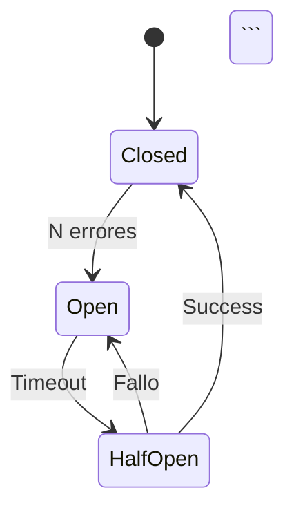

# Estándares y Reglas de Documentación ERP

**Fecha de creación**: 2025-11-23
**Última actualización**: 2025-11-23

## 📋 Tabla de Contenidos

1. [Estructura de Archivos](#estructura-de-archivos)
2. [Convenciones de Nombres](#convenciones-de-nombres)
3. [Formato de Archivos Markdown](#formato-de-archivos-markdown)
4. [Links Internos](#links-internos)
5. [Diagramas Mermaid](#diagramas-mermaid)
6. [Sidebar Configuration](#sidebar-configuration)
7. [Checklist de Calidad](#checklist-de-calidad)
8. [Ejemplos de Código](#ejemplos-de-código)

---

## 1. Estructura de Archivos

### Organización de Carpetas

```
documentacion/
├── docs/
│   ├── intro.md                          # Introducción principal
│   ├── 01-arquitectura/                  # Arquitectura general (7 archivos)
│   │   ├── 00-vision-general.md
│   │   ├── 01-stack-tecnologico.md
│   │   ├── 02-arquitectura-event-driven.md
│   │   ├── 03-comunicacion-microservicios.md
│   │   ├── 04-multi-tenancy.md
│   │   ├── 05-seguridad-rbac.md
│   │   └── 06-patrones-diseno.md
│   │
│   ├── 02-microservicios/                # Microservicios
│   │   ├── auth-service/                 # Auth Service (14 archivos)
│   │   │   ├── 00-overview.md
│   │   │   ├── 01-alcance.md
│   │   │   ├── 02-arquitectura.md
│   │   │   ├── 03-modelo-datos.md
│   │   │   ├── 04-configuracion.md
│   │   │   ├── 05-eventos-publicados.md
│   │   │   ├── 06-grpc-server.md
│   │   │   ├── 07-api-auth.md
│   │   │   ├── 08-api-users.md
│   │   │   ├── 09-api-roles.md
│   │   │   ├── 10-api-permissions.md
│   │   │   ├── 11-api-locals.md
│   │   │   ├── 12-api-organizations.md
│   │   │   └── 13-flujos-negocio.md
│   │   │
│   │   ├── catalog-service/              # Catalog Service (18 archivos)
│   │   │   ├── 00-overview.md
│   │   │   ├── 01-alcance.md
│   │   │   ├── 02-arquitectura.md
│   │   │   ├── 03-modelo-datos.md
│   │   │   ├── 04-configuracion.md
│   │   │   ├── 05-eventos-publicados.md
│   │   │   ├── 06-eventos-consumidos.md
│   │   │   ├── 07-validacion-locales.md
│   │   │   ├── 08-auth-client-grpc.md
│   │   │   ├── 09-api-products.md
│   │   │   ├── 10-api-variants.md
│   │   │   ├── 11-api-options.md
│   │   │   ├── 12-paginacion-cursor.md
│   │   │   ├── 13-cache-strategy.md
│   │   │   ├── 14-flujos-negocio.md
│   │   │   ├── 15-testing.md
│   │   │   ├── 16-errores-comunes.md
│   │   │   └── 17-migraciones.md
│   │   │
│   │   └── audit-service/                # Audit Service (8 archivos)
│   │       ├── 00-overview.md
│   │       ├── 01-alcance.md
│   │       ├── 02-arquitectura.md
│   │       ├── 03-modelo-datos.md
│   │       ├── 04-event-consumer.md
│   │       ├── 05-api-logs.md
│   │       ├── 06-retention-policy.md
│   │       └── 07-queries-comunes.md
│   │
│   ├── 03-decisiones-arquitectura/       # ADRs (8 archivos)
│   │   ├── 00-introduccion-adrs.md
│   │   ├── adr-001-python-fastapi.md
│   │   ├── adr-002-postgresql.md
│   │   ├── adr-003-event-driven.md
│   │   ├── adr-004-grpc-internal.md
│   │   ├── adr-005-rbac-multinivel.md
│   │   ├── adr-006-postgresql-multi-tenant.md
│   │   └── adr-007-cursor-pagination.md
│   │
│   ├── 04-integraciones/                 # Integraciones (5 archivos)
│   │   ├── 00-overview.md
│   │   ├── 01-rabbitmq.md
│   │   ├── 02-redis.md
│   │   ├── 03-grpc.md
│   │   └── 04-postgresql.md
│   │
│   ├── 05-guias/                         # Guías (5 archivos)
│   │   ├── 00-setup-local.md
│   │   ├── 01-crear-microservicio.md
│   │   ├── 02-testing.md
│   │   ├── 03-deployment.md
│   │   └── 04-troubleshooting.md
│   │
│   └── 06-anexos/                        # Anexos (4 archivos)
│       ├── 00-glosario.md
│       ├── 01-convenciones.md
│       ├── 02-referencias.md
│       └── 03-diagramas.md
│
├── static/                               # Assets estáticos
├── sidebars.js                           # Configuración de navegación
├── docusaurus.config.js                  # Configuración de Docusaurus
├── package.json                          # Dependencias
├── .project-state.md                     # Estado del proyecto
└── .standards.md                         # Este archivo

**Total**: 73 archivos markdown
```

### Reglas de Numeración

1. **Archivos**: Usar prefijo numérico de 2 dígitos + guión + nombre descriptivo
   - ✅ `00-overview.md`
   - ✅ `01-alcance.md`
   - ✅ `13-flujos-negocio.md`
   - ❌ `overview.md`
   - ❌ `1-overview.md`

2. **Carpetas**: Usar prefijo numérico de 2 dígitos + guión + nombre descriptivo
   - ✅ `01-arquitectura/`
   - ✅ `02-microservicios/`
   - ❌ `arquitectura/`
   - ❌ `1-arquitectura/`

---

## 2. Convenciones de Nombres

### Nombres de Archivos

**Formato**: `NN-nombre-descriptivo.md`

**Reglas**:
- Usar minúsculas
- Separar palabras con guiones (`-`)
- No usar espacios ni caracteres especiales
- Prefijo numérico de 2 dígitos
- Extensión `.md`

**Ejemplos**:
```
✅ 00-overview.md
✅ 03-modelo-datos.md
✅ 07-validacion-locales.md
✅ 13-flujos-negocio.md

❌ Overview.md
❌ modelo_datos.md
❌ 7-validacion-locales.md
❌ flujos de negocio.md
```

### Nombres de Carpetas

**Formato**: `NN-nombre-categoria/`

**Ejemplos**:
```
✅ 01-arquitectura/
✅ 02-microservicios/
✅ 03-decisiones-arquitectura/

❌ arquitectura/
❌ 1-arquitectura/
❌ Arquitectura/
```

### IDs de Documento (Docusaurus)

Los IDs se derivan automáticamente del path sin el prefijo numérico:

**Archivo**: `01-arquitectura/00-vision-general.md`
**ID Docusaurus**: `arquitectura/vision-general`

**Archivo**: `02-microservicios/auth-service/00-overview.md`
**ID Docusaurus**: `microservicios/auth-service/overview`

---

## 3. Formato de Archivos Markdown

### Frontmatter Obligatorio

Todos los archivos deben comenzar con:

```yaml
---
sidebar_position: N
---
```

**Reglas**:
- `sidebar_position` empieza en 1 (no en 0)
- Debe coincidir con el número del archivo + 1
  - `00-overview.md` → `sidebar_position: 1`
  - `01-alcance.md` → `sidebar_position: 2`
  - `13-flujos-negocio.md` → `sidebar_position: 14`

### Estructura de Documento

```markdown
---
sidebar_position: N
---

# Título Principal (H1)

Introducción breve del contenido (1-3 párrafos).

## Sección Principal 1 (H2)

Contenido...

### Subsección 1.1 (H3)

Contenido...

## Sección Principal 2 (H2)

Contenido...

## Próximos Pasos (H2)

Links a documentos relacionados.

- [Documento Relacionado 1](/categoria/documento-1)
- [Documento Relacionado 2](/categoria/documento-2)
```

### Reglas de Títulos

1. **H1**: Solo uno por documento (título principal)
2. **H2**: Secciones principales
3. **H3**: Subsecciones
4. **H4**: Detalles específicos (usar con moderación)
5. **Nunca saltar niveles**: ❌ H2 → H4 (sin H3)

---

## 4. Links Internos

### Formato Correcto

**❌ INCORRECTO (no usar)**:
```markdown
[Link](/01-arquitectura/00-vision-general)
[Link](/02-microservicios/auth-service/01-alcance)
[Link](../arquitectura/vision-general)
[Link](./overview.md)
```

**✅ CORRECTO (usar siempre)**:
```markdown
[Link](/arquitectura/vision-general)
[Link](/microservicios/auth-service/alcance)
[Link](/decisiones-arquitectura/adr-001-python-fastapi)
```

### Reglas de Links

1. **Siempre usar rutas absolutas** desde `/`
2. **Sin prefijos numéricos** en links
3. **Sin extensión `.md`**
4. **Usar IDs de Docusaurus**, no paths de archivo

### Tabla de Conversión de Links

| Archivo Físico | ID Docusaurus | Link Correcto |
|----------------|---------------|---------------|
| `intro.md` | `intro` | `/intro` |
| `01-arquitectura/00-vision-general.md` | `arquitectura/vision-general` | `/arquitectura/vision-general` |
| `02-microservicios/auth-service/00-overview.md` | `microservicios/auth-service/overview` | `/microservicios/auth-service/overview` |
| `03-decisiones-arquitectura/adr-001-python-fastapi.md` | `decisiones-arquitectura/adr-001-python-fastapi` | `/decisiones-arquitectura/adr-001-python-fastapi` |

### Links a Secciones (Anchors)

```markdown
✅ [Ver Sección](#sección-principal)
✅ [Ver Arquitectura](/arquitectura/vision-general#componentes)
```

---

## 5. Diagramas Mermaid

### Configuración Habilitada

Mermaid está habilitado en `docusaurus.config.js`:

```javascript
markdown: {
  mermaid: true,
},
themes: ['@docusaurus/theme-mermaid'],
```

### Tipos de Diagramas Utilizados

#### 1. Flowchart (Diagramas de Flujo)

```markdown
```mermaid
flowchart TB
    A[Cliente] --> B[API Gateway]
    B --> C[Auth Service]
    B --> D[Catalog Service]
```‎
```

#### 2. Sequence Diagram (Diagramas de Secuencia)

```markdown
```mermaid
sequenceDiagram
    participant Client
    participant API
    participant Auth
    participant DB

    Client->>API: POST /auth/login
    API->>Auth: Validar credenciales
    Auth->>DB: SELECT user
    DB-->>Auth: User data
    Auth-->>API: Token
    API-->>Client: 200 OK + token
```‎
```

#### 3. ER Diagram (Diagramas de Entidad-Relación)

```markdown
```mermaid
erDiagram
    USERS ||--o{ USER_ROLES : "tiene"
    ROLES ||--o{ USER_ROLES : "asignado a"

    USERS {
        varchar id PK
        varchar email
        boolean active
    }

    ROLES {
        varchar id PK
        varchar name
    }
```‎
```

#### 4. State Diagram (Diagramas de Estados)

```markdown


### Reglas para Diagramas

1. **Siempre incluir** cuando ayude a la comprensión
2. **Usar español** en labels
3. **Mantener simplicidad**: No más de 10-15 nodos
4. **Agregar comentarios** si el diagrama es complejo

---

## 6. Sidebar Configuration

### Archivo: `sidebars.js`

```javascript
const sidebars = {
  docs: [
    'intro',
    {
      type: 'category',
      label: '📐 Arquitectura General',
      collapsed: false,
      items: [
        'arquitectura/vision-general',
        'arquitectura/stack-tecnologico',
        // ... más items
      ],
    },
    {
      type: 'category',
      label: '🔧 Microservicios',
      collapsed: false,
      items: [
        {
          type: 'category',
          label: 'Auth Service',
          collapsed: true,
          items: [
            'microservicios/auth-service/overview',
            'microservicios/auth-service/alcance',
            // ... más items
          ],
        },
      ],
    },
  ],
};

module.exports = sidebars;
```

### Reglas de Sidebar

1. **Categorías principales**: `collapsed: false`
2. **Subcategorías (servicios)**: `collapsed: true`
3. **Labels con emojis** para categorías principales:
   - 📐 Arquitectura General
   - 🔧 Microservicios
   - 📝 Decisiones Arquitectura (ADRs)
   - 🔌 Integraciones
   - 📚 Guías
   - 📖 Anexos

4. **Orden de items** debe seguir el orden lógico de lectura
5. **IDs sin prefijos numéricos** (automático por Docusaurus)

---

## 7. Checklist de Calidad

### Antes de Crear un Archivo

- [ ] El nombre sigue el formato `NN-nombre-descriptivo.md`
- [ ] El frontmatter incluye `sidebar_position`
- [ ] Tiene un título H1 único
- [ ] La introducción es clara (1-3 párrafos)
- [ ] Los links internos NO tienen prefijos numéricos
- [ ] Los diagramas están en formato Mermaid
- [ ] Tiene sección "Próximos Pasos" con links relacionados

### Después de Crear un Archivo

- [ ] El archivo está en la carpeta correcta
- [ ] Actualizar `sidebars.js` si es necesario
- [ ] Verificar que Docusaurus compila sin errores
- [ ] Verificar que los links funcionan
- [ ] Verificar que los diagramas se renderizan

### Verificación de Links

```bash
# Buscar links con prefijos numéricos (deben ser 0)
grep -r "](/0" documentacion/docs --include="*.md" | wc -l

# Debe retornar: 0
```

---

## 8. Ejemplos de Código

### Bloques de Código

**Formato**:
```markdown
```python
def example():
    return "Hello World"
```‎
```

**Lenguajes Soportados**:
- `python`
- `javascript`
- `typescript`
- `sql`
- `bash`
- `yaml`
- `json`
- `protobuf`
- `dockerfile`

### Reglas para Código

1. **Siempre especificar el lenguaje**
2. **Incluir comentarios** cuando sea necesario
3. **Código funcional** (evitar pseudocódigo)
4. **Nombres descriptivos** de variables/funciones
5. **Seguir PEP 8** para Python

### Ejemplos de Requests/Responses HTTP

```markdown
### Request
```http
POST /auth/login
Content-Type: application/json
Authorization: Bearer {token}

{
  "email": "user@example.com",
  "password": "password123"
}
```‎

### Response 200 OK
```json
{
  "access_token": "eyJhbGc...",
  "token_type": "bearer",
  "expires_in": 900
}
```‎
```

---

## 9. Elementos Especiales de Docusaurus

### Admonitions (Notas, Warnings, Tips)

```markdown
:::info
Información general importante.
:::

:::tip
Consejo útil para el desarrollador.
:::

:::warning
Advertencia sobre algo que puede causar problemas.
:::

:::danger
Peligro crítico, puede romper el sistema.
:::

:::note
Nota adicional de contexto.
:::
```

**Cuándo usar**:
- `info`: Información contextual importante
- `tip`: Mejores prácticas, optimizaciones
- `warning`: Cosas que pueden causar errores
- `danger`: Operaciones peligrosas, destructivas
- `note`: Información adicional no crítica

---

## 10. Convenciones de Escritura

### Idioma

- **Español**: Todo el contenido
- **Términos técnicos**: Mantener en inglés cuando sea convención
  - ✅ "Repository Pattern"
  - ✅ "Circuit Breaker"
  - ✅ "Event-Driven"
  - ❌ "Patrón Repositorio" (traducción innecesaria)

### Tono

- **Técnico pero claro**: Audiencia mixta (académica + técnica)
- **Directo**: Sin rodeos innecesarios
- **Instructivo**: Usar verbos imperativos
  - ✅ "Crear un usuario"
  - ✅ "Validar el token"
  - ❌ "Se puede crear un usuario"

### Formato de Listas

**Lista desordenada**:
```markdown
- Item 1
- Item 2
  - Subitem 2.1
  - Subitem 2.2
- Item 3
```

**Lista ordenada**:
```markdown
1. Primer paso
2. Segundo paso
3. Tercer paso
```

**Checklist**:
```markdown
- [ ] Tarea pendiente
- [x] Tarea completada
```

---

## 11. Tablas

### Formato Estándar

```markdown
| Columna 1 | Columna 2 | Columna 3 |
|-----------|-----------|-----------|
| Dato 1    | Dato 2    | Dato 3    |
| Dato 4    | Dato 5    | Dato 6    |
```

### Alineación

```markdown
| Izquierda | Centro | Derecha |
|:----------|:------:|--------:|
| Texto     | Texto  | 123     |
| Más texto | Texto  | 456     |
```

---

## 12. Imágenes y Assets

### Ubicación

Guardar en: `documentacion/static/img/`

### Referencia en Markdown

```markdown

```

### Reglas

1. **Formato**: PNG para diagramas, JPG para fotos
2. **Nombres**: Usar kebab-case
   - ✅ `auth-flow-diagram.png`
   - ❌ `Auth Flow Diagram.png`
3. **Tamaño**: Optimizar antes de subir (< 500KB)
4. **Alt text**: Siempre incluir descripción

---

## 13. Metadatos del Proyecto

### Información General

- **Nombre**: zenLogic
- **Tecnología**: Docusaurus 3.1.0
- **Idioma**: Español
- **Total archivos**: 73 markdown files
- **Progreso actual**: 26/73 (36%)

### Arquitectura del Sistema

- **Lenguaje**: Python 3.11
- **Framework**: FastAPI
- **Base de Datos**: PostgreSQL 15+
- **Cache**: Redis 7.0
- **Message Broker**: RabbitMQ
- **Comunicación Interna**: gRPC
- **Comunicación Externa**: REST

### Microservicios

1. **Auth Service** (Puerto 8001, gRPC 50051)
2. **Catalog Service** (Puerto 8002)
3. **Audit Service** (Puerto 8003)
4. **Inventory Service** (Futuro)
5. **Order Service** (Futuro)

---

## 14. Comandos Útiles

### Desarrollo

```bash
# Iniciar servidor de desarrollo
cd documentacion
npm start

# Construir para producción
npm run build

# Limpiar cache
npm run clear
```

### Verificación de Calidad

```bash
# Buscar links rotos (debe retornar 0)
grep -r "](/0" docs --include="*.md" | wc -l

# Contar archivos creados
find docs -name "*.md" -type f | wc -l

# Listar archivos por carpeta
find docs -name "*.md" | sed 's|docs/||' | sort
```

### Git

```bash
# Commit de documentación
git add documentacion/
git commit -m "docs: agregar documentación de [servicio/sección]"
git push
```

---

## 15. Resolución de Problemas Comunes

### Links No Funcionan

**Problema**: Los links internos llevan a 404

**Solución**: Verificar que los links NO tengan prefijos numéricos

```bash
# Buscar links problemáticos
grep -r "](/0" docs --include="*.md"

# Debe retornar vacío
```

### Docusaurus No Compila

**Problema**: Error en `sidebars.js`

**Solución**: Verificar que todos los IDs en sidebar existan como archivos

```bash
# Verificar que archivo existe
ls docs/02-microservicios/auth-service/00-overview.md
```

### Diagramas No Se Renderizan

**Problema**: Diagramas Mermaid no aparecen

**Solución**: Verificar sintaxis de Mermaid en https://mermaid.live/

---

## 16. Template de Nuevo Documento

```markdown
---
sidebar_position: N
---

# Título del Documento

Introducción breve describiendo qué cubre este documento (1-3 párrafos).

## Sección Principal 1

Contenido de la sección...

### Subsección 1.1

Detalle específico...

## Sección Principal 2

Contenido de la sección...

### Ejemplo de Código

```python
# Código de ejemplo
def example():
    return "Hello World"
```‎

## Próximos Pasos

- [Documento Relacionado 1](/categoria/documento-1)
- [Documento Relacionado 2](/categoria/documento-2)
```

---

## 17. Changelog

| Fecha | Cambios |
|-------|---------|
| 2025-11-23 | Creación inicial del documento de estándares |
| 2025-11-23 | Corrección masiva de links internos (26 archivos) |
| 2025-11-23 | Actualización de sidebar con Catalog Service |

---

**Última actualización**: 2025-11-23 16:00 UTC
**Mantenido por**: Claude Code Agent
**Versión**: 1.0
