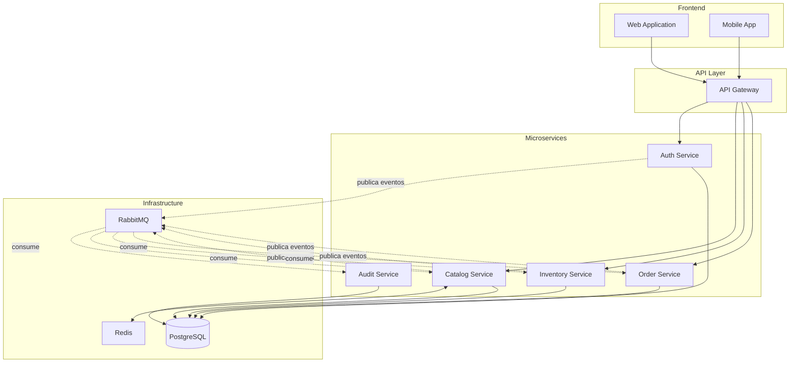
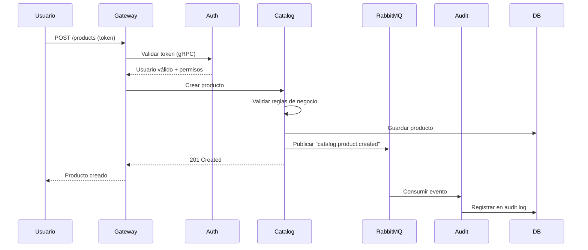

# Visión General de la Arquitectura

## Introducción

El Sistema zenLogic está diseñado como una plataforma empresarial escalable que permite a múltiples organizaciones gestionar sus operaciones de manera independiente dentro de una infraestructura compartida.

## Objetivos del Sistema

### Objetivos de Negocio

1. **Multi-tenancy Eficiente**: Permitir que múltiples organizaciones (tenants) utilicen el sistema de manera aislada y segura
2. **Escalabilidad**: Crecer horizontalmente según la demanda sin afectar el rendimiento
3. **Flexibilidad**: Adaptar módulos y permisos según las necesidades de cada organización
4. **Trazabilidad**: Mantener un registro completo de todas las operaciones del sistema

### Objetivos Técnicos

1. **Arquitectura de Microservicios**: Servicios independientes, desplegables y escalables de forma independiente
2. **Event-Driven Architecture**: Comunicación asíncrona para desacoplamiento y resiliencia
3. **API-First**: Todas las funcionalidades expuestas mediante APIs bien documentadas
4. **Alta Disponibilidad**: Diseño resiliente con redundancia y recuperación ante fallos

## Componentes Principales del Sistema

## Microservicios del Sistema

### 1. Auth Service
**Responsabilidad**: Identidad, autenticación y autorización

- Gestión de usuarios, roles y permisos
- Emisión y validación de tokens JWT
- RBAC (Role-Based Access Control) multinivel
- Gestión de organizaciones y locales
- Control de sesiones

**Tecnologías**: Python 3.11, FastAPI, PostgreSQL, Redis, gRPC

### 2. Catalog Service
**Responsabilidad**: Gestión del catálogo de productos

- CRUD de productos, variantes, colecciones
- Gestión de marcas (brands)
- Etiquetas (tags) para clasificación
- Price tiers (precios por volumen)
- Referencias de inventario (solo lectura)

**Tecnologías**: Python 3.11, FastAPI, PostgreSQL, Redis, RabbitMQ

### 3. Audit Service
**Responsabilidad**: Auditoría y trazabilidad

- Consumidor de todos los eventos del sistema
- Registro centralizado de auditoría
- API de consultas con filtros avanzados
- Compliance y reportes

**Tecnologías**: Python 3.11, FastAPI, PostgreSQL, RabbitMQ

### 4. Inventory Service
**Responsabilidad**: Gestión de inventario

- Control de stock por bodega
- Movimientos de inventario
- Reservas y ajustes
- Integración con Catalog

**Tecnologías**: Python 3.11, FastAPI, PostgreSQL

### 5. Order Service
**Responsabilidad**: Gestión de órdenes

- Creación y seguimiento de órdenes
- Estados del ciclo de vida
- Integración con Catalog e Inventory
- Cálculo de totales

**Tecnologías**: Python 3.11, FastAPI, PostgreSQL

## Alcance General

### Módulos Funcionales

| Módulo | Descripción | Servicio Responsable |
|--------|-------------|---------------------|
| **Identidad y Acceso** | Usuarios, roles, permisos, organizaciones | Auth Service |
| **Catálogo** | Productos, variantes, colecciones, marcas | Catalog Service |
| **Inventario** | Stock, bodegas, movimientos, ajustes | Inventory Service |
| **Órdenes** | Órdenes de venta, cotizaciones | Order Service |
| **Auditoría** | Trazabilidad, compliance, reportes | Audit Service |

### Funcionalidades Transversales

- **Multi-tenancy**: Todos los servicios soportan múltiples organizaciones
- **Event-Driven**: Comunicación asíncrona mediante eventos
- **RBAC**: Control de acceso granular en cada servicio
- **Auditoría**: Todos los eventos son registrados
- **Observabilidad**: Logs, métricas y tracing distribuido

## Principios de Diseño

### 1. Separación de Responsabilidades (SRP)
Cada microservicio tiene una responsabilidad clara y bien definida.

### 2. Desacoplamiento
Los servicios se comunican mediante:
- **REST APIs**: Para comunicación externa (frontend ↔ backend)
- **gRPC**: Para comunicación interna de alto rendimiento
- **Eventos**: Para comunicación asíncrona

### 3. Escalabilidad Horizontal
Cada servicio puede escalar independientemente según su carga.

### 4. Resilencia
- Circuit breakers para prevenir cascading failures
- Retry con backoff exponencial
- Timeouts configurables
- Dead Letter Queues para eventos fallidos

### 5. Consistencia Eventual
Los servicios mantienen consistencia mediante eventos, aceptando que los datos pueden estar temporalmente desincronizados.

## Flujo General de una Operación

## Decisiones Arquitectónicas Clave

Las decisiones técnicas importantes están documentadas en la sección de [Architecture Decision Records (ADRs)](/adrs/introduccion-adrs):

- **Event-Driven en Auth Service**: Por qué Auth publica eventos
- **Audit Service Independiente**: Por qué un servicio separado para auditoría
- **Comunicación Híbrida**: Por qué REST + gRPC
- **RabbitMQ vs Kafka**: Por qué elegimos RabbitMQ
- **PostgreSQL Multi-tenant**: Por qué row-level isolation

## Próximos Pasos

Para profundizar en la arquitectura, consulta:

1. [Stack Tecnológico](/arquitectura/stack-tecnologico) - Tecnologías utilizadas y justificación
2. [Arquitectura Event-Driven](/arquitectura/arquitectura-event-driven) - Comunicación asíncrona
3. [Comunicación entre Microservicios](/arquitectura/comunicacion-microservicios) - REST + gRPC
4. [Multi-tenancy](/arquitectura/multi-tenancy) - Aislamiento de datos por organización
5. [Seguridad y RBAC](/arquitectura/seguridad-rbac) - Control de acceso
6. [Patrones de Diseño](/arquitectura/patrones-diseno) - Patrones aplicados
