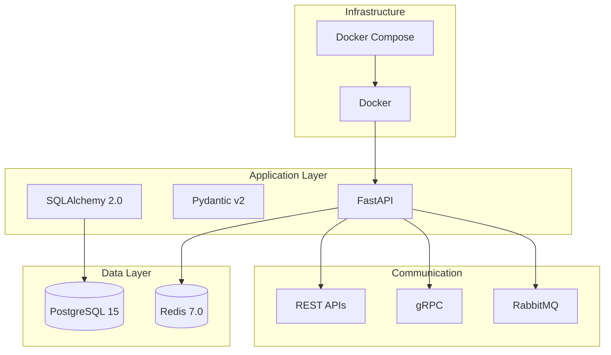

# Stack Tecnológico

## Introducción

El stack tecnológico del zenLogic fue seleccionado considerando factores como:

- Performance y escalabilidad
- Ecosistema y comunidad
- Facilidad de desarrollo y mantenimiento
- Compatibilidad entre componentes
- Soporte a largo plazo

## Backend

### Python 3.11

**¿Por qué Python?**

- ✅ Alta productividad en desarrollo
- ✅ Ecosistema maduro para microservicios
- ✅ Excelente soporte para async/await
- ✅ Tipado estático con type hints
- ✅ Comunidad grande y activa

**Versión**: 3.11+ (mejoras significativas en performance)

### FastAPI

**Framework principal para APIs REST**

- ✅ Alto rendimiento (comparable a NodeJS y Go)
- ✅ Validación automática con Pydantic
- ✅ Documentación automática (OpenAPI/Swagger)
- ✅ Soporte nativo para async/await
- ✅ Tipado estático end-to-end

**Alternativas consideradas**:
- Flask: Más simple pero menos features out-of-the-box
- Django REST Framework: Más pesado, orientado a monolitos

### SQLAlchemy 2.0

**ORM (Object-Relational Mapping)**

- ✅ ORM más maduro de Python
- ✅ Soporte async nativo en 2.0
- ✅ Migraciones con Alembic
- ✅ Queries tipadas y seguras

### Pydantic v2

**Validación de datos**

- ✅ Validación en runtime
- ✅ Serialización/deserialización automática
- ✅ Integración perfecta con FastAPI
- ✅ Performance mejorada en v2

### gRPC (grpcio)

**Comunicación interna entre microservicios**

- ✅ Alto rendimiento (binario, HTTP/2)
- ✅ Tipado fuerte con proto files
- ✅ Streaming bidireccional
- ✅ Code generation automático

**Uso**: Auth Service expone gRPC para validación de tokens

## Base de Datos

### PostgreSQL 15+

**Base de datos relacional principal**

- ✅ Open source y battle-tested
- ✅ ACID compliant
- ✅ JSON nativo (JSONB)
- ✅ Índices avanzados (GIN, GIST)
- ✅ Row-Level Security para multi-tenancy
- ✅ Particionamiento de tablas

**Configuración**:
- Un schema por microservicio
- Row-level isolation por `organization_id`
- Índices en campos de tenant

**Alternativas consideradas**:
- MySQL: Menos features avanzadas
- MongoDB: No relacional, no garantiza ACID

## Cache

### Redis 7.0

**Cache distribuido en memoria**

- ✅ Alto rendimiento (sub-ms latency)
- ✅ Estructuras de datos avanzadas
- ✅ TTL por key
- ✅ Pub/Sub para invalidación
- ✅ Persistencia opcional

**Uso**:
- Cache de tokens JWT
- Cache de permisos de usuarios
- Cache de productos en Catalog Service
- Sesiones de usuarios

## Message Broker

### RabbitMQ 3.12

**Message broker para eventos**

- ✅ Protocolo AMQP estándar
- ✅ Routing avanzado (topic, fanout, direct)
- ✅ Dead Letter Queues
- ✅ Management UI excelente
- ✅ Menor complejidad operacional que Kafka

**Configuración**:
- Exchange tipo `topic` para eventos
- Queues durables
- DLQ para mensajes fallidos
- Retry con backoff exponencial

**Por qué RabbitMQ y no Kafka**: Ver [ADR-005](/decisiones-arquitectura/adr-005-rabbitmq-vs-kafka)

## Containerización

### Docker

**Containerización de servicios**

- ✅ Aislamiento de entornos
- ✅ Reproducibilidad
- ✅ Fácil deployment

### Docker Compose

**Orquestación local**

- ✅ Define multi-container apps
- ✅ Perfecto para desarrollo local
- ✅ Networking automático

**Archivo**: `docker-compose.yml` con todos los servicios

## Testing

### Pytest

**Framework de testing**

- ✅ Simple y poderoso
- ✅ Fixtures para setup/teardown
- ✅ Plugins para coverage, async, etc.
- ✅ Mocking integrado

**Estructura**:
```
tests/
  unit/         # Tests unitarios por servicio
  integration/  # Tests de integración
  e2e/          # Tests end-to-end
```

## Observabilidad

### Logging

**Logs estructurados**

- ✅ JSON format
- ✅ Correlation IDs
- ✅ Niveles: DEBUG, INFO, WARNING, ERROR, CRITICAL

### Métricas (Futuro)

**Prometheus + Grafana**

- Métricas de aplicación
- Dashboards visuales
- Alertas configurables

### Tracing (Futuro)

**OpenTelemetry**

- Tracing distribuido
- Seguimiento de requests cross-service

## Seguridad

### JWT (JSON Web Tokens)

**Autenticación stateless**

- Access tokens (15 min TTL)
- Refresh tokens (7 días TTL)
- Firmados con RS256 (RSA)

### bcrypt

**Hashing de contraseñas**

- ✅ Algoritmo battle-tested
- ✅ Salting automático
- ✅ Cost factor configurable

## Herramientas de Desarrollo

### Poetry (Opcional)

**Gestión de dependencias**

- ✅ Lock file determinístico
- ✅ Entornos virtuales integrados

### Black

**Code formatter**

- ✅ Estilo consistente
- ✅ Zero-config

### mypy

**Type checker**

- ✅ Valida tipos estáticos
- ✅ Detecta errores antes de runtime

### pre-commit

**Git hooks**

- ✅ Linting automático
- ✅ Format check
- ✅ Type check

## Tabla Comparativa de Tecnologías

### Backend Framework

| Framework | Pros | Contras | Decisión |
|-----------|------|---------|----------|
| **FastAPI** | Performance, async, docs automáticas | Relativamente nuevo | ✅ **ELEGIDO** |
| Flask | Simple, maduro | Sin features avanzadas | ❌ |
| Django | Completo, admin panel | Pesado para microservicios | ❌ |

### Base de Datos

| DB | Pros | Contras | Decisión |
|----|------|---------|----------|
| **PostgreSQL** | ACID, features avanzadas, RLS | - | ✅ **ELEGIDO** |
| MySQL | Popular, buen performance | Menos features | ❌ |
| MongoDB | Flexible schema | No ACID completo | ❌ |

### Message Broker

| Broker | Pros | Contras | Decisión |
|--------|------|---------|----------|
| **RabbitMQ** | Simple, routing avanzado | Menor throughput | ✅ **ELEGIDO** |
| Kafka | Alto throughput, event log | Complejidad operacional | ❌ |
| AWS SQS | Managed, escalable | Vendor lock-in | ❌ |

## Diagrama del Stack



## Versiones Específicas

```json
{
  "python": "3.11+",
  "fastapi": "^0.104.0",
  "sqlalchemy": "^2.0.0",
  "pydantic": "^2.4.0",
  "alembic": "^1.12.0",
  "pydantic-settings": "^2.0.0",
  "python-jose": "^3.3.0",
  "passlib": "^1.7.4",
  "bcrypt": "^4.0.1",
  "grpcio": "^1.59.0",
  "grpcio-tools": "^1.59.0",
  "pika": "^1.3.2",
  "redis": "^5.0.0",
  "psycopg2-binary": "^2.9.9",
  "pytest": "^7.4.0",
  "pytest-asyncio": "^0.21.0"
}
```

## Próximos Pasos

Para profundizar en el uso de estas tecnologías:

1. [Arquitectura Event-Driven](/arquitectura/arquitectura-event-driven) - Cómo usamos RabbitMQ
2. [Comunicación entre Microservicios](/arquitectura/comunicacion-microservicios) - REST + gRPC
3. [Integraciones - RabbitMQ](/integraciones/01-rabbitmq) - Configuración detallada
4. [Integraciones - gRPC](/integraciones/02-grpc-proto-files) - Proto files y setup
5. [Integraciones - PostgreSQL](/integraciones/04-postgresql) - Setup de base de datos
