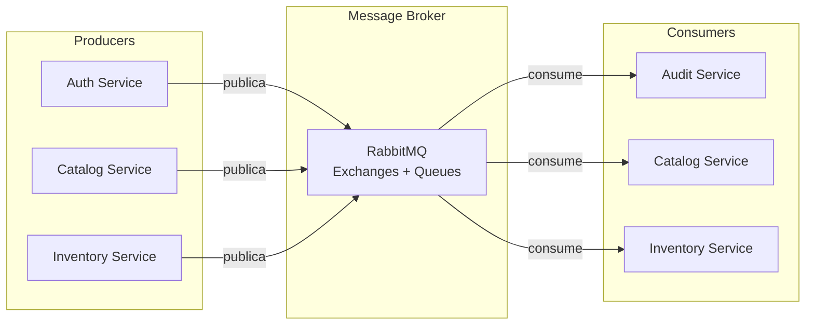
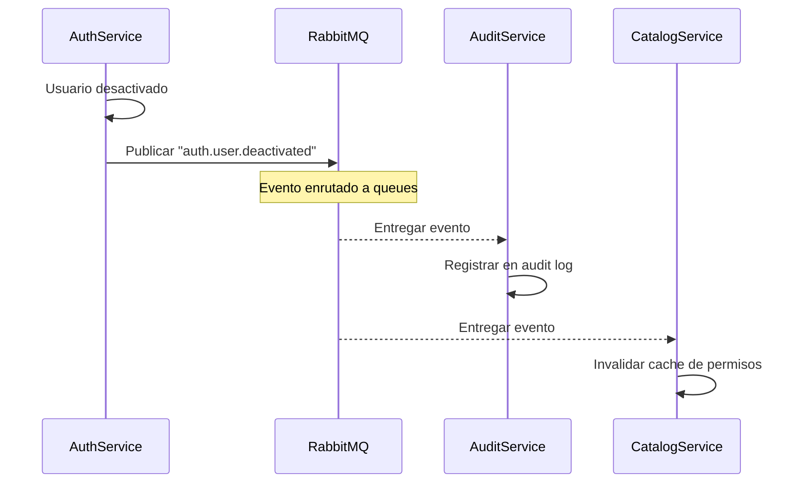
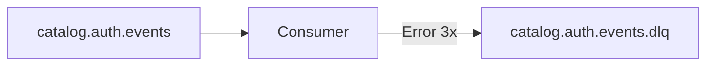
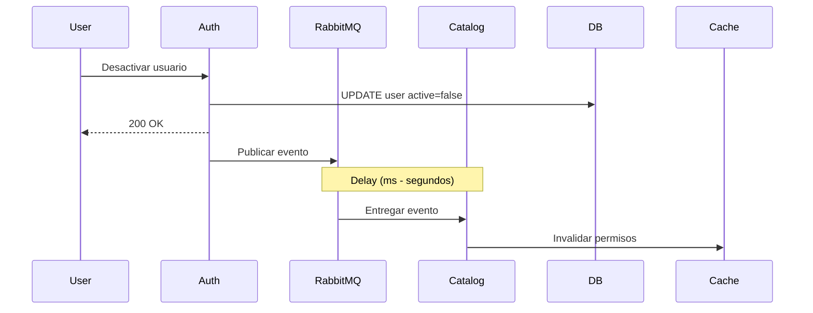

# Arquitectura Event-Driven

## Introducción

La arquitectura event-driven (orientada a eventos) es un patrón de diseño donde los componentes del sistema se comunican mediante la producción y consumo de eventos.

## ¿Qué es un Evento?

Un evento es un **registro inmutable** de algo que ocurrió en el sistema.

### Características de un Evento

- **Inmutable**: Una vez creado, no puede modificarse
- **Histórico**: Representa algo que ya sucedió (pasado)
- **Desacoplado**: El productor no sabe quién consume
- **Asíncrono**: No espera respuesta inmediata

### Ejemplo de Evento

```json
{
  "event_id": "evt_88291ABC",
  "event_type": "auth.user.created",
  "event_version": "v1",
  "timestamp": "2025-11-15T10:30:00Z",
  "organization_id": "org_123",
  "actor": {
    "user_id": "user_admin_001",
    "email": "admin@empresa.com"
  },
  "payload": {
    "user_id": "user_002",
    "email": "vendedor@empresa.com",
    "roles": ["role_sales"]
  }
}
```

## Arquitectura General



## Flujo de un Evento



## RabbitMQ: Message Broker

### Exchanges

Un **exchange** recibe eventos y los enruta a queues según routing keys.

**Exchanges configurados**:

```
auth.events        (tipo: topic)
catalog.events     (tipo: topic)
inventory.events   (tipo: topic)
orders.events      (tipo: topic)
```

### Queues

Una **queue** almacena eventos para ser consumidos.

**Queues configuradas**:

```
audit.all.events           → consume TODOS los eventos
catalog.auth.events        → consume eventos de auth
inventory.catalog.events   → consume eventos de catalog
```

### Routing Keys

El **routing key** determina a qué queues llega el evento.

**Patrón**: `{servicio}.{entidad}.{acción}`

Ejemplos:
- `auth.user.created`
- `auth.user.updated`
- `auth.user.deactivated`
- `catalog.product.created`
- `catalog.product.updated`

### Bindings

Un **binding** conecta un exchange con una queue mediante patrones.

```
Exchange: auth.events
Queue: audit.all.events
Pattern: auth.#  (todos los eventos de auth)

Exchange: auth.events
Queue: catalog.auth.events
Pattern: auth.user.*  (solo eventos de usuarios)
```

## Eventos por Servicio

### Auth Service

**Eventos publicados**:

| Evento | Cuándo |
|--------|--------|
| `auth.user.created` | Usuario creado |
| `auth.user.updated` | Usuario actualizado |
| `auth.user.deactivated` | Usuario desactivado |
| `auth.role.updated` | Rol modificado |
| `auth.role.permissions_changed` | Permisos cambiados |
| `auth.organization.suspended` | Organización suspendida |
| `auth.local.deleted` | Local eliminado |

### Catalog Service

**Eventos publicados**:

| Evento | Cuándo |
|--------|--------|
| `catalog.product.created` | Producto creado |
| `catalog.product.updated` | Producto actualizado |
| `catalog.product.deleted` | Producto eliminado |
| `catalog.variant.created` | Variante creada |
| `catalog.brand.updated` | Marca actualizada |

**Eventos consumidos**:

| Evento Consumido | Acción |
|-----------------|--------|
| `auth.user.deactivated` | Invalidar cache de permisos |
| `auth.role.permissions_changed` | Invalidar cache de roles |
| `auth.organization.suspended` | Bloquear operaciones |
| `auth.local.deleted` | Validar variantes |

### Audit Service

**Eventos consumidos**: TODOS (`#`)

Registra todos los eventos del sistema para auditoría.

## Beneficios

### 1. Desacoplamiento

Los servicios no se llaman directamente, reduciendo dependencias.

```
❌ Sin eventos:
Auth Service → HTTP → Catalog Service → HTTP → Inventory Service

✅ Con eventos:
Auth Service → RabbitMQ → [Catalog, Inventory] consumen independientemente
```

### 2. Escalabilidad

Cada consumer puede escalar independientemente.

### 3. Resilencia

Si un consumer está caído, los eventos se acumulan en la queue.

### 4. Auditoría

Todos los eventos quedan registrados automáticamente.

### 5. Extensibilidad

Agregar nuevos consumers no afecta a los existentes.

## Patrones Implementados

### Event Notification

Eventos notifican que algo ocurrió sin incluir todos los detalles.

```json
{
  "event_type": "catalog.product.updated",
  "product_id": "prod_123",
  "changes": ["price", "title"]
}
```

### Event-Carried State Transfer

Eventos incluyen toda la información necesaria.

```json
{
  "event_type": "auth.user.created",
  "user": {
    "id": "user_002",
    "email": "user@example.com",
    "roles": ["role_sales"],
    "organization_id": "org_123"
  }
}
```

## Manejo de Errores

### Dead Letter Queue (DLQ)

Si un consumer falla múltiples veces procesando un evento:



### Retry con Backoff

```python
@retry(
    stop=stop_after_attempt(3),
    wait=wait_exponential(multiplier=1, min=2, max=10)
)
async def process_event(event):
    # Procesar evento
    pass
```

## Versionado de Eventos

Los eventos incluyen `event_version` para evolución:

```json
{
  "event_type": "auth.user.created",
  "event_version": "v1",  ← versión
  "payload": {...}
}
```

Si el formato cambia → `v2`, y consumers soportan ambas versiones.

## Consistencia Eventual



⚠️ **Importante**: El sistema acepta que los datos pueden estar temporalmente desincronizados (segundos).

## Monitoreo de Eventos

### Métricas a medir:

- Eventos publicados por segundo
- Eventos consumidos por segundo
- Latencia de procesamiento
- Eventos en DLQ
- Queues con backlog

### Herramientas:

- RabbitMQ Management UI
- Prometheus + Grafana
- Alertas cuando DLQ > umbral

## Próximos Pasos

- [Auth Service - Eventos Publicados](/microservicios/auth-service/eventos-publicados)
- [Catalog Service - Event Consumers](/microservicios/catalog-service/eventos-consumidos)
- [Audit Service](/microservicios/audit-service/overview)
- [ADR-001: Event-Driven en Auth](/decisiones-arquitectura/adr-001-event-driven-auth)
- [Integración - RabbitMQ](/integraciones/01-rabbitmq)
