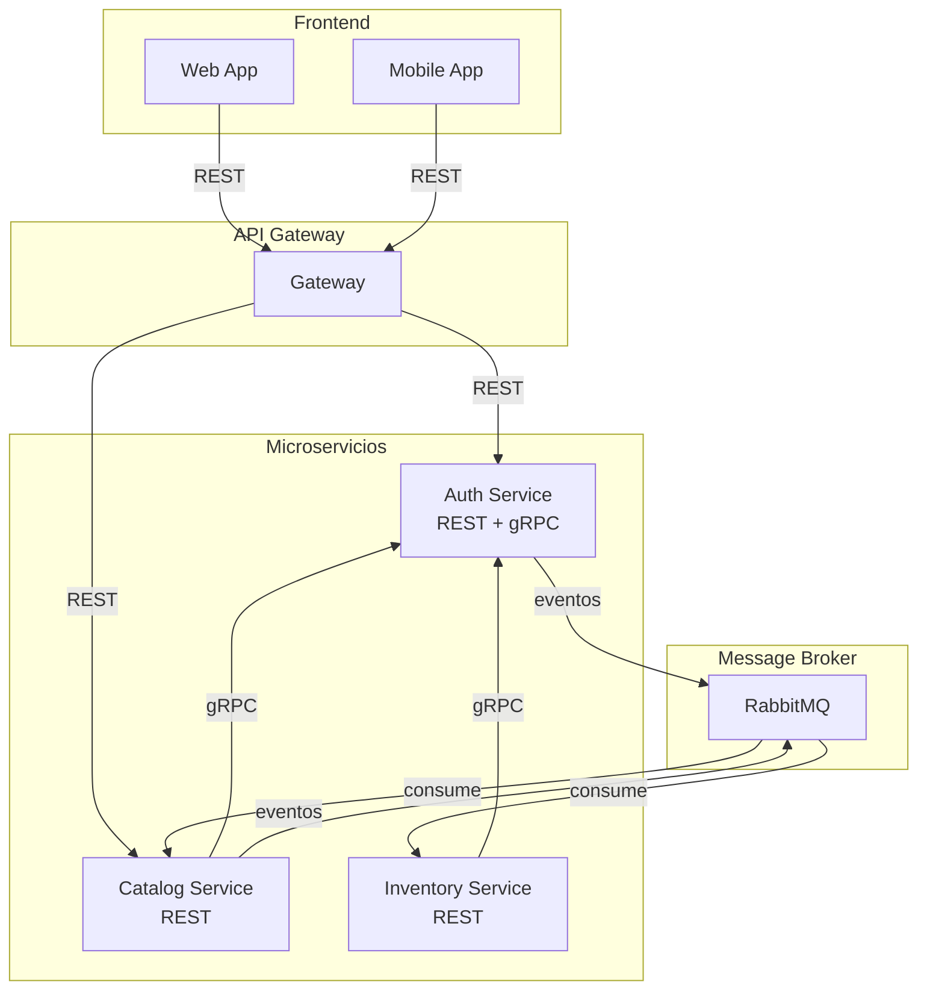
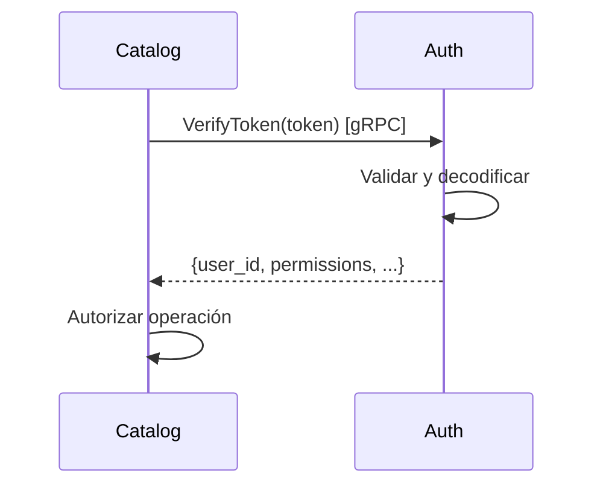
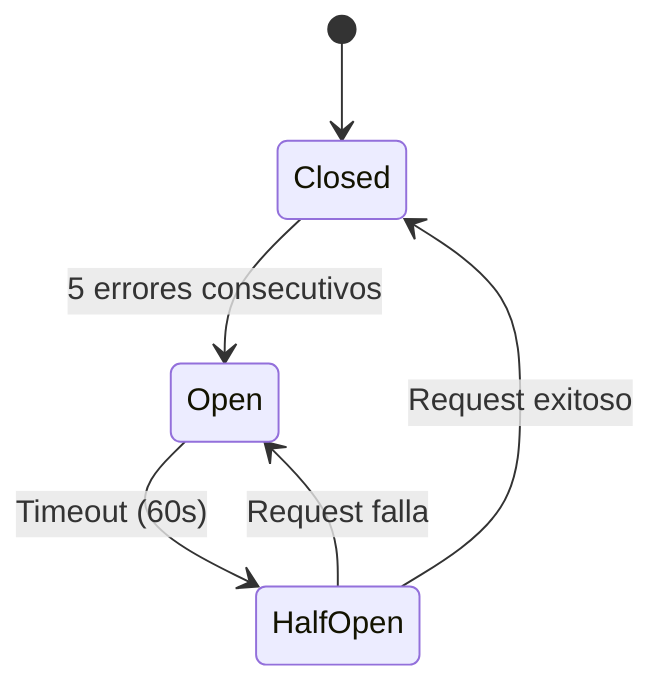

# Comunicación entre Microservicios

## Introducción

El sistema utiliza **comunicación híbrida** combinando:
- **REST** para APIs públicas (frontend ↔ backend)
- **gRPC** para comunicación interna (backend ↔ backend)
- **Eventos** para comunicación asíncrona

## Diagrama General



## REST APIs

### Uso

**Para**: Comunicación externa (frontend ↔ microservicios)

**Ventajas**:
- ✅ Estándar universal
- ✅ Fácil de consumir desde navegadores
- ✅ Documentación con OpenAPI/Swagger
- ✅ Debugging simple (HTTP readable)

### Características

- **Protocolo**: HTTP/1.1
- **Formato**: JSON
- **Autenticación**: JWT en header `Authorization: Bearer <token>`
- **Versionado**: `/api/v1/...`

### Ejemplo REST

```http
POST /api/v1/products HTTP/1.1
Host: catalog-service
Authorization: Bearer eyJhbGc...
Content-Type: application/json

{
  "title": "Producto Nuevo",
  "sku": "PROD-001"
}
```

## gRPC

### Uso

**Para**: Comunicación interna (microservicio ↔ microservicio)

**Ventajas**:
- ✅ Alto rendimiento (binario, HTTP/2)
- ✅ Tipado fuerte (proto files)
- ✅ Streaming bidireccional
- ✅ Menor latencia que REST

### Proto File Ejemplo

```protobuf
syntax = "proto3";

package auth;

service AuthService {
  rpc VerifyToken (VerifyTokenRequest) returns (VerifyTokenResponse);
}

message VerifyTokenRequest {
  string access_token = 1;
}

message VerifyTokenResponse {
  string user_id = 1;
  string organization_id = 2;
  repeated string permissions = 3;
  repeated string locals = 4;
  bool active = 5;
}
```

### Flujo gRPC



### Servicios gRPC Expuestos

| Servicio | Método gRPC | Uso |
|----------|-------------|-----|
| Auth Service | `VerifyToken` | Validar tokens desde otros servicios |

## Comunicación Asíncrona (Eventos)

### Uso

**Para**: Notificaciones, invalidación de cache, auditoría

**Ventajas**:
- ✅ Desacoplamiento temporal
- ✅ No bloquea el flujo principal
- ✅ Permite múltiples consumers

### Ejemplo

```python
# Auth Service (Producer)
await event_publisher.publish(
    event_type="auth.user.deactivated",
    payload={"user_id": "user_002"},
    organization_id="org_123"
)

# Catalog Service (Consumer)
@event_consumer.on("auth.user.deactivated")
async def handle_user_deactivated(event):
    await cache.invalidate(f"user:{event['user_id']}")
```

## Comparación REST vs gRPC

| Aspecto | REST | gRPC |
|---------|------|------|
| **Protocolo** | HTTP/1.1 | HTTP/2 |
| **Formato** | JSON (texto) | Protobuf (binario) |
| **Performance** | Medio | Alto |
| **Legibilidad** | Alta | Baja (binario) |
| **Tooling** | Curl, Postman | grpcurl, BloomRPC |
| **Uso en proyecto** | Frontend → Backend | Backend ↔ Backend |

## Circuit Breaker

Para prevenir cascading failures cuando un servicio falla:

```python
from pybreaker import CircuitBreaker

auth_breaker = CircuitBreaker(
    fail_max=5,          # Abrir después de 5 fallos
    timeout_duration=60  # Intentar de nuevo en 60s
)

@auth_breaker
async def verify_token_grpc(token):
    return await auth_grpc_client.VerifyToken(token)
```

### Estados del Circuit Breaker



## Timeouts y Retry

### Timeouts Configurados

| Tipo de llamada | Timeout |
|----------------|---------|
| gRPC | 2-3 segundos |
| REST interno | 3-5 segundos |
| REST externo | 10 segundos |
| Eventos | No aplica (asíncrono) |

### Estrategia de Retry

```python
@retry(
    stop=stop_after_attempt(3),
    wait=wait_exponential(multiplier=1, min=1, max=10)
)
async def call_external_service():
    # Llamada a servicio externo
    pass
```

## Fallback Strategies

### gRPC a REST

Si gRPC falla, hacer fallback a REST:

```python
async def verify_token(token):
    try:
        # Intentar gRPC primero
        return await auth_grpc_client.verify(token)
    except grpc.RpcError:
        # Fallback a REST
        return await auth_rest_client.verify(token)
```

## Trazabilidad (Correlation ID)

Cada request lleva un `correlation_id` para rastrear:

```
Request ID: req_9912ABCD

Auth Service: req_9912ABCD - Verificando token
Catalog Service: req_9912ABCD - Creando producto
RabbitMQ: req_9912ABCD - Publicando evento
Audit Service: req_9912ABCD - Registrando auditoría
```

## Próximos Pasos

- [Auth Service - gRPC Server](/microservicios/auth-service/grpc-server)
- [Catalog Service - gRPC Client](/microservicios/catalog-service/auth-client-grpc)
- [ADR-004: Comunicación Híbrida](/decisiones-arquitectura/adr-004-comunicacion-hibrida)
- [Integraciones - gRPC Proto Files](/integraciones/02-grpc-proto-files)
