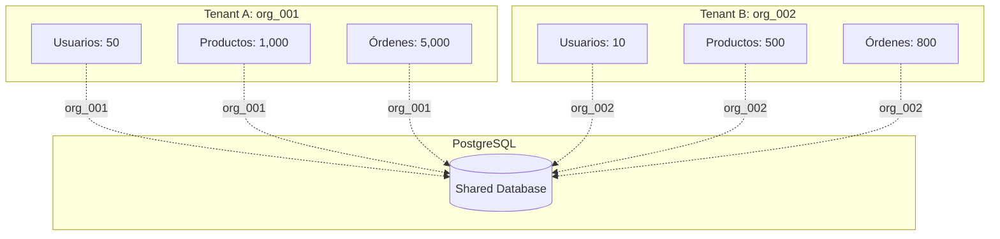

# Multi-tenancy

## Introducción

**Multi-tenancy** es la capacidad de un sistema de servir a múltiples organizaciones (tenants) usando la misma infraestructura, manteniendo sus datos completamente aislados.

## ¿Qué es un Tenant?

En nuestro contexto, un **tenant** es una **organización** que usa el ERP.

### Ejemplos de Tenants

```
Tenant 1: "Empresa Zapatos S.A." (org_001)
  - 50 usuarios
  - 3 sucursales
  - 1,000 productos

Tenant 2: "Tienda Ropa Ltda." (org_002)
  - 10 usuarios
  - 1 sucursal
  - 500 productos

Tenant 3: "Distribuidora XYZ" (org_003)
  - 200 usuarios
  - 15 sucursales
  - 10,000 productos
```

**Mismo sistema, datos completamente separados.**

## Modelos de Multi-tenancy

### 1. Database per Tenant

Cada tenant tiene su propia base de datos.

```
org_001_db
org_002_db
org_003_db
```

**Ventajas**:
- ✅ Máximo aislamiento
- ✅ Backup y restore independiente
- ✅ Fácil migración de datos

**Desventajas**:
- ❌ No escala (miles de BDs)
- ❌ Alto costo operacional
- ❌ Mantenimiento complejo (migraciones en N bases)

### 2. Schema per Tenant

Cada tenant tiene su propio schema en la misma BD.

```sql
CREATE SCHEMA org_001;
CREATE SCHEMA org_002;
```

**Ventajas**:
- ✅ Buen aislamiento
- ✅ Una sola BD

**Desventajas**:
- ❌ Complejidad en queries cross-tenant
- ❌ Migraciones más complejas

### 3. Row-Level Isolation ✅ (Elegido)

Todos los tenants comparten las mismas tablas, cada fila tiene `organization_id`.

```sql
CREATE TABLE products (
  id VARCHAR PRIMARY KEY,
  organization_id VARCHAR NOT NULL,  ← Tenant ID
  title VARCHAR,
  sku VARCHAR,
  ...
);

CREATE INDEX idx_products_org ON products(organization_id);
```

**Ventajas**:
- ✅ Escalable (millones de tenants)
- ✅ Queries cross-tenant fáciles (reportes globales)
- ✅ Migraciones simples
- ✅ Menor costo operacional

**Desventajas**:
- ❌ Requiere cuidado en queries (siempre filtrar por org_id)
- ❌ Menor aislamiento que database-per-tenant

## Implementación en el ERP

### Modelo de Datos

Todas las tablas principales incluyen `organization_id`:

```sql
-- Auth Service
CREATE TABLE users (
  id VARCHAR PRIMARY KEY,
  organization_id VARCHAR NOT NULL,
  email VARCHAR NOT NULL,
  password_hash VARCHAR,
  active BOOLEAN,
  ...
  CONSTRAINT uk_org_email UNIQUE (organization_id, email)
);

-- Catalog Service
CREATE TABLE products (
  id VARCHAR PRIMARY KEY,
  organization_id VARCHAR NOT NULL,
  title VARCHAR,
  sku VARCHAR,
  ...
  CONSTRAINT uk_org_sku UNIQUE (organization_id, sku)
);

-- Audit Service
CREATE TABLE audit_logs (
  id VARCHAR PRIMARY KEY,
  organization_id VARCHAR NOT NULL,
  event_type VARCHAR,
  ...
);
```

### Índices Obligatorios

**Cada tabla con multi-tenancy DEBE tener**:

```sql
CREATE INDEX idx_{tabla}_org ON {tabla}(organization_id);
```

Esto permite queries eficientes por tenant:

```sql
-- Rápido: usa índice
SELECT * FROM products
WHERE organization_id = 'org_123'
AND sku = 'PROD-001';

-- Lento: full table scan
SELECT * FROM products
WHERE sku = 'PROD-001';  ← ❌ Falta filtro por org
```

### Enforcement en Código

#### FastAPI Dependency

```python
from fastapi import Depends, Header, HTTPException

async def get_organization_id(
    x_tenant_id: str = Header(..., alias="X-Tenant-ID")
) -> str:
    """
    Extrae organization_id del header X-Tenant-ID
    Obligatorio en todas las requests
    """
    if not x_tenant_id:
        raise HTTPException(
            status_code=428,
            detail="Header X-Tenant-ID es obligatorio"
        )
    return x_tenant_id

# Uso en endpoints
@router.get("/products")
async def list_products(
    org_id: str = Depends(get_organization_id)
):
    products = await db.query(Product).filter(
        Product.organization_id == org_id
    ).all()
    return products
```

#### Validación Token + Tenant

```python
async def verify_request(
    token: str = Depends(oauth2_scheme),
    tenant_id: str = Header(..., alias="X-Tenant-ID"),
    auth_client: AuthClient = Depends()
):
    """
    Valida:
    1. Token válido
    2. Token pertenece al tenant especificado
    """
    user = await auth_client.verify_token(token)

    if user["organization_id"] != tenant_id:
        raise HTTPException(
            status_code=403,
            detail="Token no pertenece a esta organización"
        )

    return user
```

### Row-Level Security (Opcional)

PostgreSQL soporta políticas de seguridad a nivel de fila:

```sql
-- Habilitar RLS
ALTER TABLE products ENABLE ROW LEVEL SECURITY;

-- Crear política
CREATE POLICY tenant_isolation ON products
  USING (organization_id = current_setting('app.organization_id'));

-- Establecer org_id en sesión
SET app.organization_id = 'org_123';

-- Ahora solo ve filas de org_123
SELECT * FROM products;  -- Filtrado automáticamente
```

**Ventaja**: Protección a nivel de BD, imposible de bypassear desde código.

**Desventaja**: Complejidad adicional, debugging más difícil.

## Aislamiento de Datos

### Diagrama de Aislamiento



### Garantías de Aislamiento

1. **Queries siempre filtrados por organization_id**
2. **Validación en API layer** (FastAPI dependencies)
3. **Validación en token** (JWT contiene organization_id)
4. **Header X-Tenant-ID debe coincidir con token**
5. **Índices optimizados por tenant**

## Gestión de Organizaciones

### Tabla Organizations

```sql
CREATE TABLE organizations (
  id VARCHAR PRIMARY KEY,
  name VARCHAR NOT NULL,
  slug VARCHAR UNIQUE,
  plan VARCHAR,  -- basic, pro, enterprise
  status VARCHAR,  -- active, suspended, inactive
  limits JSONB,  -- { max_users: 50, max_locals: 5 }
  modules_enabled JSONB,  -- ["catalog", "inventory", "orders"]
  created_date TIMESTAMP,
  updated_date TIMESTAMP
);
```

### Límites por Plan

```json
{
  "basic": {
    "max_users": 10,
    "max_locals": 1,
    "max_products": 1000,
    "modules": ["catalog"]
  },
  "pro": {
    "max_users": 50,
    "max_locals": 5,
    "max_products": 10000,
    "modules": ["catalog", "inventory", "orders"]
  },
  "enterprise": {
    "max_users": "unlimited",
    "max_locals": "unlimited",
    "max_products": "unlimited",
    "modules": ["all"]
  }
}
```

### Validación de Límites

```python
async def check_user_limit(org_id: str):
    org = await db.get_organization(org_id)
    current_users = await db.count_users(org_id)

    if current_users >= org.limits["max_users"]:
        raise LimitExceededError(
            f"Límite de usuarios alcanzado: {org.limits['max_users']}"
        )
```

## Locales (Sucursales)

Cada organización puede tener múltiples **locales** (sucursales, bodegas).

### Tabla Locals

```sql
CREATE TABLE locals (
  id VARCHAR PRIMARY KEY,
  organization_id VARCHAR NOT NULL,  ← Pertenece a un tenant
  name VARCHAR,
  code VARCHAR,
  address TEXT,
  status VARCHAR,
  ...
);
```

### Usuarios y Locales

Un usuario puede tener acceso a uno o más locales:

```sql
CREATE TABLE user_local (
  user_id VARCHAR,
  local_id VARCHAR,
  PRIMARY KEY (user_id, local_id)
);
```

### Validación de Acceso a Local

```python
async def validate_local_access(user_id: str, local_id: str):
    """Valida que usuario tenga acceso al local"""
    has_access = await db.query(
        UserLocal
    ).filter(
        UserLocal.user_id == user_id,
        UserLocal.local_id == local_id
    ).exists()

    if not has_access:
        raise ForbiddenError(
            f"Usuario no tiene acceso al local {local_id}"
        )
```

## Ejemplos de Queries Multi-tenant

### Query Correcto ✅

```python
# Siempre filtrar por organization_id
products = await db.query(Product).filter(
    Product.organization_id == org_id,  ← Obligatorio
    Product.status == "active"
).all()
```

### Query Incorrecto ❌

```python
# ❌ NUNCA hacer queries sin filtro por org_id
products = await db.query(Product).filter(
    Product.sku == "PROD-001"
).first()  # Puede retornar producto de otro tenant!
```

### Query Cross-tenant (Admin Only)

```python
# Solo para super admin del sistema
if user.is_system_admin:
    # Puede ver todos los tenants
    all_orgs = await db.query(Organization).all()
```

## Migración de Datos entre Tenants

Si un tenant necesita migrar datos:

```python
async def migrate_tenant_data(
    from_org_id: str,
    to_org_id: str
):
    """
    Migra todos los datos de un tenant a otro
    Útil para fusiones de empresas
    """
    # Migrar usuarios
    await db.execute(
        f"UPDATE users SET organization_id = '{to_org_id}' "
        f"WHERE organization_id = '{from_org_id}'"
    )

    # Migrar productos
    await db.execute(
        f"UPDATE products SET organization_id = '{to_org_id}' "
        f"WHERE organization_id = '{from_org_id}'"
    )

    # ... migrar todas las entidades
```

## Pruebas de Aislamiento

### Test Unitario

```python
async def test_tenant_isolation():
    """Verifica que un tenant no ve datos de otro"""

    # Crear producto para org_001
    product_org1 = await create_product(
        organization_id="org_001",
        title="Producto A"
    )

    # Crear producto para org_002
    product_org2 = await create_product(
        organization_id="org_002",
        title="Producto B"
    )

    # Listar productos de org_001
    products = await list_products(organization_id="org_001")

    # Debe ver solo su producto
    assert len(products) == 1
    assert products[0].id == product_org1.id
    assert products[0].organization_id == "org_001"
```

## Consideraciones de Performance

### 1. Índices por Tenant

```sql
-- Índice compuesto para queries frecuentes
CREATE INDEX idx_products_org_sku
ON products(organization_id, sku);

-- Query optimizado
SELECT * FROM products
WHERE organization_id = 'org_123' AND sku = 'PROD-001';
```

### 2. Particionamiento (Opcional)

Para tenants muy grandes:

```sql
-- Particionar por organization_id
CREATE TABLE products_org_001
PARTITION OF products
FOR VALUES IN ('org_001');

CREATE TABLE products_org_002
PARTITION OF products
FOR VALUES IN ('org_002');
```

### 3. Cache por Tenant

```python
# Cache key incluye organization_id
cache_key = f"products:{org_id}:{product_id}"
product = await redis.get(cache_key)
```

## Seguridad

### Amenazas y Mitigaciones

| Amenaza | Mitigación |
|---------|------------|
| **Tenant A accede a datos de Tenant B** | Validación estricta de organization_id en todos los queries |
| **Token de un tenant usado en otro** | Validar que token.org_id == header.X-Tenant-ID |
| **Query sin filtro por org_id** | Code review, linting, tests |
| **SQL Injection** | ORM (SQLAlchemy), prepared statements |

### Auditoría de Acceso Cross-tenant

```python
async def audit_potential_breach(
    user_id: str,
    requested_org_id: str,
    user_org_id: str
):
    """Registra intentos de acceso cross-tenant"""
    if requested_org_id != user_org_id:
        await audit_log.critical(
            event="CROSS_TENANT_ATTEMPT",
            user_id=user_id,
            user_org=user_org_id,
            requested_org=requested_org_id
        )
        raise ForbiddenError("Acceso denegado")
```

## Próximos Pasos

- [Seguridad y RBAC](/arquitectura/seguridad-rbac)
- [Auth Service - Organizations](/microservicios/auth-service/api-organizations)
- [Auth Service - Locals](/microservicios/auth-service/api-locals)
- [ADR-006: PostgreSQL Multi-tenant](/decisiones-arquitectura/adr-006-postgresql-multi-tenant)
- [Integraciones - PostgreSQL](/integraciones/04-postgresql)
