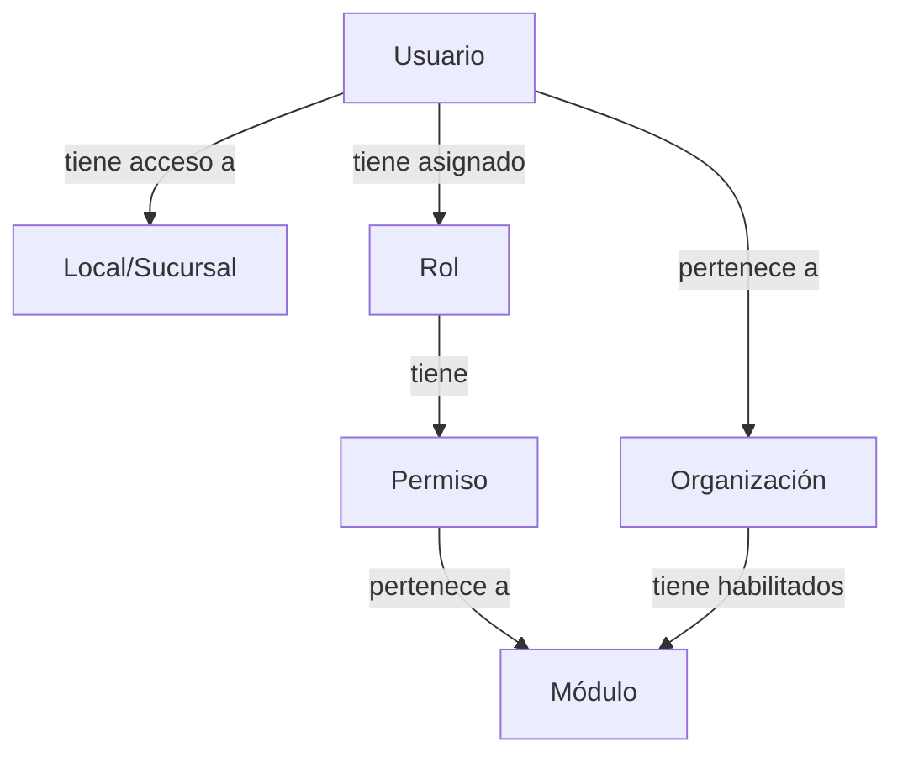
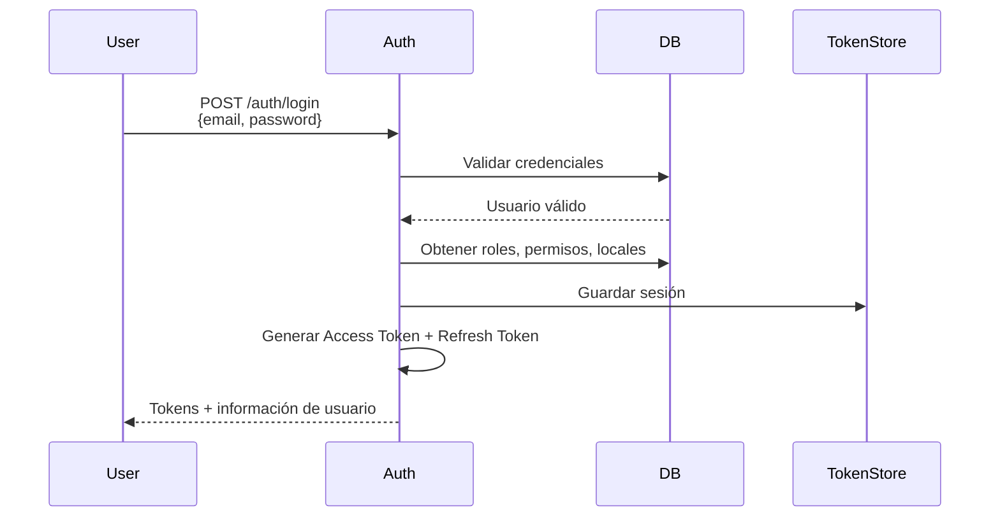
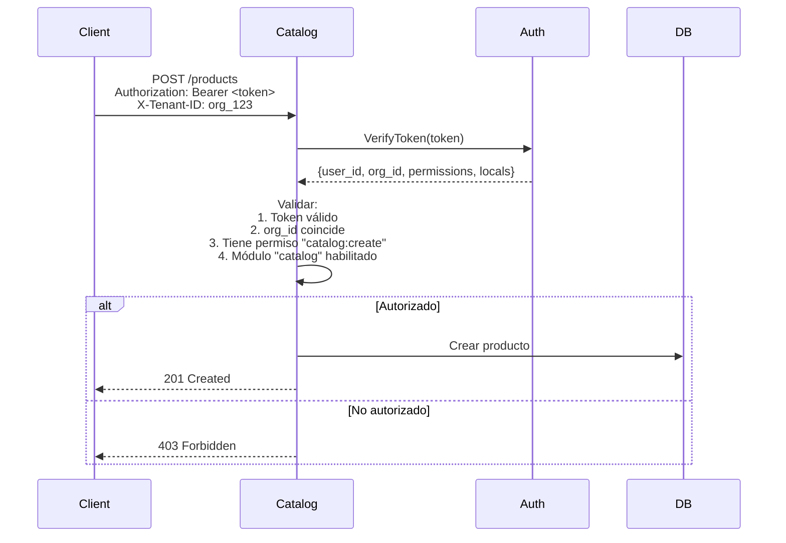

# Seguridad y RBAC

## Introducción

El sistema implementa un modelo de **RBAC (Role-Based Access Control) multinivel** que permite control granular de acceso a recursos y operaciones.

## Modelo de Seguridad General



## Componentes del Modelo RBAC

### 1. Usuarios (Users)

Personas que usan el sistema.

```json
{
  "id": "user_001",
  "email": "admin@empresa.com",
  "organization_id": "org_123",
  "active": true,
  "roles": ["role_admin"],
  "locals": ["local_01", "local_02"]
}
```

### 2. Organizaciones (Organizations)

Tenants del sistema.

```json
{
  "id": "org_123",
  "name": "Mi Empresa S.A.",
  "plan": "pro",
  "modules_enabled": ["catalog", "inventory", "orders"]
}
```

### 3. Módulos (Modules)

Funcionalidades del ERP.

```json
{
  "id": "module_catalog",
  "name": "Catálogo",
  "description": "Gestión de productos y variantes"
}
```

**Módulos disponibles**:
- `catalog`: Catálogo de productos
- `inventory`: Gestión de inventario
- `orders`: Órdenes de venta
- `pricing`: Gestión de precios
- `reports`: Reportes y analytics

### 4. Permisos (Permissions)

Acciones específicas que se pueden realizar.

```json
{
  "id": "perm_catalog_create",
  "module_id": "module_catalog",
  "name": "catalog:create",
  "description": "Crear productos en el catálogo"
}
```

**Formato de permisos**: `{módulo}:{acción}`

Ejemplos:
- `catalog:read`
- `catalog:create`
- `catalog:edit`
- `catalog:delete`
- `inventory:read`
- `inventory:adjust`
- `orders:create`
- `orders:cancel`

### 5. Roles

Agrupación de permisos.

```json
{
  "id": "role_admin",
  "organization_id": "org_123",
  "name": "Administrador",
  "permissions": [
    "catalog:read",
    "catalog:create",
    "catalog:edit",
    "catalog:delete",
    "inventory:read",
    "inventory:adjust"
  ]
}
```

**Características**:
- Cada organización define sus propios roles
- Un rol puede tener múltiples permisos
- Un usuario puede tener múltiples roles

### 6. Locales (Sucursales)

Ubicaciones físicas o lógicas de operación.

```json
{
  "id": "local_01",
  "organization_id": "org_123",
  "name": "Sucursal Centro",
  "code": "SC-01"
}
```

**Control de acceso por local**:
- Un usuario puede tener acceso a uno o más locales
- Operaciones se validan contra los locales permitidos

## Flujo de Autenticación y Autorización

### 1. Login



### 2. Request Autorizado



## Tokens JWT

### Access Token

Token de corta duración para acceder a recursos.

**Estructura**:

```json
{
  "header": {
    "alg": "RS256",
    "typ": "JWT"
  },
  "payload": {
    "user_id": "user_001",
    "email": "admin@empresa.com",
    "organization_id": "org_123",
    "roles": ["role_admin"],
    "permissions": ["catalog:read", "catalog:create", ...],
    "locals": ["local_01", "local_02"],
    "exp": 1705851600,  // 15 minutos
    "iat": 1705850700
  },
  "signature": "..."
}
```

**TTL**: 15 minutos

### Refresh Token

Token de larga duración para obtener nuevos access tokens.

**TTL**: 7 días

**Uso**:

```http
POST /auth/refresh
Content-Type: application/json

{
  "refresh_token": "jwt-refresh..."
}
```

**Response**:

```json
{
  "access_token": "new-jwt-access...",
  "expires_in": 900
}
```

## Validación de Permisos

### En el Microservicio

Cada microservicio valida permisos localmente:

```python
from fastapi import Depends, HTTPException

async def require_permission(
    permission: str,
    user: User = Depends(get_current_user)
):
    """
    Dependency para validar que el usuario tenga un permiso
    """
    if permission not in user.permissions:
        raise HTTPException(
            status_code=403,
            detail={
                "code": "INSUFFICIENT_PERMISSIONS",
                "message": f"Se requiere permiso: {permission}",
                "required": permission,
                "user_permissions": user.permissions
            }
        )
    return user

# Uso en endpoint
@router.post("/products")
async def create_product(
    data: ProductCreate,
    user: User = Depends(require_permission("catalog:create"))
):
    # Usuario tiene permiso catalog:create
    product = await product_service.create(data, user)
    return product
```

### Permisos Especiales

#### local:access_all

Permite acceso a todos los locales de la organización sin restricción:

```python
def can_access_local(user: User, local_id: str) -> bool:
    """Verifica si usuario puede acceder a un local"""
    # Si tiene permiso especial, puede acceder a todos
    if "local:access_all" in user.permissions:
        return True

    # Si no, debe estar en su lista de locales
    return local_id in user.locals
```

#### admin:global

Super admin que puede gestionar todas las organizaciones:

```python
def is_system_admin(user: User) -> bool:
    return "admin:global" in user.permissions
```

## Jerarquía de Roles (Ejemplo)

### Rol: Super Admin

**Permisos**: Todos (`*`)

**Uso**: Administrador del zenLogic (proveedor SaaS)

### Rol: Admin Organizacional

**Permisos**:
- `catalog:*`
- `inventory:*`
- `orders:*`
- `users:read`, `users:create`, `users:edit`
- `roles:read`, `roles:create`, `roles:edit`

**Uso**: Administrador de una organización

### Rol: Gerente

**Permisos**:
- `catalog:read`, `catalog:edit`
- `inventory:read`
- `orders:read`, `orders:create`
- `users:read`

**Uso**: Gerente de sucursal

### Rol: Vendedor

**Permisos**:
- `catalog:read`
- `orders:read`, `orders:create`

**Uso**: Personal de ventas

### Rol: Bodeguero

**Permisos**:
- `catalog:read`
- `inventory:read`, `inventory:adjust`

**Uso**: Personal de bodega

## Validación de Módulos Habilitados

Además de permisos, se valida que el módulo esté habilitado para la organización:

```python
async def validate_module_access(
    user: User,
    required_module: str
):
    """
    Valida que la organización tenga el módulo habilitado
    """
    org = await db.get_organization(user.organization_id)

    if required_module not in org.modules_enabled:
        raise HTTPException(
            status_code=403,
            detail={
                "code": "MODULE_NOT_ENABLED",
                "message": f"Módulo {required_module} no habilitado",
                "enabled_modules": org.modules_enabled
            }
        )
```

## Control de Acceso por Local

Validación de que usuario opere solo en locales permitidos:

```python
async def validate_local_access(
    user: User,
    local_id: str
):
    """
    Valida que usuario tenga acceso al local
    """
    # Permiso especial permite acceso a todos
    if "local:access_all" in user.permissions:
        return True

    # Validar que local esté en lista del usuario
    if local_id not in user.locals:
        raise HTTPException(
            status_code=403,
            detail={
                "code": "LOCAL_ACCESS_DENIED",
                "message": f"No tienes acceso al local {local_id}",
                "allowed_locals": user.locals
            }
        )
```

## Ejemplo Completo de Validación

```python
@router.post("/products/{product_id}/variants")
async def create_variant(
    product_id: str,
    data: VariantCreate,
    user: User = Depends(get_current_user)
):
    """
    Crear variante con validaciones completas
    """
    # 1. Validar que usuario esté activo
    if not user.active:
        raise HTTPException(403, "Usuario inactivo")

    # 2. Validar que organización esté activa
    org = await db.get_organization(user.organization_id)
    if org.status != "active":
        raise HTTPException(403, "Organización suspendida")

    # 3. Validar módulo habilitado
    if "catalog" not in org.modules_enabled:
        raise HTTPException(403, "Módulo catalog no habilitado")

    # 4. Validar permiso
    if "catalog:create" not in user.permissions:
        raise HTTPException(403, "Permiso catalog:create requerido")

    # 5. Validar acceso al local (warehouseId)
    if not await can_access_local(user, data.warehouseId):
        raise HTTPException(403, f"Sin acceso al local {data.warehouseId}")

    # 6. Validar que producto pertenece a la organización
    product = await db.get_product(product_id)
    if product.organization_id != user.organization_id:
        raise HTTPException(404, "Producto no encontrado")

    # Todo OK, crear variante
    variant = await variant_service.create(product_id, data, user)
    return variant
```

## Seguridad de Contraseñas

### Hashing

```python
from passlib.context import CryptContext

pwd_context = CryptContext(schemes=["bcrypt"], deprecated="auto")

# Al crear usuario
hashed = pwd_context.hash("password123")

# Al validar login
is_valid = pwd_context.verify("password123", hashed)
```

### Políticas de Contraseñas

```python
def validate_password_strength(password: str):
    """
    Valida fortaleza de contraseña
    """
    if len(password) < 8:
        raise ValueError("Mínimo 8 caracteres")

    if not any(c.isupper() for c in password):
        raise ValueError("Debe tener al menos una mayúscula")

    if not any(c.isdigit() for c in password):
        raise ValueError("Debe tener al menos un número")
```

### Bloqueo por Intentos Fallidos

```python
async def handle_failed_login(email: str):
    """
    Incrementa contador de intentos fallidos
    Bloquea usuario después de 5 intentos
    """
    key = f"failed_login:{email}"
    attempts = await redis.incr(key)
    await redis.expire(key, 900)  # 15 minutos

    if attempts >= 5:
        await db.update_user(email, locked=True)
        raise HTTPException(423, "Usuario bloqueado por seguridad")
```

## Rate Limiting

Límites de requests por endpoint:

```python
from slowapi import Limiter

limiter = Limiter(key_func=get_remote_address)

@router.post("/auth/login")
@limiter.limit("5/minute")
async def login(request: Request, credentials: LoginRequest):
    # Máximo 5 intentos de login por minuto por IP
    pass
```

## Auditoría de Seguridad

Todos los eventos de seguridad se registran:

```python
await audit_log.security(
    event_type="LOGIN_SUCCESS",
    user_id=user.id,
    organization_id=user.organization_id,
    ip=request.client.host,
    user_agent=request.headers.get("user-agent")
)
```

**Eventos auditados**:
- Login exitoso/fallido
- Cambio de contraseña
- Asignación/revocación de roles
- Cambio de permisos
- Intentos de acceso denegado
- Usuario bloqueado/desbloqueado

## Headers de Seguridad

```python
@app.middleware("http")
async def add_security_headers(request: Request, call_next):
    response = await call_next(request)

    response.headers["X-Content-Type-Options"] = "nosniff"
    response.headers["X-Frame-Options"] = "DENY"
    response.headers["X-XSS-Protection"] = "1; mode=block"
    response.headers["Strict-Transport-Security"] = "max-age=31536000"

    return response
```

## CORS

```python
from fastapi.middleware.cors import CORSMiddleware

app.add_middleware(
    CORSMiddleware,
    allow_origins=["https://app.example.com"],  # Solo orígenes permitidos
    allow_credentials=True,
    allow_methods=["GET", "POST", "PUT", "DELETE"],
    allow_headers=["Authorization", "Content-Type", "X-Tenant-ID"],
)
```

## Próximos Pasos

- [Auth Service - Overview](/microservicios/auth-service/overview)
- [Auth Service - API Users](/microservicios/auth-service/api-users)
- [Auth Service - API Roles](/microservicios/auth-service/api-roles)
- [Auth Service - API Permissions](/microservicios/auth-service/api-permissions)
- [Catalog Service - Validación de Locales](/microservicios/catalog-service/validacion-locales)
