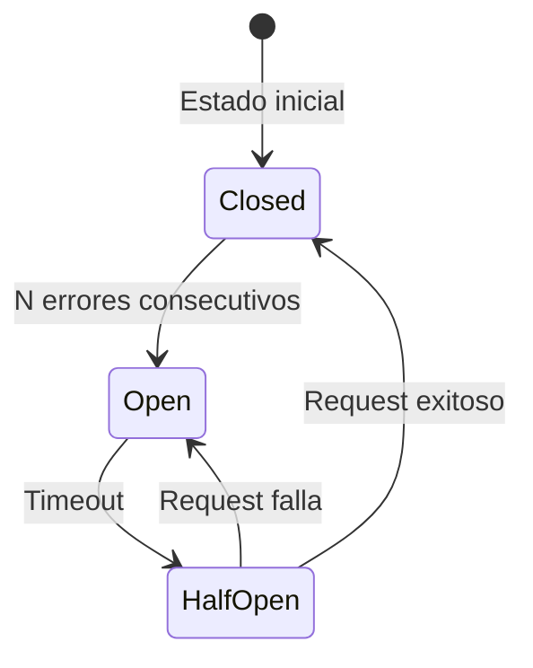

# Patrones de Diseño

## Introducción

El zenLogic implementa múltiples patrones de diseño reconocidos en la industria para garantizar mantenibilidad, escalabilidad y robustez.

## Patrones Arquitectónicos

### 1. Microservicios

**Descripción**: Dividir la aplicación en servicios pequeños, independientes y desplegables por separado.

**Implementación**:
- Auth Service
- Catalog Service
- Audit Service
- Inventory Service
- Order Service

**Beneficios**:
- ✅ Escalabilidad independiente
- ✅ Tecnologías heterogéneas posibles
- ✅ Fallas aisladas
- ✅ Despliegues independientes

**Trade-offs**:
- ❌ Complejidad operacional
- ❌ Latencia de red
- ❌ Debugging distribuido más difícil

### 2. Event-Driven Architecture

**Descripción**: Los componentes se comunican mediante eventos asíncronos.

**Implementación**:
```python
# Producer
await event_publisher.publish(
    event_type="auth.user.deactivated",
    payload={"user_id": "user_001"}
)

# Consumer
@event_consumer.on("auth.user.deactivated")
async def handle_user_deactivated(event):
    await cache.invalidate_user(event["user_id"])
```

**Beneficios**:
- ✅ Desacoplamiento temporal
- ✅ Escalabilidad
- ✅ Extensibilidad

**Trade-offs**:
- ❌ Consistencia eventual
- ❌ Debugging complejo
- ❌ Gestión de eventos duplicados

### 3. API Gateway

**Descripción**: Punto de entrada único para todas las requests externas.

**Implementación**:
```
Cliente → API Gateway → [Auth, Catalog, Inventory, Orders]
```

**Beneficios**:
- ✅ Punto único de autenticación
- ✅ Rate limiting centralizado
- ✅ Routing simplificado
- ✅ CORS management

## Patrones de Aplicación

### 4. Repository Pattern

**Descripción**: Abstracción de acceso a datos, separando lógica de negocio de persistencia.

**Implementación**:

```python
# Repository
class ProductRepository:
    def __init__(self, db: Session):
        self.db = db

    async def get_by_id(
        self,
        product_id: str,
        organization_id: str
    ) -> Product:
        return await self.db.query(Product).filter(
            Product.id == product_id,
            Product.organization_id == organization_id
        ).first()

    async def create(self, product: Product) -> Product:
        self.db.add(product)
        await self.db.commit()
        await self.db.refresh(product)
        return product

# Service usando repository
class ProductService:
    def __init__(self, repo: ProductRepository):
        self.repo = repo

    async def get_product(
        self,
        product_id: str,
        user: User
    ) -> Product:
        product = await self.repo.get_by_id(
            product_id,
            user.organization_id
        )
        if not product:
            raise NotFoundError("Producto no encontrado")
        return product
```

**Beneficios**:
- ✅ Testeable (fácil mockear repositorio)
- ✅ Cambio de BD simplificado
- ✅ Separación de responsabilidades

### 5. Service Layer

**Descripción**: Capa intermedia que contiene lógica de negocio.

**Estructura**:
```
API Layer (FastAPI)
    ↓
Service Layer (Lógica de negocio)
    ↓
Repository Layer (Acceso a datos)
    ↓
Database
```

**Implementación**:

```python
# Service con lógica de negocio
class OrderService:
    def __init__(
        self,
        order_repo: OrderRepository,
        inventory_service: InventoryService,
        catalog_service: CatalogService
    ):
        self.order_repo = order_repo
        self.inventory = inventory_service
        self.catalog = catalog_service

    async def create_order(
        self,
        data: OrderCreate,
        user: User
    ) -> Order:
        # 1. Validar productos existen
        for item in data.items:
            product = await self.catalog.get_product(item.product_id)
            if not product:
                raise ValidationError(f"Producto {item.product_id} no existe")

        # 2. Validar stock disponible
        for item in data.items:
            available = await self.inventory.check_stock(
                item.variant_id,
                item.quantity
            )
            if not available:
                raise ValidationError(f"Stock insuficiente para {item.variant_id}")

        # 3. Reservar stock
        for item in data.items:
            await self.inventory.reserve_stock(
                item.variant_id,
                item.quantity,
                order_id=order.id
            )

        # 4. Crear orden
        order = Order(**data.dict(), user_id=user.id)
        order = await self.order_repo.create(order)

        # 5. Publicar evento
        await self.event_publisher.publish(
            "order.created",
            {"order_id": order.id}
        )

        return order
```

**Beneficios**:
- ✅ Lógica centralizada
- ✅ Reutilizable
- ✅ Testeable

### 6. Dependency Injection

**Descripción**: Inyectar dependencias en lugar de crearlas internamente.

**Implementación**:

```python
from fastapi import Depends

# Dependency providers
def get_db() -> Session:
    db = SessionLocal()
    try:
        yield db
    finally:
        db.close()

def get_product_repository(
    db: Session = Depends(get_db)
) -> ProductRepository:
    return ProductRepository(db)

def get_product_service(
    repo: ProductRepository = Depends(get_product_repository),
    event_publisher: EventPublisher = Depends(get_event_publisher)
) -> ProductService:
    return ProductService(repo, event_publisher)

# Endpoint con DI
@router.get("/products/{product_id}")
async def get_product(
    product_id: str,
    service: ProductService = Depends(get_product_service),
    user: User = Depends(get_current_user)
):
    return await service.get_product(product_id, user)
```

**Beneficios**:
- ✅ Testeable (inyectar mocks)
- ✅ Desacoplamiento
- ✅ Configuración centralizada

## Patrones de Resilencia

### 7. Circuit Breaker

**Descripción**: Prevenir llamadas a servicios que están fallando.

**Estados**:


**Implementación**:

```python
from pybreaker import CircuitBreaker

# Configuración
auth_breaker = CircuitBreaker(
    fail_max=5,           # Abrir tras 5 fallos
    timeout_duration=60,  # Reintento en 60s
    expected_exception=ServiceUnavailableError
)

# Uso
@auth_breaker
async def verify_token_grpc(token: str):
    """
    Llamada protegida por circuit breaker
    """
    try:
        return await auth_grpc_client.verify(token)
    except grpc.RpcError as e:
        raise ServiceUnavailableError("Auth Service unavailable")
```

**Beneficios**:
- ✅ Previene cascading failures
- ✅ Fail fast
- ✅ Auto-recovery

### 8. Retry con Backoff Exponencial

**Descripción**: Reintentar operaciones fallidas con delays crecientes.

**Implementación**:

```python
from tenacity import retry, stop_after_attempt, wait_exponential

@retry(
    stop=stop_after_attempt(3),
    wait=wait_exponential(multiplier=1, min=1, max=10),
    reraise=True
)
async def call_external_api():
    """
    Intenta 3 veces con delays de 1s, 2s, 4s
    """
    response = await httpx.get("https://api.external.com")
    response.raise_for_status()
    return response.json()
```

**Beneficios**:
- ✅ Tolera fallos transitorios
- ✅ No sobrecarga servicios
- ✅ Configurable

### 9. Fallback

**Descripción**: Proveer alternativa cuando servicio principal falla.

**Implementación**:

```python
async def verify_token(token: str):
    """
    Intenta gRPC, fallback a REST
    """
    try:
        # Primero gRPC (más rápido)
        return await auth_grpc_client.verify(token)
    except grpc.RpcError:
        logger.warning("gRPC failed, falling back to REST")
        # Fallback a REST
        return await auth_rest_client.verify(token)
    except Exception:
        # Fallback a cache (si existe)
        cached = await cache.get(f"token:{token}")
        if cached:
            logger.warning("Using cached token verification")
            return cached
        raise
```

## Patrones de Datos

### 10. Cache-Aside

**Descripción**: Leer de cache primero, si no existe leer de BD y cachear.

**Implementación**:

```python
async def get_product(product_id: str, org_id: str):
    """
    Cache-aside pattern
    """
    cache_key = f"product:{org_id}:{product_id}"

    # 1. Intentar leer de cache
    cached = await redis.get(cache_key)
    if cached:
        return json.loads(cached)

    # 2. Si no existe, leer de BD
    product = await db.query(Product).filter(
        Product.id == product_id,
        Product.organization_id == org_id
    ).first()

    if not product:
        raise NotFoundError()

    # 3. Guardar en cache
    await redis.setex(
        cache_key,
        300,  # TTL 5 minutos
        json.dumps(product.dict())
    )

    return product
```

**Invalidación de cache**:

```python
async def update_product(product_id: str, data: ProductUpdate):
    # 1. Actualizar en BD
    product = await db.update(product_id, data)

    # 2. Invalidar cache
    cache_key = f"product:{product.organization_id}:{product_id}"
    await redis.delete(cache_key)

    return product
```

### 11. Unit of Work

**Descripción**: Agrupar operaciones de BD en una transacción.

**Implementación**:

```python
class UnitOfWork:
    def __init__(self, session: Session):
        self.session = session
        self._committed = False

    async def __aenter__(self):
        return self

    async def __aexit__(self, exc_type, exc_val, exc_tb):
        if exc_type is None:
            await self.commit()
        else:
            await self.rollback()

    async def commit(self):
        await self.session.commit()
        self._committed = True

    async def rollback(self):
        await self.session.rollback()

# Uso
async def transfer_stock(
    from_local: str,
    to_local: str,
    variant_id: str,
    quantity: int
):
    async with UnitOfWork(db) as uow:
        # Todas estas operaciones en una transacción
        await inventory_repo.decrease_stock(from_local, variant_id, quantity)
        await inventory_repo.increase_stock(to_local, variant_id, quantity)
        await movement_repo.create_transfer(from_local, to_local, variant_id, quantity)
        # Si cualquier operación falla, rollback automático
```

### 12. Event Sourcing (Parcial)

**Descripción**: Almacenar eventos en lugar de estado actual.

**Implementación** (en Audit Service):

```python
# En lugar de guardar solo el estado actual
# Guardamos cada evento que ocurre
events = [
    {"event": "product.created", "data": {...}, "timestamp": "..."},
    {"event": "product.price_updated", "old": 10, "new": 15, "timestamp": "..."},
    {"event": "product.deactivated", "timestamp": "..."}
]

# Podemos reconstruir el estado en cualquier momento
def rebuild_product_state(product_id: str):
    events = get_all_events(product_id)
    state = {}
    for event in events:
        state = apply_event(state, event)
    return state
```

## Patrones de Integración

### 13. Adapter Pattern

**Descripción**: Adaptar interfaces incompatibles.

**Implementación**:

```python
# Interfaz común
class AuthClientInterface(ABC):
    @abstractmethod
    async def verify_token(self, token: str) -> User:
        pass

# Adapter para gRPC
class AuthGrpcAdapter(AuthClientInterface):
    def __init__(self, grpc_client):
        self.client = grpc_client

    async def verify_token(self, token: str) -> User:
        response = await self.client.VerifyToken(token)
        return User(
            id=response.user_id,
            email=response.email,
            permissions=list(response.permissions)
        )

# Adapter para REST
class AuthRestAdapter(AuthClientInterface):
    def __init__(self, http_client):
        self.client = http_client

    async def verify_token(self, token: str) -> User:
        response = await self.client.post("/verify", json={"token": token})
        data = response.json()
        return User(**data["user"])

# Service usa interfaz común
class ProductService:
    def __init__(self, auth_client: AuthClientInterface):
        self.auth = auth_client

    async def get_product(self, token: str, product_id: str):
        user = await self.auth.verify_token(token)
        # ... resto de lógica
```

### 14. Saga Pattern (Futuro)

**Descripción**: Transacciones distribuidas mediante eventos compensatorios.

**Ejemplo conceptual**:

```python
# Crear orden (happy path)
1. Order Service: Crear orden → OK
2. Inventory Service: Reservar stock → OK
3. Payment Service: Procesar pago → OK
4. Order Service: Confirmar orden → OK

# Crear orden (con error en pago)
1. Order Service: Crear orden → OK
2. Inventory Service: Reservar stock → OK
3. Payment Service: Procesar pago → ERROR
4. Inventory Service: Liberar stock (compensación)
5. Order Service: Cancelar orden (compensación)
```

## Patrones de API

### 15. Cursor Pagination

**Descripción**: Paginación eficiente basada en cursors en lugar de offset.

**Implementación**: Ver [ADR-007](/decisiones-arquitectura/adr-007-cursor-pagination)

```json
{
  "edges": [
    {"cursor": "Y3Vyc29yX3Byb2RfMDAx", "node": {...}},
    {"cursor": "Y3Vyc29yX3Byb2RfMDAy", "node": {...}}
  ],
  "pageInfo": {
    "hasNextPage": true,
    "hasPreviousPage": false,
    "startCursor": "Y3Vyc29yX3Byb2RfMDAx",
    "endCursor": "Y3Vyc29yX3Byb2RfMDAy"
  }
}
```

### 16. API Versioning

**Descripción**: Mantener compatibilidad mientras evoluciona la API.

**Implementación**:

```python
# v1
@router.get("/api/v1/products")
async def list_products_v1():
    return {"products": [...]}

# v2 con cambios
@router.get("/api/v2/products")
async def list_products_v2():
    return {
        "data": {
            "products": {
                "edges": [...],
                "pageInfo": {...}
            }
        }
    }
```

## Tabla Resumen de Patrones

| Patrón | Categoría | Usado en | Beneficio Principal |
|--------|-----------|----------|---------------------|
| Microservicios | Arquitectura | Todo el sistema | Escalabilidad independiente |
| Event-Driven | Arquitectura | Auth, Catalog, Audit | Desacoplamiento |
| API Gateway | Arquitectura | Entry point | Centralización |
| Repository | Aplicación | Todos los servicios | Abstracción de datos |
| Service Layer | Aplicación | Todos los servicios | Lógica de negocio |
| Dependency Injection | Aplicación | FastAPI | Testabilidad |
| Circuit Breaker | Resilencia | Catalog ↔ Auth | Prevenir fallos en cascada |
| Retry | Resilencia | Llamadas externas | Tolerar fallos transitorios |
| Fallback | Resilencia | gRPC → REST | Alta disponibilidad |
| Cache-Aside | Datos | Catalog, Auth | Performance |
| Unit of Work | Datos | Transacciones | Consistencia |
| Event Sourcing | Datos | Audit Service | Trazabilidad completa |
| Adapter | Integración | Auth clients | Interfaces compatibles |
| Cursor Pagination | API | Todas las APIs | Performance en paginación |

## Próximos Pasos

- [Auth Service](/microservicios/auth-service/overview)
- [Catalog Service](/microservicios/catalog-service/overview)
- [Decisiones de Arquitectura](/decisiones-arquitectura/00-introduccion-adrs)
