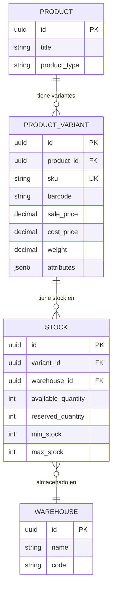
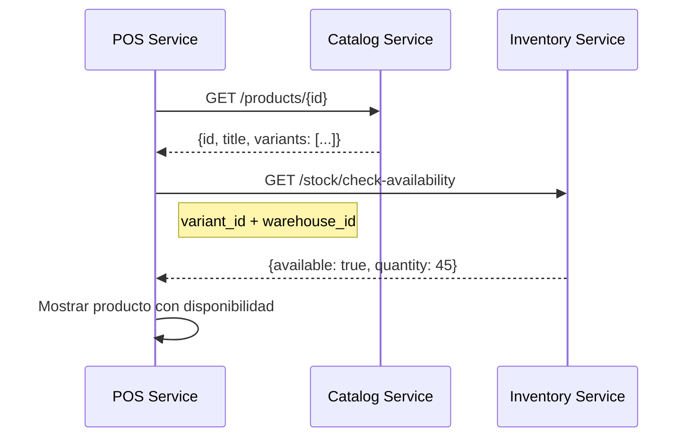
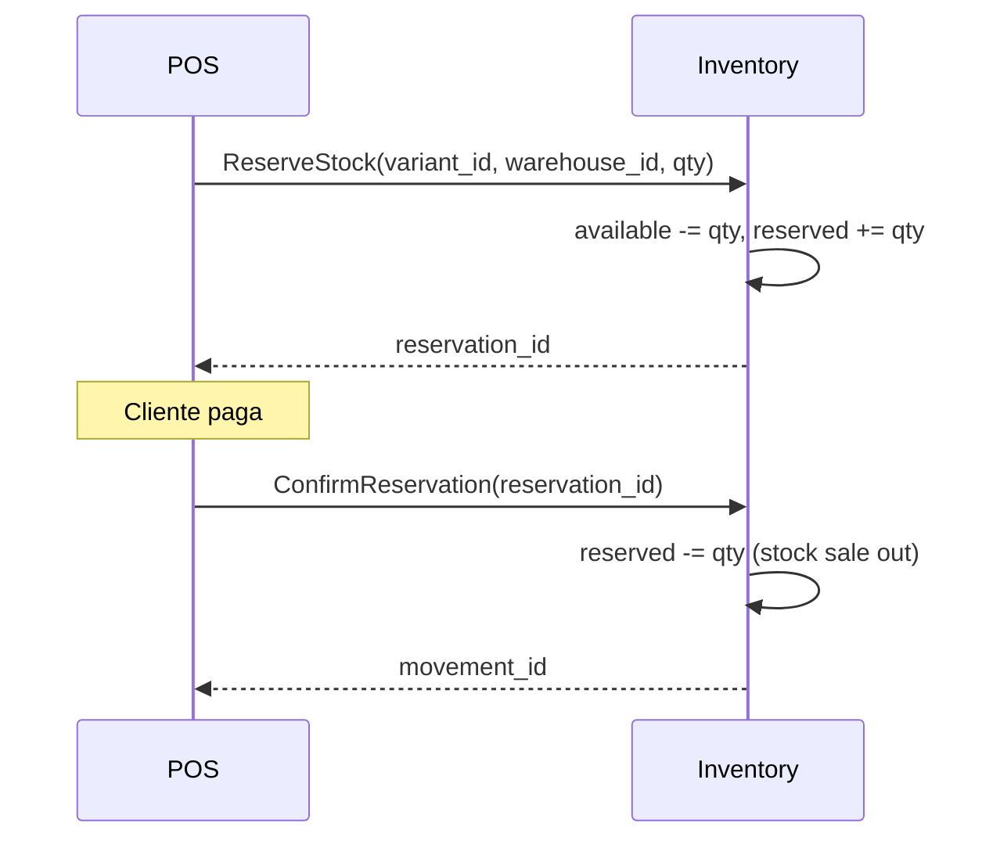
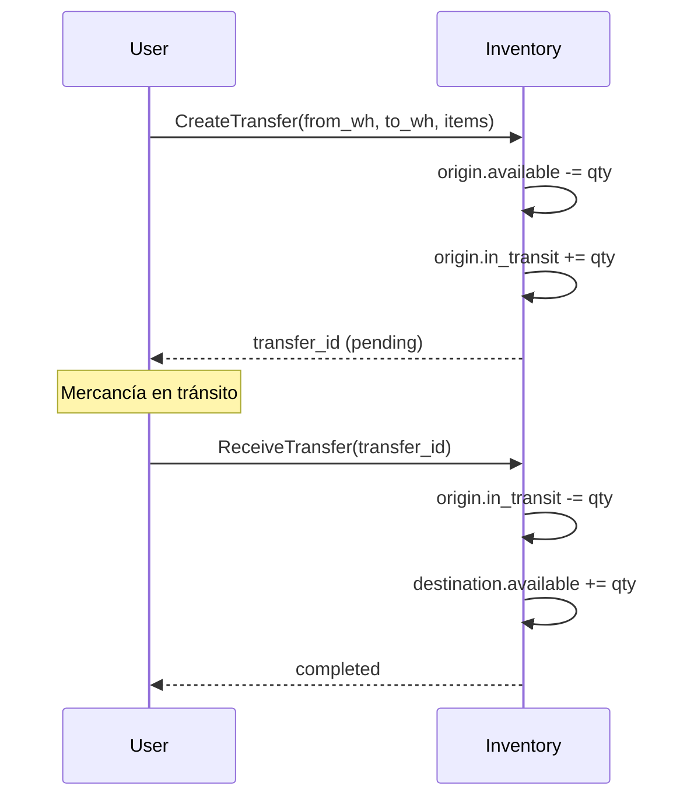
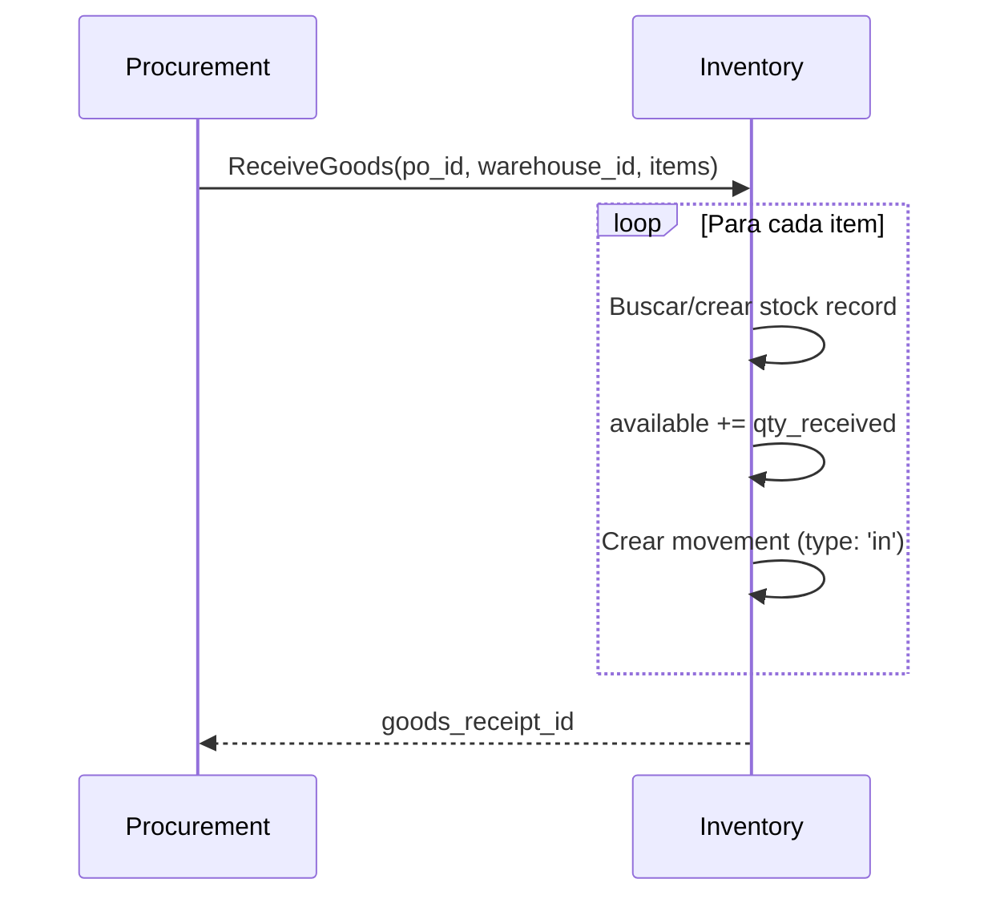

# Variantes vs Stock: Diferencias Clave

Documentación que clarifica la diferencia entre **Variantes** (Catalog Service) y **Stock** (Inventory Service).

## Concepto Fundamental

```
┌──────────────────────────────────────────────────────────────────────────┐
│                          CATALOG SERVICE                                  │
│  ┌────────────────────────────────────────────────────────────────────┐  │
│  │  Variante = QUÉ VENDES (atributos del producto)                    │  │
│  │                                                                     │  │
│  │  • SKU: CAMISETA-AZUL-M                                            │  │
│  │  • Color: Azul                                                      │  │
│  │  • Talla: M                                                         │  │
│  │  • Peso: 0.25 kg                                                    │  │
│  │  • Precio base: $25.00                                              │  │
│  └────────────────────────────────────────────────────────────────────┘  │
└──────────────────────────────────────────────────────────────────────────┘
                                    │
                                    │ variant_id
                                    ▼
┌──────────────────────────────────────────────────────────────────────────┐
│                         INVENTORY SERVICE                                 │
│  ┌────────────────────────────────────────────────────────────────────┐  │
│  │  Stock = CUÁNTO TIENES (cantidad por ubicación)                    │  │
│  │                                                                     │  │
│  │  Bodega Central:     150 unidades disponibles                      │  │
│  │  Bodega Sucursal A:   45 unidades disponibles                      │  │
│  │  Bodega Sucursal B:   23 unidades disponibles                      │  │
│  │  ────────────────────────────────────────                          │  │
│  │  Total:              218 unidades                                  │  │
│  └────────────────────────────────────────────────────────────────────┘  │
└──────────────────────────────────────────────────────────────────────────┘
```

## Responsabilidades por Servicio

### Catalog Service (Variantes)

**Gestiona atributos del producto**, no cantidades:

| Campo | Propósito | Ejemplo |
|-------|-----------|---------|
| `sku` | Identificador único | `NIKE-AF1-WHITE-42` |
| `barcode` | Código de barras | `7501234567890` |
| `sale_price` | Precio base de venta | `$120.00` |
| `cost_price` | Costo unitario | `$65.00` |
| `tax` | Porcentaje de impuesto | `12%` |
| `weight` | Peso para envío | `0.8 kg` |
| `dimensions` | Medidas físicas | `30x20x12 cm` |
| `attributes` | Color, talla, material, etc. | `{color: "white", size: "42"}` |

### Inventory Service (Stock)

**Gestiona cantidades y ubicaciones**:

| Campo | Propósito | Ejemplo |
|-------|-----------|---------|
| `total_quantity` | Cantidad total física | `150` |
| `available_quantity` | Disponible para venta | `130` |
| `reserved_quantity` | Reservado en pedidos | `15` |
| `damaged_quantity` | Dañado/no vendible | `5` |
| `in_transit_quantity` | En transferencia | `0` |
| `min_stock` | Alerta de stock bajo | `20` |
| `max_stock` | Capacidad máxima | `200` |
| `reorder_point` | Punto de reorden | `30` |
| `warehouse_id` | Bodega donde está | `wh_001` |
| `location_id` | Ubicación física | `A-05-03-02` |

## Diagrama de Relación



## ¿Por Qué Separar?

### 1. Una variante puede estar en múltiples bodegas

```
Variante: "Nike Air Force 1 - Blanco - Talla 42"
(variant_id: var_nike_af1_w42)

Stock:
├── Bodega Central:     150 unidades
├── Sucursal Norte:      45 unidades
├── Sucursal Sur:        23 unidades
└── Bodega Virtual:      12 unidades (dropshipping)
```

### 2. Diferentes niveles de stock por ubicación

```sql
-- Stock en Bodega Central
{variant_id: "var_nike_af1_w42", warehouse_id: "wh_central", min_stock: 50, max_stock: 200}

-- Stock en Sucursal (menor capacidad)
{variant_id: "var_nike_af1_w42", warehouse_id: "wh_norte", min_stock: 10, max_stock: 50}
```

### 3. Movimientos de inventario entre bodegas

Los movimientos de stock son internos de Inventory Service:

```
Transferencia WH_CENTRAL → WH_NORTE
├── variant_id: var_nike_af1_w42
├── quantity: 30 unidades
├── status: in_transit
└── estimated_arrival: 2025-01-20
```

## Flujo de Consulta: "¿Hay stock disponible?"



### Ejemplo de Request

```http
# 1. Obtener info de producto (Catalog)
GET /api/v1/products/prod_123
Authorization: Bearer {token}

# Response
{
  "id": "prod_123",
  "title": "Nike Air Force 1",
  "variants": [
    {
      "id": "var_456",
      "sku": "NIKE-AF1-WHITE-42",
      "sale_price": 120.00,
      "attributes": {"color": "white", "size": "42"}
      // ❌ NO incluye campos de stock
    }
  ]
}

# 2. Consultar disponibilidad (Inventory)
GET /api/v1/stock/availability?variant_id=var_456&warehouse_id=wh_001
Authorization: Bearer {token}

# Response
{
  "variant_id": "var_456",
  "warehouse_id": "wh_001",
  "available_quantity": 45,
  "reserved_quantity": 5,
  "can_sell": true
}
```

## Modelo Correcto de ProductVariant (Catalog)

```sql
-- ✅ CORRECTO: Solo atributos del producto
CREATE TABLE product_variants (
    id UUID PRIMARY KEY,
    product_id UUID NOT NULL REFERENCES products(id),

    -- Identificadores
    sku VARCHAR(100) NOT NULL UNIQUE,
    barcode VARCHAR(100) UNIQUE,

    -- Precios (base, pueden ser sobreescritos por Pricing Service)
    sale_price DECIMAL(10, 2) NOT NULL,
    cost_price DECIMAL(10, 2),
    tax_rate DECIMAL(5, 2) DEFAULT 0,

    -- Atributos físicos
    weight DECIMAL(10, 3),
    dim_length DECIMAL(10, 2),
    dim_width DECIMAL(10, 2),
    dim_height DECIMAL(10, 2),

    -- Atributos variables (color, talla, etc.)
    attributes JSONB DEFAULT '{}',

    -- Configuración de inventario (valores por defecto)
    track_inventory BOOLEAN DEFAULT TRUE,
    default_min_stock INT DEFAULT 10,
    default_max_stock INT DEFAULT 1000,

    -- Metadata
    created_at TIMESTAMP DEFAULT NOW(),
    updated_at TIMESTAMP DEFAULT NOW()
);

-- ❌ INCORRECTO: NO incluir estos campos en Catalog
-- stock_total INT,        -- Va en Inventory Service
-- stock_available INT,    -- Va en Inventory Service
-- stock_reserved INT,     -- Va en Inventory Service
-- warehouse_id UUID,      -- Va en Inventory Service
```

## Modelo Correcto de Stock (Inventory)

```sql
-- ✅ CORRECTO: Cantidades por variante + bodega
CREATE TABLE stock (
    id UUID PRIMARY KEY,
    organization_id UUID NOT NULL,
    variant_id UUID NOT NULL,        -- FK lógica a Catalog
    warehouse_id UUID NOT NULL REFERENCES warehouses(id),

    -- Cantidades
    total_quantity INT NOT NULL DEFAULT 0,
    available_quantity INT NOT NULL DEFAULT 0,
    reserved_quantity INT NOT NULL DEFAULT 0,
    damaged_quantity INT NOT NULL DEFAULT 0,
    in_transit_quantity INT NOT NULL DEFAULT 0,

    -- Control de stock
    min_stock INT NOT NULL DEFAULT 0,
    max_stock INT NOT NULL DEFAULT 9999,
    reorder_point INT DEFAULT 0,

    -- Configuración
    stock_strategy VARCHAR(10) DEFAULT 'FIFO',  -- FIFO, LIFO, FEFO

    -- Auditoría
    version INT DEFAULT 1,  -- Optimistic locking
    last_movement_at TIMESTAMP,
    created_at TIMESTAMP DEFAULT NOW(),
    updated_at TIMESTAMP DEFAULT NOW(),

    -- Un registro por variante+bodega
    CONSTRAINT uk_stock_variant_warehouse UNIQUE (organization_id, variant_id, warehouse_id),

    -- Validar consistencia de cantidades
    CONSTRAINT chk_stock_total CHECK (
        total_quantity = available_quantity + reserved_quantity + damaged_quantity + in_transit_quantity
    )
);
```

## Inicialización de Stock

Cuando se crea una variante en Catalog, **NO se crea stock automáticamente**.

El stock se inicializa cuando:
1. Se recibe mercancía (Purchase Order → Goods Receipt)
2. Se hace un ajuste manual de inventario
3. Se hace una carga inicial (migración)

### Evento de Catalog → Inventory

```python
# Catalog Service publica evento
await event_publisher.publish(
    event_type="catalog.variant.created",
    data={
        "variant_id": "var_456",
        "sku": "NIKE-AF1-WHITE-42",
        "track_inventory": True,
        "default_min_stock": 10,
        "default_max_stock": 1000
    }
)

# Inventory Service consume y opcionalmente pre-crea registro
@consumer.on("catalog.variant.created")
async def handle_variant_created(event):
    # Solo guardar referencia, stock = 0
    # El stock real viene con la recepción de mercancía
    pass
```

## Consulta Consolidada: Stock Total por Variante

```sql
-- Stock total de una variante en todas las bodegas
SELECT
    s.variant_id,
    COUNT(DISTINCT s.warehouse_id) as warehouses_count,
    SUM(s.available_quantity) as total_available,
    SUM(s.reserved_quantity) as total_reserved,
    SUM(s.damaged_quantity) as total_damaged,
    MIN(s.available_quantity) as min_in_any_warehouse,
    MAX(s.available_quantity) as max_in_any_warehouse
FROM stock s
WHERE s.organization_id = $1
  AND s.variant_id = $2
GROUP BY s.variant_id;
```

## Casos de Uso

### Caso 1: Venta en POS



### Caso 2: Transferencia entre Bodegas



### Caso 3: Recepción de Compra



## Resumen

| Aspecto | Catalog Service (Variantes) | Inventory Service (Stock) |
|---------|----------------------------|---------------------------|
| **Propósito** | Definir QUÉ se vende | Rastrear CUÁNTO hay |
| **Datos** | Atributos, precios, medidas | Cantidades, ubicaciones |
| **Granularidad** | Por variante | Por variante + bodega |
| **Cambia con** | Actualización de producto | Movimientos de inventario |
| **Usado por** | Frontend, POS (mostrar) | POS (vender), Compras |

## Próximos Pasos

- [Catalog Service - Modelo de Datos](../02-microservicios/catalog-service/03-modelo-datos.md)
- [Inventory Service - Modelo de Datos](../02-microservicios/inventory-service/03-modelo-datos.md)
- [Flujo de Venta POS](../03-flujos-negocio/01-flujo-venta-completo.md)
