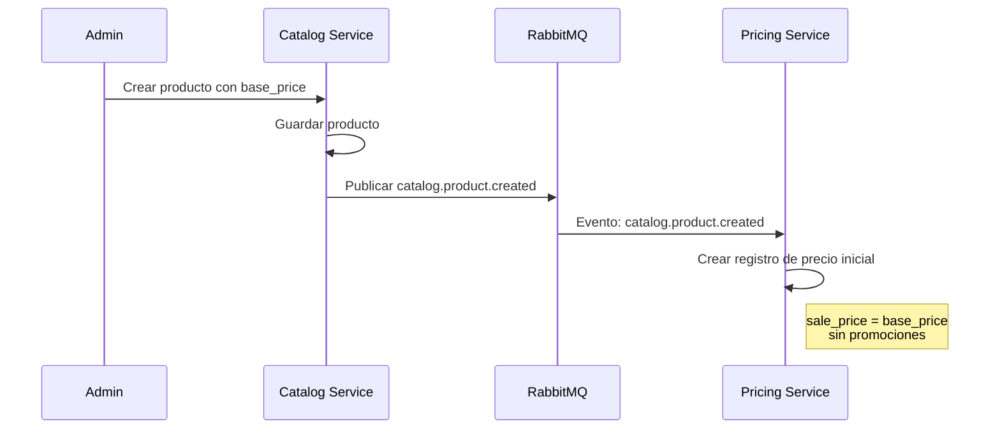
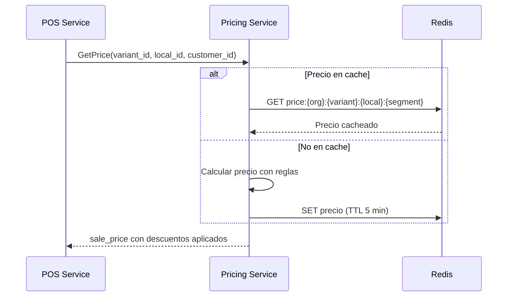

# Política de Precios y Fuente de Verdad

Documento que define las responsabilidades y flujos de precios en el sistema ERP.

## Resumen Ejecutivo

```
┌─────────────────────────────────────────────────────────────────────────────┐
│                          FUENTE DE VERDAD                                   │
│                                                                              │
│  Catalog Service → Precio BASE del producto (base_price)                    │
│  Pricing Service → Precio FINAL de venta (sale_price)                       │
│                                                                              │
│  Para mostrar precio al cliente: SIEMPRE consultar Pricing Service          │
└─────────────────────────────────────────────────────────────────────────────┘
```

## Responsabilidades por Servicio

### Catalog Service

**Lo que SÍ gestiona:**
- Precio base del producto (`base_price`)
- Costo del producto (`cost`)
- SKU y variantes

**Lo que NO gestiona:**
- Precios de venta al público
- Promociones ni descuentos
- Precios por cliente o segmento
- Precios por local/sucursal

```sql
-- Ejemplo en Catalog Service (variants)
CREATE TABLE variants (
    id UUID PRIMARY KEY,
    product_id UUID NOT NULL,
    sku VARCHAR(100) NOT NULL,
    base_price DECIMAL(12, 4) NOT NULL,  -- Precio base de referencia
    cost DECIMAL(12, 4),                  -- Costo de adquisición
    -- ...
);
```

### Pricing Service

**Lo que SÍ gestiona:**
- Precio de venta (`sale_price`)
- Promociones y descuentos
- Precios por segmento de cliente
- Precios por local/sucursal
- Precios por rango de fechas
- Programa de lealtad (puntos, tiers, beneficios)

**Lo que NO gestiona:**
- Información del producto (nombre, descripción)
- Inventario

```sql
-- Ejemplo en Pricing Service (prices)
CREATE TABLE prices (
    id UUID PRIMARY KEY,
    variant_id UUID NOT NULL,
    organization_id UUID NOT NULL,

    -- Contexto del precio
    local_id UUID,           -- NULL = todos los locales
    customer_segment VARCHAR(50),  -- NULL = todos los segmentos

    -- Precios
    base_price DECIMAL(12, 4) NOT NULL,  -- Copiado de Catalog al crear
    sale_price DECIMAL(12, 4) NOT NULL,  -- Precio de venta

    -- Vigencia
    starts_at TIMESTAMP,
    ends_at TIMESTAMP,

    -- Prioridad (mayor = más específico)
    priority INTEGER DEFAULT 0
);
```

## Flujo de Sincronización

### Cuando Catalog crea/actualiza un producto



### Cuando se consulta precio para venta



## Jerarquía de Precios

Pricing Service evalúa precios en el siguiente orden de prioridad (de mayor a menor):

```
1. Precio específico para cliente (customer_id)
   ↓
2. Precio por segmento de cliente (customer_segment)
   ↓
3. Precio por local específico (local_id)
   ↓
4. Promoción activa (promotion_id)
   ↓
5. Precio base organizacional (base_price)
```

### Ejemplo de Resolución

```python
async def get_final_price(
    variant_id: str,
    organization_id: str,
    local_id: str | None = None,
    customer_id: str | None = None,
    customer_segment: str | None = None
) -> PriceResult:
    """
    Obtener precio final aplicando todas las reglas.
    """
    # 1. Buscar precio específico del cliente
    if customer_id:
        customer_price = await get_customer_price(variant_id, customer_id)
        if customer_price:
            return customer_price

    # 2. Buscar precio por segmento
    if customer_segment:
        segment_price = await get_segment_price(variant_id, customer_segment)
        if segment_price:
            return segment_price

    # 3. Buscar precio por local
    if local_id:
        local_price = await get_local_price(variant_id, local_id)
        if local_price:
            return local_price

    # 4. Buscar promoción activa
    promotion = await get_active_promotion(variant_id)
    if promotion:
        return apply_promotion(base_price, promotion)

    # 5. Retornar precio base
    return await get_base_price(variant_id, organization_id)
```

## API de Pricing Service

### Obtener Precio

```http
GET /api/v1/pricing/price?variant_id=var_123&local_id=local_001&customer_id=cust_456
Authorization: Bearer {token}
```

**Response:**

```json
{
  "variant_id": "var_123",
  "sku": "PROD-001-RED-M",
  "base_price": 100.00,
  "sale_price": 85.00,
  "discount_applied": {
    "type": "promotion",
    "promotion_id": "promo_789",
    "promotion_name": "Descuento 15%",
    "discount_amount": 15.00,
    "discount_percentage": 15
  },
  "tax_rate": 0.07,
  "final_price_with_tax": 90.95,
  "currency": "USD",
  "valid_until": "2025-11-30T23:59:59Z"
}
```

### Obtener Precios en Lote

```http
POST /api/v1/pricing/prices/batch
Authorization: Bearer {token}
Content-Type: application/json

{
  "variant_ids": ["var_123", "var_456", "var_789"],
  "local_id": "local_001",
  "customer_id": "cust_456"
}
```

**Response:**

```json
{
  "prices": [
    {
      "variant_id": "var_123",
      "sale_price": 85.00,
      "discount_applied": true
    },
    {
      "variant_id": "var_456",
      "sale_price": 50.00,
      "discount_applied": false
    },
    {
      "variant_id": "var_789",
      "sale_price": 120.00,
      "discount_applied": true
    }
  ],
  "resolved_at": "2025-11-24T10:30:00Z"
}
```

## gRPC para Comunicación Interna

Para consultas desde POS/Order Service, se usa gRPC por eficiencia:

```protobuf
service PricingService {
  rpc GetPrice(GetPriceRequest) returns (PriceResponse);
  rpc GetPricesBatch(GetPricesBatchRequest) returns (PricesBatchResponse);
}

message GetPriceRequest {
  string variant_id = 1;
  string organization_id = 2;
  optional string local_id = 3;
  optional string customer_id = 4;
  optional string customer_segment = 5;
}

message PriceResponse {
  string variant_id = 1;
  double base_price = 2;
  double sale_price = 3;
  double tax_rate = 4;
  optional DiscountInfo discount = 5;
}
```

## Eventos Relacionados

### Catalog → Pricing

| Evento | Acción en Pricing |
|--------|-------------------|
| `catalog.product.created` | Crear precio base |
| `catalog.product.updated` | Actualizar `base_price` si cambió |
| `catalog.variant.created` | Crear registro de precio para variante |
| `catalog.price.updated` | Sincronizar `base_price` |

### Pricing → POS/Cache

| Evento | Acción |
|--------|--------|
| `pricing.price.updated` | Invalidar cache en POS |
| `pricing.promotion.activated` | Recalcular precios afectados |
| `pricing.promotion.deactivated` | Restaurar precios base |

## Caché de Precios

```python
# Estrategia de cache
CACHE_KEY = "price:{org_id}:{variant_id}:{local_id}:{segment}"
CACHE_TTL = 300  # 5 minutos

# Invalidación
async def invalidate_price_cache(variant_id: str, org_id: str):
    """Invalidar todas las combinaciones de cache para un variant."""
    pattern = f"price:{org_id}:{variant_id}:*"
    await redis.delete_pattern(pattern)
```

## Reglas de Negocio

### 1. Precio nunca puede ser negativo

```python
sale_price = max(0, calculated_price)
```

### 2. Descuento máximo configurable

```python
MAX_DISCOUNT_PERCENTAGE = 50  # Configurable por organización

if discount_percentage > MAX_DISCOUNT_PERCENTAGE:
    raise MaxDiscountExceededError(...)
```

### 3. Precio con impuesto siempre redondeado a 2 decimales

```python
final_price = round(sale_price * (1 + tax_rate), 2)
```

### 4. Promociones no se acumulan (por defecto)

Solo se aplica la promoción de mayor prioridad, a menos que esté configurado lo contrario.

## Próximos Pasos

- [Pricing Service - Overview](/microservicios/pricing-service/overview)
- [Pricing Service - Modelo de Datos](/microservicios/pricing-service/modelo-datos)
- [Catalog Service - Modelo de Datos](/microservicios/catalog-service/modelo-datos)
