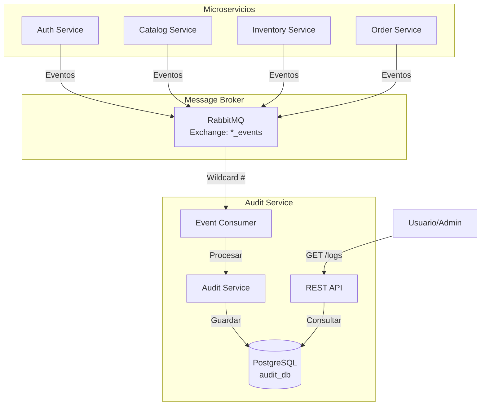

# Overview - Audit Service

Servicio de auditoría centralizado que registra todos los eventos del sistema ERP.

## Propósito

Audit Service es el **sistema de trazabilidad completa** del ERP zenLogic. Consume todos los eventos publicados por los microservicios y mantiene un registro inmutable de:

- Quién hizo qué
- Cuándo lo hizo
- Qué datos cambiaron
- Desde dónde (IP, dispositivo)

## Características Principales

### 1. Event Sourcing Parcial

- Consume **todos** los eventos del sistema (wildcard `#`)
- Almacena eventos inmutables
- Permite reconstruir estado histórico

### 2. Almacenamiento Optimizado

- PostgreSQL para persistencia
- Índices optimizados para queries temporales
- Particionamiento por fecha

### 3. Retention Policy

- Configuración flexible de retención de datos
- Archivado automático de logs antiguos
- Compresión de datos históricos

### 4. API de Consulta

- Búsqueda por usuario, organización, servicio
- Filtros por rango de fechas
- Paginación eficiente

## Stack Tecnológico

```yaml
Lenguaje: Python 3.11
Framework: FastAPI
Base de Datos: PostgreSQL 15+
Message Broker: RabbitMQ
ORM: SQLAlchemy 2.0 (async)
Validación: Pydantic v2
```

## Arquitectura High-Level



## Responsabilidades

### ✅ Lo que SÍ hace

- **Registrar todos los eventos** del sistema
- **Almacenar logs inmutables** de auditoría
- **Proporcionar API** para consulta de logs
- **Gestionar retención** de datos históricos
- **Generar reportes** de auditoría

### ❌ Lo que NO hace

- No publica eventos (solo consume)
- No modifica datos de otros servicios
- No valida lógica de negocio
- No tiene comunicación síncrona con otros servicios

## Ubicación en el Sistema

- **Puerto HTTP**: 8005
- **Base de Datos**: `audit_db`
- **Redis DB**: No requiere (solo consume eventos, no usa cache)
- **Exchange Consumido**: Todos (`auth_events`, `catalog_events`, etc.)
- **Queue**: `audit_service_queue`

## Casos de Uso

### 1. Auditoría de Cambios

```
Admin quiere saber:
- "¿Quién cambió el precio del producto X?"
- "¿Cuándo se desactivó el usuario Y?"
- "¿Qué permisos tenía el rol Z antes de ser modificado?"
```

### 2. Compliance

```
Necesidad regulatoria:
- Registro de accesos al sistema
- Trazabilidad de cambios en datos sensibles
- Historial de operaciones financieras
```

### 3. Debugging

```
Developer necesita:
- Ver secuencia de eventos que causó un error
- Reconstruir estado de entidad en momento específico
- Analizar patrones de uso
```

### 4. Reportes

```
Generar reportes de:
- Actividad por usuario
- Cambios por organización
- Eventos por servicio
- Timeline de acciones
```

## Métricas Clave

```python
# Prometheus metrics
audit_events_consumed_total
audit_events_stored_total
audit_query_duration_seconds
audit_db_size_bytes
```

## Próximos Pasos

- [Alcance](/microservicios/audit-service/alcance)
- [Arquitectura](/microservicios/audit-service/arquitectura)
- [Modelo de Datos](/microservicios/audit-service/modelo-datos)
