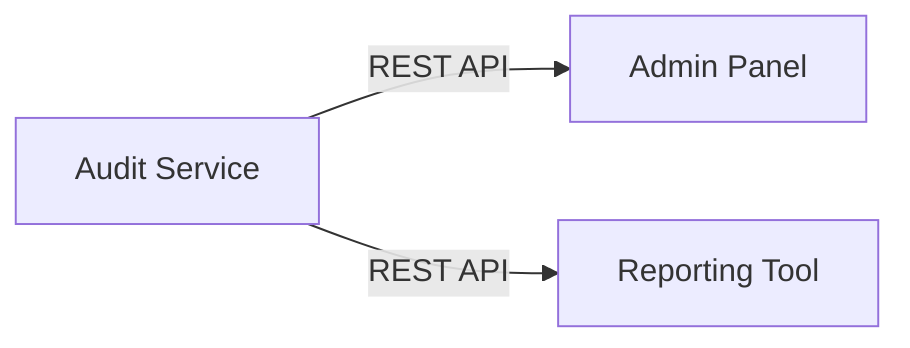

# Alcance

Definición detallada de las responsabilidades del Audit Service.

## Funcionalidades Core

### 1. Consumo de Eventos

**Descripción**: Escuchar y procesar todos los eventos del sistema.

**Eventos Consumidos**:

```yaml
Exchanges:
  - auth_events (routing key: #)
  - catalog_events (routing key: #)
  - inventory_events (routing key: #)
  - order_events (routing key: #)

Total: ~50+ tipos de eventos diferentes
```

**Garantías**:
- At-least-once delivery
- Procesamiento idempotente
- Sin pérdida de eventos

### 2. Almacenamiento de Logs

**Descripción**: Persistir eventos en PostgreSQL de forma inmutable.

**Datos Almacenados**:
- Event type
- Timestamp
- Service origen
- Payload completo
- Metadata (user_id, organization_id, IP, etc.)

**Características**:
- Logs inmutables (no UPDATE, no DELETE)
- Particionamiento por mes
- Índices optimizados

### 3. API de Consulta

**Endpoints**:

```
GET /api/v1/logs
GET /api/v1/logs/{id}
GET /api/v1/logs/timeline
GET /api/v1/logs/stats
```

**Filtros Soportados**:
- Por rango de fechas
- Por usuario
- Por organización
- Por servicio
- Por tipo de evento
- Por entidad (product_id, user_id, etc.)

### 4. Retention Policy

**Descripción**: Gestión automática del ciclo de vida de logs.

**Políticas**:
- Logs activos: 90 días
- Logs archivados: 2 años
- Después de 2 años: Eliminación o S3

**Automatización**:
- Cronjob diario para archivado
- Compresión de logs antiguos

## Límites y Restricciones

### ✅ Dentro del Alcance

1. **Registro de Eventos**
   - Todos los eventos de negocio
   - Eventos de autenticación
   - Eventos de cambios de datos

2. **Consultas de Auditoría**
   - Búsqueda por múltiples criterios
   - Timeline de eventos
   - Estadísticas agregadas

3. **Gestión de Datos**
   - Retención automática
   - Archivado
   - Exportación de logs

### ❌ Fuera del Alcance

1. **No es un Sistema de Logging Técnico**
   - No captura logs de aplicación (stdout/stderr)
   - No reemplaza a Elasticsearch/Kibana
   - Solo eventos de negocio

2. **No es Analytics**
   - No genera dashboards complejos
   - No hace predicciones
   - Solo consultas históricas

3. **No es Backup**
   - No respalda datos de otros servicios
   - Solo registra eventos
   - No restaura estado de otros servicios

4. **No Valida Negocio**
   - No valida eventos antes de guardar
   - Solo registra lo que recibe
   - No rechaza eventos inválidos

## Casos de Uso Detallados

### Caso 1: Investigar Cambio de Precio

```
Situación:
- Admin nota que precio de producto cambió
- Necesita saber quién y cuándo

Solución:
GET /api/v1/logs?entity_type=product&entity_id={id}&event_type=catalog.product.updated

Resultado:
[
  {
    "timestamp": "2025-11-23T10:00:00Z",
    "user_id": "user-123",
    "event_type": "catalog.product.updated",
    "payload": {
      "changes": {
        "base_price": {"old": 19.99, "new": 29.99}
      }
    }
  }
]
```

### Caso 2: Compliance Report Mensual

```
Situación:
- Necesidad regulatoria de reportar todos los accesos
- Generar CSV de logins del mes

Solución:
GET /api/v1/logs?event_type=auth.session.created&start_date=2025-11-01&end_date=2025-11-30&format=csv

Resultado:
- CSV con todos los logins del mes
- Incluye: fecha, usuario, IP, resultado
```

### Caso 3: Debugging de Bug

```
Situación:
- Usuario reporta que su rol perdió permisos
- Developer necesita ver secuencia de eventos

Solución:
GET /api/v1/logs/timeline?user_id={id}&start_date={date}

Resultado:
- Timeline cronológico de todos los eventos del usuario
- Incluye: roles asignados, permisos cambiados, etc.
```

## Integraciones

### Consumidas


### Expuestas



## Métricas de Performance

### SLAs

- **Latencia de ingesta**: < 100ms por evento
- **Throughput**: 1000 eventos/segundo
- **Latencia de query**: < 500ms (p95)
- **Disponibilidad**: 99.5%

### Capacidad

- **Volumen estimado**: 100K eventos/día
- **Retención**: 90 días activo = 9M eventos
- **Tamaño DB**: ~5GB por 90 días

## Dependencias

### Críticas (Servicio no funciona sin ellas)

- PostgreSQL
- RabbitMQ

### Opcionales (Degradación graceful)

- Redis (cache de queries)

## Próximos Pasos

- [Arquitectura](/microservicios/audit-service/arquitectura)
- [Modelo de Datos](/microservicios/audit-service/modelo-datos)
- [Event Consumer](/microservicios/audit-service/event-consumer)
