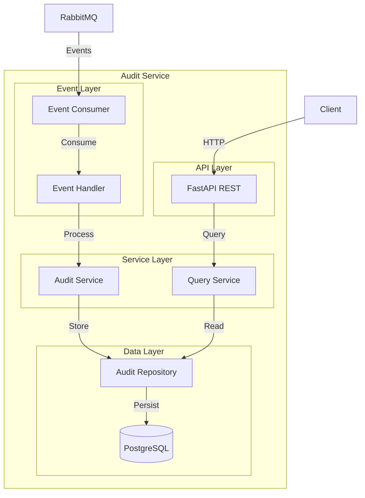
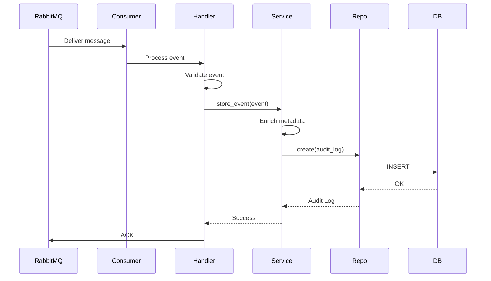
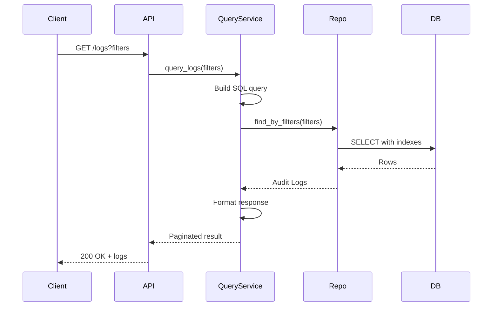

# Arquitectura

Diseño arquitectónico del Audit Service.

## Diagrama de Componentes



## Capas de la Arquitectura

### 1. Event Layer

**Responsabilidad**: Consumir eventos de RabbitMQ

**Componentes**:

- **Event Consumer**: Gestiona conexión a RabbitMQ
- **Event Handler**: Despacha eventos a procesadores específicos

**Tecnologías**:
- aio_pika (RabbitMQ async client)
- asyncio para concurrencia

### 2. Service Layer

**Responsabilidad**: Lógica de negocio

**Componentes**:

- **Audit Service**: Procesa y almacena eventos
- **Query Service**: Lógica de consultas complejas

**Patrones**:
- Service Layer Pattern
- Dependency Injection

### 3. Data Layer

**Responsabilidad**: Persistencia de datos

**Componentes**:

- **Audit Repository**: Abstracción de acceso a datos
- **PostgreSQL**: Base de datos

**Patrones**:
- Repository Pattern
- Unit of Work

### 4. API Layer

**Responsabilidad**: Exposición de endpoints REST

**Componentes**:

- **FastAPI Router**: Endpoints HTTP
- **Pydantic Schemas**: Validación de I/O

## Flujo de Datos

### Flujo de Ingesta (Write)



### Flujo de Consulta (Read)



## Patrones de Diseño

### 1. Event-Driven Architecture

**Aplicación**: Todo el consumo de eventos

**Beneficios**:
- Desacoplamiento de servicios
- Escalabilidad horizontal
- Procesamiento asíncrono

### 2. CQRS (Command Query Responsibility Segregation)

**Aplicación**: Separación de writes y reads

**Write Model**:
- Optimizado para ingesta rápida
- Sin validaciones complejas
- Solo inserts (inmutabilidad)

**Read Model**:
- Optimizado para queries
- Múltiples índices
- Agregaciones

### 3. Repository Pattern

**Aplicación**: Capa de acceso a datos

```python
class AuditRepository:
    async def create(self, audit_log: AuditLog) -> AuditLog
    async def find_by_id(self, log_id: str) -> Optional[AuditLog]
    async def find_by_filters(self, filters: dict) -> List[AuditLog]
    async def count_by_filters(self, filters: dict) -> int
```

### 4. Dependency Injection

**Aplicación**: Gestión de dependencias

```python
@router.get("/logs")
async def get_logs(
    query_service: QueryService = Depends(get_query_service),
    repo: AuditRepository = Depends(get_audit_repo)
):
    ...
```

## Escalabilidad

### Escalado Horizontal

**Event Consumers**:
- Múltiples instancias del consumer
- RabbitMQ distribuye mensajes (round-robin)
- Prefetch count: 10

**API Instances**:
- Load balancer delante
- Stateless (sin sesión)
- Escalado automático por CPU

### Escalado Vertical

**PostgreSQL**:
- Particionamiento por fecha
- Read replicas para queries
- Connection pooling

## Resiliencia

### Manejo de Fallos

**Eventos Duplicados**:
```python
# Idempotencia por event_id
async def store_event(event: dict):
    if await repo.exists_by_event_id(event["event_id"]):
        return  # Ya procesado, ignorar
    await repo.create(event)
```

**Fallos de DB**:
```python
# Retry con backoff exponencial
@retry(stop=stop_after_attempt(3), wait=wait_exponential())
async def store_with_retry(event):
    await repo.create(event)
```

**Dead Letter Queue**:
```python
# Eventos que fallan 3 veces van a DLQ
queue_args = {
    "x-dead-letter-exchange": "audit_dlq",
    "x-message-ttl": 60000
}
```

## Performance

### Optimizaciones

**Batch Inserts**:
```python
# Acumular eventos y hacer insert batch cada 100ms
async def batch_insert(events: List[dict]):
    await repo.bulk_create(events)
```

**Índices Estratégicos**:
```sql
CREATE INDEX idx_audit_org_time ON audit_logs(organization_id, created_at DESC);
CREATE INDEX idx_audit_user_time ON audit_logs(user_id, created_at DESC);
CREATE INDEX idx_audit_event_type ON audit_logs(event_type);
```

**Particionamiento**:
```sql
-- Partición por mes
CREATE TABLE audit_logs_2025_11 PARTITION OF audit_logs
    FOR VALUES FROM ('2025-11-01') TO ('2025-12-01');
```

## Seguridad

### Autenticación

- JWT tokens (mismo que resto del sistema)
- Solo admins pueden consultar logs

### Autorización

- Admin global: Todos los logs
- Admin org: Solo logs de su organización
- User normal: No tiene acceso

### Inmutabilidad

- Tabla sin UPDATE ni DELETE
- Solo INSERT permitido
- Triggers para prevenir modificaciones

## Monitoreo

### Métricas Clave

```python
# Prometheus
audit_events_received = Counter("audit_events_received_total")
audit_events_stored = Counter("audit_events_stored_total")
audit_query_duration = Histogram("audit_query_duration_seconds")
audit_db_lag = Gauge("audit_db_lag_seconds")
```

### Logs Estructurados

```python
logger.info(
    "event_stored",
    event_type=event["event_type"],
    organization_id=event["payload"]["organization_id"],
    duration_ms=duration
)
```

## Próximos Pasos

- [Modelo de Datos](/microservicios/audit-service/modelo-datos)
- [Event Consumer](/microservicios/audit-service/event-consumer)
- [API Logs](/microservicios/audit-service/api-logs)
