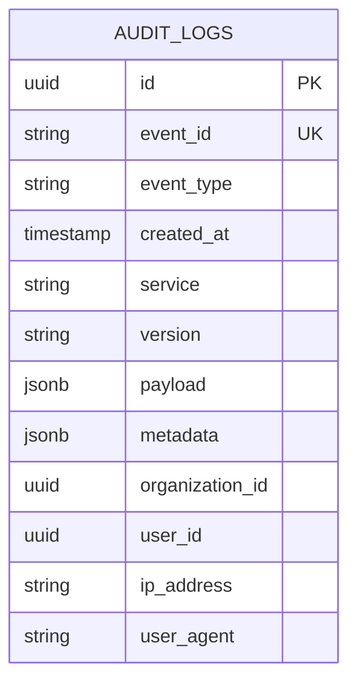

# Modelo de Datos

Estructura de base de datos para almacenar logs de auditoría.

## Diagrama ER



## Tabla Principal

### `audit_logs`

```sql
CREATE TABLE audit_logs (
    id UUID PRIMARY KEY DEFAULT gen_random_uuid(),
    event_id VARCHAR(100) UNIQUE NOT NULL,
    event_type VARCHAR(100) NOT NULL,
    created_at TIMESTAMP WITH TIME ZONE NOT NULL DEFAULT NOW(),
    service VARCHAR(50) NOT NULL,
    version VARCHAR(20) DEFAULT '1.0',

    -- Payload del evento (JSON completo)
    payload JSONB NOT NULL,

    -- Metadata adicional
    metadata JSONB,

    -- Datos de contexto
    organization_id UUID,
    user_id UUID,
    ip_address INET,
    user_agent TEXT,

    -- Particionamiento
    CONSTRAINT audit_logs_created_at_check CHECK (created_at >= DATE '2025-01-01')
) PARTITION BY RANGE (created_at);
```

## Particiones por Mes

```sql
-- Partición Noviembre 2025
CREATE TABLE audit_logs_2025_11 PARTITION OF audit_logs
    FOR VALUES FROM ('2025-11-01') TO ('2025-12-01');

-- Partición Diciembre 2025
CREATE TABLE audit_logs_2025_12 PARTITION OF audit_logs
    FOR VALUES FROM ('2025-12-01') TO ('2026-01-01');

-- Script automático para crear particiones futuras
CREATE OR REPLACE FUNCTION create_audit_partition(year INT, month INT)
RETURNS VOID AS $$
DECLARE
    partition_name TEXT;
    start_date DATE;
    end_date DATE;
BEGIN
    partition_name := 'audit_logs_' || year || '_' || LPAD(month::TEXT, 2, '0');
    start_date := make_date(year, month, 1);
    end_date := start_date + INTERVAL '1 month';

    EXECUTE format(
        'CREATE TABLE IF NOT EXISTS %I PARTITION OF audit_logs FOR VALUES FROM (%L) TO (%L)',
        partition_name, start_date, end_date
    );
END;
$$ LANGUAGE plpgsql;
```

## Índices

### Índices de Búsqueda

```sql
-- Por organización y fecha (query más común)
CREATE INDEX idx_audit_org_time
    ON audit_logs(organization_id, created_at DESC)
    WHERE organization_id IS NOT NULL;

-- Por usuario y fecha
CREATE INDEX idx_audit_user_time
    ON audit_logs(user_id, created_at DESC)
    WHERE user_id IS NOT NULL;

-- Por tipo de evento
CREATE INDEX idx_audit_event_type
    ON audit_logs(event_type, created_at DESC);

-- Por servicio
CREATE INDEX idx_audit_service
    ON audit_logs(service, created_at DESC);

-- Índice único para idempotencia
CREATE UNIQUE INDEX idx_audit_event_id
    ON audit_logs(event_id);

-- GIN para búsqueda en payload JSON
CREATE INDEX idx_audit_payload_gin
    ON audit_logs USING GIN (payload jsonb_path_ops);
```

## Modelo SQLAlchemy

```python
from sqlalchemy import Column, String, DateTime, Text, Index
from sqlalchemy.dialects.postgresql import UUID, INET, JSONB
from datetime import datetime
import uuid

class AuditLog(Base):
    """Modelo de log de auditoría."""

    __tablename__ = "audit_logs"

    id = Column(UUID(as_uuid=True), primary_key=True, default=uuid.uuid4)
    event_id = Column(String(100), unique=True, nullable=False, index=True)
    event_type = Column(String(100), nullable=False, index=True)
    created_at = Column(DateTime(timezone=True), nullable=False, default=datetime.utcnow, index=True)
    service = Column(String(50), nullable=False, index=True)
    version = Column(String(20), default="1.0")

    # JSON fields
    payload = Column(JSONB, nullable=False)
    metadata = Column(JSONB)

    # Contexto
    organization_id = Column(UUID(as_uuid=True), index=True)
    user_id = Column(UUID(as_uuid=True), index=True)
    ip_address = Column(INET)
    user_agent = Column(Text)

    # Índices compuestos
    __table_args__ = (
        Index('idx_audit_org_time', 'organization_id', 'created_at'),
        Index('idx_audit_user_time', 'user_id', 'created_at'),
        Index('idx_audit_payload_gin', 'payload', postgresql_using='gin'),
    )

    def __repr__(self):
        return f"<AuditLog {self.event_type} at {self.created_at}>"
```

## Schemas Pydantic

```python
from pydantic import BaseModel, Field
from datetime import datetime
from typing import Optional, Dict, Any
from uuid import UUID

class AuditLogCreate(BaseModel):
    """Schema para crear log de auditoría."""

    event_id: str = Field(..., max_length=100)
    event_type: str = Field(..., max_length=100)
    service: str = Field(..., max_length=50)
    version: str = Field(default="1.0", max_length=20)
    payload: Dict[str, Any]
    metadata: Optional[Dict[str, Any]] = None
    organization_id: Optional[UUID] = None
    user_id: Optional[UUID] = None
    ip_address: Optional[str] = None
    user_agent: Optional[str] = None

class AuditLogResponse(BaseModel):
    """Schema de respuesta de log de auditoría."""

    id: UUID
    event_id: str
    event_type: str
    created_at: datetime
    service: str
    version: str
    payload: Dict[str, Any]
    metadata: Optional[Dict[str, Any]]
    organization_id: Optional[UUID]
    user_id: Optional[UUID]
    ip_address: Optional[str]
    user_agent: Optional[str]

    class Config:
        from_attributes = True
```

## Queries Comunes

### Buscar por Organización

```sql
SELECT *
FROM audit_logs
WHERE organization_id = 'org-uuid'
  AND created_at >= '2025-11-01'
  AND created_at < '2025-12-01'
ORDER BY created_at DESC
LIMIT 100;
```

### Buscar por Usuario

```sql
SELECT *
FROM audit_logs
WHERE user_id = 'user-uuid'
  AND event_type LIKE 'auth.%'
ORDER BY created_at DESC;
```

### Buscar en Payload JSON

```sql
-- Buscar cambios de precio
SELECT *
FROM audit_logs
WHERE event_type = 'catalog.product.updated'
  AND payload @> '{"changes": {"base_price": {}}}'::jsonb;

-- Buscar producto específico
SELECT *
FROM audit_logs
WHERE payload->>'product_id' = 'product-uuid';
```

### Estadísticas

```sql
-- Eventos por tipo en últimas 24h
SELECT
    event_type,
    COUNT(*) as count
FROM audit_logs
WHERE created_at >= NOW() - INTERVAL '24 hours'
GROUP BY event_type
ORDER BY count DESC;

-- Actividad por usuario en el mes
SELECT
    user_id,
    COUNT(*) as events_count,
    COUNT(DISTINCT event_type) as event_types
FROM audit_logs
WHERE created_at >= DATE_TRUNC('month', NOW())
  AND user_id IS NOT NULL
GROUP BY user_id
ORDER BY events_count DESC
LIMIT 20;
```

## Anti-Falsificación

### Integridad de Registros

El sistema implementa múltiples capas para garantizar que los logs no puedan ser alterados:

#### 1. Checksum por Registro

Cada registro incluye un checksum SHA-256 de sus datos críticos:

```sql
-- Agregar columna de checksum
ALTER TABLE audit_logs ADD COLUMN checksum VARCHAR(64);

-- Función para calcular checksum
CREATE OR REPLACE FUNCTION calculate_audit_checksum(
    p_event_id VARCHAR,
    p_event_type VARCHAR,
    p_created_at TIMESTAMP,
    p_payload JSONB,
    p_organization_id UUID
) RETURNS VARCHAR AS $$
BEGIN
    RETURN encode(
        sha256(
            (p_event_id || p_event_type || p_created_at::TEXT ||
             p_payload::TEXT || COALESCE(p_organization_id::TEXT, ''))::bytea
        ),
        'hex'
    );
END;
$$ LANGUAGE plpgsql IMMUTABLE;

-- Trigger para auto-generar checksum
CREATE OR REPLACE FUNCTION generate_audit_checksum()
RETURNS TRIGGER AS $$
BEGIN
    NEW.checksum := calculate_audit_checksum(
        NEW.event_id,
        NEW.event_type,
        NEW.created_at,
        NEW.payload,
        NEW.organization_id
    );
    RETURN NEW;
END;
$$ LANGUAGE plpgsql;

CREATE TRIGGER audit_checksum_trigger
BEFORE INSERT ON audit_logs
FOR EACH ROW EXECUTE FUNCTION generate_audit_checksum();
```

#### 2. Cadena de Hashes (Hash Chain)

Cada registro referencia el hash del registro anterior, creando una cadena verificable:

```sql
-- Agregar columna para hash anterior
ALTER TABLE audit_logs ADD COLUMN previous_hash VARCHAR(64);
ALTER TABLE audit_logs ADD COLUMN sequence_number BIGSERIAL;

-- Función para obtener hash anterior
CREATE OR REPLACE FUNCTION get_previous_audit_hash(org_id UUID)
RETURNS VARCHAR AS $$
DECLARE
    prev_hash VARCHAR;
BEGIN
    SELECT checksum INTO prev_hash
    FROM audit_logs
    WHERE organization_id = org_id
    ORDER BY sequence_number DESC
    LIMIT 1;

    RETURN COALESCE(prev_hash, 'GENESIS');
END;
$$ LANGUAGE plpgsql;

-- Trigger para enlazar con registro anterior
CREATE OR REPLACE FUNCTION link_audit_chain()
RETURNS TRIGGER AS $$
BEGIN
    NEW.previous_hash := get_previous_audit_hash(NEW.organization_id);
    RETURN NEW;
END;
$$ LANGUAGE plpgsql;

CREATE TRIGGER audit_chain_trigger
BEFORE INSERT ON audit_logs
FOR EACH ROW EXECUTE FUNCTION link_audit_chain();
```

### Verificación de Integridad

```python
# audit_service/integrity.py
import hashlib
from typing import Optional

async def verify_audit_checksum(log: AuditLog) -> bool:
    """Verificar checksum de un registro individual."""
    expected = hashlib.sha256(
        f"{log.event_id}{log.event_type}{log.created_at}"
        f"{log.payload}{log.organization_id or ''}".encode()
    ).hexdigest()

    return log.checksum == expected

async def verify_audit_chain(
    organization_id: str,
    start_seq: int,
    end_seq: int
) -> dict:
    """Verificar integridad de cadena de logs."""
    logs = await get_logs_range(organization_id, start_seq, end_seq)

    broken_links = []
    invalid_checksums = []

    for i, log in enumerate(logs):
        # Verificar checksum individual
        if not await verify_audit_checksum(log):
            invalid_checksums.append(log.sequence_number)

        # Verificar enlace con anterior
        if i > 0:
            expected_prev = logs[i-1].checksum
            if log.previous_hash != expected_prev:
                broken_links.append(log.sequence_number)

    return {
        "verified_count": len(logs),
        "valid": len(broken_links) == 0 and len(invalid_checksums) == 0,
        "broken_links": broken_links,
        "invalid_checksums": invalid_checksums
    }

async def audit_integrity_report(organization_id: str) -> dict:
    """Generar reporte de integridad completo."""
    # Verificar últimos 1000 registros
    result = await verify_audit_chain(organization_id, -1000, -1)

    # Contar por tipo de evento
    stats = await get_event_type_stats(organization_id)

    return {
        "organization_id": organization_id,
        "integrity_check": result,
        "event_stats": stats,
        "checked_at": datetime.utcnow().isoformat()
    }
```

### API de Verificación

```python
@router.get("/integrity/{organization_id}")
async def check_integrity(
    organization_id: str,
    start_sequence: int = Query(default=-1000),
    end_sequence: int = Query(default=-1),
    ctx: TenantContext = Depends(get_admin_context)
) -> IntegrityReport:
    """
    Verificar integridad de logs de auditoría.

    Solo accesible por administradores del sistema.
    """
    return await audit_integrity_report(organization_id)

@router.get("/verify/{event_id}")
async def verify_single_event(
    event_id: str,
    ctx: TenantContext = Depends(get_admin_context)
) -> VerificationResult:
    """Verificar un evento específico."""
    log = await get_log_by_event_id(event_id)
    if not log:
        raise HTTPException(404, "Event not found")

    is_valid = await verify_audit_checksum(log)

    return VerificationResult(
        event_id=event_id,
        checksum_valid=is_valid,
        stored_checksum=log.checksum,
        previous_hash=log.previous_hash
    )
```

## Triggers de Inmutabilidad

```sql
-- Prevenir UPDATE
CREATE OR REPLACE FUNCTION prevent_audit_update()
RETURNS TRIGGER AS $$
BEGIN
    RAISE EXCEPTION 'Audit logs are immutable - UPDATE not allowed';
END;
$$ LANGUAGE plpgsql;

CREATE TRIGGER prevent_update_audit_logs
BEFORE UPDATE ON audit_logs
FOR EACH ROW EXECUTE FUNCTION prevent_audit_update();

-- Prevenir DELETE (excepto por retention policy)
CREATE OR REPLACE FUNCTION prevent_audit_delete()
RETURNS TRIGGER AS $$
BEGIN
    -- Solo permitir DELETE desde proceso de retention
    IF current_setting('app.retention_process', true) = 'true' THEN
        RETURN OLD;
    END IF;
    RAISE EXCEPTION 'Audit logs are immutable - DELETE not allowed';
END;
$$ LANGUAGE plpgsql;

CREATE TRIGGER prevent_delete_audit_logs
BEFORE DELETE ON audit_logs
FOR EACH ROW EXECUTE FUNCTION prevent_audit_delete();
```

### Proceso de Retention (único que puede eliminar)

```python
async def execute_retention_policy(days_to_keep: int = 365):
    """
    Eliminar logs antiguos siguiendo política de retención.
    Este es el único proceso autorizado para eliminar logs.
    """
    async with db.begin():
        # Habilitar flag de retention
        await db.execute("SET LOCAL app.retention_process = 'true'")

        # Eliminar particiones antiguas
        cutoff_date = datetime.utcnow() - timedelta(days=days_to_keep)

        result = await db.execute(
            """
            DELETE FROM audit_logs
            WHERE created_at < :cutoff
            RETURNING id
            """,
            {"cutoff": cutoff_date}
        )

        deleted_count = result.rowcount

        # Registrar la eliminación como evento de auditoría
        await create_audit_log(
            event_type="audit.retention.executed",
            payload={
                "deleted_count": deleted_count,
                "cutoff_date": cutoff_date.isoformat(),
                "policy_days": days_to_keep
            }
        )

    return deleted_count
```

## Estimaciones de Tamaño

### Por Evento

```
Tamaño promedio por evento: 1-2 KB
- Metadata: 200 bytes
- Payload: 500-1500 bytes
- Índices: 300 bytes
```

### Por Volumen

```
100 eventos/minuto = 6,000/hora = 144,000/día

Tamaño diario: 144,000 * 1.5 KB ≈ 216 MB/día
Tamaño mensual: 216 MB * 30 ≈ 6.5 GB/mes
Tamaño anual: 6.5 GB * 12 ≈ 78 GB/año
```

## Próximos Pasos

- [Event Consumer](/microservicios/audit-service/event-consumer)
- [API Logs](/microservicios/audit-service/api-logs)
- [Retention Policy](/microservicios/audit-service/retention-policy)
