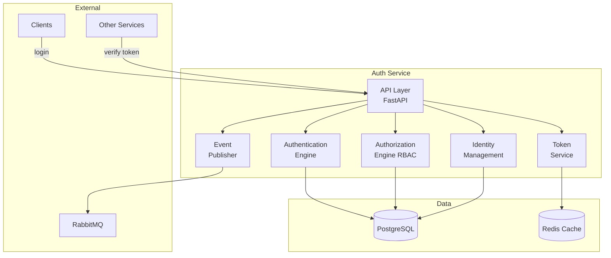
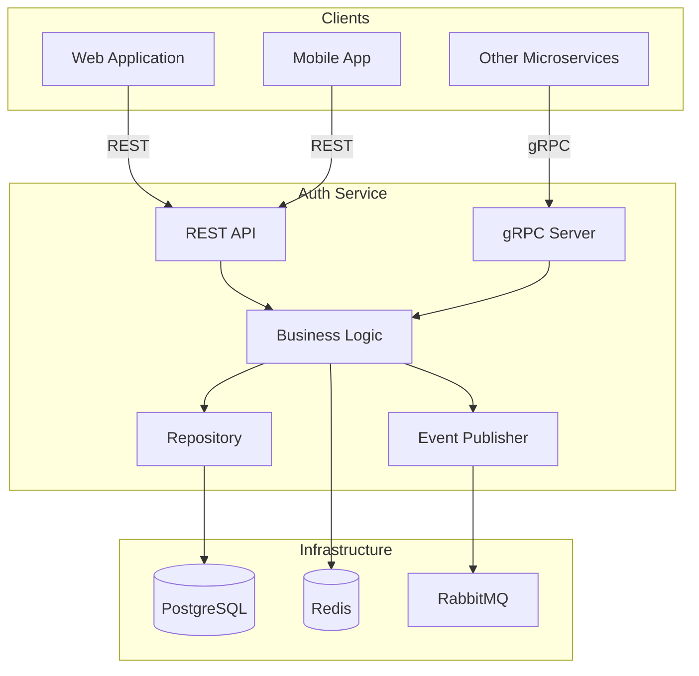
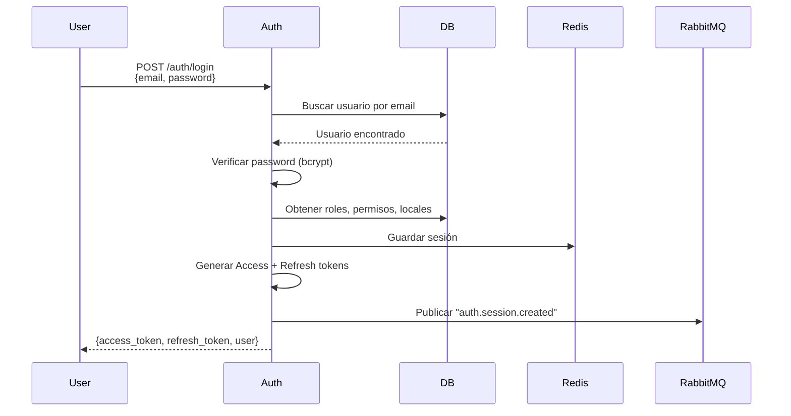
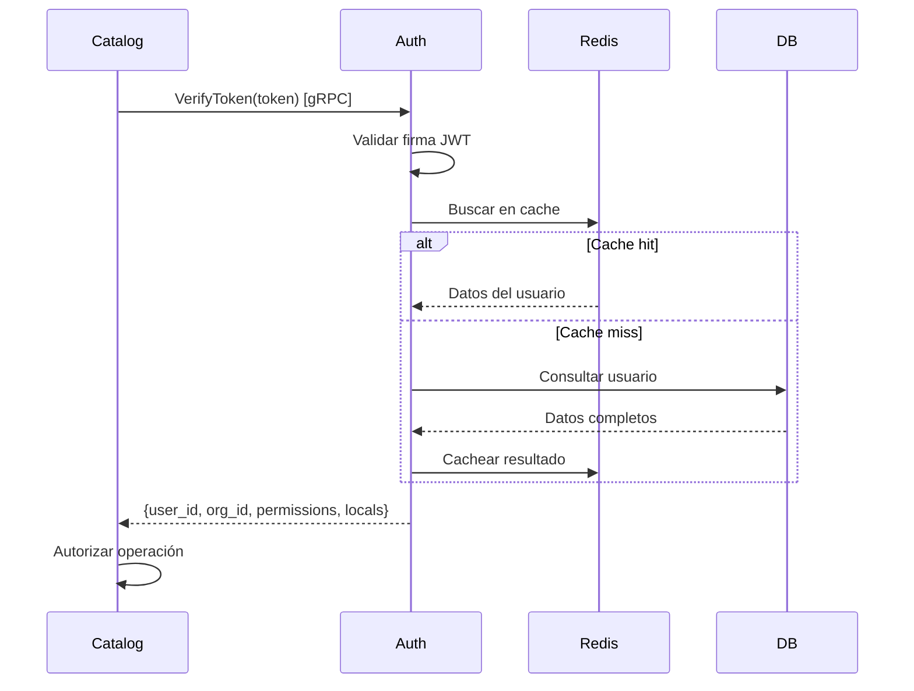

# Auth Service - Overview

## Introducción

El **Auth Service** es el microservicio central encargado de toda la **identidad, autenticación, autorización y gobierno de acceso** dentro de la plataforma ERP multi-tenant.

:::info Cerebro de Seguridad
Es el cerebro de seguridad del sistema. Controla quién puede entrar, quién puede hacer qué, en qué organización, en qué sucursal, qué módulos tiene permitidos y qué datos puede tocar.
:::

## Responsabilidades Principales

### 1. Identity Management (Gestión de Identidad)

- CRUD de usuarios
- Asignación de roles
- Asignación de sucursales/locales
- Manejo de estados (activo, suspendido, revocado)

### 2. Authentication (Autenticación)

- Validación de credenciales
- Hashing de contraseñas (bcrypt)
- Emisión de Access Token (JWT)
- Emisión de Refresh Token
- Revocación de sesiones
- Bloqueo por intentos fallidos

### 3. Authorization (Autorización)

- RBAC (Role-Based Access Control) multinivel
- Definición de roles por organización
- Asignación de permisos por rol
- Validación de permisos en cada endpoint
- Control de acceso por:
  - Organización
  - Sucursal/local
  - Módulo
  - Acción (permiso específico)

### 4. Tenant & Organization Management

- Gestión de organizaciones (tenants)
- Gestión de sucursales/locales
- Asignación de módulos por organización
- Políticas basadas en plan (Free, Premium, Enterprise)

### 5. Token Service

- Generación de JWT (RS256)
- Validación de firma y expiración
- Rotación de Refresh Tokens
- Blacklist / versionado de tokens

### 6. Audit Logging

- Registro de inicios de sesión
- Cambios de roles
- Cambios de permisos
- Creación/eliminación de usuarios
- Intentos de acceso fallidos

### 7. Verification API

Expone `/auth/verify`, que los microservicios usan para saber:
- Quién está haciendo la petición
- A qué organización pertenece
- A qué sucursales tiene acceso
- Qué permisos tiene
- Qué módulos tiene habilitados
- Si el usuario está activo

## Diagrama de Componentes



## Stack Tecnológico

| Componente | Tecnología |
|------------|------------|
| **Framework** | Python 3.11 + FastAPI |
| **ORM** | SQLAlchemy 2.0 (async) |
| **Validación** | Pydantic v2 |
| **Base de Datos** | PostgreSQL 15+ |
| **Cache** | Redis 7.0 |
| **Password Hashing** | bcrypt (via passlib) |
| **JWT** | python-jose (RS256) |
| **Message Broker** | RabbitMQ (pika) |
| **gRPC** | grpcio |
| **Testing** | Pytest + pytest-asyncio |

## Arquitectura General



## Entidades Principales

### Users
Usuarios del sistema vinculados a una organización.

### Organizations
Tenants/organizaciones que usan el ERP.

### Locals
Sucursales o ubicaciones físicas de una organización.

### Modules
Funcionalidades del ERP (catalog, inventory, orders, etc.).

### Permissions
Acciones específicas (`catalog:create`, `inventory:read`).

### Roles
Agrupaciones de permisos definidas por cada organización.

## APIs Expuestas

### REST APIs (Públicas)

| Endpoint | Método | Descripción |
|----------|--------|-------------|
| `/auth/login` | POST | Autenticación con credenciales |
| `/auth/refresh` | POST | Renovar access token |
| `/auth/logout` | POST | Cerrar sesión |
| `/auth/verify` | POST | Verificar token (interno) |
| `/api/v1/users` | GET, POST, PUT, DELETE | Gestión de usuarios |
| `/api/v1/roles` | GET, POST, PUT, DELETE | Gestión de roles |
| `/api/v1/permissions` | GET, POST, PUT, DELETE | Gestión de permisos |
| `/api/v1/locals` | GET, POST, PUT, DELETE | Gestión de locales |
| `/api/v1/organizations` | GET, POST, PUT, DELETE | Gestión de organizaciones |

### gRPC APIs (Internas)

| Service | Method | Descripción |
|---------|--------|-------------|
| `AuthService` | `VerifyToken` | Validar token desde otros servicios |

## Eventos Publicados

Auth Service publica eventos para notificar cambios:

| Evento | Cuándo |
|--------|--------|
| `auth.user.created` | Usuario creado |
| `auth.user.updated` | Usuario actualizado |
| `auth.user.deactivated` | Usuario desactivado |
| `auth.user.deleted` | Usuario eliminado |
| `auth.user.password_changed` | Contraseña cambiada |
| `auth.role.created` | Rol creado |
| `auth.role.updated` | Rol actualizado |
| `auth.role.deleted` | Rol eliminado |
| `auth.role.permissions_changed` | Permisos de rol cambiados |
| `auth.permission.created` | Permiso creado (admin) |
| `auth.permission.updated` | Permiso actualizado (admin) |
| `auth.permission.deleted` | Permiso eliminado (admin) |
| `auth.organization.created` | Organización creada |
| `auth.organization.updated` | Organización actualizada |
| `auth.organization.suspended` | Organización suspendida |
| `auth.organization.reactivated` | Organización reactivada |
| `auth.organization.module_enabled` | Módulo habilitado |
| `auth.organization.module_disabled` | Módulo deshabilitado |
| `auth.local.created` | Local creado |
| `auth.local.updated` | Local actualizado |
| `auth.local.deleted` | Local eliminado |
| `auth.session.created` | Login exitoso |
| `auth.session.revoked` | Logout |
| `auth.token.revoked` | Token revocado manualmente |

:::tip Event-Driven
Estos eventos permiten que otros servicios reaccionen a cambios en Auth Service, manteniendo consistencia eventual del sistema.
:::

## Consumidores de Eventos

**Servicios que consumen eventos de Auth**:
- **Catalog Service**: Invalida cache cuando cambian permisos
- **Inventory Service**: Valida locales activos
- **Order Service**: Bloquea órdenes de usuarios inactivos
- **Audit Service**: Registra todos los eventos de auth

## Flujos Principales

### Flujo de Login



### Flujo de Verificación de Token



## Seguridad

### Protección de Contraseñas

```python
from passlib.context import CryptContext

pwd_context = CryptContext(
    schemes=["bcrypt"],
    deprecated="auto"
)

# Al crear usuario
hashed = pwd_context.hash(password)

# Al validar
is_valid = pwd_context.verify(password, hashed)
```

### Tokens JWT

```json
{
  "header": {
    "alg": "RS256",
    "typ": "JWT"
  },
  "payload": {
    "user_id": "user_001",
    "organization_id": "org_123",
    "permissions": ["catalog:read", "catalog:create"],
    "locals": ["local_01"],
    "exp": 1705851600,
    "iat": 1705850700
  }
}
```

**Access Token**: 15 minutos
**Refresh Token**: 7 días

### Rate Limiting

```
/auth/login: 5 requests/minuto por IP
/auth/verify: 1000 requests/minuto por servicio
```

### Bloqueo por Intentos Fallidos

Después de 5 intentos fallidos → usuario bloqueado por 15 minutos.

## Métricas y Observabilidad

### Logs Estructurados

```json
{
  "timestamp": "2025-11-15T10:30:00Z",
  "level": "INFO",
  "service": "auth-service",
  "event": "user_login_success",
  "user_id": "user_001",
  "organization_id": "org_123",
  "correlation_id": "req_9912ABCD"
}
```

### Health Checks

- `/health`: Estado general del servicio
- `/ready`: ¿Listo para recibir requests?
- `/live`: ¿El servicio está vivo?

### Métricas (Prometheus)

- Logins exitosos/fallidos por minuto
- Tokens generados por minuto
- Latencia de verificación de tokens
- Usuarios bloqueados
- Cache hit/miss ratio

## Próximos Pasos

Explora la documentación detallada de Auth Service:

1. [Alcance](/microservicios/auth-service/alcance) - Qué hace y qué NO hace
2. [Arquitectura](/microservicios/auth-service/arquitectura) - Diseño interno
3. [Modelo de Datos](/microservicios/auth-service/modelo-datos) - Entidades y relaciones
4. [Eventos Publicados](/microservicios/auth-service/eventos-publicados) - Event-Driven
5. [gRPC Server](/microservicios/auth-service/grpc-server) - API interna
6. [API Auth](/microservicios/auth-service/api-auth) - Login, refresh, logout
7. [API Users](/microservicios/auth-service/api-users) - Gestión de usuarios
8. [Flujos de Negocio](/microservicios/auth-service/flujos-negocio) - Diagramas de flujo
