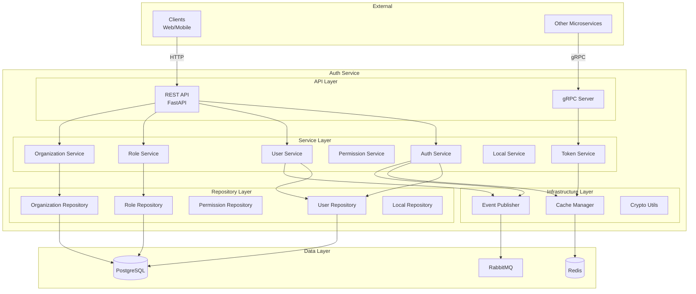
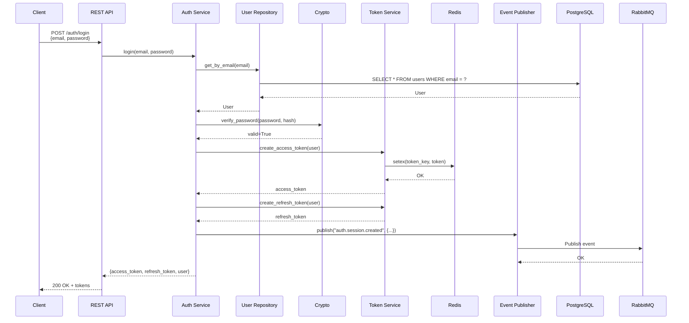

# Arquitectura Interna

## Capas de la Arquitectura

Auth Service implementa una arquitectura en capas (Layered Architecture) con separación clara de responsabilidades.



## Estructura de Directorios

```
auth-service/
├── src/
│   ├── api/                    # API Layer
│   │   ├── rest/
│   │   │   ├── __init__.py
│   │   │   ├── auth.py         # Endpoints de autenticación
│   │   │   ├── users.py        # CRUD usuarios
│   │   │   ├── roles.py        # CRUD roles
│   │   │   ├── permissions.py  # Gestión permisos
│   │   │   ├── organizations.py
│   │   │   └── locals.py
│   │   └── grpc/
│   │       ├── __init__.py
│   │       ├── server.py       # gRPC server
│   │       └── auth_service.proto
│   │
│   ├── services/               # Service Layer
│   │   ├── __init__.py
│   │   ├── auth_service.py     # Lógica de autenticación
│   │   ├── user_service.py     # Lógica de usuarios
│   │   ├── role_service.py     # Lógica de roles
│   │   ├── permission_service.py
│   │   ├── organization_service.py
│   │   ├── local_service.py
│   │   └── token_service.py    # Generación/validación JWT
│   │
│   ├── repositories/           # Repository Layer
│   │   ├── __init__.py
│   │   ├── user_repository.py
│   │   ├── role_repository.py
│   │   ├── permission_repository.py
│   │   ├── organization_repository.py
│   │   └── local_repository.py
│   │
│   ├── models/                 # SQLAlchemy Models
│   │   ├── __init__.py
│   │   ├── user.py
│   │   ├── role.py
│   │   ├── permission.py
│   │   ├── organization.py
│   │   └── local.py
│   │
│   ├── schemas/                # Pydantic Schemas
│   │   ├── __init__.py
│   │   ├── auth.py             # LoginRequest, TokenResponse
│   │   ├── user.py             # UserCreate, UserUpdate, UserResponse
│   │   ├── role.py
│   │   ├── permission.py
│   │   ├── organization.py
│   │   └── local.py
│   │
│   ├── infrastructure/         # Infrastructure Layer
│   │   ├── __init__.py
│   │   ├── database.py         # DB connection
│   │   ├── redis_client.py     # Redis client
│   │   ├── event_publisher.py  # RabbitMQ publisher
│   │   ├── crypto.py           # Password hashing, JWT
│   │   └── cache.py            # Cache manager
│   │
│   ├── middleware/             # Middlewares
│   │   ├── __init__.py
│   │   ├── auth_middleware.py  # Validación de token
│   │   ├── tenant_middleware.py # Validación X-Tenant-ID
│   │   └── rate_limit.py       # Rate limiting
│   │
│   ├── dependencies/           # FastAPI Dependencies
│   │   ├── __init__.py
│   │   ├── auth.py             # get_current_user
│   │   ├── database.py         # get_db
│   │   └── permissions.py      # require_permission
│   │
│   ├── config/                 # Configuración
│   │   ├── __init__.py
│   │   └── settings.py         # Environment variables
│   │
│   └── main.py                 # Entry point
│
├── tests/                      # Tests
│   ├── unit/
│   ├── integration/
│   └── e2e/
│
├── migrations/                 # Alembic migrations
│   └── versions/
│
├── scripts/                    # Scripts utilitarios
│   ├── seed_permissions.py
│   └── create_admin.py
│
├── Dockerfile
├── docker-compose.yml
├── requirements.txt
├── pytest.ini
└── README.md
```

## API Layer

### REST API (FastAPI)

Expone endpoints HTTP para clientes externos.

**Archivo**: `src/api/rest/auth.py`

```python
from fastapi import APIRouter, Depends, HTTPException
from src.schemas.auth import LoginRequest, TokenResponse
from src.services.auth_service import AuthService

router = APIRouter(prefix="/auth", tags=["Authentication"])

@router.post("/login", response_model=TokenResponse)
async def login(
    credentials: LoginRequest,
    auth_service: AuthService = Depends()
):
    """
    Autenticar usuario y retornar tokens
    """
    try:
        result = await auth_service.login(
            credentials.email,
            credentials.password
        )
        return result
    except InvalidCredentialsError:
        raise HTTPException(401, "Credenciales inválidas")
```

### gRPC Server

Expone servicios internos para otros microservicios.

**Archivo**: `src/api/grpc/auth_service.proto`

```protobuf
syntax = "proto3";

package auth;

service AuthService {
  rpc VerifyToken(VerifyTokenRequest) returns (VerifyTokenResponse);
  rpc GetUserPermissions(GetUserPermissionsRequest) returns (GetUserPermissionsResponse);
}

message VerifyTokenRequest {
  string token = 1;
}

message VerifyTokenResponse {
  string user_id = 1;
  string organization_id = 2;
  string email = 3;
  repeated string permissions = 4;
  repeated string locals = 5;
  bool active = 6;
}
```

**Implementación**: `src/api/grpc/server.py`

```python
import grpc
from concurrent import futures
from src.services.token_service import TokenService
import auth_pb2
import auth_pb2_grpc

class AuthServicer(auth_pb2_grpc.AuthServiceServicer):
    def __init__(self, token_service: TokenService):
        self.token_service = token_service

    async def VerifyToken(self, request, context):
        try:
            user = await self.token_service.verify_token(request.token)
            return auth_pb2.VerifyTokenResponse(
                user_id=user.id,
                organization_id=user.organization_id,
                email=user.email,
                permissions=user.permissions,
                locals=user.locals,
                active=user.active
            )
        except Exception as e:
            context.set_code(grpc.StatusCode.UNAUTHENTICATED)
            context.set_details(str(e))
            return auth_pb2.VerifyTokenResponse()

def serve():
    server = grpc.aio.server(futures.ThreadPoolExecutor(max_workers=10))
    auth_pb2_grpc.add_AuthServiceServicer_to_server(
        AuthServicer(token_service),
        server
    )
    server.add_insecure_port('[::]:50051')
    await server.start()
    await server.wait_for_termination()
```

## Service Layer

Contiene la lógica de negocio.

### Auth Service

**Archivo**: `src/services/auth_service.py`

```python
from src.repositories.user_repository import UserRepository
from src.services.token_service import TokenService
from src.infrastructure.crypto import CryptoUtils
from src.infrastructure.event_publisher import EventPublisher

class AuthService:
    def __init__(
        self,
        user_repo: UserRepository,
        token_service: TokenService,
        crypto: CryptoUtils,
        event_publisher: EventPublisher
    ):
        self.user_repo = user_repo
        self.token_service = token_service
        self.crypto = crypto
        self.event_publisher = event_publisher

    async def login(self, email: str, password: str):
        """
        Autenticar usuario y generar tokens
        """
        # 1. Buscar usuario
        user = await self.user_repo.get_by_email(email)
        if not user:
            raise InvalidCredentialsError("Usuario no encontrado")

        # 2. Validar contraseña
        if not self.crypto.verify_password(password, user.password_hash):
            await self._handle_failed_login(user.id)
            raise InvalidCredentialsError("Contraseña incorrecta")

        # 3. Validar usuario activo
        if not user.active:
            raise UserInactiveError("Usuario inactivo")

        # 4. Generar tokens
        access_token = await self.token_service.create_access_token(user)
        refresh_token = await self.token_service.create_refresh_token(user)

        # 5. Publicar evento
        await self.event_publisher.publish(
            "auth.session.created",
            {
                "user_id": user.id,
                "organization_id": user.organization_id,
                "timestamp": datetime.utcnow().isoformat()
            }
        )

        return {
            "access_token": access_token,
            "refresh_token": refresh_token,
            "token_type": "bearer",
            "expires_in": 900,  # 15 minutos
            "user": user.to_dict()
        }

    async def _handle_failed_login(self, user_id: str):
        """Incrementa intentos fallidos y bloquea si es necesario"""
        attempts = await self.redis.incr(f"failed_login:{user_id}")
        await self.redis.expire(f"failed_login:{user_id}", 900)  # 15 min

        if attempts >= 5:
            await self.user_repo.update(user_id, {"locked": True})
            await self.event_publisher.publish(
                "auth.user.locked",
                {"user_id": user_id, "reason": "too_many_attempts"}
            )
```

### Token Service

**Archivo**: `src/services/token_service.py`

```python
from jose import jwt, JWTError
from datetime import datetime, timedelta
from src.config.settings import settings

class TokenService:
    def __init__(self, redis_client, user_repo):
        self.redis = redis_client
        self.user_repo = user_repo

    async def create_access_token(self, user) -> str:
        """
        Genera Access Token (JWT)
        """
        payload = {
            "user_id": user.id,
            "email": user.email,
            "organization_id": user.organization_id,
            "permissions": user.get_permissions(),
            "locals": user.get_locals(),
            "exp": datetime.utcnow() + timedelta(minutes=15),
            "iat": datetime.utcnow(),
            "type": "access"
        }

        token = jwt.encode(
            payload,
            settings.JWT_PRIVATE_KEY,
            algorithm="RS256"
        )

        # Cachear en Redis
        await self.redis.setex(
            f"token:{user.id}",
            900,  # 15 minutos
            token
        )

        return token

    async def verify_token(self, token: str) -> dict:
        """
        Valida y decodifica token
        """
        # 1. Verificar en blacklist
        is_blacklisted = await self.redis.exists(f"blacklist:{token}")
        if is_blacklisted:
            raise TokenRevokedError("Token revocado")

        # 2. Decodificar y validar firma
        try:
            payload = jwt.decode(
                token,
                settings.JWT_PUBLIC_KEY,
                algorithms=["RS256"]
            )
        except JWTError as e:
            raise InvalidTokenError(str(e))

        # 3. Validar expiración
        exp = payload.get("exp")
        if datetime.utcnow().timestamp() > exp:
            raise TokenExpiredError("Token expirado")

        # 4. Obtener usuario actualizado
        user = await self.user_repo.get_by_id(payload["user_id"])
        if not user or not user.active:
            raise UserInactiveError("Usuario inactivo")

        return user
```

## Repository Layer

Abstrae el acceso a datos.

**Archivo**: `src/repositories/user_repository.py`

```python
from sqlalchemy.ext.asyncio import AsyncSession
from sqlalchemy import select
from src.models.user import User

class UserRepository:
    def __init__(self, db: AsyncSession):
        self.db = db

    async def get_by_id(self, user_id: str, org_id: str) -> User:
        """
        Obtener usuario por ID (con tenant isolation)
        """
        stmt = select(User).where(
            User.id == user_id,
            User.organization_id == org_id
        )
        result = await self.db.execute(stmt)
        return result.scalar_one_or_none()

    async def get_by_email(self, email: str, org_id: str) -> User:
        """
        Obtener usuario por email
        """
        stmt = select(User).where(
            User.email == email,
            User.organization_id == org_id
        )
        result = await self.db.execute(stmt)
        return result.scalar_one_or_none()

    async def create(self, user: User) -> User:
        """
        Crear nuevo usuario
        """
        self.db.add(user)
        await self.db.commit()
        await self.db.refresh(user)
        return user

    async def update(self, user_id: str, org_id: str, data: dict) -> User:
        """
        Actualizar usuario
        """
        user = await self.get_by_id(user_id, org_id)
        if not user:
            raise NotFoundError(f"Usuario {user_id} no encontrado")

        for key, value in data.items():
            setattr(user, key, value)

        await self.db.commit()
        await self.db.refresh(user)
        return user
```

## Infrastructure Layer

### Event Publisher

**Archivo**: `src/infrastructure/event_publisher.py`

```python
import pika
import json
from src.config.settings import settings

class EventPublisher:
    def __init__(self):
        self.connection = pika.BlockingConnection(
            pika.ConnectionParameters(settings.RABBITMQ_HOST)
        )
        self.channel = self.connection.channel()
        self.channel.exchange_declare(
            exchange='auth_events',
            exchange_type='topic',
            durable=True
        )

    async def publish(self, event_name: str, data: dict, organization_id: str):
        """
        Publica evento a RabbitMQ
        """
        message = {
            "event": event_name,
            "timestamp": datetime.utcnow().isoformat(),
            "service": "auth-service",
            "version": "1.0",
            "organization_id": organization_id,
            "data": data
        }

        self.channel.basic_publish(
            exchange='auth_events',
            routing_key=event_name,
            body=json.dumps(message),
            properties=pika.BasicProperties(
                delivery_mode=2,  # persistent
                content_type='application/json'
            )
        )
```

### Cache Manager

**Archivo**: `src/infrastructure/cache.py`

```python
import redis.asyncio as redis
from src.config.settings import settings

class CacheManager:
    def __init__(self):
        self.redis = redis.from_url(settings.REDIS_URL)

    async def get(self, key: str):
        """Obtener valor de cache"""
        value = await self.redis.get(key)
        return json.loads(value) if value else None

    async def set(self, key: str, value: any, ttl: int = 300):
        """Guardar en cache con TTL"""
        await self.redis.setex(
            key,
            ttl,
            json.dumps(value)
        )

    async def delete(self, key: str):
        """Eliminar de cache"""
        await self.redis.delete(key)

    async def exists(self, key: str) -> bool:
        """Verificar si existe"""
        return await self.redis.exists(key) > 0
```

## Dependency Injection

FastAPI usa Depends() para inyección de dependencias.

**Archivo**: `src/dependencies/auth.py`

```python
from fastapi import Depends, Header, HTTPException
from src.services.token_service import TokenService

async def get_current_user(
    authorization: str = Header(...),
    token_service: TokenService = Depends()
):
    """
    Dependency para obtener usuario actual del token
    """
    if not authorization.startswith("Bearer "):
        raise HTTPException(401, "Token inválido")

    token = authorization.replace("Bearer ", "")

    try:
        user = await token_service.verify_token(token)
        return user
    except Exception as e:
        raise HTTPException(401, str(e))

async def require_permission(permission: str):
    """
    Dependency factory para validar permisos
    """
    async def permission_checker(
        user = Depends(get_current_user)
    ):
        if permission not in user.permissions:
            raise HTTPException(
                403,
                f"Se requiere permiso: {permission}"
            )
        return user

    return permission_checker
```

## Flujo Completo: Login



## Próximos Pasos

- [Modelo de Datos](/microservicios/auth-service/modelo-datos)
- [Eventos Publicados](/microservicios/auth-service/eventos-publicados)
- [gRPC Server](/microservicios/auth-service/grpc-server)
