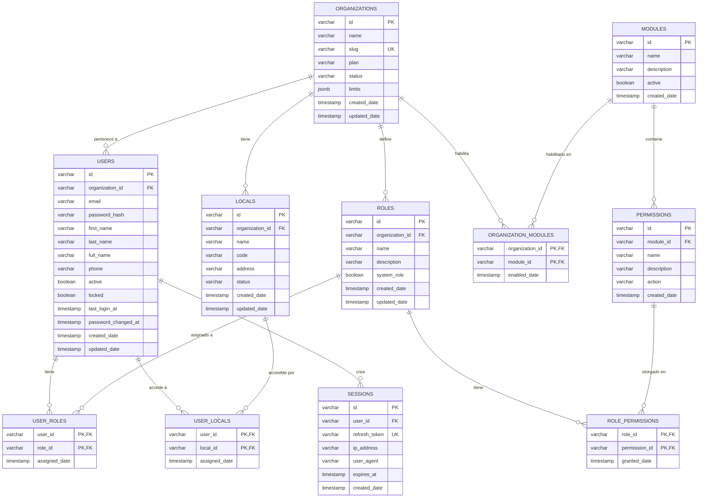

# Modelo de Datos

## Diagrama de Entidad-Relación



## Tablas Principales

### Organizations

Representa los tenants del sistema.

```sql
CREATE TABLE organizations (
    id VARCHAR(50) PRIMARY KEY,
    name VARCHAR(200) NOT NULL,
    slug VARCHAR(100) UNIQUE NOT NULL,
    plan VARCHAR(20) NOT NULL,  -- 'basic', 'pro', 'enterprise'
    status VARCHAR(20) NOT NULL DEFAULT 'active',  -- 'active', 'suspended', 'inactive'
    limits JSONB,
    created_date TIMESTAMP DEFAULT CURRENT_TIMESTAMP,
    updated_date TIMESTAMP DEFAULT CURRENT_TIMESTAMP
);

CREATE INDEX idx_organizations_slug ON organizations(slug);
CREATE INDEX idx_organizations_status ON organizations(status);
```

**Ejemplo de `limits`**:
```json
{
    "max_users": 50,
    "max_locals": 5,
    "max_products": 10000,
    "max_storage_gb": 100
}
```

### Users

Usuarios del sistema.

```sql
CREATE TABLE users (
    id VARCHAR(50) PRIMARY KEY,
    organization_id VARCHAR(50) NOT NULL,
    email VARCHAR(255) NOT NULL,
    password_hash VARCHAR(255) NOT NULL,
    first_name VARCHAR(100),
    last_name VARCHAR(100),
    full_name VARCHAR(255),  -- Nombre completo concatenado o personalizado
    phone VARCHAR(20),  -- Teléfono del usuario
    active BOOLEAN DEFAULT TRUE,
    locked BOOLEAN DEFAULT FALSE,
    last_login_at TIMESTAMP,  -- Última vez que el usuario se logueo
    password_changed_at TIMESTAMP,  -- Última vez que cambió su contraseña
    created_date TIMESTAMP DEFAULT CURRENT_TIMESTAMP,
    updated_date TIMESTAMP DEFAULT CURRENT_TIMESTAMP,

    CONSTRAINT fk_users_organization
        FOREIGN KEY (organization_id)
        REFERENCES organizations(id)
        ON DELETE CASCADE,

    CONSTRAINT uk_users_org_email
        UNIQUE (organization_id, email)
);

CREATE INDEX idx_users_org ON users(organization_id);
CREATE INDEX idx_users_email ON users(email);
CREATE INDEX idx_users_active ON users(active);
CREATE INDEX idx_users_phone ON users(phone);
```

**Campos clave**:
- `organization_id`: Tenant al que pertenece (multi-tenancy)
- `email`: Único por organización
- `password_hash`: bcrypt hash
- `full_name`: Nombre completo del usuario (puede ser diferente a first_name + last_name)
- `phone`: Teléfono de contacto
- `active`: ¿Usuario puede loguearse?
- `locked`: ¿Usuario bloqueado por intentos fallidos?
- `last_login_at`: Timestamp de último login (útil para auditoría y seguridad)
- `password_changed_at`: Timestamp del último cambio de contraseña (para políticas de expiración)

### Roles

Roles definidos por cada organización.

```sql
CREATE TABLE roles (
    id VARCHAR(50) PRIMARY KEY,
    organization_id VARCHAR(50) NOT NULL,
    name VARCHAR(100) NOT NULL,
    description TEXT,
    system_role BOOLEAN DEFAULT FALSE,  -- Rol del sistema (no modificable)
    created_date TIMESTAMP DEFAULT CURRENT_TIMESTAMP,
    updated_date TIMESTAMP DEFAULT CURRENT_TIMESTAMP,

    CONSTRAINT fk_roles_organization
        FOREIGN KEY (organization_id)
        REFERENCES organizations(id)
        ON DELETE CASCADE,

    CONSTRAINT uk_roles_org_name
        UNIQUE (organization_id, name)
);

CREATE INDEX idx_roles_org ON roles(organization_id);
```

**system_role**:
- `true`: Rol predefinido del sistema (ej: "Super Admin")
- `false`: Rol creado por la organización

### Permissions

Permisos disponibles en el sistema.

```sql
CREATE TABLE permissions (
    id VARCHAR(50) PRIMARY KEY,
    module_id VARCHAR(50) NOT NULL,
    name VARCHAR(100) UNIQUE NOT NULL,  -- 'catalog:read', 'inventory:edit'
    description TEXT,
    action VARCHAR(50),  -- 'read', 'create', 'edit', 'delete'
    created_date TIMESTAMP DEFAULT CURRENT_TIMESTAMP,

    CONSTRAINT fk_permissions_module
        FOREIGN KEY (module_id)
        REFERENCES modules(id)
        ON DELETE CASCADE
);

CREATE INDEX idx_permissions_module ON permissions(module_id);
CREATE INDEX idx_permissions_name ON permissions(name);
```

**Formato de nombres**: `{módulo}:{acción}`

Ejemplos:
- `catalog:read`
- `catalog:create`
- `inventory:adjust`
- `orders:cancel`

### Modules

Módulos del ERP.

```sql
CREATE TABLE modules (
    id VARCHAR(50) PRIMARY KEY,
    name VARCHAR(100) UNIQUE NOT NULL,
    description TEXT,
    active BOOLEAN DEFAULT TRUE,
    created_date TIMESTAMP DEFAULT CURRENT_TIMESTAMP
);
```

**Módulos predefinidos**:
- `catalog`: Gestión de productos
- `inventory`: Gestión de inventario
- `orders`: Órdenes de venta
- `pricing`: Gestión de precios
- `reports`: Reportes y analytics

### Locals

Sucursales o ubicaciones físicas.

```sql
CREATE TABLE locals (
    id VARCHAR(50) PRIMARY KEY,
    organization_id VARCHAR(50) NOT NULL,
    name VARCHAR(200) NOT NULL,
    code VARCHAR(50),
    address TEXT,
    status VARCHAR(20) DEFAULT 'active',  -- 'active', 'inactive'
    created_date TIMESTAMP DEFAULT CURRENT_TIMESTAMP,
    updated_date TIMESTAMP DEFAULT CURRENT_TIMESTAMP,

    CONSTRAINT fk_locals_organization
        FOREIGN KEY (organization_id)
        REFERENCES organizations(id)
        ON DELETE CASCADE,

    CONSTRAINT uk_locals_org_code
        UNIQUE (organization_id, code)
);

CREATE INDEX idx_locals_org ON locals(organization_id);
CREATE INDEX idx_locals_status ON locals(status);
```

## Tablas de Relación

### User_Roles

Asignación de roles a usuarios.

```sql
CREATE TABLE user_roles (
    user_id VARCHAR(50) NOT NULL,
    role_id VARCHAR(50) NOT NULL,
    assigned_date TIMESTAMP DEFAULT CURRENT_TIMESTAMP,

    PRIMARY KEY (user_id, role_id),

    CONSTRAINT fk_user_roles_user
        FOREIGN KEY (user_id)
        REFERENCES users(id)
        ON DELETE CASCADE,

    CONSTRAINT fk_user_roles_role
        FOREIGN KEY (role_id)
        REFERENCES roles(id)
        ON DELETE CASCADE
);

CREATE INDEX idx_user_roles_user ON user_roles(user_id);
CREATE INDEX idx_user_roles_role ON user_roles(role_id);
```

**Relación**: Un usuario puede tener múltiples roles.

### Role_Permissions

Permisos asignados a roles.

```sql
CREATE TABLE role_permissions (
    role_id VARCHAR(50) NOT NULL,
    permission_id VARCHAR(50) NOT NULL,
    granted_date TIMESTAMP DEFAULT CURRENT_TIMESTAMP,

    PRIMARY KEY (role_id, permission_id),

    CONSTRAINT fk_role_permissions_role
        FOREIGN KEY (role_id)
        REFERENCES roles(id)
        ON DELETE CASCADE,

    CONSTRAINT fk_role_permissions_permission
        FOREIGN KEY (permission_id)
        REFERENCES permissions(id)
        ON DELETE CASCADE
);

CREATE INDEX idx_role_permissions_role ON role_permissions(role_id);
CREATE INDEX idx_role_permissions_permission ON role_permissions(permission_id);
```

### User_Locals

Locales a los que un usuario tiene acceso.

```sql
CREATE TABLE user_locals (
    user_id VARCHAR(50) NOT NULL,
    local_id VARCHAR(50) NOT NULL,
    assigned_date TIMESTAMP DEFAULT CURRENT_TIMESTAMP,

    PRIMARY KEY (user_id, local_id),

    CONSTRAINT fk_user_locals_user
        FOREIGN KEY (user_id)
        REFERENCES users(id)
        ON DELETE CASCADE,

    CONSTRAINT fk_user_locals_local
        FOREIGN KEY (local_id)
        REFERENCES locals(id)
        ON DELETE CASCADE
);

CREATE INDEX idx_user_locals_user ON user_locals(user_id);
CREATE INDEX idx_user_locals_local ON user_locals(local_id);
```

### Organization_Modules

Módulos habilitados por organización.

```sql
CREATE TABLE organization_modules (
    organization_id VARCHAR(50) NOT NULL,
    module_id VARCHAR(50) NOT NULL,
    enabled_date TIMESTAMP DEFAULT CURRENT_TIMESTAMP,

    PRIMARY KEY (organization_id, module_id),

    CONSTRAINT fk_org_modules_org
        FOREIGN KEY (organization_id)
        REFERENCES organizations(id)
        ON DELETE CASCADE,

    CONSTRAINT fk_org_modules_module
        FOREIGN KEY (module_id)
        REFERENCES modules(id)
        ON DELETE CASCADE
);

CREATE INDEX idx_org_modules_org ON organization_modules(organization_id);
```

### Sessions

Sesiones de usuario (Refresh Tokens).

```sql
CREATE TABLE sessions (
    id VARCHAR(50) PRIMARY KEY,
    user_id VARCHAR(50) NOT NULL,
    refresh_token TEXT UNIQUE NOT NULL,
    ip_address VARCHAR(45),
    user_agent TEXT,
    expires_at TIMESTAMP NOT NULL,
    created_date TIMESTAMP DEFAULT CURRENT_TIMESTAMP,

    CONSTRAINT fk_sessions_user
        FOREIGN KEY (user_id)
        REFERENCES users(id)
        ON DELETE CASCADE
);

CREATE INDEX idx_sessions_user ON sessions(user_id);
CREATE INDEX idx_sessions_refresh_token ON sessions(refresh_token);
CREATE INDEX idx_sessions_expires ON sessions(expires_at);
```

## SQLAlchemy Models

### User Model

```python
from sqlalchemy import Column, String, Boolean, DateTime, ForeignKey
from sqlalchemy.orm import relationship
from datetime import datetime

class User(Base):
    __tablename__ = "users"

    id = Column(String(50), primary_key=True)
    organization_id = Column(String(50), ForeignKey("organizations.id"), nullable=False)
    email = Column(String(255), nullable=False)
    password_hash = Column(String(255), nullable=False)
    first_name = Column(String(100))
    last_name = Column(String(100))
    full_name = Column(String(255))
    phone = Column(String(20))
    active = Column(Boolean, default=True)
    locked = Column(Boolean, default=False)
    last_login_at = Column(DateTime)
    password_changed_at = Column(DateTime)
    created_date = Column(DateTime, default=datetime.utcnow)
    updated_date = Column(DateTime, default=datetime.utcnow, onupdate=datetime.utcnow)

    # Relationships
    organization = relationship("Organization", back_populates="users")
    roles = relationship("Role", secondary="user_roles", back_populates="users")
    locals = relationship("Local", secondary="user_locals", back_populates="users")
    sessions = relationship("Session", back_populates="user", cascade="all, delete-orphan")

    def get_permissions(self) -> list[str]:
        """Retorna lista de permisos del usuario"""
        permissions = set()
        for role in self.roles:
            for permission in role.permissions:
                permissions.add(permission.name)
        return list(permissions)

    def get_locals(self) -> list[str]:
        """Retorna IDs de locales permitidos"""
        return [local.id for local in self.locals]

    def to_dict(self):
        return {
            "id": self.id,
            "email": self.email,
            "first_name": self.first_name,
            "last_name": self.last_name,
            "full_name": self.full_name,
            "phone": self.phone,
            "organization_id": self.organization_id,
            "active": self.active,
            "permissions": self.get_permissions(),
            "locals": self.get_locals(),
            "last_login_at": self.last_login_at.isoformat() if self.last_login_at else None,
            "password_changed_at": self.password_changed_at.isoformat() if self.password_changed_at else None
        }
```

### Role Model

```python
class Role(Base):
    __tablename__ = "roles"

    id = Column(String(50), primary_key=True)
    organization_id = Column(String(50), ForeignKey("organizations.id"), nullable=False)
    name = Column(String(100), nullable=False)
    description = Column(String)
    system_role = Column(Boolean, default=False)
    created_date = Column(DateTime, default=datetime.utcnow)
    updated_date = Column(DateTime, default=datetime.utcnow, onupdate=datetime.utcnow)

    # Relationships
    organization = relationship("Organization", back_populates="roles")
    users = relationship("User", secondary="user_roles", back_populates="roles")
    permissions = relationship("Permission", secondary="role_permissions", back_populates="roles")
```

## Queries Comunes

### Obtener Usuario con Permisos

```sql
SELECT
    u.id,
    u.email,
    u.organization_id,
    u.active,
    array_agg(DISTINCT p.name) AS permissions,
    array_agg(DISTINCT ul.local_id) AS locals
FROM users u
LEFT JOIN user_roles ur ON u.id = ur.user_id
LEFT JOIN roles r ON ur.role_id = r.id
LEFT JOIN role_permissions rp ON r.id = rp.role_id
LEFT JOIN permissions p ON rp.permission_id = p.id
LEFT JOIN user_locals ul ON u.id = ul.user_id
WHERE u.id = $1 AND u.organization_id = $2
GROUP BY u.id, u.email, u.organization_id, u.active;
```

### Validar Permiso de Usuario

```sql
SELECT EXISTS (
    SELECT 1
    FROM users u
    JOIN user_roles ur ON u.id = ur.user_id
    JOIN roles r ON ur.role_id = r.id
    JOIN role_permissions rp ON r.id = rp.role_id
    JOIN permissions p ON rp.permission_id = p.id
    WHERE u.id = $1
      AND u.organization_id = $2
      AND p.name = $3
) AS has_permission;
```

### Obtener Módulos Habilitados de Organización

```sql
SELECT m.*
FROM modules m
JOIN organization_modules om ON m.id = om.module_id
WHERE om.organization_id = $1
  AND m.active = TRUE;
```

## Datos Seed

### Módulos Predefinidos

```sql
INSERT INTO modules (id, name, description) VALUES
('module_catalog', 'Catálogo', 'Gestión de productos y variantes'),
('module_inventory', 'Inventario', 'Control de stock y movimientos'),
('module_orders', 'Órdenes', 'Gestión de órdenes de venta'),
('module_pricing', 'Precios', 'Gestión de precios y promociones'),
('module_reports', 'Reportes', 'Analytics y reportes');
```

### Permisos Predefinidos

```sql
INSERT INTO permissions (id, module_id, name, description, action) VALUES
-- Catalog
('perm_catalog_read', 'module_catalog', 'catalog:read', 'Ver productos', 'read'),
('perm_catalog_create', 'module_catalog', 'catalog:create', 'Crear productos', 'create'),
('perm_catalog_edit', 'module_catalog', 'catalog:edit', 'Editar productos', 'edit'),
('perm_catalog_delete', 'module_catalog', 'catalog:delete', 'Eliminar productos', 'delete'),

-- Inventory
('perm_inventory_read', 'module_inventory', 'inventory:read', 'Ver inventario', 'read'),
('perm_inventory_adjust', 'module_inventory', 'inventory:adjust', 'Ajustar stock', 'edit'),

-- Orders
('perm_orders_read', 'module_orders', 'orders:read', 'Ver órdenes', 'read'),
('perm_orders_create', 'module_orders', 'orders:create', 'Crear órdenes', 'create'),
('perm_orders_cancel', 'module_orders', 'orders:cancel', 'Cancelar órdenes', 'delete');
```

## Migraciones

Las migraciones se gestionan con **Alembic**.

### Crear Migración

```bash
alembic revision --autogenerate -m "Add user_locals table"
```

### Aplicar Migraciones

```bash
alembic upgrade head
```

### Rollback

```bash
alembic downgrade -1
```

## Próximos Pasos

- [Eventos Publicados](/microservicios/auth-service/eventos-publicados)
- [gRPC Server](/microservicios/auth-service/grpc-server)
- [API Auth](/microservicios/auth-service/api-auth)
