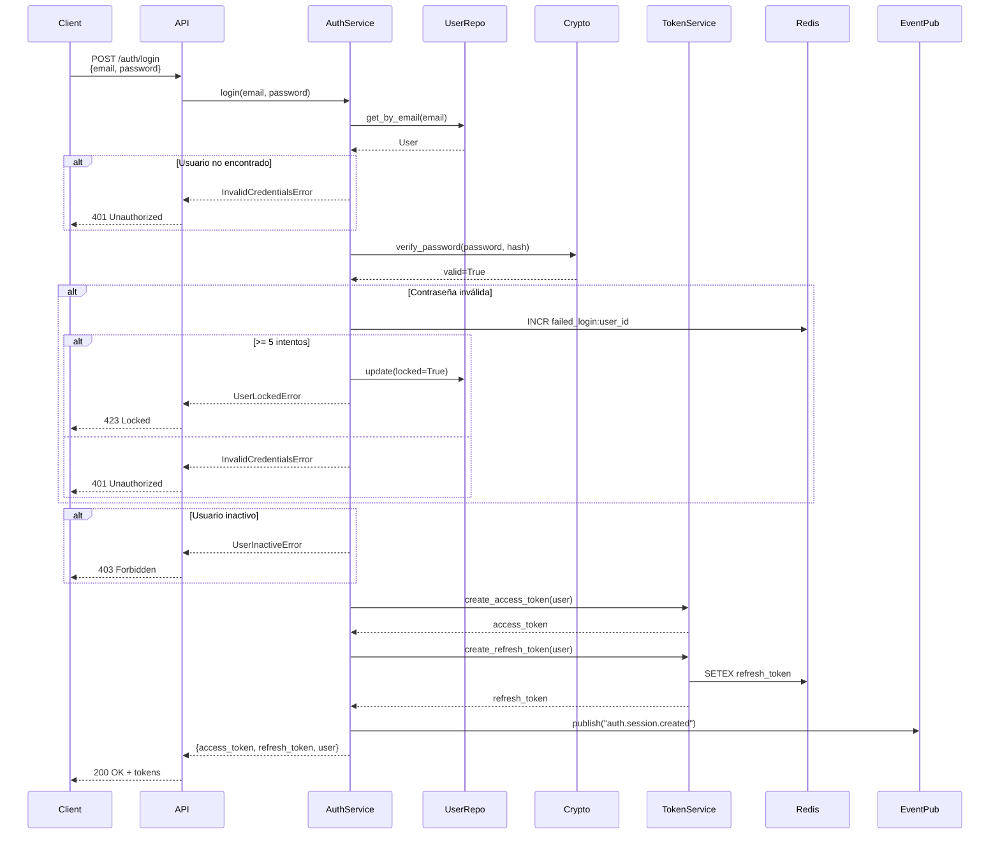
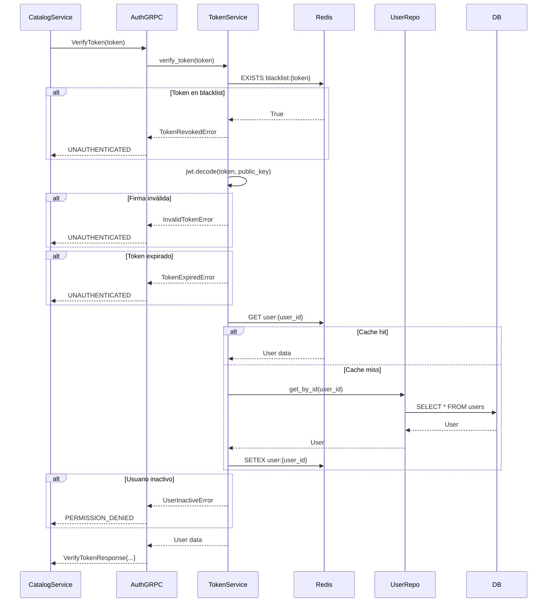
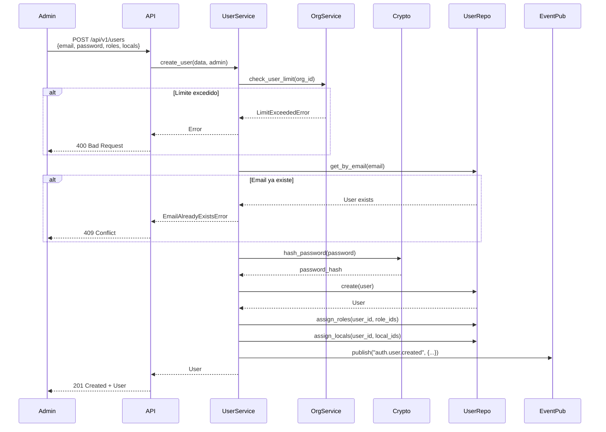
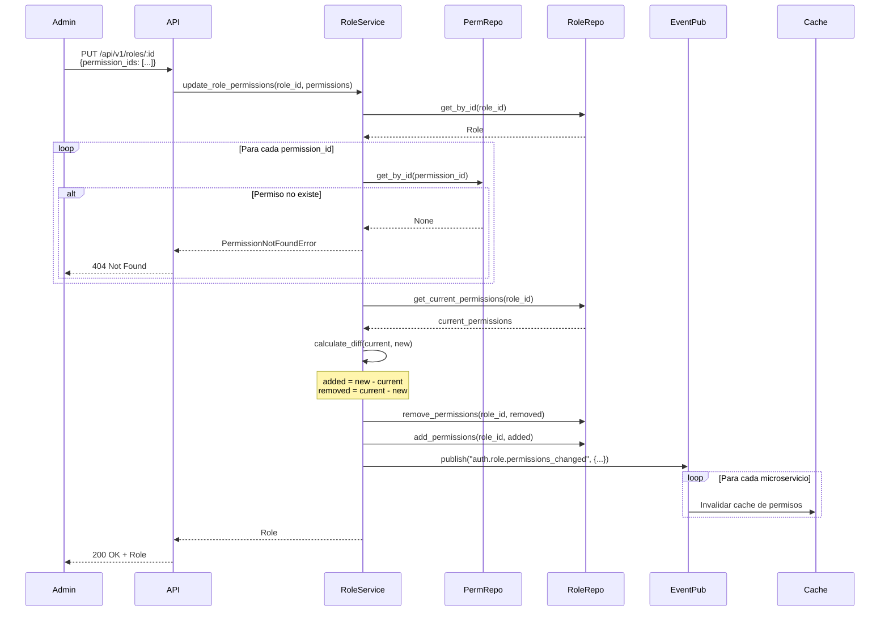
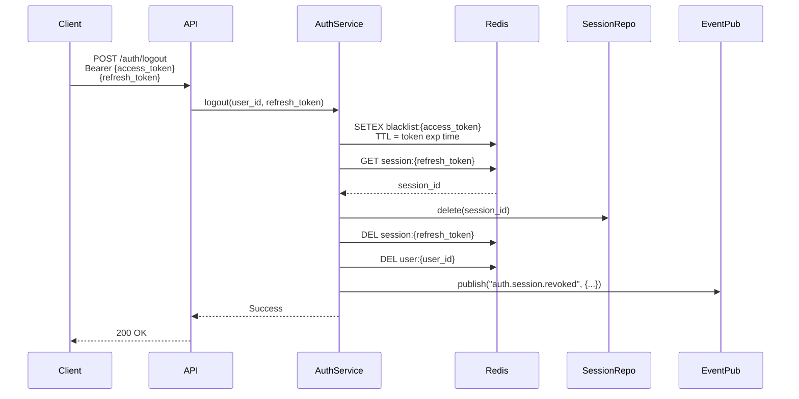
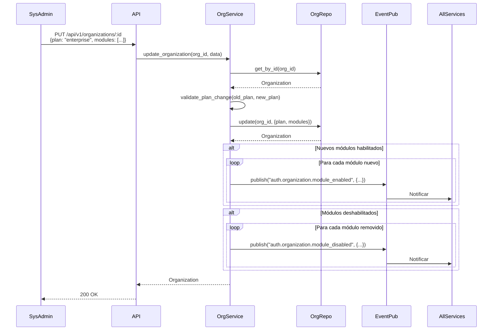

# Flujos de Negocio

Diagramas de flujos principales de Auth Service.

## Flujo de Login

## Flujo de Verificación de Token (gRPC)

## Flujo de Creación de Usuario

## Flujo de Asignación de Permisos a Rol

## Flujo de Logout

## Flujo de Cambio de Plan de Organización

## Próximos Pasos

- [Catalog Service](/microservicios/catalog-service/overview)
- [Seguridad y RBAC](/arquitectura/seguridad-rbac)
