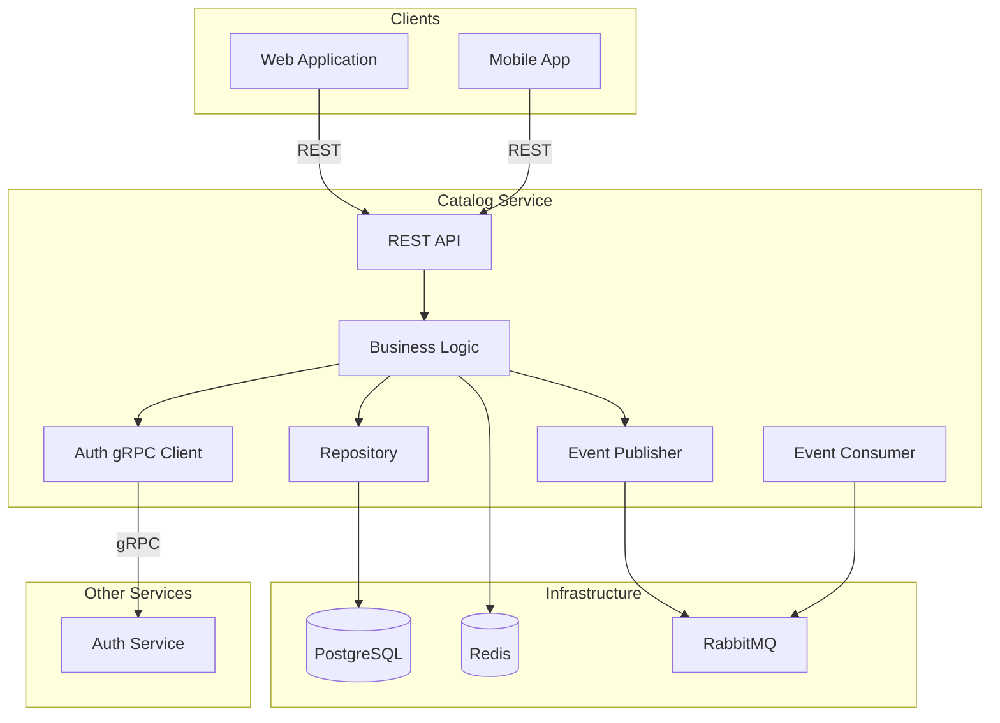
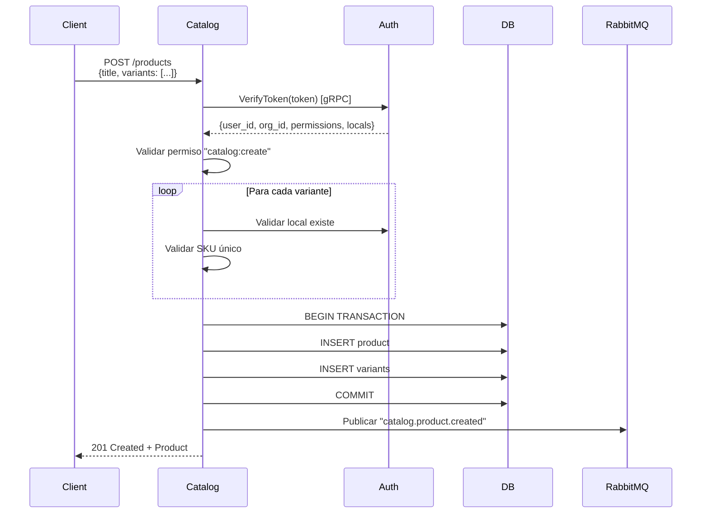

# Catalog Service - Overview

El **Catalog Service** es el microservicio encargado de la gestión completa del catálogo de productos en el ERP multi-tenant.

## Responsabilidades Principales

### 1. Gestión de Productos
- ✅ CRUD de productos (title, description, SKU, etc.)
- ✅ Multi-tenancy (aislamiento por `organization_id`)
- ✅ Categorización de productos
- ✅ Gestión de imágenes
- ✅ Estados (active, archived)

### 2. Gestión de Variantes
- ✅ Múltiples variantes por producto
- ✅ Opciones configurables (Color, Talla, etc.)
- ✅ SKU único por variante
- ✅ Precios por variante
- ✅ Stock por variante y local

### 3. Validación de Locales
- ✅ Verificar que locales existen en Auth Service
- ✅ Validar acceso del usuario al local
- ✅ Sincronización con Auth Service via eventos

### 4. Event-Driven
- ✅ Publicar eventos de cambios en el catálogo
- ✅ Consumir eventos de Auth Service
- ✅ Invalidación de cache automática

## Stack Tecnológico

| Componente | Tecnología | Versión |
|------------|------------|---------|
| **Runtime** | Python | 3.11+ |
| **Framework** | FastAPI | 0.104+ |
| **ORM** | SQLAlchemy | 2.0+ |
| **Validación** | Pydantic | 2.0+ |
| **Base de Datos** | PostgreSQL | 15+ |
| **Cache** | Redis | 7.2+ |
| **Message Broker** | RabbitMQ | 3.12+ |
| **gRPC** | grpcio | 1.59+ |

## Arquitectura General

## Entidades Principales

### Products
Productos del catálogo.

### ProductVariants
Variantes específicas de un producto (combinación de opciones).

### Options
Tipos de opciones (Color, Talla, Material).

### OptionValues
Valores específicos de opciones (Rojo, M, Algodón).

## APIs Expuestas

### REST APIs

| Endpoint | Método | Descripción |
|----------|--------|-------------|
| `/api/v1/products` | GET, POST | Listar/crear productos |
| `/api/v1/products/:id` | GET, PUT, DELETE | Gestionar producto específico |
| `/api/v1/products/:id/variants` | GET, POST | Gestionar variantes |
| `/api/v1/variants/:id` | GET, PUT, DELETE | Gestionar variante específica |
| `/api/v1/options` | GET, POST | Gestionar opciones |

## Eventos Publicados

| Evento | Cuándo |
|--------|--------|
| `catalog.product.created` | Producto creado |
| `catalog.product.updated` | Producto actualizado |
| `catalog.product.deleted` | Producto eliminado |
| `catalog.variant.created` | Variante creada |
| `catalog.variant.updated` | Variante actualizada |
| `catalog.variant.stock_updated` | Stock de variante actualizado |

## Eventos Consumidos

| Evento | Acción |
|--------|--------|
| `auth.user.deactivated` | Invalidar cache de usuario |
| `auth.local.created` | Registrar nuevo local |
| `auth.local.deleted` | Validar que no haya variantes con ese local |
| `auth.organization.suspended` | Marcar productos como inaccesibles |

## Flujo Principal: Crear Producto con Variantes

## Próximos Pasos

- [Alcance](/microservicios/catalog-service/alcance)
- [Arquitectura](/microservicios/catalog-service/arquitectura)
- [Modelo de Datos](/microservicios/catalog-service/modelo-datos)
