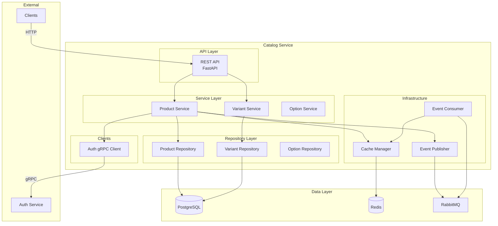

# Arquitectura Interna

## Capas de la Arquitectura



## Estructura de Directorios

```
catalog-service/
├── src/
│   ├── api/
│   │   └── rest/
│   │       ├── products.py
│   │       ├── variants.py
│   │       └── options.py
│   │
│   ├── services/
│   │   ├── product_service.py
│   │   ├── variant_service.py
│   │   └── option_service.py
│   │
│   ├── repositories/
│   │   ├── product_repository.py
│   │   ├── variant_repository.py
│   │   └── option_repository.py
│   │
│   ├── models/
│   │   ├── product.py
│   │   ├── product_variant.py
│   │   ├── option.py
│   │   └── option_value.py
│   │
│   ├── schemas/
│   │   ├── product.py
│   │   ├── variant.py
│   │   └── option.py
│   │
│   ├── clients/
│   │   └── auth_client.py
│   │
│   ├── infrastructure/
│   │   ├── event_publisher.py
│   │   ├── event_consumer.py
│   │   └── cache.py
│   │
│   ├── middleware/
│   │   └── local_validation.py
│   │
│   └── main.py
│
├── tests/
├── migrations/
├── Dockerfile
└── requirements.txt
```

## Service Layer

### Product Service

```python
class ProductService:
    def __init__(
        self,
        product_repo: ProductRepository,
        variant_repo: VariantRepository,
        auth_client: AuthClient,
        event_publisher: EventPublisher,
        cache: CacheManager
    ):
        self.product_repo = product_repo
        self.variant_repo = variant_repo
        self.auth_client = auth_client
        self.event_publisher = event_publisher
        self.cache = cache

    async def create_product(
        self,
        data: ProductCreate,
        user: User
    ) -> Product:
        """Crear producto con variantes"""

        # 1. Validar locales de las variantes
        for variant_data in data.variants:
            await self._validate_local(
                variant_data.warehouseId,
                user.organization_id
            )

        # 2. Validar SKUs únicos
        for variant_data in data.variants:
            exists = await self.variant_repo.exists_sku(
                variant_data.sku,
                user.organization_id
            )
            if exists:
                raise ValidationError(f"SKU {variant_data.sku} ya existe")

        # 3. Crear producto y variantes en transacción
        async with UnitOfWork(db) as uow:
            product = Product(**data.dict(), organization_id=user.organization_id)
            product = await self.product_repo.create(product)

            for variant_data in data.variants:
                variant = ProductVariant(
                    **variant_data.dict(),
                    product_id=product.id
                )
                await self.variant_repo.create(variant)

        # 4. Publicar evento
        await self.event_publisher.publish(
            "catalog.product.created",
            {
                "product_id": product.id,
                "organization_id": user.organization_id,
                "variants_count": len(data.variants)
            }
        )

        return product

    async def _validate_local(self, local_id: str, org_id: str):
        """Validar que local existe en Auth Service"""
        # Intentar obtener de cache
        cache_key = f"local:{org_id}:{local_id}"
        cached = await self.cache.get(cache_key)

        if cached:
            return True

        # Consultar a Auth Service vía gRPC
        try:
            local = await self.auth_client.get_local(local_id, org_id)

            # Cachear por 10 minutos
            await self.cache.set(cache_key, local, ttl=600)

            return True
        except NotFoundError:
            raise ValidationError(f"Local {local_id} no existe")
```

## Auth gRPC Client

```python
import grpc
import auth_pb2
import auth_pb2_grpc

class AuthClient:
    def __init__(self, grpc_url: str):
        self.channel = grpc.aio.insecure_channel(grpc_url)
        self.stub = auth_pb2_grpc.AuthServiceStub(self.channel)

    async def verify_token(self, token: str):
        """Verificar token y obtener usuario"""
        request = auth_pb2.VerifyTokenRequest(token=token)

        try:
            response = await self.stub.VerifyToken(request, timeout=5.0)
            return {
                "user_id": response.user_id,
                "organization_id": response.organization_id,
                "permissions": list(response.permissions),
                "locals": list(response.locals)
            }
        except grpc.RpcError as e:
            if e.code() == grpc.StatusCode.UNAUTHENTICATED:
                raise UnauthorizedError("Token inválido")
            raise

    async def get_local(self, local_id: str, org_id: str):
        """Obtener información de local"""
        # Implementación similar
        pass
```

## Event Consumer

```python
import pika
import json

class EventConsumer:
    def __init__(self, cache: CacheManager):
        self.cache = cache
        self.connection = pika.BlockingConnection(
            pika.ConnectionParameters('localhost')
        )
        self.channel = self.connection.channel()

    def start(self):
        """Iniciar consumo de eventos"""

        # Declarar exchange
        self.channel.exchange_declare(
            exchange='auth_events',
            exchange_type='topic',
            durable=True
        )

        # Crear queue
        self.channel.queue_declare(
            queue='catalog_auth_events',
            durable=True
        )

        # Bind a eventos específicos
        self.channel.queue_bind(
            exchange='auth_events',
            queue='catalog_auth_events',
            routing_key='auth.user.*'
        )
        self.channel.queue_bind(
            exchange='auth_events',
            queue='catalog_auth_events',
            routing_key='auth.local.*'
        )

        # Consumir
        self.channel.basic_consume(
            queue='catalog_auth_events',
            on_message_callback=self.handle_event
        )

        self.channel.start_consuming()

    def handle_event(self, ch, method, properties, body):
        """Manejar evento recibido"""
        event = json.loads(body)
        event_type = event["event_type"]

        if event_type == "auth.user.deactivated":
            self._handle_user_deactivated(event)
        elif event_type == "auth.local.deleted":
            self._handle_local_deleted(event)
        elif event_type == "auth.organization.suspended":
            self._handle_org_suspended(event)

        ch.basic_ack(delivery_tag=method.delivery_tag)

    async def _handle_user_deactivated(self, event):
        """Invalidar cache cuando usuario es desactivado"""
        user_id = event["payload"]["user_id"]
        await self.cache.delete(f"user:{user_id}")

    async def _handle_local_deleted(self, event):
        """Invalidar cache cuando local es eliminado"""
        local_id = event["payload"]["local_id"]
        org_id = event["payload"]["organization_id"]
        await self.cache.delete(f"local:{org_id}:{local_id}")
```

## Middleware de Validación de Local

```python
from fastapi import Request, HTTPException

async def validate_local_middleware(request: Request, call_next):
    """
    Middleware para validar locales en requests que los requieren
    """

    # Solo aplicar en endpoints que requieren local
    if request.url.path.startswith("/api/v1/variants"):

        # Obtener local_id del body o query
        if request.method == "POST":
            body = await request.json()
            local_id = body.get("warehouseId")

            if local_id:
                user = request.state.user
                auth_client = request.app.state.auth_client

                # Validar que local existe
                try:
                    await auth_client.get_local(local_id, user.organization_id)
                except NotFoundError:
                    raise HTTPException(404, f"Local {local_id} no existe")

                # Validar que usuario tiene acceso
                if local_id not in user.locals and "local:access_all" not in user.permissions:
                    raise HTTPException(403, f"Sin acceso al local {local_id}")

    response = await call_next(request)
    return response
```

## Próximos Pasos

- [Modelo de Datos](/microservicios/catalog-service/modelo-datos)
- [Validación de Locales](/microservicios/catalog-service/validacion-locales)
- [Auth gRPC Client](/microservicios/catalog-service/auth-client-grpc)
