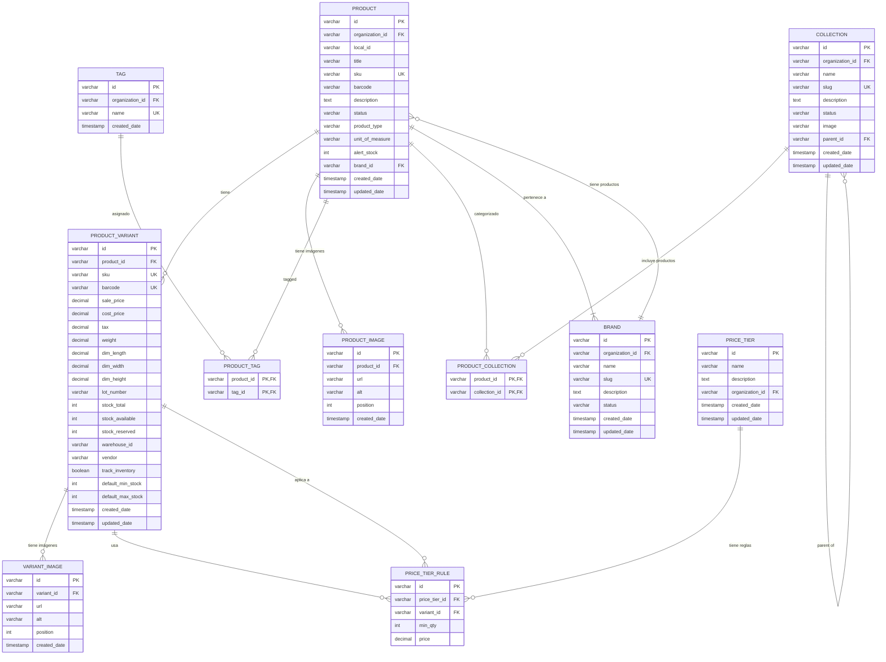

# Modelo de Datos

Modelo de datos completo del Catalog Service con todas las entidades y relaciones.

## Diagrama de Entidad-Relación Completo



## Tablas Principales

### Products

Tabla principal de productos. Representa un producto genérico con toda su información.

```sql
CREATE TABLE products (
    id VARCHAR(50) PRIMARY KEY,
    organization_id VARCHAR(50) NOT NULL,
    local_id VARCHAR(50),  -- ID de local/tienda física
    title VARCHAR(255) NOT NULL,
    sku VARCHAR(100) NOT NULL,
    barcode VARCHAR(100),
    description TEXT,
    status VARCHAR(20) DEFAULT 'activa',  -- 'activa', 'inactiva'
    product_type VARCHAR(100),  -- 'ropa-deporte', 'electronica', etc.
    unit_of_measure VARCHAR(50) DEFAULT 'unidad',
    alert_stock INT DEFAULT 0,
    brand_id VARCHAR(50),
    created_date TIMESTAMP DEFAULT CURRENT_TIMESTAMP,
    updated_date TIMESTAMP DEFAULT CURRENT_TIMESTAMP,

    CONSTRAINT fk_products_organization
        FOREIGN KEY (organization_id)
        REFERENCES organizations(id)
        ON DELETE CASCADE,

    CONSTRAINT fk_products_brand
        FOREIGN KEY (brand_id)
        REFERENCES brands(id)
        ON DELETE SET NULL,

    CONSTRAINT uk_product_org_sku
        UNIQUE (organization_id, sku)
);

CREATE INDEX idx_products_org ON products(organization_id);
CREATE INDEX idx_products_status ON products(status);
CREATE INDEX idx_products_brand ON products(brand_id);
CREATE INDEX idx_products_sku ON products(sku);
CREATE INDEX idx_products_title ON products USING gin(to_tsvector('spanish', title));
CREATE INDEX idx_products_product_type ON products(product_type);
```

### Brands

Marcas comerciales de productos.

```sql
CREATE TABLE brands (
    id VARCHAR(50) PRIMARY KEY,
    organization_id VARCHAR(50) NOT NULL,
    name VARCHAR(255) NOT NULL,
    slug VARCHAR(255) NOT NULL,
    description TEXT,
    status VARCHAR(20) DEFAULT 'active',  -- 'active', 'inactive'
    created_date TIMESTAMP DEFAULT CURRENT_TIMESTAMP,
    updated_date TIMESTAMP DEFAULT CURRENT_TIMESTAMP,

    CONSTRAINT fk_brands_organization
        FOREIGN KEY (organization_id)
        REFERENCES organizations(id)
        ON DELETE CASCADE,

    CONSTRAINT uk_brand_org_slug
        UNIQUE (organization_id, slug)
);

CREATE INDEX idx_brands_org ON brands(organization_id);
CREATE INDEX idx_brands_status ON brands(status);
CREATE INDEX idx_brands_name ON brands USING gin(to_tsvector('spanish', name));
```

### Product_Images

Imágenes asociadas a productos.

```sql
CREATE TABLE product_images (
    id VARCHAR(50) PRIMARY KEY,
    product_id VARCHAR(50) NOT NULL,
    url VARCHAR(500) NOT NULL,
    alt VARCHAR(255),
    position INT DEFAULT 0,
    created_date TIMESTAMP DEFAULT CURRENT_TIMESTAMP,

    CONSTRAINT fk_product_images_product
        FOREIGN KEY (product_id)
        REFERENCES products(id)
        ON DELETE CASCADE
);

CREATE INDEX idx_product_images_product ON product_images(product_id);
CREATE INDEX idx_product_images_position ON product_images(product_id, position);
```

### Tags

Etiquetas para clasificación flexible de productos.

```sql
CREATE TABLE tags (
    id VARCHAR(50) PRIMARY KEY,
    organization_id VARCHAR(50) NOT NULL,
    name VARCHAR(100) NOT NULL,
    created_date TIMESTAMP DEFAULT CURRENT_TIMESTAMP,

    CONSTRAINT fk_tags_organization
        FOREIGN KEY (organization_id)
        REFERENCES organizations(id)
        ON DELETE CASCADE,

    CONSTRAINT uk_tag_org_name
        UNIQUE (organization_id, name)
);

CREATE INDEX idx_tags_org ON tags(organization_id);
CREATE INDEX idx_tags_name ON tags(name);
```

### Product_Tags

Relación Many-to-Many entre productos y tags.

```sql
CREATE TABLE product_tags (
    product_id VARCHAR(50) NOT NULL,
    tag_id VARCHAR(50) NOT NULL,

    PRIMARY KEY (product_id, tag_id),

    CONSTRAINT fk_product_tags_product
        FOREIGN KEY (product_id)
        REFERENCES products(id)
        ON DELETE CASCADE,

    CONSTRAINT fk_product_tags_tag
        FOREIGN KEY (tag_id)
        REFERENCES tags(id)
        ON DELETE CASCADE
);

CREATE INDEX idx_product_tags_tag ON product_tags(tag_id);
```

### Collections

Colecciones/categorías para agrupar productos.

```sql
CREATE TABLE collections (
    id VARCHAR(50) PRIMARY KEY,
    organization_id VARCHAR(50) NOT NULL,
    name VARCHAR(255) NOT NULL,
    slug VARCHAR(255) NOT NULL,
    description TEXT,
    status VARCHAR(20) DEFAULT 'activa',  -- 'activa', 'inactiva'
    image VARCHAR(500),
    parent_id VARCHAR(50),  -- Para jerarquía de categorías
    created_date TIMESTAMP DEFAULT CURRENT_TIMESTAMP,
    updated_date TIMESTAMP DEFAULT CURRENT_TIMESTAMP,

    CONSTRAINT fk_collections_organization
        FOREIGN KEY (organization_id)
        REFERENCES organizations(id)
        ON DELETE CASCADE,

    CONSTRAINT fk_collections_parent
        FOREIGN KEY (parent_id)
        REFERENCES collections(id)
        ON DELETE SET NULL,

    CONSTRAINT uk_collection_org_slug
        UNIQUE (organization_id, slug)
);

CREATE INDEX idx_collections_org ON collections(organization_id);
CREATE INDEX idx_collections_status ON collections(status);
CREATE INDEX idx_collections_parent ON collections(parent_id);
CREATE INDEX idx_collections_name ON collections USING gin(to_tsvector('spanish', name));
```

### Product_Collections

Relación Many-to-Many entre productos y colecciones.

```sql
CREATE TABLE product_collections (
    product_id VARCHAR(50) NOT NULL,
    collection_id VARCHAR(50) NOT NULL,

    PRIMARY KEY (product_id, collection_id),

    CONSTRAINT fk_product_collections_product
        FOREIGN KEY (product_id)
        REFERENCES products(id)
        ON DELETE CASCADE,

    CONSTRAINT fk_product_collections_collection
        FOREIGN KEY (collection_id)
        REFERENCES collections(id)
        ON DELETE CASCADE
);

CREATE INDEX idx_product_collections_collection ON product_collections(collection_id);
```

### Product_Variants

Variantes de productos con precios, inventario y atributos específicos.

```sql
CREATE TABLE product_variants (
    id VARCHAR(50) PRIMARY KEY,
    product_id VARCHAR(50) NOT NULL,
    sku VARCHAR(100) NOT NULL,
    barcode VARCHAR(100) UNIQUE,  -- Código de barras único de variante
    sale_price DECIMAL(10, 2) NOT NULL,
    cost_price DECIMAL(10, 2),
    tax DECIMAL(5, 2) DEFAULT 0,  -- Porcentaje de impuesto
    weight DECIMAL(10, 2),  -- En kg
    dim_length DECIMAL(10, 2),  -- En cm
    dim_width DECIMAL(10, 2),
    dim_height DECIMAL(10, 2),
    lot_number VARCHAR(100),
    stock_total INT DEFAULT 0,
    stock_available INT DEFAULT 0,
    stock_reserved INT DEFAULT 0,
    warehouse_id VARCHAR(50) NOT NULL,  -- Foreign key lógica a Auth Service
    vendor VARCHAR(255),  -- Proveedor
    track_inventory BOOLEAN DEFAULT TRUE,  -- Si se debe rastrear inventario para esta variante
    default_min_stock INT DEFAULT 20,  -- Stock mínimo recomendado
    default_max_stock INT DEFAULT 1000,  -- Stock máximo recomendado
    created_date TIMESTAMP DEFAULT CURRENT_TIMESTAMP,
    updated_date TIMESTAMP DEFAULT CURRENT_TIMESTAMP,

    CONSTRAINT fk_variants_product
        FOREIGN KEY (product_id)
        REFERENCES products(id)
        ON DELETE CASCADE,

    CONSTRAINT uk_variant_sku
        UNIQUE (sku),

    CONSTRAINT chk_variant_stock
        CHECK (stock_available >= 0 AND stock_reserved >= 0 AND stock_total = stock_available + stock_reserved),

    CONSTRAINT chk_variant_stock_levels
        CHECK (default_min_stock >= 0 AND default_max_stock >= default_min_stock)
);

CREATE INDEX idx_variants_product ON product_variants(product_id);
CREATE INDEX idx_variants_sku ON product_variants(sku);
CREATE INDEX idx_variants_barcode ON product_variants(barcode);
CREATE INDEX idx_variants_warehouse ON product_variants(warehouse_id);
CREATE INDEX idx_variants_lot_number ON product_variants(lot_number);
CREATE INDEX idx_variants_sale_price ON product_variants(sale_price);
CREATE INDEX idx_variants_track_inventory ON product_variants(track_inventory);
```

### Variant_Images

Imágenes específicas de variantes.

```sql
CREATE TABLE variant_images (
    id VARCHAR(50) PRIMARY KEY,
    variant_id VARCHAR(50) NOT NULL,
    url VARCHAR(500) NOT NULL,
    alt VARCHAR(255),
    position INT DEFAULT 0,
    created_date TIMESTAMP DEFAULT CURRENT_TIMESTAMP,

    CONSTRAINT fk_variant_images_variant
        FOREIGN KEY (variant_id)
        REFERENCES product_variants(id)
        ON DELETE CASCADE
);

CREATE INDEX idx_variant_images_variant ON variant_images(variant_id);
CREATE INDEX idx_variant_images_position ON variant_images(variant_id, position);
```

### Price_Tiers

Definición de grupos de precios por volumen.

```sql
CREATE TABLE price_tiers (
    id VARCHAR(50) PRIMARY KEY,
    organization_id VARCHAR(50) NOT NULL,
    name VARCHAR(255) NOT NULL,
    description TEXT,
    created_date TIMESTAMP DEFAULT CURRENT_TIMESTAMP,
    updated_date TIMESTAMP DEFAULT CURRENT_TIMESTAMP,

    CONSTRAINT fk_price_tiers_organization
        FOREIGN KEY (organization_id)
        REFERENCES organizations(id)
        ON DELETE CASCADE,

    CONSTRAINT uk_price_tier_org_name
        UNIQUE (organization_id, name)
);

CREATE INDEX idx_price_tiers_org ON price_tiers(organization_id);
```

### Price_Tier_Rules

Reglas específicas de precios por volumen para variantes.

```sql
CREATE TABLE price_tier_rules (
    id VARCHAR(50) PRIMARY KEY,
    price_tier_id VARCHAR(50) NOT NULL,
    variant_id VARCHAR(50) NOT NULL,
    min_qty INT NOT NULL,
    price DECIMAL(10, 2) NOT NULL,

    CONSTRAINT fk_price_tier_rules_tier
        FOREIGN KEY (price_tier_id)
        REFERENCES price_tiers(id)
        ON DELETE CASCADE,

    CONSTRAINT fk_price_tier_rules_variant
        FOREIGN KEY (variant_id)
        REFERENCES product_variants(id)
        ON DELETE CASCADE,

    CONSTRAINT uk_price_tier_rule
        UNIQUE (price_tier_id, variant_id, min_qty),

    CONSTRAINT chk_price_tier_min_qty
        CHECK (min_qty > 0)
);

CREATE INDEX idx_price_tier_rules_tier ON price_tier_rules(price_tier_id);
CREATE INDEX idx_price_tier_rules_variant ON price_tier_rules(variant_id);
CREATE INDEX idx_price_tier_rules_min_qty ON price_tier_rules(min_qty);
```

## Ejemplo de Datos Completo

### Producto: Camiseta Deportiva

```sql
-- Brand
INSERT INTO brands (id, organization_id, name, slug, description, status)
VALUES ('brand_01', 'org_123', 'SportBrand', 'sportbrand', 'Marca deportiva premium', 'active');

-- Tags
INSERT INTO tags (id, organization_id, name)
VALUES
    ('tag_deporte', 'org_123', 'Deporte'),
    ('tag_hombre', 'org_123', 'Hombre'),
    ('tag_premium', 'org_123', 'Premium');

-- Collections
INSERT INTO collections (id, organization_id, name, slug, description, status, parent_id)
VALUES
    ('col_100', 'org_123', 'Ropa Deportiva', 'ropa-deportiva', 'Colección general de ropa deportiva', 'activa', NULL),
    ('col_300', 'org_123', 'Accesorios', 'accesorios', 'Accesorios deportivos', 'activa', NULL);

-- Producto
INSERT INTO products (id, organization_id, title, sku, barcode, description, status, product_type, unit_of_measure, alert_stock, brand_id)
VALUES ('prod_2002', 'org_123', 'Camiseta Deportiva Hombre', 'TSH-MEN-2002', '9876543210987', 'Camiseta deportiva de manga corta', 'activa', 'ropa-deporte', 'unidad', 50, 'brand_01');

-- Imágenes del producto
INSERT INTO product_images (id, product_id, url, alt, position)
VALUES
    ('img_2002A', 'prod_2002', 'https://cdn.example.com/products/tsh-men-2002-front.jpg', 'Frontal', 1),
    ('img_2002B', 'prod_2002', 'https://cdn.example.com/products/tsh-men-2002-back.jpg', 'Trasera', 2);

-- Tags del producto
INSERT INTO product_tags (product_id, tag_id)
VALUES
    ('prod_2002', 'tag_deporte'),
    ('prod_2002', 'tag_hombre');

-- Collections del producto
INSERT INTO product_collections (product_id, collection_id)
VALUES
    ('prod_2002', 'col_100');

-- Variante: Azul M
INSERT INTO product_variants (id, product_id, sku, sale_price, cost_price, tax, weight, dim_length, dim_width, dim_height, lot_number, stock_total, stock_available, stock_reserved, warehouse_id, vendor)
VALUES ('var_2002_blue_m', 'prod_2002', 'TSH-MEN-2002-BLUE-M', 24.99, 12.50, 12.00, 0.25, 40, 30, 2, 'L2025B', 200, 180, 20, 'wh_02', 'Proveedor Ropa S.A.');

-- Imagen de variante
INSERT INTO variant_images (id, variant_id, url, alt, position)
VALUES ('img_2002A1', 'var_2002_blue_m', 'https://cdn.example.com/products/tsh-men-2002-blue-m.jpg', 'Azul M', 1);

-- Price Tier
INSERT INTO price_tiers (id, organization_id, name, description)
VALUES ('tier_A', 'org_123', 'Mayorista A', 'Precios preferenciales para compras por volumen');

-- Price Tier Rules
INSERT INTO price_tier_rules (id, price_tier_id, variant_id, min_qty, price)
VALUES
    ('rule_001', 'tier_A', 'var_2002_blue_m', 1, 24.99),
    ('rule_002', 'tier_A', 'var_2002_blue_m', 10, 22.99),
    ('rule_003', 'tier_A', 'var_2002_blue_m', 50, 20.99);
```

## Queries Comunes

### Obtener Producto Completo

```sql
SELECT
    p.id,
    p.title,
    p.sku,
    p.barcode,
    p.description,
    p.status,
    p.product_type,
    p.unit_of_measure,
    p.alert_stock,
    jsonb_build_object(
        'id', b.id,
        'name', b.name,
        'slug', b.slug
    ) AS brand,
    (
        SELECT jsonb_agg(
            jsonb_build_object(
                'id', pi.id,
                'url', pi.url,
                'alt', pi.alt,
                'position', pi.position
            ) ORDER BY pi.position
        )
        FROM product_images pi
        WHERE pi.product_id = p.id
    ) AS images,
    (
        SELECT jsonb_agg(
            jsonb_build_object(
                'id', t.id,
                'name', t.name
            )
        )
        FROM product_tags pt
        JOIN tags t ON pt.tag_id = t.id
        WHERE pt.product_id = p.id
    ) AS tags,
    (
        SELECT jsonb_agg(
            jsonb_build_object(
                'id', c.id,
                'name', c.name,
                'slug', c.slug
            )
        )
        FROM product_collections pc
        JOIN collections c ON pc.collection_id = c.id
        WHERE pc.product_id = p.id
    ) AS collections,
    (
        SELECT jsonb_agg(
            jsonb_build_object(
                'id', v.id,
                'sku', v.sku,
                'sale_price', v.sale_price,
                'cost_price', v.cost_price,
                'tax', v.tax,
                'weight', v.weight,
                'dimensions', jsonb_build_object(
                    'length', v.dim_length,
                    'width', v.dim_width,
                    'height', v.dim_height
                ),
                'stock', jsonb_build_object(
                    'total', v.stock_total,
                    'available', v.stock_available,
                    'reserved', v.stock_reserved
                ),
                'warehouse_id', v.warehouse_id
            )
        )
        FROM product_variants v
        WHERE v.product_id = p.id
    ) AS variants
FROM products p
LEFT JOIN brands b ON p.brand_id = b.id
WHERE p.id = $1 AND p.organization_id = $2;
```

### Buscar Productos con Filtros

```sql
SELECT
    p.id,
    p.title,
    p.sku,
    p.status,
    b.name AS brand_name
FROM products p
LEFT JOIN brands b ON p.brand_id = b.id
LEFT JOIN product_collections pc ON p.id = pc.product_id
LEFT JOIN product_tags pt ON p.id = pt.product_id
WHERE p.organization_id = $1
    AND ($2::VARCHAR IS NULL OR p.status = $2)  -- filtro por status
    AND ($3::VARCHAR IS NULL OR b.id = $3)      -- filtro por brand
    AND ($4::VARCHAR IS NULL OR pc.collection_id = $4)  -- filtro por collection
    AND ($5::VARCHAR IS NULL OR pt.tag_id = $5)  -- filtro por tag
GROUP BY p.id, p.title, p.sku, p.status, b.name
ORDER BY p.updated_date DESC;
```

### Obtener Variantes con Price Tiers

```sql
SELECT
    v.*,
    (
        SELECT jsonb_agg(
            jsonb_build_object(
                'tier_id', pt.id,
                'tier_name', pt.name,
                'min_qty', ptr.min_qty,
                'price', ptr.price
            ) ORDER BY ptr.min_qty
        )
        FROM price_tier_rules ptr
        JOIN price_tiers pt ON ptr.price_tier_id = pt.id
        WHERE ptr.variant_id = v.id
    ) AS price_tiers
FROM product_variants v
WHERE v.product_id = $1;
```

## SQLAlchemy Models

### Product Model

```python
from sqlalchemy import Column, String, Text, Integer, DateTime, ForeignKey
from sqlalchemy.orm import relationship
from datetime import datetime

class Product(Base):
    __tablename__ = "products"

    id = Column(String(50), primary_key=True)
    organization_id = Column(String(50), nullable=False)
    local_id = Column(String(50))
    title = Column(String(255), nullable=False)
    sku = Column(String(100), nullable=False)
    barcode = Column(String(100))
    description = Column(Text)
    status = Column(String(20), default="activa")
    product_type = Column(String(100))
    unit_of_measure = Column(String(50), default="unidad")
    alert_stock = Column(Integer, default=0)
    brand_id = Column(String(50), ForeignKey("brands.id"))
    created_date = Column(DateTime, default=datetime.utcnow)
    updated_date = Column(DateTime, default=datetime.utcnow, onupdate=datetime.utcnow)

    # Relationships
    brand = relationship("Brand", back_populates="products")
    images = relationship("ProductImage", back_populates="product", cascade="all, delete-orphan")
    variants = relationship("ProductVariant", back_populates="product", cascade="all, delete-orphan")
    tags = relationship("Tag", secondary="product_tags", back_populates="products")
    collections = relationship("Collection", secondary="product_collections", back_populates="products")
```

### Brand Model

```python
class Brand(Base):
    __tablename__ = "brands"

    id = Column(String(50), primary_key=True)
    organization_id = Column(String(50), nullable=False)
    name = Column(String(255), nullable=False)
    slug = Column(String(255), nullable=False)
    description = Column(Text)
    status = Column(String(20), default="active")
    created_date = Column(DateTime, default=datetime.utcnow)
    updated_date = Column(DateTime, default=datetime.utcnow, onupdate=datetime.utcnow)

    # Relationships
    products = relationship("Product", back_populates="brand")
```

### ProductVariant Model

```python
from sqlalchemy import Numeric, Boolean

class ProductVariant(Base):
    __tablename__ = "product_variants"

    id = Column(String(50), primary_key=True)
    product_id = Column(String(50), ForeignKey("products.id"), nullable=False)
    sku = Column(String(100), unique=True, nullable=False)
    barcode = Column(String(100), unique=True)
    sale_price = Column(Numeric(10, 2), nullable=False)
    cost_price = Column(Numeric(10, 2))
    tax = Column(Numeric(5, 2), default=0)
    weight = Column(Numeric(10, 2))
    dim_length = Column(Numeric(10, 2))
    dim_width = Column(Numeric(10, 2))
    dim_height = Column(Numeric(10, 2))
    lot_number = Column(String(100))
    stock_total = Column(Integer, default=0)
    stock_available = Column(Integer, default=0)
    stock_reserved = Column(Integer, default=0)
    warehouse_id = Column(String(50), nullable=False)
    vendor = Column(String(255))
    track_inventory = Column(Boolean, default=True)
    default_min_stock = Column(Integer, default=20)
    default_max_stock = Column(Integer, default=1000)
    created_date = Column(DateTime, default=datetime.utcnow)
    updated_date = Column(DateTime, default=datetime.utcnow, onupdate=datetime.utcnow)

    # Relationships
    product = relationship("Product", back_populates="variants")
    images = relationship("VariantImage", back_populates="variant", cascade="all, delete-orphan")
    price_tier_rules = relationship("PriceTierRule", back_populates="variant")
```

### Collection Model

```python
class Collection(Base):
    __tablename__ = "collections"

    id = Column(String(50), primary_key=True)
    organization_id = Column(String(50), nullable=False)
    name = Column(String(255), nullable=False)
    slug = Column(String(255), nullable=False)
    description = Column(Text)
    status = Column(String(20), default="activa")
    image = Column(String(500))
    parent_id = Column(String(50), ForeignKey("collections.id"))
    created_date = Column(DateTime, default=datetime.utcnow)
    updated_date = Column(DateTime, default=datetime.utcnow, onupdate=datetime.utcnow)

    # Relationships
    parent = relationship("Collection", remote_side=[id], backref="children")
    products = relationship("Product", secondary="product_collections", back_populates="collections")
```

### PriceTier Model

```python
class PriceTier(Base):
    __tablename__ = "price_tiers"

    id = Column(String(50), primary_key=True)
    organization_id = Column(String(50), nullable=False)
    name = Column(String(255), nullable=False)
    description = Column(Text)
    created_date = Column(DateTime, default=datetime.utcnow)
    updated_date = Column(DateTime, default=datetime.utcnow, onupdate=datetime.utcnow)

    # Relationships
    rules = relationship("PriceTierRule", back_populates="price_tier", cascade="all, delete-orphan")
```

## Próximos Pasos

- [Eventos Publicados](eventos-publicados)
- [API Products](api-products)
- [API Brands](api-brands)
- [API Collections](api-collections)
