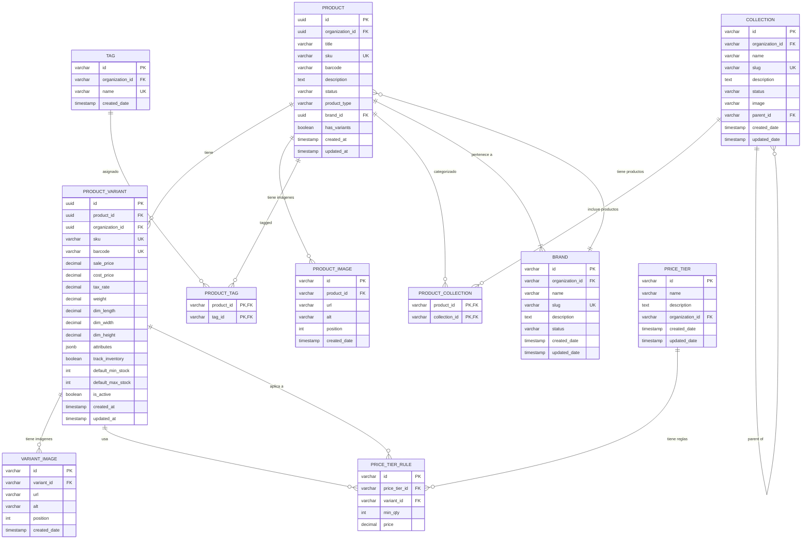

# Modelo de Datos

Modelo de datos completo del Catalog Service con todas las entidades y relaciones.

## Diagrama de Entidad-Relación Completo



## Tablas Principales

### Products

Tabla principal de productos. Representa un producto genérico que puede tener una o más variantes.

> **Nota**: Se eliminó `unit_of_measure` ya que no aplica a nivel de producto. La unidad de medida se define en las recetas (`recipe_ingredients.unit`) cuando aplica.

```sql
CREATE TABLE products (
    id UUID PRIMARY KEY DEFAULT gen_random_uuid(),
    organization_id UUID NOT NULL,

    -- Información básica
    title VARCHAR(255) NOT NULL,
    sku VARCHAR(100) NOT NULL,  -- SKU base del producto
    barcode VARCHAR(100),
    description TEXT,

    -- Clasificación
    status VARCHAR(20) DEFAULT 'active',  -- 'active', 'inactive', 'archived'
    product_type VARCHAR(100),  -- 'ropa', 'electronica', 'bebida', 'insumo', etc.
    brand_id UUID,

    -- Configuración
    has_variants BOOLEAN DEFAULT true,  -- Si tiene variantes o es producto simple
    is_composite BOOLEAN DEFAULT false,  -- Si tiene receta/BOM

    -- Timestamps
    created_at TIMESTAMP DEFAULT CURRENT_TIMESTAMP,
    updated_at TIMESTAMP DEFAULT CURRENT_TIMESTAMP,

    CONSTRAINT fk_products_brand
        FOREIGN KEY (brand_id)
        REFERENCES brands(id)
        ON DELETE SET NULL,

    CONSTRAINT uk_product_org_sku
        UNIQUE (organization_id, sku),

    CONSTRAINT chk_status CHECK (status IN ('active', 'inactive', 'archived'))
);

CREATE INDEX idx_products_org ON products(organization_id);
CREATE INDEX idx_products_status ON products(status);
CREATE INDEX idx_products_brand ON products(brand_id);
CREATE INDEX idx_products_sku ON products(sku);
CREATE INDEX idx_products_title ON products USING gin(to_tsvector('spanish', title));
CREATE INDEX idx_products_product_type ON products(product_type);
CREATE INDEX idx_products_composite ON products(is_composite) WHERE is_composite = true;
```

### Brands

Marcas comerciales de productos.

```sql
CREATE TABLE brands (
    id VARCHAR(50) PRIMARY KEY,
    organization_id VARCHAR(50) NOT NULL,
    name VARCHAR(255) NOT NULL,
    slug VARCHAR(255) NOT NULL,
    description TEXT,
    status VARCHAR(20) DEFAULT 'active',  -- 'active', 'inactive'
    created_date TIMESTAMP DEFAULT CURRENT_TIMESTAMP,
    updated_date TIMESTAMP DEFAULT CURRENT_TIMESTAMP,

    CONSTRAINT fk_brands_organization
        FOREIGN KEY (organization_id)
        REFERENCES organizations(id)
        ON DELETE CASCADE,

    CONSTRAINT uk_brand_org_slug
        UNIQUE (organization_id, slug)
);

CREATE INDEX idx_brands_org ON brands(organization_id);
CREATE INDEX idx_brands_status ON brands(status);
CREATE INDEX idx_brands_name ON brands USING gin(to_tsvector('spanish', name));
```

### Product_Images

Imágenes asociadas a productos.

```sql
CREATE TABLE product_images (
    id VARCHAR(50) PRIMARY KEY,
    product_id VARCHAR(50) NOT NULL,
    url VARCHAR(500) NOT NULL,
    alt VARCHAR(255),
    position INT DEFAULT 0,
    created_date TIMESTAMP DEFAULT CURRENT_TIMESTAMP,

    CONSTRAINT fk_product_images_product
        FOREIGN KEY (product_id)
        REFERENCES products(id)
        ON DELETE CASCADE
);

CREATE INDEX idx_product_images_product ON product_images(product_id);
CREATE INDEX idx_product_images_position ON product_images(product_id, position);
```

### Tags

Etiquetas para clasificación flexible de productos.

```sql
CREATE TABLE tags (
    id VARCHAR(50) PRIMARY KEY,
    organization_id VARCHAR(50) NOT NULL,
    name VARCHAR(100) NOT NULL,
    created_date TIMESTAMP DEFAULT CURRENT_TIMESTAMP,

    CONSTRAINT fk_tags_organization
        FOREIGN KEY (organization_id)
        REFERENCES organizations(id)
        ON DELETE CASCADE,

    CONSTRAINT uk_tag_org_name
        UNIQUE (organization_id, name)
);

CREATE INDEX idx_tags_org ON tags(organization_id);
CREATE INDEX idx_tags_name ON tags(name);
```

### Product_Tags

Relación Many-to-Many entre productos y tags.

```sql
CREATE TABLE product_tags (
    product_id VARCHAR(50) NOT NULL,
    tag_id VARCHAR(50) NOT NULL,

    PRIMARY KEY (product_id, tag_id),

    CONSTRAINT fk_product_tags_product
        FOREIGN KEY (product_id)
        REFERENCES products(id)
        ON DELETE CASCADE,

    CONSTRAINT fk_product_tags_tag
        FOREIGN KEY (tag_id)
        REFERENCES tags(id)
        ON DELETE CASCADE
);

CREATE INDEX idx_product_tags_tag ON product_tags(tag_id);
```

### Collections

Colecciones/categorías para agrupar productos.

```sql
CREATE TABLE collections (
    id VARCHAR(50) PRIMARY KEY,
    organization_id VARCHAR(50) NOT NULL,
    name VARCHAR(255) NOT NULL,
    slug VARCHAR(255) NOT NULL,
    description TEXT,
    status VARCHAR(20) DEFAULT 'activa',  -- 'activa', 'inactiva'
    image VARCHAR(500),
    parent_id VARCHAR(50),  -- Para jerarquía de categorías
    created_date TIMESTAMP DEFAULT CURRENT_TIMESTAMP,
    updated_date TIMESTAMP DEFAULT CURRENT_TIMESTAMP,

    CONSTRAINT fk_collections_organization
        FOREIGN KEY (organization_id)
        REFERENCES organizations(id)
        ON DELETE CASCADE,

    CONSTRAINT fk_collections_parent
        FOREIGN KEY (parent_id)
        REFERENCES collections(id)
        ON DELETE SET NULL,

    CONSTRAINT uk_collection_org_slug
        UNIQUE (organization_id, slug)
);

CREATE INDEX idx_collections_org ON collections(organization_id);
CREATE INDEX idx_collections_status ON collections(status);
CREATE INDEX idx_collections_parent ON collections(parent_id);
CREATE INDEX idx_collections_name ON collections USING gin(to_tsvector('spanish', name));
```

### Product_Collections

Relación Many-to-Many entre productos y colecciones.

```sql
CREATE TABLE product_collections (
    product_id VARCHAR(50) NOT NULL,
    collection_id VARCHAR(50) NOT NULL,

    PRIMARY KEY (product_id, collection_id),

    CONSTRAINT fk_product_collections_product
        FOREIGN KEY (product_id)
        REFERENCES products(id)
        ON DELETE CASCADE,

    CONSTRAINT fk_product_collections_collection
        FOREIGN KEY (collection_id)
        REFERENCES collections(id)
        ON DELETE CASCADE
);

CREATE INDEX idx_product_collections_collection ON product_collections(collection_id);
```

### Product_Variants

Variantes de productos con precios y atributos específicos.

> **Regla Fundamental**: Una variante **SIEMPRE** pertenece a un producto. No existen variantes huérfanas. La relación `product_id` es obligatoria y tiene `ON DELETE CASCADE`.

> **Stock**: Las variantes NO contienen campos de stock. El stock se gestiona en **Inventory Service** por variante + bodega. Ver [Variantes vs Stock](/arquitectura/variantes-vs-stock) para más detalles.

#### Producto Simple vs Producto con Variantes

```
┌─────────────────────────────────────────────────────────────────────────┐
│                      PRODUCTO SIMPLE                                     │
│  (has_variants = false)                                                  │
│                                                                          │
│  Producto: "Cable USB-C"                                                 │
│      └── Variante única: SKU="CABLE-USBC" (creada automáticamente)      │
└─────────────────────────────────────────────────────────────────────────┘

┌─────────────────────────────────────────────────────────────────────────┐
│                   PRODUCTO CON VARIANTES                                 │
│  (has_variants = true)                                                   │
│                                                                          │
│  Producto: "Camiseta Deportiva"                                          │
│      ├── Variante: SKU="CAM-AZUL-S"  {color: "Azul", talla: "S"}        │
│      ├── Variante: SKU="CAM-AZUL-M"  {color: "Azul", talla: "M"}        │
│      ├── Variante: SKU="CAM-AZUL-L"  {color: "Azul", talla: "L"}        │
│      ├── Variante: SKU="CAM-ROJO-S"  {color: "Rojo", talla: "S"}        │
│      ├── Variante: SKU="CAM-ROJO-M"  {color: "Rojo", talla: "M"}        │
│      └── Variante: SKU="CAM-ROJO-L"  {color: "Rojo", talla: "L"}        │
└─────────────────────────────────────────────────────────────────────────┘
```

#### Creación de Variante (siempre con producto)

```python
# ✅ CORRECTO: Crear variante asociada a producto
variant = ProductVariant(
    product_id=product.id,  # Obligatorio
    organization_id=org_id,
    sku="CAM-AZUL-M",
    sale_price=Decimal("24.99"),
    attributes={"color": "Azul", "talla": "M"}
)

# ❌ INCORRECTO: Esto fallará por constraint NOT NULL
variant = ProductVariant(
    # product_id=???  # Falta!
    sku="CAM-AZUL-M",
    sale_price=Decimal("24.99")
)
```

```sql
CREATE TABLE product_variants (
    id UUID PRIMARY KEY DEFAULT gen_random_uuid(),
    product_id UUID NOT NULL,
    organization_id UUID NOT NULL,

    -- Identificadores
    sku VARCHAR(100) NOT NULL,
    barcode VARCHAR(100) UNIQUE,  -- Código de barras único de variante

    -- Precios base (pueden ser sobreescritos por Pricing Service)
    sale_price DECIMAL(10, 2) NOT NULL,
    cost_price DECIMAL(10, 2),
    tax_rate DECIMAL(5, 2) DEFAULT 0,  -- Porcentaje de impuesto

    -- Atributos físicos
    weight DECIMAL(10, 3),  -- En kg
    dim_length DECIMAL(10, 2),  -- En cm
    dim_width DECIMAL(10, 2),
    dim_height DECIMAL(10, 2),

    -- Atributos variables (color, talla, material, etc.)
    attributes JSONB DEFAULT '{}',

    -- Configuración de inventario (valores por defecto para Inventory Service)
    track_inventory BOOLEAN DEFAULT TRUE,
    default_min_stock INT DEFAULT 10,
    default_max_stock INT DEFAULT 1000,

    -- Metadata
    is_active BOOLEAN DEFAULT TRUE,
    created_at TIMESTAMP DEFAULT CURRENT_TIMESTAMP,
    updated_at TIMESTAMP DEFAULT CURRENT_TIMESTAMP,

    CONSTRAINT fk_variants_product
        FOREIGN KEY (product_id)
        REFERENCES products(id)
        ON DELETE CASCADE,

    CONSTRAINT uk_variant_org_sku
        UNIQUE (organization_id, sku),

    CONSTRAINT chk_variant_stock_levels
        CHECK (default_min_stock >= 0 AND default_max_stock >= default_min_stock)
);

CREATE INDEX idx_variants_product ON product_variants(product_id);
CREATE INDEX idx_variants_org ON product_variants(organization_id);
CREATE INDEX idx_variants_sku ON product_variants(sku);
CREATE INDEX idx_variants_barcode ON product_variants(barcode);
CREATE INDEX idx_variants_sale_price ON product_variants(sale_price);
CREATE INDEX idx_variants_active ON product_variants(is_active);
```

#### Atributos Variables (JSONB)

Los atributos permiten definir variantes flexibles:

```json
// Ropa
{
  "color": "Azul",
  "talla": "M",
  "material": "100% Algodón"
}

// Electrónica
{
  "color": "Negro",
  "capacidad": "256GB",
  "ram": "8GB"
}

// Calzado
{
  "color": "Blanco",
  "talla": "42",
  "ancho": "Normal"
}
```

### Variant_Images

Imágenes específicas de variantes.

```sql
CREATE TABLE variant_images (
    id VARCHAR(50) PRIMARY KEY,
    variant_id VARCHAR(50) NOT NULL,
    url VARCHAR(500) NOT NULL,
    alt VARCHAR(255),
    position INT DEFAULT 0,
    created_date TIMESTAMP DEFAULT CURRENT_TIMESTAMP,

    CONSTRAINT fk_variant_images_variant
        FOREIGN KEY (variant_id)
        REFERENCES product_variants(id)
        ON DELETE CASCADE
);

CREATE INDEX idx_variant_images_variant ON variant_images(variant_id);
CREATE INDEX idx_variant_images_position ON variant_images(variant_id, position);
```

### Price_Tiers

Definición de grupos de precios por volumen.

```sql
CREATE TABLE price_tiers (
    id VARCHAR(50) PRIMARY KEY,
    organization_id VARCHAR(50) NOT NULL,
    name VARCHAR(255) NOT NULL,
    description TEXT,
    created_date TIMESTAMP DEFAULT CURRENT_TIMESTAMP,
    updated_date TIMESTAMP DEFAULT CURRENT_TIMESTAMP,

    CONSTRAINT fk_price_tiers_organization
        FOREIGN KEY (organization_id)
        REFERENCES organizations(id)
        ON DELETE CASCADE,

    CONSTRAINT uk_price_tier_org_name
        UNIQUE (organization_id, name)
);

CREATE INDEX idx_price_tiers_org ON price_tiers(organization_id);
```

### Price_Tier_Rules

Reglas específicas de precios por volumen para variantes.

```sql
CREATE TABLE price_tier_rules (
    id VARCHAR(50) PRIMARY KEY,
    price_tier_id VARCHAR(50) NOT NULL,
    variant_id VARCHAR(50) NOT NULL,
    min_qty INT NOT NULL,
    price DECIMAL(10, 2) NOT NULL,

    CONSTRAINT fk_price_tier_rules_tier
        FOREIGN KEY (price_tier_id)
        REFERENCES price_tiers(id)
        ON DELETE CASCADE,

    CONSTRAINT fk_price_tier_rules_variant
        FOREIGN KEY (variant_id)
        REFERENCES product_variants(id)
        ON DELETE CASCADE,

    CONSTRAINT uk_price_tier_rule
        UNIQUE (price_tier_id, variant_id, min_qty),

    CONSTRAINT chk_price_tier_min_qty
        CHECK (min_qty > 0)
);

CREATE INDEX idx_price_tier_rules_tier ON price_tier_rules(price_tier_id);
CREATE INDEX idx_price_tier_rules_variant ON price_tier_rules(variant_id);
CREATE INDEX idx_price_tier_rules_min_qty ON price_tier_rules(min_qty);
```

## Ejemplo de Datos Completo

### Producto: Camiseta Deportiva

```sql
-- Brand
INSERT INTO brands (id, organization_id, name, slug, description, status)
VALUES ('brand_01', 'org_123', 'SportBrand', 'sportbrand', 'Marca deportiva premium', 'active');

-- Tags
INSERT INTO tags (id, organization_id, name)
VALUES
    ('tag_deporte', 'org_123', 'Deporte'),
    ('tag_hombre', 'org_123', 'Hombre'),
    ('tag_premium', 'org_123', 'Premium');

-- Collections
INSERT INTO collections (id, organization_id, name, slug, description, status, parent_id)
VALUES
    ('col_100', 'org_123', 'Ropa Deportiva', 'ropa-deportiva', 'Colección general de ropa deportiva', 'activa', NULL),
    ('col_300', 'org_123', 'Accesorios', 'accesorios', 'Accesorios deportivos', 'activa', NULL);

-- Producto
INSERT INTO products (id, organization_id, title, sku, barcode, description, status, product_type, unit_of_measure, alert_stock, brand_id)
VALUES ('prod_2002', 'org_123', 'Camiseta Deportiva Hombre', 'TSH-MEN-2002', '9876543210987', 'Camiseta deportiva de manga corta', 'activa', 'ropa-deporte', 'unidad', 50, 'brand_01');

-- Imágenes del producto
INSERT INTO product_images (id, product_id, url, alt, position)
VALUES
    ('img_2002A', 'prod_2002', 'https://cdn.example.com/products/tsh-men-2002-front.jpg', 'Frontal', 1),
    ('img_2002B', 'prod_2002', 'https://cdn.example.com/products/tsh-men-2002-back.jpg', 'Trasera', 2);

-- Tags del producto
INSERT INTO product_tags (product_id, tag_id)
VALUES
    ('prod_2002', 'tag_deporte'),
    ('prod_2002', 'tag_hombre');

-- Collections del producto
INSERT INTO product_collections (product_id, collection_id)
VALUES
    ('prod_2002', 'col_100');

-- Variante: Azul M
INSERT INTO product_variants (
    id, product_id, organization_id, sku, barcode,
    sale_price, cost_price, tax_rate,
    weight, dim_length, dim_width, dim_height,
    attributes, track_inventory, default_min_stock, default_max_stock
)
VALUES (
    'var_2002_blue_m',
    'prod_2002',
    'org_123',
    'TSH-MEN-2002-BLUE-M',
    '7501234567890',
    24.99,
    12.50,
    12.00,
    0.25, 40, 30, 2,
    '{"color": "Azul", "talla": "M", "material": "Poliéster"}',
    TRUE,
    20,
    200
);

-- NOTA: El stock se gestiona en Inventory Service
-- Crear stock inicial en Inventory Service:
-- POST /api/v1/stock
-- {
--   "variant_id": "var_2002_blue_m",
--   "warehouse_id": "wh_02",
--   "initial_quantity": 200,
--   "min_stock": 20,
--   "max_stock": 200
-- }

-- Imagen de variante
INSERT INTO variant_images (id, variant_id, url, alt, position)
VALUES ('img_2002A1', 'var_2002_blue_m', 'https://cdn.example.com/products/tsh-men-2002-blue-m.jpg', 'Azul M', 1);

-- Price Tier
INSERT INTO price_tiers (id, organization_id, name, description)
VALUES ('tier_A', 'org_123', 'Mayorista A', 'Precios preferenciales para compras por volumen');

-- Price Tier Rules
INSERT INTO price_tier_rules (id, price_tier_id, variant_id, min_qty, price)
VALUES
    ('rule_001', 'tier_A', 'var_2002_blue_m', 1, 24.99),
    ('rule_002', 'tier_A', 'var_2002_blue_m', 10, 22.99),
    ('rule_003', 'tier_A', 'var_2002_blue_m', 50, 20.99);
```

## Queries Comunes

### Obtener Producto Completo

```sql
SELECT
    p.id,
    p.title,
    p.sku,
    p.barcode,
    p.description,
    p.status,
    p.product_type,
    p.unit_of_measure,
    p.alert_stock,
    jsonb_build_object(
        'id', b.id,
        'name', b.name,
        'slug', b.slug
    ) AS brand,
    (
        SELECT jsonb_agg(
            jsonb_build_object(
                'id', pi.id,
                'url', pi.url,
                'alt', pi.alt,
                'position', pi.position
            ) ORDER BY pi.position
        )
        FROM product_images pi
        WHERE pi.product_id = p.id
    ) AS images,
    (
        SELECT jsonb_agg(
            jsonb_build_object(
                'id', t.id,
                'name', t.name
            )
        )
        FROM product_tags pt
        JOIN tags t ON pt.tag_id = t.id
        WHERE pt.product_id = p.id
    ) AS tags,
    (
        SELECT jsonb_agg(
            jsonb_build_object(
                'id', c.id,
                'name', c.name,
                'slug', c.slug
            )
        )
        FROM product_collections pc
        JOIN collections c ON pc.collection_id = c.id
        WHERE pc.product_id = p.id
    ) AS collections,
    (
        SELECT jsonb_agg(
            jsonb_build_object(
                'id', v.id,
                'sku', v.sku,
                'barcode', v.barcode,
                'sale_price', v.sale_price,
                'cost_price', v.cost_price,
                'tax_rate', v.tax_rate,
                'weight', v.weight,
                'dimensions', jsonb_build_object(
                    'length', v.dim_length,
                    'width', v.dim_width,
                    'height', v.dim_height
                ),
                'attributes', v.attributes,
                'track_inventory', v.track_inventory,
                'is_active', v.is_active
            )
        )
        FROM product_variants v
        WHERE v.product_id = p.id AND v.is_active = true
    ) AS variants
FROM products p
LEFT JOIN brands b ON p.brand_id = b.id
WHERE p.id = $1 AND p.organization_id = $2;

-- NOTA: Para obtener stock, hacer llamada separada a Inventory Service:
-- GET /api/v1/stock?variant_ids=var_001,var_002&warehouse_id=wh_001
```

### Buscar Productos con Filtros

```sql
SELECT
    p.id,
    p.title,
    p.sku,
    p.status,
    b.name AS brand_name
FROM products p
LEFT JOIN brands b ON p.brand_id = b.id
LEFT JOIN product_collections pc ON p.id = pc.product_id
LEFT JOIN product_tags pt ON p.id = pt.product_id
WHERE p.organization_id = $1
    AND ($2::VARCHAR IS NULL OR p.status = $2)  -- filtro por status
    AND ($3::VARCHAR IS NULL OR b.id = $3)      -- filtro por brand
    AND ($4::VARCHAR IS NULL OR pc.collection_id = $4)  -- filtro por collection
    AND ($5::VARCHAR IS NULL OR pt.tag_id = $5)  -- filtro por tag
GROUP BY p.id, p.title, p.sku, p.status, b.name
ORDER BY p.updated_date DESC;
```

### Obtener Variantes con Price Tiers

```sql
SELECT
    v.*,
    (
        SELECT jsonb_agg(
            jsonb_build_object(
                'tier_id', pt.id,
                'tier_name', pt.name,
                'min_qty', ptr.min_qty,
                'price', ptr.price
            ) ORDER BY ptr.min_qty
        )
        FROM price_tier_rules ptr
        JOIN price_tiers pt ON ptr.price_tier_id = pt.id
        WHERE ptr.variant_id = v.id
    ) AS price_tiers
FROM product_variants v
WHERE v.product_id = $1;
```

## SQLAlchemy Models

### Product Model

```python
from sqlalchemy import Column, String, Text, Boolean, DateTime, ForeignKey
from sqlalchemy.dialects.postgresql import UUID
from sqlalchemy.orm import relationship
from datetime import datetime
import uuid

class Product(Base):
    """
    Producto base - puede tener una o más variantes.
    El producto define información general, las variantes definen
    atributos específicos como color, talla, y precios.
    """
    __tablename__ = "products"

    id = Column(UUID(as_uuid=True), primary_key=True, default=uuid.uuid4)
    organization_id = Column(UUID(as_uuid=True), nullable=False)

    # Información básica
    title = Column(String(255), nullable=False)
    sku = Column(String(100), nullable=False)
    barcode = Column(String(100))
    description = Column(Text)

    # Clasificación
    status = Column(String(20), default="active")
    product_type = Column(String(100))
    brand_id = Column(UUID(as_uuid=True), ForeignKey("brands.id"))

    # Configuración
    has_variants = Column(Boolean, default=True)
    is_composite = Column(Boolean, default=False)  # Tiene receta/BOM

    # Timestamps
    created_at = Column(DateTime, default=datetime.utcnow)
    updated_at = Column(DateTime, default=datetime.utcnow, onupdate=datetime.utcnow)

    # Relationships
    brand = relationship("Brand", back_populates="products")
    images = relationship("ProductImage", back_populates="product", cascade="all, delete-orphan")
    variants = relationship("ProductVariant", back_populates="product", cascade="all, delete-orphan")
    tags = relationship("Tag", secondary="product_tags", back_populates="products")
    collections = relationship("Collection", secondary="product_collections", back_populates="products")
    recipes = relationship("ProductRecipe", back_populates="product", cascade="all, delete-orphan")

    # Constraints
    __table_args__ = (
        UniqueConstraint('organization_id', 'sku', name='uk_product_org_sku'),
    )
```

### Brand Model

```python
class Brand(Base):
    __tablename__ = "brands"

    id = Column(String(50), primary_key=True)
    organization_id = Column(String(50), nullable=False)
    name = Column(String(255), nullable=False)
    slug = Column(String(255), nullable=False)
    description = Column(Text)
    status = Column(String(20), default="active")
    created_date = Column(DateTime, default=datetime.utcnow)
    updated_date = Column(DateTime, default=datetime.utcnow, onupdate=datetime.utcnow)

    # Relationships
    products = relationship("Product", back_populates="brand")
```

### ProductVariant Model

```python
from sqlalchemy import Numeric, Boolean
from sqlalchemy.dialects.postgresql import UUID, JSONB
import uuid

class ProductVariant(Base):
    """
    Variante de producto - define QUÉ se vende (atributos).
    El stock (CUÁNTO hay) se gestiona en Inventory Service.
    """
    __tablename__ = "product_variants"

    id = Column(UUID(as_uuid=True), primary_key=True, default=uuid.uuid4)
    product_id = Column(UUID(as_uuid=True), ForeignKey("products.id"), nullable=False)
    organization_id = Column(UUID(as_uuid=True), nullable=False)

    # Identificadores
    sku = Column(String(100), nullable=False)
    barcode = Column(String(100), unique=True)

    # Precios base
    sale_price = Column(Numeric(10, 2), nullable=False)
    cost_price = Column(Numeric(10, 2))
    tax_rate = Column(Numeric(5, 2), default=0)

    # Atributos físicos
    weight = Column(Numeric(10, 3))
    dim_length = Column(Numeric(10, 2))
    dim_width = Column(Numeric(10, 2))
    dim_height = Column(Numeric(10, 2))

    # Atributos variables (color, talla, etc.)
    attributes = Column(JSONB, default={})

    # Configuración para Inventory Service
    track_inventory = Column(Boolean, default=True)
    default_min_stock = Column(Integer, default=10)
    default_max_stock = Column(Integer, default=1000)

    # Metadata
    is_active = Column(Boolean, default=True)
    created_at = Column(DateTime, default=datetime.utcnow)
    updated_at = Column(DateTime, default=datetime.utcnow, onupdate=datetime.utcnow)

    # Relationships
    product = relationship("Product", back_populates="variants")
    images = relationship("VariantImage", back_populates="variant", cascade="all, delete-orphan")
    price_tier_rules = relationship("PriceTierRule", back_populates="variant")

    # Constraint: SKU único por organización
    __table_args__ = (
        UniqueConstraint('organization_id', 'sku', name='uk_variant_org_sku'),
    )
```

### Collection Model

```python
class Collection(Base):
    __tablename__ = "collections"

    id = Column(String(50), primary_key=True)
    organization_id = Column(String(50), nullable=False)
    name = Column(String(255), nullable=False)
    slug = Column(String(255), nullable=False)
    description = Column(Text)
    status = Column(String(20), default="activa")
    image = Column(String(500))
    parent_id = Column(String(50), ForeignKey("collections.id"))
    created_date = Column(DateTime, default=datetime.utcnow)
    updated_date = Column(DateTime, default=datetime.utcnow, onupdate=datetime.utcnow)

    # Relationships
    parent = relationship("Collection", remote_side=[id], backref="children")
    products = relationship("Product", secondary="product_collections", back_populates="collections")
```

### PriceTier Model

```python
class PriceTier(Base):
    __tablename__ = "price_tiers"

    id = Column(String(50), primary_key=True)
    organization_id = Column(String(50), nullable=False)
    name = Column(String(255), nullable=False)
    description = Column(Text)
    created_date = Column(DateTime, default=datetime.utcnow)
    updated_date = Column(DateTime, default=datetime.utcnow, onupdate=datetime.utcnow)

    # Relationships
    rules = relationship("PriceTierRule", back_populates="price_tier", cascade="all, delete-orphan")
```

## Recetas / BOM (Bill of Materials)

Las recetas permiten definir productos compuestos donde al vender un producto, se descuentan automáticamente sus ingredientes del inventario.

### Casos de Uso

| Tipo de Negocio | Producto Vendido | Descuento en Inventario |
|-----------------|------------------|------------------------|
| **Cafetería** | Café Latte | Café en grano, leche, vaso, tapa |
| **Restaurante** | Hamburguesa | Pan, carne, lechuga, tomate, queso |
| **Panadería** | Pan de chocolate | Harina, levadura, chocolate, mantequilla |
| **Bar** | Mojito | Ron, menta, azúcar, limón, agua mineral |

### Flujo de Venta con Receta

```
┌─────────────┐     ┌─────────────┐     ┌─────────────┐
│   Cliente   │     │  Factura    │     │ Inventario  │
│             │     │             │     │             │
│ Pide: Latte │ ──► │ 1x Latte    │ ──► │ -20g café   │
│             │     │ $3.50       │     │ -200ml leche│
│             │     │             │     │ -1 vaso     │
└─────────────┘     └─────────────┘     └─────────────┘

En la factura: Producto con precio
En inventario: Se descuentan los ingredientes
```

### Modelo de Datos

```sql
-- Tabla de recetas (producto = receta)
CREATE TABLE product_recipes (
    id UUID PRIMARY KEY DEFAULT gen_random_uuid(),
    organization_id UUID NOT NULL,
    product_id UUID NOT NULL,           -- Producto que se vende (ej: "Café Latte")
    variant_id UUID,                     -- Variante específica (opcional)
    name VARCHAR(100),                   -- Nombre descriptivo (opcional)
    yield_quantity DECIMAL(10,3) DEFAULT 1,  -- Cuántas unidades produce esta receta
    is_active BOOLEAN DEFAULT true,
    created_at TIMESTAMP DEFAULT NOW(),
    updated_at TIMESTAMP DEFAULT NOW(),

    CONSTRAINT fk_recipe_org FOREIGN KEY (organization_id) REFERENCES organizations(id),
    CONSTRAINT fk_recipe_product FOREIGN KEY (product_id) REFERENCES products(id),
    CONSTRAINT fk_recipe_variant FOREIGN KEY (variant_id) REFERENCES product_variants(id),
    CONSTRAINT uk_recipe_product UNIQUE (organization_id, product_id, variant_id)
);

-- Ingredientes de cada receta
CREATE TABLE recipe_ingredients (
    id UUID PRIMARY KEY DEFAULT gen_random_uuid(),
    recipe_id UUID NOT NULL,
    ingredient_variant_id UUID NOT NULL,  -- Variante del ingrediente a descontar
    quantity DECIMAL(10,3) NOT NULL,       -- Cantidad por unidad de producto
    unit VARCHAR(20) NOT NULL,             -- unidad, gramo, ml, etc.
    is_optional BOOLEAN DEFAULT false,     -- Si es ingrediente opcional
    waste_percentage DECIMAL(5,2) DEFAULT 0,  -- % de merma/desperdicio
    notes TEXT,

    CONSTRAINT fk_ingredient_recipe FOREIGN KEY (recipe_id) REFERENCES product_recipes(id) ON DELETE CASCADE,
    CONSTRAINT fk_ingredient_variant FOREIGN KEY (ingredient_variant_id) REFERENCES product_variants(id),
    CONSTRAINT chk_quantity_positive CHECK (quantity > 0)
);

-- Índices
CREATE INDEX idx_recipes_org ON product_recipes(organization_id);
CREATE INDEX idx_recipes_product ON product_recipes(product_id);
CREATE INDEX idx_ingredients_recipe ON recipe_ingredients(recipe_id);
CREATE INDEX idx_ingredients_variant ON recipe_ingredients(ingredient_variant_id);
```

### Ejemplo: Cafetería

```sql
-- Producto vendible: Café Latte
INSERT INTO products (id, organization_id, title, sku, product_type, status)
VALUES ('prod_latte', 'org_cafe', 'Café Latte', 'LATTE-001', 'bebida', 'activa');

-- Variante del producto (el que se vende)
INSERT INTO product_variants (id, product_id, sku, sale_price)
VALUES ('var_latte_med', 'prod_latte', 'LATTE-001-M', 3.50);

-- Ingredientes (productos de inventario)
INSERT INTO products (id, organization_id, title, sku, product_type)
VALUES
    ('prod_cafe_grano', 'org_cafe', 'Café en Grano', 'CAFE-GRANO', 'insumo'),
    ('prod_leche', 'org_cafe', 'Leche Entera', 'LECHE-001', 'insumo'),
    ('prod_vaso', 'org_cafe', 'Vaso Desechable 12oz', 'VASO-12', 'insumo');

INSERT INTO product_variants (id, product_id, sku, sale_price, cost_price)
VALUES
    ('var_cafe_kg', 'prod_cafe_grano', 'CAFE-GRANO-KG', 25.00, 18.00),
    ('var_leche_lt', 'prod_leche', 'LECHE-001-LT', 1.50, 1.00),
    ('var_vaso', 'prod_vaso', 'VASO-12-U', 0.10, 0.05);

-- Receta del Latte
INSERT INTO product_recipes (id, organization_id, product_id, variant_id, name)
VALUES ('recipe_latte', 'org_cafe', 'prod_latte', 'var_latte_med', 'Receta Café Latte Mediano');

-- Ingredientes de la receta
INSERT INTO recipe_ingredients (recipe_id, ingredient_variant_id, quantity, unit, waste_percentage)
VALUES
    ('recipe_latte', 'var_cafe_kg', 20, 'gramo', 5),      -- 20g de café (5% merma)
    ('recipe_latte', 'var_leche_lt', 200, 'ml', 2),       -- 200ml de leche (2% merma)
    ('recipe_latte', 'var_vaso', 1, 'unidad', 0);         -- 1 vaso
```

### SQLAlchemy Models

```python
from sqlalchemy import Column, String, Numeric, Boolean, ForeignKey, Text
from sqlalchemy.dialects.postgresql import UUID
from sqlalchemy.orm import relationship
import uuid

class ProductRecipe(Base):
    __tablename__ = "product_recipes"

    id = Column(UUID(as_uuid=True), primary_key=True, default=uuid.uuid4)
    organization_id = Column(UUID(as_uuid=True), nullable=False)
    product_id = Column(UUID(as_uuid=True), ForeignKey("products.id"), nullable=False)
    variant_id = Column(UUID(as_uuid=True), ForeignKey("product_variants.id"))
    name = Column(String(100))
    yield_quantity = Column(Numeric(10, 3), default=1)
    is_active = Column(Boolean, default=True)
    created_at = Column(DateTime, default=datetime.utcnow)
    updated_at = Column(DateTime, default=datetime.utcnow, onupdate=datetime.utcnow)

    # Relationships
    product = relationship("Product", back_populates="recipes")
    variant = relationship("ProductVariant")
    ingredients = relationship("RecipeIngredient", back_populates="recipe", cascade="all, delete-orphan")


class RecipeIngredient(Base):
    __tablename__ = "recipe_ingredients"

    id = Column(UUID(as_uuid=True), primary_key=True, default=uuid.uuid4)
    recipe_id = Column(UUID(as_uuid=True), ForeignKey("product_recipes.id"), nullable=False)
    ingredient_variant_id = Column(UUID(as_uuid=True), ForeignKey("product_variants.id"), nullable=False)
    quantity = Column(Numeric(10, 3), nullable=False)
    unit = Column(String(20), nullable=False)
    is_optional = Column(Boolean, default=False)
    waste_percentage = Column(Numeric(5, 2), default=0)
    notes = Column(Text)

    # Relationships
    recipe = relationship("ProductRecipe", back_populates="ingredients")
    ingredient_variant = relationship("ProductVariant")
```

### Flujo de Descuento de Inventario

Cuando se vende un producto con receta:

```python
# En POS Service - al completar venta
async def process_sale_with_recipe(
    org_id: str,
    warehouse_id: str,
    sale_items: list[SaleItem]
):
    for item in sale_items:
        # 1. Verificar si producto tiene receta
        recipe = await catalog_service.get_recipe(
            org_id=org_id,
            variant_id=item.variant_id
        )

        if recipe:
            # 2. Calcular ingredientes a descontar
            for ingredient in recipe.ingredients:
                # Cantidad = cantidad_receta * cantidad_vendida * (1 + merma%)
                qty_to_deduct = (
                    ingredient.quantity *
                    item.quantity *
                    (1 + ingredient.waste_percentage / 100)
                )

                # 3. Descontar del inventario
                await inventory_service.deduct_stock(
                    org_id=org_id,
                    warehouse_id=warehouse_id,
                    variant_id=ingredient.ingredient_variant_id,
                    quantity=qty_to_deduct,
                    reason="sale_recipe",
                    reference_id=item.transaction_id
                )
        else:
            # Producto sin receta - descontar directamente
            await inventory_service.deduct_stock(
                org_id=org_id,
                warehouse_id=warehouse_id,
                variant_id=item.variant_id,
                quantity=item.quantity,
                reason="sale",
                reference_id=item.transaction_id
            )
```

### API Endpoints

```python
# GET /api/v1/products/{product_id}/recipe
@router.get("/products/{product_id}/recipe")
async def get_product_recipe(
    product_id: str,
    variant_id: str | None = None,
    ctx: TenantContext = Depends(get_tenant_context)
) -> RecipeResponse:
    """Obtener receta de un producto."""
    return await recipe_service.get_recipe(
        org_id=ctx.organization_id,
        product_id=product_id,
        variant_id=variant_id
    )

# POST /api/v1/products/{product_id}/recipe
@router.post("/products/{product_id}/recipe")
async def create_recipe(
    product_id: str,
    recipe: RecipeCreate,
    ctx: TenantContext = Depends(get_tenant_context)
) -> RecipeResponse:
    """Crear receta para un producto."""
    return await recipe_service.create_recipe(
        org_id=ctx.organization_id,
        product_id=product_id,
        recipe=recipe
    )

# PUT /api/v1/recipes/{recipe_id}/ingredients
@router.put("/recipes/{recipe_id}/ingredients")
async def update_recipe_ingredients(
    recipe_id: str,
    ingredients: list[RecipeIngredientUpdate],
    ctx: TenantContext = Depends(get_tenant_context)
) -> RecipeResponse:
    """Actualizar ingredientes de una receta."""
    return await recipe_service.update_ingredients(
        org_id=ctx.organization_id,
        recipe_id=recipe_id,
        ingredients=ingredients
    )
```

### Schemas

```python
from pydantic import BaseModel
from decimal import Decimal

class RecipeIngredientCreate(BaseModel):
    ingredient_variant_id: str
    quantity: Decimal
    unit: str  # unidad, gramo, ml, kg, litro
    is_optional: bool = False
    waste_percentage: Decimal = Decimal("0")
    notes: str | None = None

class RecipeCreate(BaseModel):
    variant_id: str | None = None  # Si aplica a variante específica
    name: str | None = None
    yield_quantity: Decimal = Decimal("1")
    ingredients: list[RecipeIngredientCreate]

class RecipeIngredientResponse(BaseModel):
    id: str
    ingredient_variant_id: str
    ingredient_name: str
    ingredient_sku: str
    quantity: Decimal
    unit: str
    is_optional: bool
    waste_percentage: Decimal

class RecipeResponse(BaseModel):
    id: str
    product_id: str
    product_name: str
    variant_id: str | None
    variant_sku: str | None
    name: str | None
    yield_quantity: Decimal
    is_active: bool
    ingredients: list[RecipeIngredientResponse]
    total_cost: Decimal  # Suma de costos de ingredientes
```

## Próximos Pasos

- [Eventos Publicados](eventos-publicados)
- [API Products](api-products)
- [API Brands](api-brands)
- [API Collections](api-collections)
