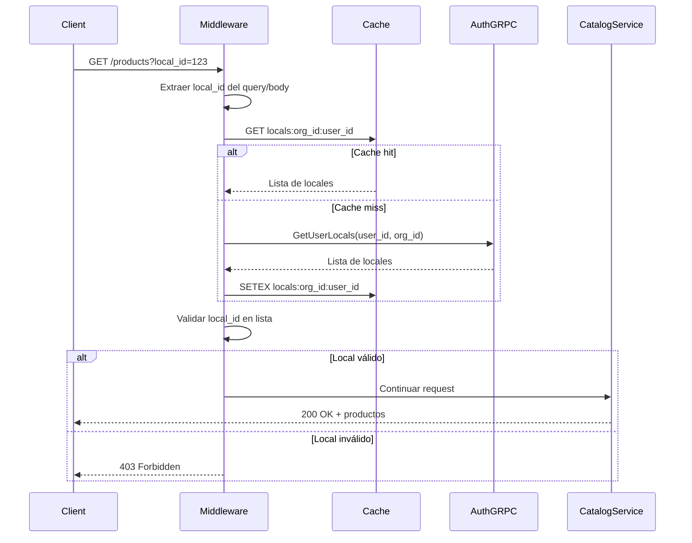

# Validación de Locales

Middleware y lógica para validar que usuarios tengan acceso a locales en operaciones del catálogo.

## Arquitectura de Validación



## Middleware de Validación

### `middlewares/local_validation.py`

```python
from fastapi import Request, HTTPException, status
from fastapi.responses import JSONResponse
from typing import Optional, List
import logging

from app.clients.auth_client import AuthClient
from app.cache.redis_client import RedisCache

logger = logging.getLogger(__name__)


class LocalValidationMiddleware:
    """
    Middleware para validar acceso a locales.

    Verifica que el usuario tenga permisos sobre el local solicitado.
    """

    def __init__(
        self,
        auth_client: AuthClient,
        cache: RedisCache
    ):
        self.auth_client = auth_client
        self.cache = cache

    async def __call__(self, request: Request, call_next):
        """Ejecutar validación de local."""

        # Extraer datos del request
        user_id = request.state.user_id  # Seteado por auth middleware
        org_id = request.state.organization_id

        # Extraer local_id del request
        local_id = await self._extract_local_id(request)

        if local_id:
            # Validar acceso al local
            has_access = await self.validate_local_access(
                user_id=user_id,
                org_id=org_id,
                local_id=local_id
            )

            if not has_access:
                logger.warning(
                    f"Usuario {user_id} intentó acceder a local {local_id} sin permisos",
                    extra={"organization_id": org_id}
                )
                return JSONResponse(
                    status_code=status.HTTP_403_FORBIDDEN,
                    content={
                        "detail": "No tienes acceso a este local",
                        "error_code": "LOCAL_ACCESS_DENIED"
                    }
                )

            # Guardar en request state para uso posterior
            request.state.local_id = local_id

        response = await call_next(request)
        return response

    async def _extract_local_id(self, request: Request) -> Optional[str]:
        """
        Extraer local_id del request.

        Busca en:
        1. Query parameters (?local_id=xxx)
        2. Path parameters (/locals/{local_id}/products)
        3. Request body (JSON)
        """
        # 1. Query parameters
        local_id = request.query_params.get("local_id")
        if local_id:
            return local_id

        # 2. Path parameters
        if "local_id" in request.path_params:
            return request.path_params["local_id"]

        # 3. Request body (solo para POST/PUT/PATCH)
        if request.method in ["POST", "PUT", "PATCH"]:
            try:
                body = await request.json()
                if "local_id" in body:
                    return body["local_id"]
            except Exception:
                pass

        return None

    async def validate_local_access(
        self,
        user_id: str,
        org_id: str,
        local_id: str
    ) -> bool:
        """
        Validar que usuario tenga acceso al local.

        Args:
            user_id: ID del usuario
            org_id: ID de la organización
            local_id: ID del local a validar

        Returns:
            True si tiene acceso, False en caso contrario
        """
        # Obtener locales del usuario (con cache)
        user_locals = await self.get_user_locals(user_id, org_id)

        # Verificar si local_id está en la lista
        return local_id in user_locals

    async def get_user_locals(
        self,
        user_id: str,
        org_id: str
    ) -> List[str]:
        """
        Obtener lista de locales del usuario.

        Usa cache de Redis con TTL de 1 hora.
        """
        cache_key = f"locals:{org_id}:{user_id}"

        # Intentar obtener del cache
        cached = await self.cache.get(cache_key)
        if cached:
            logger.debug(f"Cache hit para locales de usuario {user_id}")
            return cached

        # Cache miss - consultar Auth Service vía gRPC
        logger.debug(f"Cache miss - consultando Auth Service para usuario {user_id}")

        try:
            user_locals = await self.auth_client.get_user_locals(
                user_id=user_id,
                org_id=org_id
            )

            # Guardar en cache (1 hora)
            await self.cache.set(
                key=cache_key,
                value=user_locals,
                ttl=3600
            )

            return user_locals

        except Exception as e:
            logger.error(f"Error obteniendo locales de usuario: {e}")
            # En caso de error, denegar acceso
            return []
```

## Dependency Injection

### `dependencies.py`

```python
from fastapi import Depends, HTTPException, status
from typing import Optional

from app.middlewares.local_validation import LocalValidationMiddleware
from app.clients.auth_client import get_auth_client
from app.cache.redis_client import get_redis_cache


async def get_local_validator(
    auth_client = Depends(get_auth_client),
    cache = Depends(get_redis_cache)
) -> LocalValidationMiddleware:
    """Dependency para obtener validator de locales."""
    return LocalValidationMiddleware(auth_client, cache)


async def validate_local_access(
    local_id: str,
    request: Request,
    validator: LocalValidationMiddleware = Depends(get_local_validator)
) -> str:
    """
    Dependency para validar acceso a local específico.

    Usage:
        @app.get("/products")
        async def get_products(
            local_id: str = Depends(validate_local_access)
        ):
            ...
    """
    user_id = request.state.user_id
    org_id = request.state.organization_id

    has_access = await validator.validate_local_access(
        user_id=user_id,
        org_id=org_id,
        local_id=local_id
    )

    if not has_access:
        raise HTTPException(
            status_code=status.HTTP_403_FORBIDDEN,
            detail="No tienes acceso a este local"
        )

    return local_id
```

## Uso en Endpoints

### Opción 1: Dependency en Endpoint

```python
from fastapi import APIRouter, Depends
from app.dependencies import validate_local_access

router = APIRouter()

@router.get("/products")
async def get_products(
    local_id: str = Depends(validate_local_access),
    product_service: ProductService = Depends()
):
    """
    Listar productos de un local.

    El dependency validate_local_access ya verificó el acceso.
    """
    products = await product_service.get_by_local(local_id)
    return products
```

### Opción 2: Validación Manual en Service Layer

```python
from app.clients.auth_client import AuthClient

class ProductService:
    def __init__(
        self,
        product_repo: ProductRepository,
        auth_client: AuthClient
    ):
        self.product_repo = product_repo
        self.auth_client = auth_client

    async def create_product(
        self,
        product_data: ProductCreate,
        user_id: str,
        org_id: str
    ):
        """Crear producto con validación de local."""

        # Validar local_id si viene en los datos
        if product_data.local_id:
            await self._validate_local_access(
                user_id=user_id,
                org_id=org_id,
                local_id=product_data.local_id
            )

        return await self.product_repo.create(product_data, org_id)

    async def _validate_local_access(
        self,
        user_id: str,
        org_id: str,
        local_id: str
    ):
        """Validar acceso a local."""
        user_locals = await self.auth_client.get_user_locals(user_id, org_id)

        if local_id not in user_locals:
            raise HTTPException(
                status_code=403,
                detail=f"No tienes acceso al local {local_id}"
            )
```

## Cache de Locales

### Estrategia de Invalidación

```python
class LocalCacheManager:
    """Gestor de cache para locales."""

    def __init__(self, cache: RedisCache):
        self.cache = cache

    async def invalidate_user_locals(
        self,
        user_id: str,
        org_id: str
    ):
        """Invalidar cache de locales de un usuario."""
        cache_key = f"locals:{org_id}:{user_id}"
        await self.cache.delete(cache_key)

    async def invalidate_org_locals(self, org_id: str):
        """Invalidar cache de todos los usuarios de una org."""
        pattern = f"locals:{org_id}:*"
        await self.cache.delete_pattern(pattern)
```

### Sincronización con Eventos

```python
# En event handlers (eventos-consumidos.md)

async def handle_local_created(event: dict):
    """Invalidar cache cuando se crea un local."""
    org_id = event["payload"]["organization_id"]
    await cache_manager.invalidate_org_locals(org_id)

async def handle_user_locals_updated(event: dict):
    """Invalidar cache cuando cambian locales de usuario."""
    user_id = event["payload"]["user_id"]
    org_id = event["payload"]["organization_id"]
    await cache_manager.invalidate_user_locals(user_id, org_id)
```

## Testing

### Unit Test

```python
import pytest
from unittest.mock import Mock, AsyncMock

@pytest.mark.asyncio
async def test_validate_local_access_allowed():
    """Test de validación exitosa de local."""

    # Mock del auth client
    auth_client = Mock()
    auth_client.get_user_locals = AsyncMock(
        return_value=["local-1", "local-2", "local-3"]
    )

    # Mock del cache
    cache = Mock()
    cache.get = AsyncMock(return_value=None)
    cache.set = AsyncMock()

    # Crear validator
    validator = LocalValidationMiddleware(auth_client, cache)

    # Validar acceso
    has_access = await validator.validate_local_access(
        user_id="user-123",
        org_id="org-456",
        local_id="local-2"
    )

    assert has_access is True

@pytest.mark.asyncio
async def test_validate_local_access_denied():
    """Test de validación denegada."""

    auth_client = Mock()
    auth_client.get_user_locals = AsyncMock(
        return_value=["local-1", "local-2"]
    )

    cache = Mock()
    cache.get = AsyncMock(return_value=None)

    validator = LocalValidationMiddleware(auth_client, cache)

    has_access = await validator.validate_local_access(
        user_id="user-123",
        org_id="org-456",
        local_id="local-999"  # No está en la lista
    )

    assert has_access is False
```

## Logs y Monitoreo

```python
import structlog

logger = structlog.get_logger()

# Log de acceso permitido
logger.info(
    "local_access_granted",
    user_id=user_id,
    organization_id=org_id,
    local_id=local_id,
    cache_hit=True
)

# Log de acceso denegado
logger.warning(
    "local_access_denied",
    user_id=user_id,
    organization_id=org_id,
    local_id=local_id,
    reason="local_not_in_user_list"
)
```

## Métricas

```python
from prometheus_client import Counter, Histogram

# Contador de validaciones
local_validations = Counter(
    "catalog_local_validations_total",
    "Total de validaciones de local",
    ["result"]  # allowed, denied
)

# Latencia de validación
local_validation_duration = Histogram(
    "catalog_local_validation_duration_seconds",
    "Duración de validaciones de local"
)

# Uso
with local_validation_duration.time():
    has_access = await validate_local_access(...)

if has_access:
    local_validations.labels(result="allowed").inc()
else:
    local_validations.labels(result="denied").inc()
```

## Próximos Pasos

- [Auth Client gRPC](/microservicios/catalog-service/auth-client-grpc)
- [Eventos Consumidos](/microservicios/catalog-service/eventos-consumidos)
- [Cache Strategy](/microservicios/catalog-service/cache-strategy)
