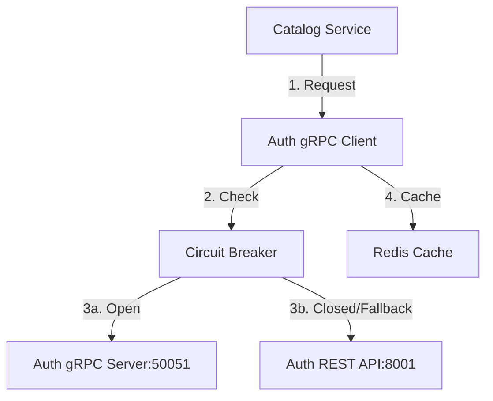

# Auth Client gRPC

Cliente gRPC para comunicación con Auth Service con Circuit Breaker y fallback a REST.

## Arquitectura



## Proto Definitions

### `protos/auth_service.proto`

```protobuf
syntax = "proto3";

package auth;

service AuthService {
  rpc VerifyToken(VerifyTokenRequest) returns (VerifyTokenResponse);
  rpc GetUserPermissions(GetUserPermissionsRequest) returns (GetUserPermissionsResponse);
  rpc GetUserLocals(GetUserLocalsRequest) returns (GetUserLocalsResponse);
  rpc GetOrganization(GetOrganizationRequest) returns (GetOrganizationResponse);
}

message VerifyTokenRequest {
  string token = 1;
}

message VerifyTokenResponse {
  string user_id = 1;
  string organization_id = 2;
  string email = 3;
  bool is_active = 4;
  repeated string permissions = 5;
  repeated string locals = 6;
}

message GetUserPermissionsRequest {
  string user_id = 1;
  string organization_id = 2;
}

message GetUserPermissionsResponse {
  repeated string permissions = 1;
}

message GetUserLocalsRequest {
  string user_id = 1;
  string organization_id = 2;
}

message GetUserLocalsResponse {
  repeated string local_ids = 1;
}

message GetOrganizationRequest {
  string organization_id = 1;
}

message GetOrganizationResponse {
  string id = 1;
  string name = 2;
  string plan = 3;
  bool is_active = 4;
  repeated string modules = 5;
}
```

## Implementación del Cliente

### `clients/auth_client.py`

```python
import grpc
import httpx
from typing import List, Optional
from datetime import datetime, timedelta
import logging

from protos import auth_service_pb2, auth_service_pb2_grpc
from config.settings import settings
from app.cache.redis_client import RedisCache

logger = logging.getLogger(__name__)


class CircuitBreaker:
    """Circuit Breaker para gRPC."""

    def __init__(
        self,
        failure_threshold: int = 5,
        timeout: int = 60,
        recovery_timeout: int = 30
    ):
        self.failure_threshold = failure_threshold
        self.timeout = timeout
        self.recovery_timeout = recovery_timeout
        self.failures = 0
        self.last_failure_time = None
        self.state = "CLOSED"  # CLOSED, OPEN, HALF_OPEN

    def call(self, func):
        """Ejecutar función con circuit breaker."""
        if self.state == "OPEN":
            # Verificar si es hora de intentar recuperación
            if datetime.now() - self.last_failure_time > timedelta(
                seconds=self.recovery_timeout
            ):
                self.state = "HALF_OPEN"
                logger.info("Circuit Breaker: HALF_OPEN - intentando recuperación")
            else:
                raise Exception("Circuit Breaker is OPEN")

        try:
            result = func()
            # Éxito - resetear contador
            if self.state == "HALF_OPEN":
                self.state = "CLOSED"
                logger.info("Circuit Breaker: CLOSED - recuperado")
            self.failures = 0
            return result

        except Exception as e:
            self.failures += 1
            self.last_failure_time = datetime.now()

            if self.failures >= self.failure_threshold:
                self.state = "OPEN"
                logger.error(f"Circuit Breaker: OPEN - {self.failures} fallos")

            raise


class AuthClient:
    """Cliente para comunicación con Auth Service."""

    def __init__(self, cache: RedisCache):
        self.cache = cache
        self.grpc_channel = None
        self.grpc_stub = None
        self.circuit_breaker = CircuitBreaker(
            failure_threshold=settings.circuit_breaker_failure_threshold,
            timeout=settings.circuit_breaker_timeout,
            recovery_timeout=settings.circuit_breaker_recovery_timeout
        )
        self._setup_grpc()

    def _setup_grpc(self):
        """Configurar canal gRPC."""
        grpc_address = f"{settings.auth_grpc_host}:{settings.auth_grpc_port}"
        self.grpc_channel = grpc.aio.insecure_channel(grpc_address)
        self.grpc_stub = auth_service_pb2_grpc.AuthServiceStub(self.grpc_channel)

    async def verify_token(self, token: str) -> dict:
        """Verificar token JWT."""
        cache_key = f"token_verify:{token[:20]}"

        # Intentar cache
        cached = await self.cache.get(cache_key)
        if cached:
            return cached

        try:
            # Intentar gRPC
            result = await self._verify_token_grpc(token)
        except Exception as e:
            logger.warning(f"gRPC failed, usando REST fallback: {e}")
            result = await self._verify_token_rest(token)

        # Guardar en cache (5 minutos)
        await self.cache.set(cache_key, result, ttl=300)
        return result

    async def _verify_token_grpc(self, token: str) -> dict:
        """Verificar token vía gRPC."""
        request = auth_service_pb2.VerifyTokenRequest(token=token)

        def call():
            return self.grpc_stub.VerifyToken(
                request,
                timeout=settings.auth_grpc_timeout
            )

        response = await self.circuit_breaker.call(call)

        return {
            "user_id": response.user_id,
            "organization_id": response.organization_id,
            "email": response.email,
            "is_active": response.is_active,
            "permissions": list(response.permissions),
            "locals": list(response.locals)
        }

    async def _verify_token_rest(self, token: str) -> dict:
        """Verificar token vía REST (fallback)."""
        async with httpx.AsyncClient() as client:
            response = await client.post(
                f"{settings.auth_rest_url}/auth/verify",
                json={"token": token},
                timeout=settings.auth_rest_timeout
            )
            response.raise_for_status()
            return response.json()

    async def get_user_locals(
        self,
        user_id: str,
        org_id: str
    ) -> List[str]:
        """Obtener locales del usuario."""
        cache_key = f"locals:{org_id}:{user_id}"

        # Intentar cache
        cached = await self.cache.get(cache_key)
        if cached:
            return cached

        try:
            # Intentar gRPC
            locals = await self._get_user_locals_grpc(user_id, org_id)
        except Exception as e:
            logger.warning(f"gRPC failed, usando REST fallback: {e}")
            locals = await self._get_user_locals_rest(user_id, org_id)

        # Guardar en cache (1 hora)
        await self.cache.set(cache_key, locals, ttl=3600)
        return locals

    async def _get_user_locals_grpc(
        self,
        user_id: str,
        org_id: str
    ) -> List[str]:
        """Obtener locales vía gRPC."""
        request = auth_service_pb2.GetUserLocalsRequest(
            user_id=user_id,
            organization_id=org_id
        )

        def call():
            return self.grpc_stub.GetUserLocals(
                request,
                timeout=settings.auth_grpc_timeout
            )

        response = await self.circuit_breaker.call(call)
        return list(response.local_ids)

    async def _get_user_locals_rest(
        self,
        user_id: str,
        org_id: str
    ) -> List[str]:
        """Obtener locales vía REST (fallback)."""
        async with httpx.AsyncClient() as client:
            response = await client.get(
                f"{settings.auth_rest_url}/api/v1/users/{user_id}/locals",
                headers={"X-Tenant-ID": org_id},
                timeout=settings.auth_rest_timeout
            )
            response.raise_for_status()
            data = response.json()
            return [local["id"] for local in data["locals"]]

    async def close(self):
        """Cerrar canal gRPC."""
        if self.grpc_channel:
            await self.grpc_channel.close()
```

## Dependency Injection

```python
from functools import lru_cache
from app.cache.redis_client import get_redis_cache

@lru_cache()
def get_auth_client(cache: RedisCache = Depends(get_redis_cache)) -> AuthClient:
    """Dependency para obtener Auth Client."""
    return AuthClient(cache)
```

## Retry Logic

```python
from tenacity import retry, stop_after_attempt, wait_exponential

@retry(
    stop=stop_after_attempt(3),
    wait=wait_exponential(multiplier=1, min=2, max=10)
)
async def verify_token_with_retry(auth_client: AuthClient, token: str):
    """Verificar token con reintentos."""
    return await auth_client.verify_token(token)
```

## Testing

```python
import pytest
from unittest.mock import Mock, AsyncMock, patch

@pytest.mark.asyncio
async def test_verify_token_grpc_success():
    """Test de verificación de token exitosa vía gRPC."""
    cache = Mock()
    cache.get = AsyncMock(return_value=None)
    cache.set = AsyncMock()

    client = AuthClient(cache)

    # Mock gRPC response
    mock_response = Mock()
    mock_response.user_id = "user-123"
    mock_response.organization_id = "org-456"
    mock_response.is_active = True

    with patch.object(client.grpc_stub, 'VerifyToken', return_value=mock_response):
        result = await client.verify_token("token-abc")

    assert result["user_id"] == "user-123"
    assert result["organization_id"] == "org-456"

@pytest.mark.asyncio
async def test_verify_token_fallback_to_rest():
    """Test de fallback a REST cuando gRPC falla."""
    cache = Mock()
    cache.get = AsyncMock(return_value=None)

    client = AuthClient(cache)

    # Simular fallo de gRPC
    with patch.object(client.grpc_stub, 'VerifyToken', side_effect=Exception("gRPC error")):
        # Mock REST response
        with patch('httpx.AsyncClient.post') as mock_post:
            mock_post.return_value.json.return_value = {"user_id": "user-123"}
            result = await client.verify_token("token-abc")

    assert result["user_id"] == "user-123"
```

## Próximos Pasos

- [Validación de Locales](/microservicios/catalog-service/validacion-locales)
- [API Products](/microservicios/catalog-service/api-products)
- [Cache Strategy](/microservicios/catalog-service/cache-strategy)
