# Flujos de Negocio

Diagramas de flujos principales del Catalog Service.

## Flujo de Creación de Producto

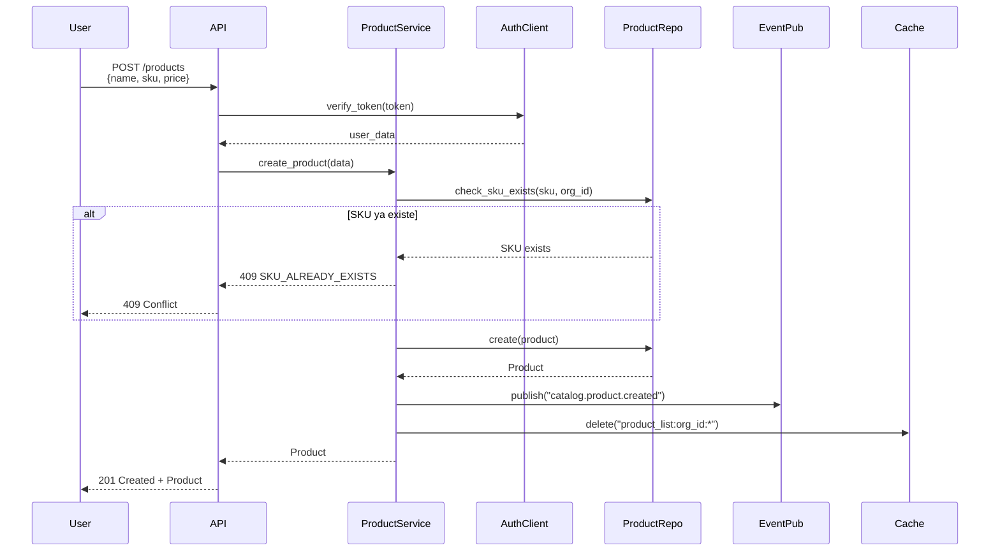

## Flujo de Consulta con Cache

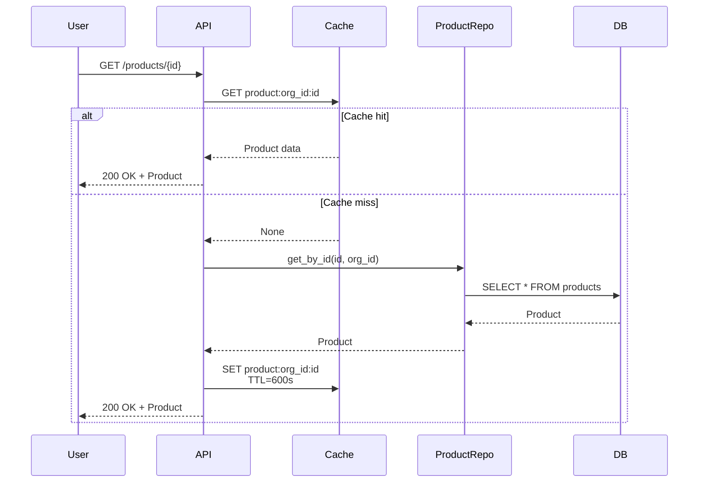

## Flujo de Creación de Variantes

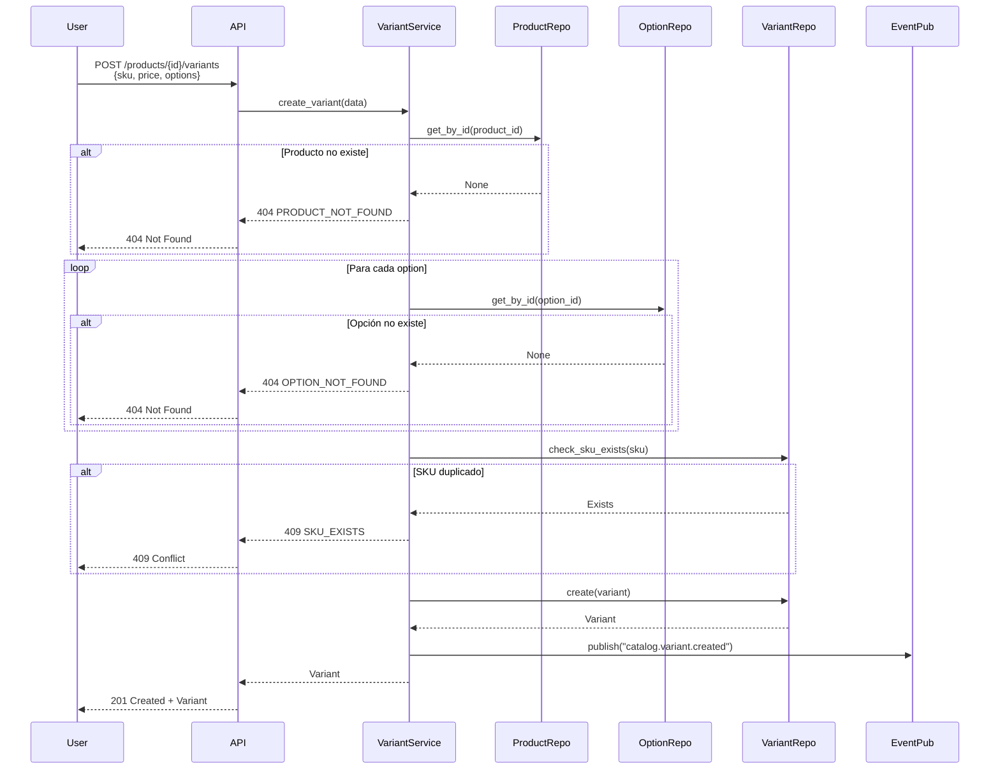

## Flujo de Validación de Local

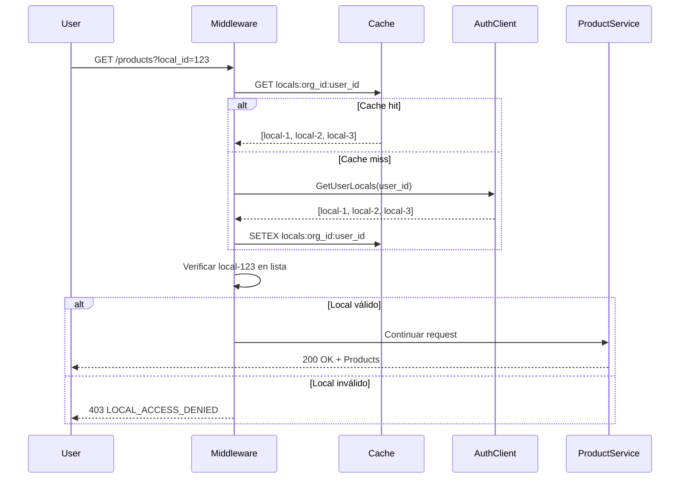

## Flujo de Consumo de Eventos

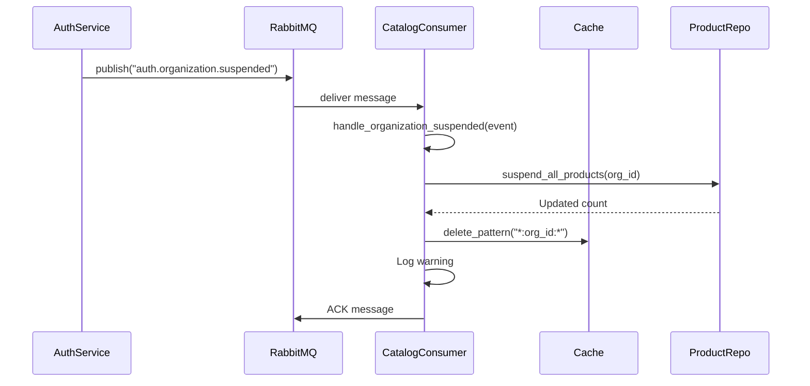

## Flujo de Creación de Brand

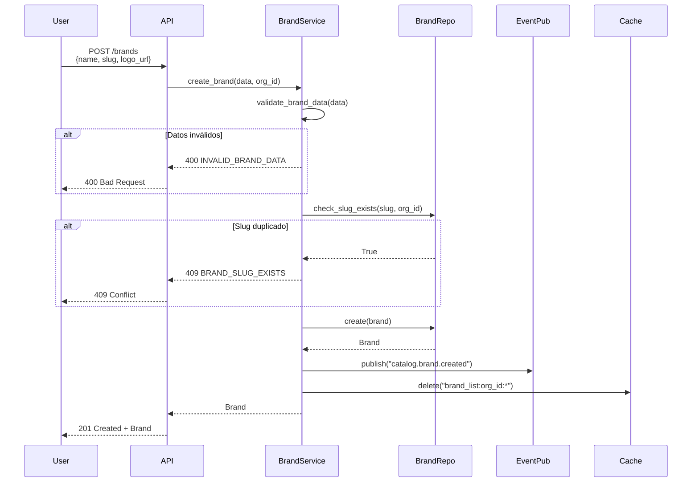

## Flujo de Jerarquía de Collections

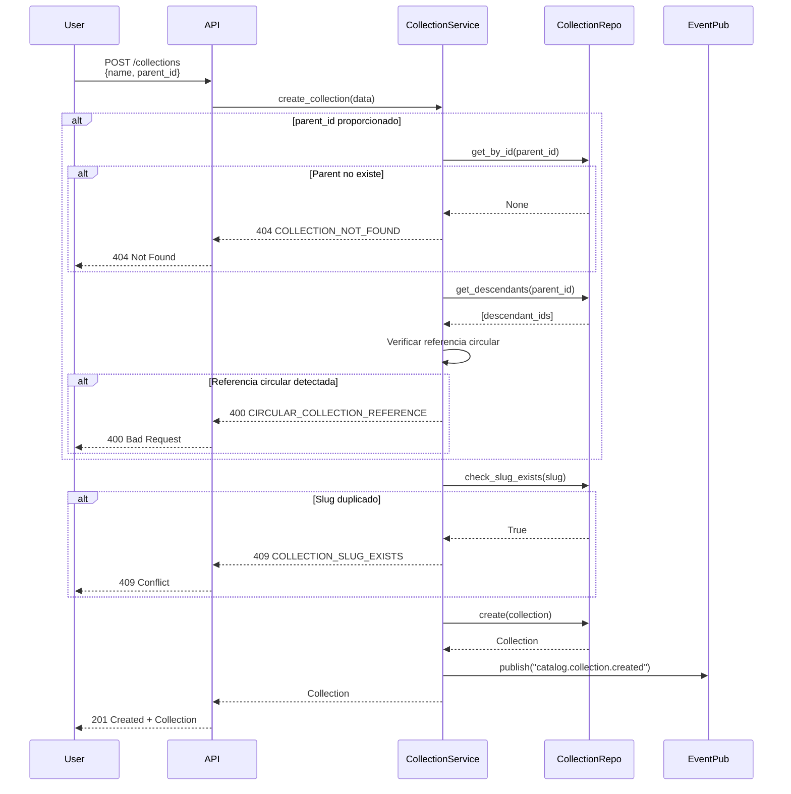

## Flujo de Asignación de Tags

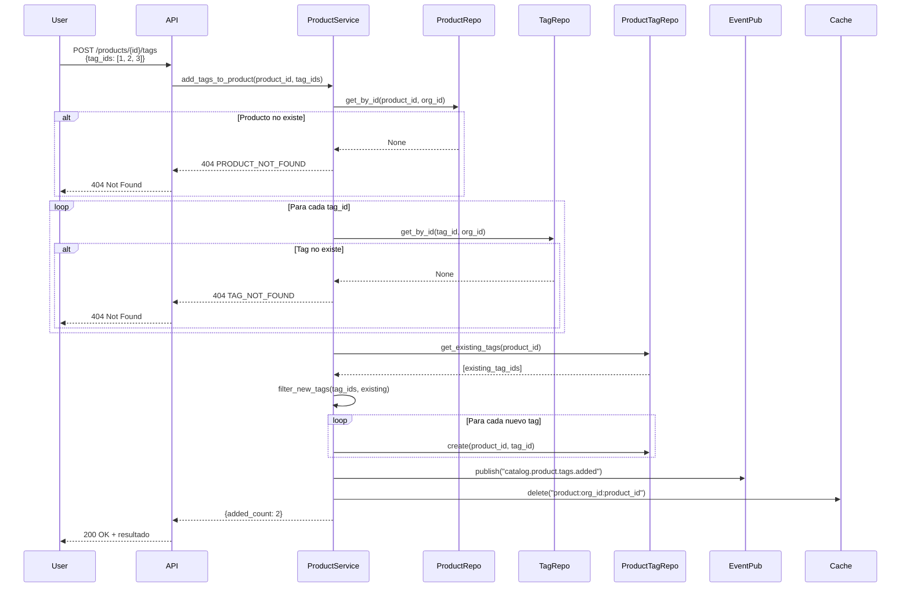

## Flujo de Cálculo de Price Tier

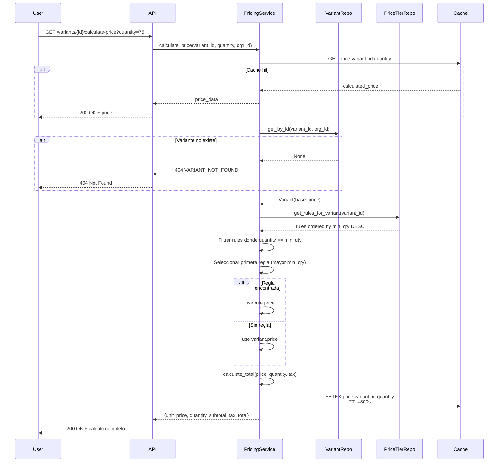

## Flujo de Upload de Imagen

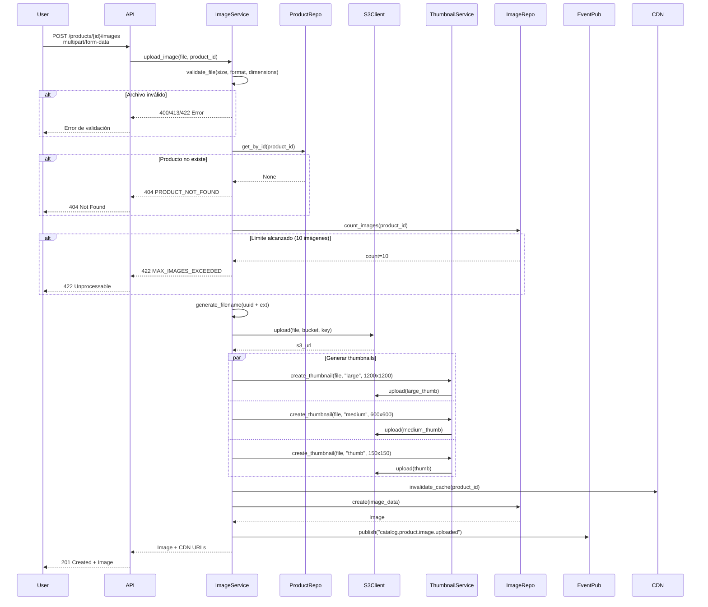

## Flujo de Reordenamiento de Imágenes

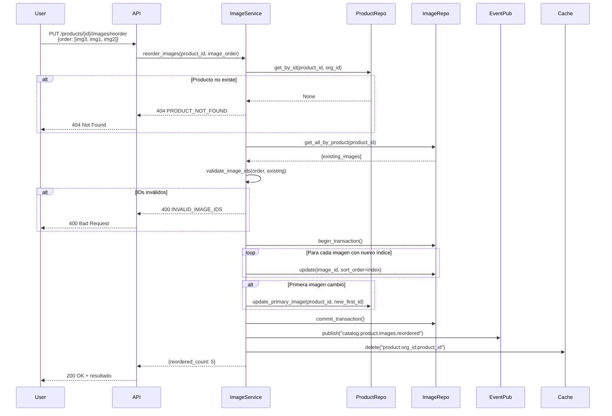

## Mejores Prácticas

### Validación de Integridad

```python
# Validar referencias circulares en colecciones
def check_circular_reference(collection_id: UUID, parent_id: UUID) -> bool:
    visited = set()
    current = parent_id

    while current:
        if current == collection_id:
            return True  # Circular reference detected
        if current in visited:
            break
        visited.add(current)
        current = get_parent_id(current)

    return False
```

### Optimización de Consultas

```python
# Usar selectinload para evitar N+1 en relaciones
from sqlalchemy.orm import selectinload

products = db.query(Product)\
    .options(
        selectinload(Product.brand),
        selectinload(Product.tags),
        selectinload(Product.images)
    )\
    .filter(Product.organization_id == org_id)\
    .all()
```

### Manejo de Transacciones

```python
# Reordenamiento atómico de imágenes
async def reorder_images(product_id: UUID, image_order: list[UUID]):
    async with db.begin():  # Transaction context
        for index, image_id in enumerate(image_order):
            await db.execute(
                update(ProductImage)
                .where(ProductImage.image_id == image_id)
                .values(sort_order=index)
            )

        # Actualizar imagen principal si cambió
        first_image = image_order[0]
        await update_primary_image(product_id, first_image)
```

### Cache con Invalidación Inteligente

```python
# Invalidar solo caches relacionadas
async def invalidate_product_caches(product_id: UUID, org_id: UUID):
    patterns = [
        f"product:{org_id}:{product_id}",
        f"product_list:{org_id}:*",
        f"collection_products:{org_id}:*",
    ]

    for pattern in patterns:
        await cache.delete_pattern(pattern)
```

## Próximos Pasos

- [Eventos Publicados](/microservicios/catalog-service/eventos-publicados)
- [Eventos Consumidos](/microservicios/catalog-service/eventos-consumidos)
- [Arquitectura](/microservicios/catalog-service/arquitectura)
