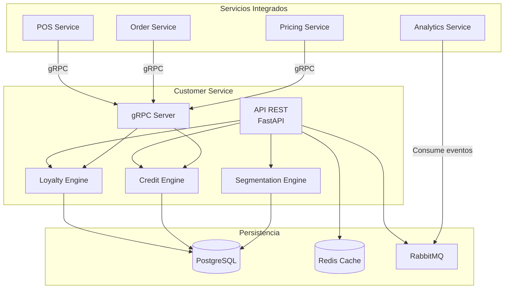

# Overview - Customer Service

## Descripción

El **Customer Service** es el microservicio encargado de gestionar toda la información de clientes, programas de lealtad, y crédito comercial en el ERP zenLogic. Proporciona una visión 360° del cliente para personalizar la experiencia de compra y fomentar la fidelización.

## Características Principales

### Funcionalidades Core

- **Gestión de Clientes**: CRUD completo de información de clientes (B2C y B2B)
- **Programa de Lealtad**: Acumulación y redención de puntos, niveles de membresía
- **Crédito Comercial**: Gestión de líneas de crédito para clientes B2B
- **Segmentación**: Clasificación automática de clientes por comportamiento
- **Historial de Compras**: Vista consolidada de todas las transacciones
- **Preferencias**: Canales favoritos, categorías de interés, restricciones
- **Direcciones**: Gestión de múltiples direcciones de envío y facturación

### Lo que NO incluye

- **No gestiona autenticación**: Eso es responsabilidad del Auth Service
- **No procesa pagos**: Solo registra información de crédito disponible
- **No crea órdenes**: Solo proporciona información para otros servicios
- **No envía notificaciones directamente**: Publica eventos para Notification Service

## Casos de Uso por Tipo de Negocio

### Supermercado
- Programa de lealtad con tarjeta de puntos
- Mayoría de ventas anónimas, pero clientes frecuentes acumulan beneficios
- Promociones personalizadas basadas en historial

### Ferretería B2B
- Gestión de crédito comercial para constructoras
- Límites de crédito personalizados
- Condiciones de pago especiales (30, 60, 90 días)
- Descuentos por volumen

### Cafetería
- Programa de lealtad simple
- Compra 10 cafés, obtén 1 gratis
- Personalización de pedidos favoritos

### Distribuidora
- Clientes exclusivamente B2B
- Crédito comercial complejo
- Historial de órdenes por cliente
- Rutas asignadas por vendedor

## Arquitectura de Alto Nivel



## Responsabilidades

### Responsabilidad Principal
Gestionar el ciclo de vida completo de clientes, desde su registro hasta su fidelización y retención.

### Responsabilidades Secundarias

1. **Gestión de Clientes**
   - Crear, actualizar, buscar clientes
   - Validar información (email, teléfono, documento)
   - Gestionar direcciones múltiples
   - Sincronizar con sistemas externos (CRM)

2. **Programa de Lealtad**
   - Acumular puntos por compras
   - Redimir puntos por descuentos
   - Gestionar niveles de membresía (Bronze, Silver, Gold, Platinum)
   - Calcular beneficios por nivel

3. **Crédito Comercial**
   - Aprobar líneas de crédito
   - Validar disponibilidad de crédito
   - Registrar uso de crédito
   - Gestionar pagos y saldos

4. **Segmentación**
   - Clasificar clientes por comportamiento
   - RFM (Recency, Frequency, Monetary)
   - Identificar clientes VIP
   - Detectar riesgo de abandono

5. **Historial y Analytics**
   - Consolidar historial de compras
   - Calcular métricas clave (LTV, AOV, frecuencia)
   - Generar insights de comportamiento

## Integraciones

### Consume de (gRPC)

| Servicio | Método | Propósito |
|----------|--------|-----------|
| **Order Service** | `GetOrdersByCustomer()` | Obtener historial de compras |
| **Auth Service** | `VerifyToken()` | Validar autenticación |

### Expone (gRPC)

| Método | Consumidores | Propósito |
|--------|--------------|-----------|
| `GetCustomer()` | POS, Order, Pricing | Obtener info de cliente |
| `AddLoyaltyPoints()` | POS, Order | Acumular puntos |
| `RedeemLoyaltyPoints()` | POS, Pricing | Redimir puntos |
| `CheckCreditAvailability()` | Order | Validar crédito disponible |
| `UseCreditLimit()` | Order | Usar crédito aprobado |
| `GetCustomerSegment()` | Pricing, Marketing | Obtener segmento del cliente |

### Publica Eventos (RabbitMQ)

| Evento | Exchange | Cuándo |
|--------|----------|--------|
| `customer.created` | `customer_events` | Nuevo cliente registrado |
| `customer.updated` | `customer_events` | Información actualizada |
| `customer.deleted` | `customer_events` | Cliente eliminado |
| `loyalty.points.earned` | `customer_events` | Puntos acumulados |
| `loyalty.points.redeemed` | `customer_events` | Puntos canjeados |
| `loyalty.tier.upgraded` | `customer_events` | Cliente sube de nivel |
| `credit.approved` | `customer_events` | Crédito aprobado |
| `credit.used` | `customer_events` | Crédito utilizado |
| `credit.limit.exceeded` | `customer_events` | Límite de crédito excedido |
| `customer.segment.changed` | `customer_events` | Segmento actualizado |

### Consume Eventos (RabbitMQ)

| Evento | Acción |
|--------|--------|
| `order.completed` | Actualizar historial de compras, calcular métricas |
| `pos.transaction.completed` | Actualizar puntos, registrar actividad |
| `payment.received` | Liberar crédito utilizado |

## Stack Tecnológico

- **Runtime**: Python 3.11+
- **Framework**: FastAPI 0.104+
- **Base de Datos**: PostgreSQL 15+ (con Row-Level Security)
- **Cache**: Redis 7.0+
- **Message Broker**: RabbitMQ 3.12+
- **Comunicación**: gRPC para servicios internos
- **ORM**: SQLAlchemy 2.0 (async)
- **Validación**: Pydantic v2

## Puerto y Configuración

- **Puerto**: 8007
- **gRPC Puerto**: 50007
- **Base URL**: `http://localhost:8007`
- **Health Check**: `GET /health`
- **Metrics**: `GET /metrics`
- **Docs API**: `http://localhost:8007/docs`

## Métricas Clave (KPIs)

- **Clientes activos**: Clientes con compras en últimos 90 días
- **Tasa de retención**: % clientes que regresan
- **Customer Lifetime Value (LTV)**: Valor promedio por cliente
- **Puntos de lealtad emitidos vs redimidos**: Ratio de uso
- **Crédito utilizado vs disponible**: % de uso de crédito

## Casos de Uso Críticos

### 1. Compra con Acumulación de Puntos

```
Usuario: Cliente en POS
Flujo:
1. Cliente proporciona número de teléfono
2. Cajera busca cliente en el sistema
3. Cliente confirma identidad
4. Se procesa la venta normalmente
5. Al completar venta, POS llama a Customer Service
6. Customer Service acumula puntos (1 punto por $1)
7. Si el cliente sube de nivel, se notifica
8. Cliente recibe confirmación de puntos acumulados
```

### 2. Redención de Puntos

```
Usuario: Cliente en POS
Flujo:
1. Cliente quiere usar sus puntos
2. Cajera consulta saldo de puntos
3. Cliente elige cuántos puntos usar
4. Customer Service valida disponibilidad
5. Convierte puntos a descuento ($1 por cada 100 puntos)
6. Pricing Service aplica el descuento
7. Se completa la venta con descuento
8. Customer Service deduce los puntos
```

### 3. Aprobación de Crédito B2B

```
Usuario: Gerente de crédito
Flujo:
1. Nuevo cliente corporativo solicita crédito
2. Gerente revisa información financiera
3. Gerente aprueba línea de crédito ($10,000, 30 días)
4. Customer Service crea registro de crédito
5. Se publica evento "credit.approved"
6. Order Service se entera y habilita crédito en checkout
7. Cliente puede realizar compras a crédito
```

### 4. Compra a Crédito

```
Usuario: Cliente B2B
Flujo:
1. Cliente agrega productos al carrito
2. Selecciona "Pagar a crédito"
3. Order Service consulta Customer Service
4. Customer Service valida crédito disponible
5. Si hay crédito, aprueba la compra
6. Customer Service registra uso de crédito
7. Orden se marca como "pendiente de pago"
8. Cliente tiene 30 días para pagar
```

## Próximos Pasos

- [Arquitectura Detallada](./01-arquitectura.md)
- [Modelo de Datos](./02-modelo-datos.md)
- [API de Clientes](./03-api-customers.md)
