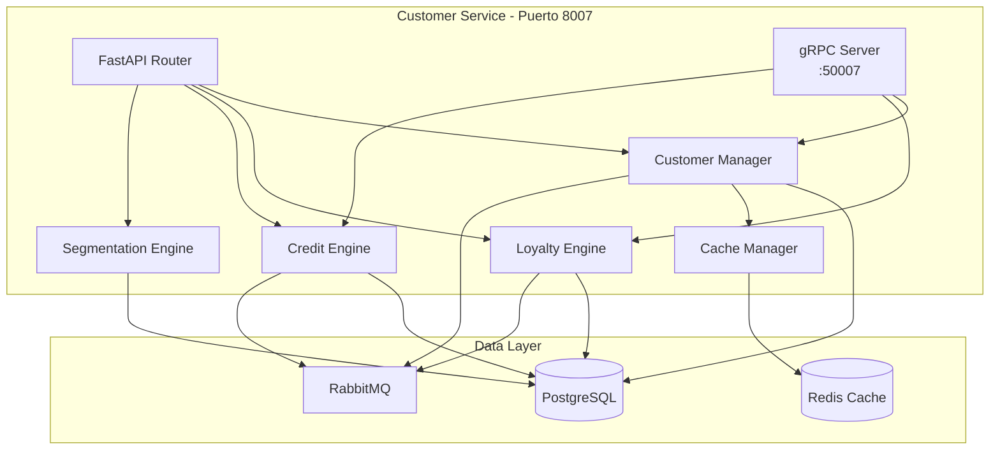

# Arquitectura - Customer Service

## Diagrama de Componentes



## Capas de la Arquitectura

### 1. API Layer

**Endpoints principales:**
- `/api/v1/customers` - CRUD de clientes
- `/api/v1/customers/{id}/loyalty` - Gestión de lealtad
- `/api/v1/customers/{id}/credit` - Gestión de crédito
- `/api/v1/customers/search` - Búsqueda de clientes

### 2. Customer Manager

Gestión del ciclo de vida de clientes.

```python
class CustomerManager:
    async def create_customer(
        self,
        customer_data: CustomerInput
    ) -> Customer

    async def get_customer(
        self,
        customer_id: UUID
    ) -> Customer

    async def search_customers(
        self,
        query: str,
        filters: CustomerFilters
    ) -> List[Customer]

    async def update_customer(
        self,
        customer_id: UUID,
        updates: CustomerUpdate
    ) -> Customer
```

### 3. Loyalty Engine

```python
class LoyaltyEngine:
    async def add_points(
        self,
        customer_id: UUID,
        transaction_id: UUID,
        amount: Decimal
    ) -> LoyaltyTransaction

    async def redeem_points(
        self,
        customer_id: UUID,
        points: int,
        reason: str
    ) -> LoyaltyTransaction

    async def calculate_tier(
        self,
        customer_id: UUID
    ) -> LoyaltyTier

    async def get_tier_benefits(
        self,
        tier: LoyaltyTier
    ) -> List[Benefit]
```

### 4. Credit Engine

```python
class CreditEngine:
    async def check_availability(
        self,
        customer_id: UUID,
        amount: Decimal
    ) -> bool

    async def use_credit(
        self,
        customer_id: UUID,
        order_id: UUID,
        amount: Decimal
    ) -> CreditUsage

    async def release_credit(
        self,
        customer_id: UUID,
        order_id: UUID
    ) -> CreditRelease

    async def record_payment(
        self,
        customer_id: UUID,
        payment_id: UUID,
        amount: Decimal
    ) -> CreditPayment
```

### 5. Segmentation Engine

```python
class SegmentationEngine:
    async def calculate_rfm(
        self,
        customer_id: UUID
    ) -> RFMScore

    async def assign_segment(
        self,
        customer_id: UUID
    ) -> CustomerSegment

    async def get_segment_customers(
        self,
        segment: str
    ) -> List[UUID]
```

## Patrones de Diseño

### 1. Strategy Pattern (Loyalty Rules)

```python
class LoyaltyStrategy(ABC):
    @abstractmethod
    async def calculate_points(self, amount: Decimal) -> int:
        pass

class StandardLoyaltyStrategy(LoyaltyStrategy):
    async def calculate_points(self, amount: Decimal) -> int:
        return int(amount)  # 1 punto por $1

class TieredLoyaltyStrategy(LoyaltyStrategy):
    async def calculate_points(self, amount: Decimal) -> int:
        # Gold: 1.5x, Platinum: 2x
        tier = await self.get_customer_tier()
        multiplier = {
            'bronze': 1.0,
            'silver': 1.2,
            'gold': 1.5,
            'platinum': 2.0
        }[tier]
        return int(amount * multiplier)
```

### 2. Observer Pattern (Events)

```python
class EventPublisher:
    def __init__(self):
        self.subscribers = []

    def subscribe(self, subscriber):
        self.subscribers.append(subscriber)

    async def publish(self, event):
        for subscriber in self.subscribers:
            await subscriber.handle(event)
```

## Próximos Pasos

- [Modelo de Datos](./02-modelo-datos.md)
- [API de Clientes](./03-api-customers.md)
