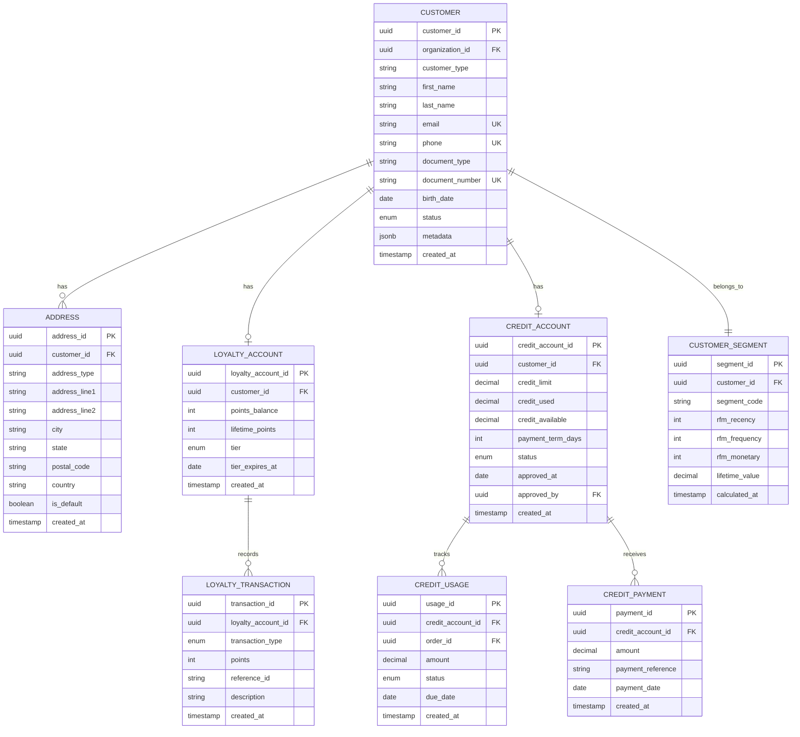

# Modelo de Datos - Customer Service

## Diagrama ER



## Entidades Principales

### 1. Customer (customers)

```sql
CREATE TABLE customers (
    customer_id UUID PRIMARY KEY DEFAULT gen_random_uuid(),
    organization_id UUID NOT NULL,

    -- Tipo de cliente
    customer_type VARCHAR(20) NOT NULL DEFAULT 'b2c',

    -- Información personal
    first_name VARCHAR(100) NOT NULL,
    last_name VARCHAR(100) NOT NULL,
    email VARCHAR(255) UNIQUE,
    phone VARCHAR(20) UNIQUE,

    -- Documentos de identidad
    document_type VARCHAR(20),
    document_number VARCHAR(50),

    -- Información adicional
    birth_date DATE,
    gender VARCHAR(20),

    -- Estado
    status VARCHAR(20) NOT NULL DEFAULT 'active',

    -- Preferencias
    preferred_language VARCHAR(10) DEFAULT 'es',
    marketing_consent BOOLEAN DEFAULT false,

    -- Metadata
    tags VARCHAR(255)[],
    metadata JSONB,
    notes TEXT,

    -- Timestamps
    created_at TIMESTAMP NOT NULL DEFAULT NOW(),
    updated_at TIMESTAMP,
    last_purchase_at TIMESTAMP,

    CONSTRAINT check_customer_type CHECK (
        customer_type IN ('b2c', 'b2b')
    ),
    CONSTRAINT check_status CHECK (
        status IN ('active', 'inactive', 'blocked')
    ),
    CONSTRAINT unique_org_email UNIQUE (organization_id, email),
    CONSTRAINT unique_org_document UNIQUE (organization_id, document_number)
);

CREATE INDEX idx_customers_organization ON customers(organization_id);
CREATE INDEX idx_customers_email ON customers(email);
CREATE INDEX idx_customers_phone ON customers(phone);
CREATE INDEX idx_customers_document ON customers(document_number);
CREATE INDEX idx_customers_status ON customers(status);
CREATE INDEX idx_customers_last_purchase ON customers(last_purchase_at DESC);
```

### 2. LoyaltyAccount (loyalty_accounts)

```sql
CREATE TABLE loyalty_accounts (
    loyalty_account_id UUID PRIMARY KEY DEFAULT gen_random_uuid(),
    customer_id UUID NOT NULL UNIQUE REFERENCES customers(customer_id),
    organization_id UUID NOT NULL,

    -- Puntos
    points_balance INTEGER NOT NULL DEFAULT 0 CHECK (points_balance >= 0),
    lifetime_points INTEGER NOT NULL DEFAULT 0,
    points_redeemed INTEGER NOT NULL DEFAULT 0,

    -- Nivel de membresía
    tier VARCHAR(20) NOT NULL DEFAULT 'bronze',
    tier_since DATE,
    tier_expires_at DATE,

    -- Estadísticas
    total_purchases INTEGER DEFAULT 0,
    total_spent DECIMAL(12, 2) DEFAULT 0.00,

    -- Timestamps
    created_at TIMESTAMP NOT NULL DEFAULT NOW(),
    updated_at TIMESTAMP,

    CONSTRAINT check_tier CHECK (
        tier IN ('bronze', 'silver', 'gold', 'platinum')
    )
);

CREATE INDEX idx_loyalty_customer ON loyalty_accounts(customer_id);
CREATE INDEX idx_loyalty_tier ON loyalty_accounts(tier);
```

### 3. LoyaltyTransaction (loyalty_transactions)

```sql
CREATE TABLE loyalty_transactions (
    transaction_id UUID PRIMARY KEY DEFAULT gen_random_uuid(),
    loyalty_account_id UUID NOT NULL REFERENCES loyalty_accounts(loyalty_account_id),

    -- Tipo de transacción
    transaction_type VARCHAR(20) NOT NULL,

    -- Puntos
    points INTEGER NOT NULL,

    -- Referencia
    reference_type VARCHAR(50),
    reference_id VARCHAR(255),
    description TEXT,

    -- Metadata
    metadata JSONB,

    created_at TIMESTAMP NOT NULL DEFAULT NOW(),

    CONSTRAINT check_transaction_type CHECK (
        transaction_type IN ('earn', 'redeem', 'expire', 'adjust', 'bonus')
    )
);

CREATE INDEX idx_loyalty_txn_account ON loyalty_transactions(loyalty_account_id);
CREATE INDEX idx_loyalty_txn_type ON loyalty_transactions(transaction_type);
CREATE INDEX idx_loyalty_txn_created ON loyalty_transactions(created_at DESC);
CREATE INDEX idx_loyalty_txn_reference ON loyalty_transactions(reference_id);
```

### 4. CreditAccount (credit_accounts)

```sql
CREATE TABLE credit_accounts (
    credit_account_id UUID PRIMARY KEY DEFAULT gen_random_uuid(),
    customer_id UUID NOT NULL UNIQUE REFERENCES customers(customer_id),
    organization_id UUID NOT NULL,

    -- Límite de crédito
    credit_limit DECIMAL(12, 2) NOT NULL CHECK (credit_limit >= 0),
    credit_used DECIMAL(12, 2) NOT NULL DEFAULT 0.00 CHECK (credit_used >= 0),
    credit_available DECIMAL(12, 2) GENERATED ALWAYS AS (credit_limit - credit_used) STORED,

    -- Términos de pago
    payment_term_days INTEGER NOT NULL DEFAULT 30,

    -- Estado
    status VARCHAR(20) NOT NULL DEFAULT 'pending',

    -- Aprobación
    approved_at DATE,
    approved_by UUID,
    approval_notes TEXT,

    -- Suspensión
    suspended_at TIMESTAMP,
    suspension_reason TEXT,

    -- Timestamps
    created_at TIMESTAMP NOT NULL DEFAULT NOW(),
    updated_at TIMESTAMP,

    CONSTRAINT check_credit_status CHECK (
        status IN ('pending', 'approved', 'suspended', 'cancelled')
    ),
    CONSTRAINT check_credit_used_limit CHECK (credit_used <= credit_limit)
);

CREATE INDEX idx_credit_customer ON credit_accounts(customer_id);
CREATE INDEX idx_credit_status ON credit_accounts(status);
CREATE INDEX idx_credit_approved_by ON credit_accounts(approved_by);
```

### 5. Address (addresses)

```sql
CREATE TABLE addresses (
    address_id UUID PRIMARY KEY DEFAULT gen_random_uuid(),
    customer_id UUID NOT NULL REFERENCES customers(customer_id) ON DELETE CASCADE,

    -- Tipo de dirección
    address_type VARCHAR(20) NOT NULL DEFAULT 'shipping',

    -- Datos de la dirección
    recipient_name VARCHAR(255),
    address_line1 VARCHAR(255) NOT NULL,
    address_line2 VARCHAR(255),
    city VARCHAR(100) NOT NULL,
    state VARCHAR(100),
    postal_code VARCHAR(20),
    country VARCHAR(3) NOT NULL DEFAULT 'PA',
    phone VARCHAR(20),

    -- Flags
    is_default BOOLEAN DEFAULT false,
    is_active BOOLEAN DEFAULT true,

    created_at TIMESTAMP NOT NULL DEFAULT NOW(),
    updated_at TIMESTAMP,

    CONSTRAINT check_address_type CHECK (
        address_type IN ('shipping', 'billing', 'both')
    )
);

CREATE INDEX idx_addresses_customer ON addresses(customer_id);
CREATE INDEX idx_addresses_is_default ON addresses(is_default);
```

### 6. CustomerSegment (customer_segments)

```sql
CREATE TABLE customer_segments (
    segment_id UUID PRIMARY KEY DEFAULT gen_random_uuid(),
    customer_id UUID NOT NULL UNIQUE REFERENCES customers(customer_id),
    organization_id UUID NOT NULL,

    -- Segmentación
    segment_code VARCHAR(50) NOT NULL,

    -- RFM Score
    rfm_recency INTEGER,  -- 1-5
    rfm_frequency INTEGER,  -- 1-5
    rfm_monetary INTEGER,  -- 1-5
    rfm_score INTEGER GENERATED ALWAYS AS (rfm_recency + rfm_frequency + rfm_monetary) STORED,

    -- Métricas
    lifetime_value DECIMAL(12, 2) DEFAULT 0.00,
    average_order_value DECIMAL(12, 2) DEFAULT 0.00,
    total_orders INTEGER DEFAULT 0,
    days_since_last_purchase INTEGER,

    -- Flags
    is_vip BOOLEAN DEFAULT false,
    is_at_risk BOOLEAN DEFAULT false,

    -- Timestamps
    calculated_at TIMESTAMP NOT NULL DEFAULT NOW(),
    updated_at TIMESTAMP,

    CONSTRAINT check_segment_code CHECK (
        segment_code IN ('champions', 'loyal', 'potential_loyalist', 'new', 'at_risk', 'lost')
    )
);

CREATE INDEX idx_segment_customer ON customer_segments(customer_id);
CREATE INDEX idx_segment_code ON customer_segments(segment_code);
CREATE INDEX idx_segment_rfm ON customer_segments(rfm_score DESC);
CREATE INDEX idx_segment_vip ON customer_segments(is_vip);
```

## Vistas

### v_customer_360

Vista consolidada de información del cliente.

```sql
CREATE VIEW v_customer_360 AS
SELECT
    c.customer_id,
    c.first_name,
    c.last_name,
    c.email,
    c.phone,
    c.customer_type,
    c.status,

    -- Loyalty
    la.points_balance,
    la.tier,
    la.lifetime_points,

    -- Credit
    ca.credit_limit,
    ca.credit_available,
    ca.payment_term_days,

    -- Segmentation
    cs.segment_code,
    cs.rfm_score,
    cs.lifetime_value,
    cs.is_vip,

    c.last_purchase_at,
    c.created_at
FROM customers c
LEFT JOIN loyalty_accounts la ON c.customer_id = la.customer_id
LEFT JOIN credit_accounts ca ON c.customer_id = ca.customer_id
LEFT JOIN customer_segments cs ON c.customer_id = cs.customer_id;
```

## Row-Level Security

```sql
ALTER TABLE customers ENABLE ROW LEVEL SECURITY;

CREATE POLICY customers_organization_isolation ON customers
    USING (organization_id = current_setting('app.current_organization_id')::uuid);
```

## Próximos Pasos

- [API de Clientes](./03-api-customers.md)
- [API de Lealtad](./04-api-loyalty.md)
