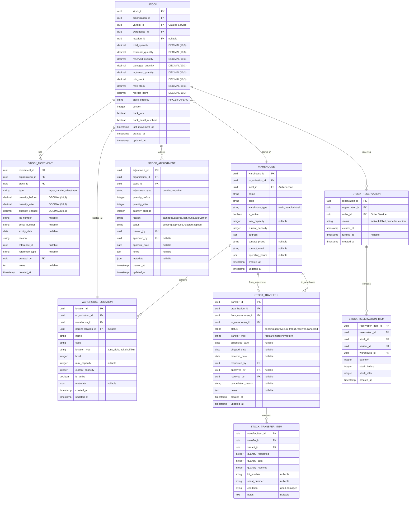

# Modelo de Datos

## Estándares de Tipos de Datos

> **Convención del ERP**: Todos los servicios usan tipos estandarizados para garantizar consistencia.
>
> | Tipo de Campo | Estándar | Descripción |
> |---------------|----------|-------------|
> | IDs primarios | `UUID` | Identificadores únicos universales |
> | Dinero | `DECIMAL(12,4)` | 12 dígitos, 4 decimales |
> | Tasas (%) | `DECIMAL(5,4)` | Ej: 0.0700 = 7% |
> | Cantidades | `DECIMAL(10,3)` | Para productos por peso |
>
> **Nota sobre cantidades**: Inventory Service usa `DECIMAL(10,3)` para cantidades para soportar productos vendidos por peso (kg, lb). Para productos unitarios, el valor se almacena como entero con 3 decimales en 0 (ej: 5.000).

Esquema completo de base de datos del Inventory Service con 6 entidades principales y soporte para multi-tenancy, lot tracking y serial tracking.

## Diagrama ER Completo



## Entidades Detalladas

### 1. Stock

Registro principal de inventario por variante, bodega y ubicación.

```sql
CREATE TABLE stock (
    stock_id UUID PRIMARY KEY DEFAULT gen_random_uuid(),
    organization_id UUID NOT NULL,
    variant_id UUID NOT NULL,  -- FK a Catalog Service
    warehouse_id UUID NOT NULL REFERENCES warehouses(warehouse_id),
    location_id UUID REFERENCES warehouse_locations(location_id),

    -- Cantidades (DECIMAL(10,3) para soportar productos por peso)
    total_quantity DECIMAL(10, 3) NOT NULL DEFAULT 0.000,
    available_quantity DECIMAL(10, 3) NOT NULL DEFAULT 0.000,
    reserved_quantity DECIMAL(10, 3) NOT NULL DEFAULT 0.000,
    damaged_quantity DECIMAL(10, 3) NOT NULL DEFAULT 0.000,
    in_transit_quantity DECIMAL(10, 3) NOT NULL DEFAULT 0.000,

    -- Control de stock
    min_stock DECIMAL(10, 3) NOT NULL DEFAULT 0.000,
    max_stock DECIMAL(10, 3) NOT NULL DEFAULT 0.000,
    reorder_point DECIMAL(10, 3) NOT NULL DEFAULT 0.000,  -- Punto de reorden (cuando disparar compra automática)
    stock_strategy VARCHAR(10) NOT NULL DEFAULT 'FIFO',

    -- Optimistic locking
    version INTEGER NOT NULL DEFAULT 1,  -- Para concurrencia optimista

    -- Tracking configuración
    track_lots BOOLEAN NOT NULL DEFAULT FALSE,  -- Si se rastrea por lotes
    track_serial_numbers BOOLEAN NOT NULL DEFAULT FALSE,  -- Si se rastrea por serial numbers

    -- Timestamps
    last_movement_at TIMESTAMP WITH TIME ZONE,
    created_at TIMESTAMP WITH TIME ZONE DEFAULT CURRENT_TIMESTAMP,
    updated_at TIMESTAMP WITH TIME ZONE DEFAULT CURRENT_TIMESTAMP,

    -- Constraints
    CONSTRAINT stock_org_variant_warehouse_unique UNIQUE (organization_id, variant_id, warehouse_id),
    CONSTRAINT stock_quantities_valid CHECK (total_quantity = available_quantity + reserved_quantity + damaged_quantity + in_transit_quantity),
    CONSTRAINT stock_min_max_valid CHECK (min_stock <= max_stock),
    CONSTRAINT stock_reorder_valid CHECK (reorder_point >= min_stock AND reorder_point <= max_stock)
);

CREATE INDEX idx_stock_organization ON stock(organization_id);
CREATE INDEX idx_stock_variant ON stock(variant_id);
CREATE INDEX idx_stock_warehouse ON stock(warehouse_id);
CREATE INDEX idx_stock_location ON stock(location_id) WHERE location_id IS NOT NULL;
CREATE INDEX idx_stock_low_stock ON stock(organization_id, available_quantity) WHERE available_quantity <= min_stock;
CREATE INDEX idx_stock_reorder ON stock(organization_id, available_quantity) WHERE available_quantity <= reorder_point;
```

**Campos Clave:**
- `reorder_point`: Cantidad que dispara una orden de compra automática (debe estar entre min_stock y max_stock)
- `version`: Para optimistic locking (evitar race conditions en actualizaciones concurrentes)
- `track_lots`: Si se debe rastrear números de lote para este stock
- `track_serial_numbers`: Si se debe rastrear números de serie individuales

**Campos Calculados:**
- `total_quantity` = available + reserved + damaged + in_transit
- `stock_status`: "in_stock", "low_stock", "out_of_stock", "reorder_needed"
- `fill_rate`: available / max_stock

**Estrategias de Stock:**
- `FIFO`: First In, First Out (por defecto)
- `LIFO`: Last In, First Out
- `FEFO`: First Expired, First Out (automático con expiry_date)

### 2. StockMovement

Historial completo de todos los movimientos de inventario.

```sql
CREATE TABLE stock_movements (
    movement_id UUID PRIMARY KEY DEFAULT gen_random_uuid(),
    organization_id UUID NOT NULL,
    stock_id UUID NOT NULL REFERENCES stock(stock_id),

    -- Tipo y cantidades (DECIMAL(10,3) para soportar productos por peso)
    type VARCHAR(20) NOT NULL,  -- 'in', 'out', 'transfer', 'adjustment'
    quantity_before DECIMAL(10, 3) NOT NULL,
    quantity_after DECIMAL(10, 3) NOT NULL,
    quantity_change DECIMAL(10, 3) NOT NULL,

    -- Tracking
    lot_number VARCHAR(100),
    serial_number VARCHAR(100),
    expiry_date DATE,

    -- Contexto
    reason VARCHAR(100) NOT NULL,
    reference_id UUID,  -- PO, SO, Transfer, Adjustment
    reference_type VARCHAR(50),
    created_by UUID NOT NULL,
    notes TEXT,

    created_at TIMESTAMP WITH TIME ZONE DEFAULT CURRENT_TIMESTAMP,

    CONSTRAINT movement_type_valid CHECK (type IN ('in', 'out', 'transfer', 'adjustment')),
    CONSTRAINT movement_quantity_change_valid CHECK (
        (type IN ('in', 'transfer') AND quantity_change > 0) OR
        (type IN ('out', 'adjustment') AND quantity_change < 0)
    )
);

CREATE INDEX idx_movements_stock ON stock_movements(stock_id);
CREATE INDEX idx_movements_organization ON stock_movements(organization_id);
CREATE INDEX idx_movements_type ON stock_movements(type);
CREATE INDEX idx_movements_created_at ON stock_movements(created_at DESC);
CREATE INDEX idx_movements_lot ON stock_movements(lot_number) WHERE lot_number IS NOT NULL;
CREATE INDEX idx_movements_serial ON stock_movements(serial_number) WHERE serial_number IS NOT NULL;
CREATE INDEX idx_movements_reference ON stock_movements(reference_id, reference_type) WHERE reference_id IS NOT NULL;
```

**Tipos de Movimientos:**
- `in`: Entrada de mercancía (compra, devolución)
- `out`: Salida de mercancía (venta, transferencia)
- `transfer`: Movimiento entre ubicaciones/bodegas
- `adjustment`: Ajuste de inventario

**Motivos Comunes:**
```python
MOVEMENT_REASONS = {
    'in': ['purchase', 'return', 'production', 'found', 'adjustment'],
    'out': ['sale', 'transfer', 'damage', 'loss', 'sample', 'donation'],
    'transfer': ['restock', 'relocation', 'consolidation'],
    'adjustment': ['audit', 'correction', 'damaged', 'expired']
}
```

### 3. Warehouse

Bodegas físicas o virtuales de la organización.

```sql
CREATE TABLE warehouses (
    warehouse_id UUID PRIMARY KEY DEFAULT gen_random_uuid(),
    organization_id UUID NOT NULL,
    local_id UUID NOT NULL,  -- FK a Auth Service

    -- Identificación
    name VARCHAR(200) NOT NULL,
    code VARCHAR(50) NOT NULL,
    warehouse_type VARCHAR(20) NOT NULL DEFAULT 'main',
    is_active BOOLEAN NOT NULL DEFAULT true,

    -- Capacidad
    max_capacity INTEGER,
    current_capacity INTEGER NOT NULL DEFAULT 0,

    -- Información de contacto
    address JSONB NOT NULL,
    contact_phone VARCHAR(20),
    contact_email VARCHAR(255),
    operating_hours JSONB,

    created_at TIMESTAMP WITH TIME ZONE DEFAULT CURRENT_TIMESTAMP,
    updated_at TIMESTAMP WITH TIME ZONE DEFAULT CURRENT_TIMESTAMP,

    CONSTRAINT warehouse_org_code_unique UNIQUE (organization_id, code),
    CONSTRAINT warehouse_type_valid CHECK (warehouse_type IN ('main', 'branch', 'virtual')),
    CONSTRAINT warehouse_capacity_valid CHECK (current_capacity <= max_capacity OR max_capacity IS NULL)
);

CREATE INDEX idx_warehouse_organization ON warehouses(organization_id);
CREATE INDEX idx_warehouse_local ON warehouses(local_id);
CREATE INDEX idx_warehouse_active ON warehouses(organization_id, is_active);
```

**warehouse_type:**
- `main`: Bodega principal
- `branch`: Bodega de sucursal
- `virtual`: Bodega virtual (dropshipping, consignación)

**address JSON Schema:**
```json
{
  "street": "Av. Principal 123",
  "city": "Ciudad de Panamá",
  "state": "Panamá",
  "country": "PA",
  "postal_code": "00001",
  "coordinates": {
    "lat": 8.983333,
    "lng": -79.516667
  }
}
```

**operating_hours JSON Schema:**
```json
{
  "monday": {"open": "08:00", "close": "18:00"},
  "tuesday": {"open": "08:00", "close": "18:00"},
  "saturday": {"open": "09:00", "close": "13:00"},
  "sunday": null
}
```

### 4. WarehouseLocation

Ubicaciones físicas jerárquicas dentro de las bodegas.

```sql
CREATE TABLE warehouse_locations (
    location_id UUID PRIMARY KEY DEFAULT gen_random_uuid(),
    organization_id UUID NOT NULL,
    warehouse_id UUID NOT NULL REFERENCES warehouses(warehouse_id),
    parent_location_id UUID REFERENCES warehouse_locations(location_id),

    -- Identificación
    name VARCHAR(200) NOT NULL,
    code VARCHAR(50) NOT NULL,
    location_type VARCHAR(20) NOT NULL,
    level INTEGER NOT NULL DEFAULT 0,

    -- Capacidad
    max_capacity INTEGER,
    current_capacity INTEGER NOT NULL DEFAULT 0,
    is_active BOOLEAN NOT NULL DEFAULT true,

    -- Metadata adicional
    metadata JSONB,

    created_at TIMESTAMP WITH TIME ZONE DEFAULT CURRENT_TIMESTAMP,
    updated_at TIMESTAMP WITH TIME ZONE DEFAULT CURRENT_TIMESTAMP,

    CONSTRAINT location_warehouse_code_unique UNIQUE (warehouse_id, code),
    CONSTRAINT location_type_valid CHECK (location_type IN ('zone', 'aisle', 'rack', 'shelf', 'bin')),
    CONSTRAINT location_capacity_valid CHECK (current_capacity <= max_capacity OR max_capacity IS NULL)
);

CREATE INDEX idx_location_warehouse ON warehouse_locations(warehouse_id);
CREATE INDEX idx_location_parent ON warehouse_locations(parent_location_id) WHERE parent_location_id IS NOT NULL;
CREATE INDEX idx_location_type ON warehouse_locations(location_type);
CREATE INDEX idx_location_active ON warehouse_locations(warehouse_id, is_active);
```

**Jerarquía de Ubicaciones:**
```
Warehouse
└── Zone (Zona de almacenamiento)
    └── Aisle (Pasillo)
        └── Rack (Estantería)
            └── Shelf (Estante)
                └── Bin (Contenedor/Casillero)
```

**Ejemplo de Código de Ubicación:**
```
WH01-Z01-A05-R03-S02-B01
│    │   │   │   │   └── Bin 01
│    │   │   │   └────── Shelf 02
│    │   │   └────────── Rack 03
│    │   └────────────── Aisle 05
│    └────────────────── Zone 01
└─────────────────────── Warehouse 01
```

### 5. StockTransfer

Transferencias de inventario entre bodegas.

```sql
CREATE TABLE stock_transfers (
    transfer_id UUID PRIMARY KEY DEFAULT gen_random_uuid(),
    organization_id UUID NOT NULL,
    from_warehouse_id UUID NOT NULL REFERENCES warehouses(warehouse_id),
    to_warehouse_id UUID NOT NULL REFERENCES warehouses(warehouse_id),

    -- Estado y tipo
    status VARCHAR(20) NOT NULL DEFAULT 'pending',
    transfer_type VARCHAR(20) NOT NULL DEFAULT 'regular',

    -- Fechas
    scheduled_date DATE,
    shipped_date DATE,
    received_date DATE,

    -- Aprobaciones
    requested_by UUID NOT NULL,
    approved_by UUID,
    received_by UUID,

    -- Información adicional
    cancellation_reason VARCHAR(500),
    notes TEXT,

    created_at TIMESTAMP WITH TIME ZONE DEFAULT CURRENT_TIMESTAMP,
    updated_at TIMESTAMP WITH TIME ZONE DEFAULT CURRENT_TIMESTAMP,

    CONSTRAINT transfer_status_valid CHECK (status IN ('pending', 'approved', 'in_transit', 'received', 'cancelled')),
    CONSTRAINT transfer_type_valid CHECK (transfer_type IN ('regular', 'emergency', 'return')),
    CONSTRAINT transfer_different_warehouses CHECK (from_warehouse_id != to_warehouse_id)
);

CREATE TABLE stock_transfer_items (
    transfer_item_id UUID PRIMARY KEY DEFAULT gen_random_uuid(),
    transfer_id UUID NOT NULL REFERENCES stock_transfers(transfer_id) ON DELETE CASCADE,
    variant_id UUID NOT NULL,

    -- Cantidades
    quantity_requested INTEGER NOT NULL,
    quantity_sent INTEGER NOT NULL DEFAULT 0,
    quantity_received INTEGER NOT NULL DEFAULT 0,

    -- Tracking
    lot_number VARCHAR(100),
    serial_number VARCHAR(100),
    condition VARCHAR(20) NOT NULL DEFAULT 'good',
    notes TEXT,

    CONSTRAINT transfer_item_quantities_valid CHECK (
        quantity_sent <= quantity_requested AND
        quantity_received <= quantity_sent
    ),
    CONSTRAINT transfer_item_condition_valid CHECK (condition IN ('good', 'damaged'))
);

CREATE INDEX idx_transfer_organization ON stock_transfers(organization_id);
CREATE INDEX idx_transfer_from_warehouse ON stock_transfers(from_warehouse_id);
CREATE INDEX idx_transfer_to_warehouse ON stock_transfers(to_warehouse_id);
CREATE INDEX idx_transfer_status ON stock_transfers(status);
CREATE INDEX idx_transfer_created_at ON stock_transfers(created_at DESC);
CREATE INDEX idx_transfer_items_transfer ON stock_transfer_items(transfer_id);
```

**Estados de Transferencia:**
1. `pending`: Creada, esperando aprobación
2. `approved`: Aprobada, lista para envío
3. `in_transit`: En tránsito a bodega destino
4. `received`: Recibida en destino
5. `cancelled`: Cancelada

**Tipos de Transferencia:**
- `regular`: Transferencia normal programada
- `emergency`: Transferencia urgente
- `return`: Devolución de mercancía

### 6. StockAdjustment

Ajustes de inventario para correcciones y auditorías.

```sql
CREATE TABLE stock_adjustments (
    adjustment_id UUID PRIMARY KEY DEFAULT gen_random_uuid(),
    organization_id UUID NOT NULL,
    stock_id UUID NOT NULL REFERENCES stock(stock_id),

    -- Tipo y cantidades
    adjustment_type VARCHAR(20) NOT NULL,
    quantity_before INTEGER NOT NULL,
    quantity_after INTEGER NOT NULL,
    quantity_change INTEGER NOT NULL,

    -- Motivo y estado
    reason VARCHAR(50) NOT NULL,
    status VARCHAR(20) NOT NULL DEFAULT 'pending',

    -- Aprobación
    created_by UUID NOT NULL,
    approved_by UUID,
    approval_date DATE,

    notes TEXT,
    metadata JSONB,

    created_at TIMESTAMP WITH TIME ZONE DEFAULT CURRENT_TIMESTAMP,
    updated_at TIMESTAMP WITH TIME ZONE DEFAULT CURRENT_TIMESTAMP,

    CONSTRAINT adjustment_type_valid CHECK (adjustment_type IN ('positive', 'negative')),
    CONSTRAINT adjustment_status_valid CHECK (status IN ('pending', 'approved', 'rejected', 'applied')),
    CONSTRAINT adjustment_reason_valid CHECK (reason IN ('damaged', 'expired', 'lost', 'found', 'audit', 'other')),
    CONSTRAINT adjustment_change_matches_type CHECK (
        (adjustment_type = 'positive' AND quantity_change > 0) OR
        (adjustment_type = 'negative' AND quantity_change < 0)
    )
);

CREATE INDEX idx_adjustment_organization ON stock_adjustments(organization_id);
CREATE INDEX idx_adjustment_stock ON stock_adjustments(stock_id);
CREATE INDEX idx_adjustment_status ON stock_adjustments(status);
CREATE INDEX idx_adjustment_created_by ON stock_adjustments(created_by);
CREATE INDEX idx_adjustment_created_at ON stock_adjustments(created_at DESC);
```

**Motivos de Ajuste:**
- `damaged`: Producto dañado
- `expired`: Producto vencido
- `lost`: Pérdida de inventario
- `found`: Inventario encontrado (sobrante)
- `audit`: Ajuste por auditoría física
- `other`: Otro motivo (especificar en notes)

### 7. StockReservation

Reservas de stock para órdenes pendientes.

```sql
CREATE TABLE stock_reservations (
    reservation_id UUID PRIMARY KEY DEFAULT gen_random_uuid(),
    organization_id UUID NOT NULL,
    order_id UUID NOT NULL,  -- FK a Order Service

    status VARCHAR(20) NOT NULL DEFAULT 'active',

    expires_at TIMESTAMP WITH TIME ZONE NOT NULL,
    fulfilled_at TIMESTAMP WITH TIME ZONE,

    created_at TIMESTAMP WITH TIME ZONE DEFAULT CURRENT_TIMESTAMP,

    CONSTRAINT reservation_status_valid CHECK (status IN ('active', 'fulfilled', 'cancelled', 'expired'))
);

CREATE TABLE stock_reservation_items (
    reservation_item_id UUID PRIMARY KEY DEFAULT gen_random_uuid(),
    reservation_id UUID NOT NULL REFERENCES stock_reservations(reservation_id) ON DELETE CASCADE,
    stock_id UUID NOT NULL REFERENCES stock(stock_id),
    variant_id UUID NOT NULL,
    warehouse_id UUID NOT NULL,

    quantity INTEGER NOT NULL,
    stock_before INTEGER NOT NULL,
    stock_after INTEGER NOT NULL,

    created_at TIMESTAMP WITH TIME ZONE DEFAULT CURRENT_TIMESTAMP,

    CONSTRAINT reservation_item_quantity_positive CHECK (quantity > 0),
    CONSTRAINT reservation_item_stock_valid CHECK (stock_after = stock_before - quantity)
);

CREATE INDEX idx_reservation_organization ON stock_reservations(organization_id);
CREATE INDEX idx_reservation_order ON stock_reservations(order_id);
CREATE INDEX idx_reservation_status ON stock_reservations(status);
CREATE INDEX idx_reservation_expires ON stock_reservations(expires_at) WHERE status = 'active';

CREATE INDEX idx_reservation_item_reservation ON stock_reservation_items(reservation_id);
CREATE INDEX idx_reservation_item_stock ON stock_reservation_items(stock_id);
CREATE INDEX idx_reservation_item_variant ON stock_reservation_items(variant_id);
CREATE INDEX idx_reservation_item_warehouse ON stock_reservation_items(warehouse_id);
```

## Vistas Útiles

### Vista de Stock Agregado por Variante

```sql
CREATE VIEW v_stock_summary AS
SELECT
    s.organization_id,
    s.variant_id,
    COUNT(DISTINCT s.warehouse_id) as warehouse_count,
    SUM(s.total_quantity) as total_quantity,
    SUM(s.available_quantity) as available_quantity,
    SUM(s.reserved_quantity) as reserved_quantity,
    SUM(s.damaged_quantity) as damaged_quantity,
    MIN(s.min_stock) as min_stock,
    MAX(s.max_stock) as max_stock,
    CASE
        WHEN SUM(s.available_quantity) = 0 THEN 'out_of_stock'
        WHEN SUM(s.available_quantity) <= MIN(s.min_stock) THEN 'low_stock'
        ELSE 'in_stock'
    END as stock_status
FROM stock s
GROUP BY s.organization_id, s.variant_id;
```

### Vista de Alertas de Stock Bajo

```sql
CREATE VIEW v_low_stock_alerts AS
SELECT
    s.stock_id,
    s.organization_id,
    s.variant_id,
    s.warehouse_id,
    w.name as warehouse_name,
    s.available_quantity,
    s.min_stock,
    (s.min_stock - s.available_quantity) as quantity_needed,
    s.last_movement_at
FROM stock s
JOIN warehouses w ON s.warehouse_id = w.warehouse_id
WHERE s.available_quantity <= s.min_stock
  AND w.is_active = true
ORDER BY (s.min_stock - s.available_quantity) DESC;
```

## Triggers

### Actualización Automática de Stock

```sql
CREATE OR REPLACE FUNCTION update_stock_on_movement()
RETURNS TRIGGER AS $$
BEGIN
    UPDATE stock
    SET
        total_quantity = total_quantity + NEW.quantity_change,
        available_quantity = available_quantity + NEW.quantity_change,
        last_movement_at = NEW.created_at,
        updated_at = CURRENT_TIMESTAMP
    WHERE stock_id = NEW.stock_id;

    RETURN NEW;
END;
$$ LANGUAGE plpgsql;

CREATE TRIGGER trigger_update_stock_on_movement
AFTER INSERT ON stock_movements
FOR EACH ROW
EXECUTE FUNCTION update_stock_on_movement();
```

### Publicación de Eventos de Stock Bajo

```sql
CREATE OR REPLACE FUNCTION notify_low_stock()
RETURNS TRIGGER AS $$
BEGIN
    IF NEW.available_quantity <= NEW.min_stock AND
       OLD.available_quantity > OLD.min_stock THEN
        PERFORM pg_notify(
            'low_stock_alert',
            json_build_object(
                'stock_id', NEW.stock_id,
                'variant_id', NEW.variant_id,
                'warehouse_id', NEW.warehouse_id,
                'available', NEW.available_quantity,
                'min_stock', NEW.min_stock
            )::text
        );
    END IF;
    RETURN NEW;
END;
$$ LANGUAGE plpgsql;

CREATE TRIGGER trigger_notify_low_stock
AFTER UPDATE ON stock
FOR EACH ROW
EXECUTE FUNCTION notify_low_stock();
```

## Multi-Tenancy

Todas las tablas incluyen `organization_id` con Row-Level Security (RLS):

```sql
-- Habilitar RLS en todas las tablas
ALTER TABLE stock ENABLE ROW LEVEL SECURITY;
ALTER TABLE stock_movements ENABLE ROW LEVEL SECURITY;
ALTER TABLE warehouses ENABLE ROW LEVEL SECURITY;
ALTER TABLE warehouse_locations ENABLE ROW LEVEL SECURITY;
ALTER TABLE stock_transfers ENABLE ROW LEVEL SECURITY;
ALTER TABLE stock_adjustments ENABLE ROW LEVEL SECURITY;
ALTER TABLE stock_reservations ENABLE ROW LEVEL SECURITY;

-- Política de ejemplo para stock
CREATE POLICY stock_organization_isolation ON stock
    USING (organization_id = current_setting('app.current_organization_id')::uuid);

-- Política de ejemplo para reservations
CREATE POLICY stock_reservations_organization_isolation ON stock_reservations
    USING (organization_id = current_setting('app.current_organization_id')::uuid);
```

## Próximos Pasos

- [Arquitectura](./arquitectura)
- [API: Stock](./api-stock)
- [API: Movements](./api-movements)
- [API: Warehouses](./api-warehouses)
- [API: Transfers](./api-transfers)
