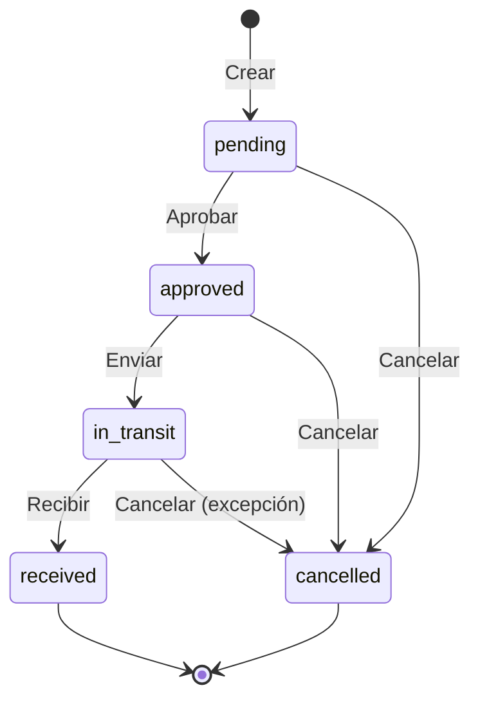

# Transfers API

API REST para gestión de transferencias de inventario entre bodegas con estados, aprobaciones y tracking.

## Endpoints

### Listar Transferencias

```http
GET /api/v1/transfers
```

**Query Parameters:**

| Parámetro | Tipo | Requerido | Descripción |
|-----------|------|-----------|-------------|
| `from_warehouse_id` | UUID | No | Bodega origen |
| `to_warehouse_id` | UUID | No | Bodega destino |
| `status` | string | No | pending, approved, in_transit, received, cancelled |
| `transfer_type` | string | No | regular, emergency, return |
| `requested_by` | UUID | No | Usuario solicitante |
| `date_from` | date | No | Fecha desde |
| `date_to` | date | No | Fecha hasta |
| `cursor` | string | No | Cursor de paginación |
| `limit` | integer | No | Resultados por página (max: 100) |

**Respuesta Exitosa (200 OK):**

```json
{
  "status": "success",
  "statusCode": 200,
  "data": {
    "edges": [
      {
        "cursor": "dHJhbnNfMTIz",
        "node": {
          "transfer_id": "trans_123",
          "from_warehouse": {
            "warehouse_id": "wh_001",
            "name": "Bodega Principal",
            "code": "WH-001"
          },
          "to_warehouse": {
            "warehouse_id": "wh_002",
            "name": "Bodega Sucursal",
            "code": "WH-002"
          },
          "status": "in_transit",
          "transfer_type": "regular",
          "items_count": 5,
          "total_quantity": 150,
          "dates": {
            "scheduled_date": "2025-11-25",
            "shipped_date": "2025-11-24T08:00:00Z",
            "received_date": null,
            "created_at": "2025-11-23T10:00:00Z"
          },
          "requested_by": {
            "user_id": "user_456",
            "name": "Juan Pérez"
          },
          "approved_by": {
            "user_id": "user_789",
            "name": "María García"
          },
          "notes": "Reabastecimiento semanal"
        }
      }
    ],
    "pageInfo": {
      "hasNextPage": true,
      "totalCount": 45
    }
  },
  "timestamp": "2025-11-23T15:00:00Z",
  "path": "/api/v1/transfers",
  "requestId": "req_trans123"
}
```

---

### Obtener Transferencia por ID

```http
GET /api/v1/transfers/{transferId}
```

**Respuesta Exitosa (200 OK):**

```json
{
  "status": "success",
  "statusCode": 200,
  "data": {
    "transfer_id": "trans_123",
    "from_warehouse": {
      "warehouse_id": "wh_001",
      "name": "Bodega Principal",
      "code": "WH-001"
    },
    "to_warehouse": {
      "warehouse_id": "wh_002",
      "name": "Bodega Sucursal",
      "code": "WH-002"
    },
    "status": "in_transit",
    "transfer_type": "regular",
    "items": [
      {
        "transfer_item_id": "item_001",
        "variant_id": "var_456",
        "variant": {
          "sku": "PROD-001",
          "name": "Producto Ejemplo"
        },
        "quantities": {
          "requested": 50,
          "sent": 50,
          "received": 0
        },
        "lot_number": "LOT-2025-001",
        "condition": "good"
      },
      {
        "transfer_item_id": "item_002",
        "variant_id": "var_457",
        "variant": {
          "sku": "PROD-002",
          "name": "Producto Ejemplo 2"
        },
        "quantities": {
          "requested": 100,
          "sent": 100,
          "received": 0
        },
        "lot_number": "LOT-2025-002",
        "condition": "good"
      }
    ],
    "dates": {
      "scheduled_date": "2025-11-25",
      "shipped_date": "2025-11-24T08:00:00Z",
      "received_date": null,
      "created_at": "2025-11-23T10:00:00Z"
    },
    "people": {
      "requested_by": {
        "user_id": "user_456",
        "name": "Juan Pérez"
      },
      "approved_by": {
        "user_id": "user_789",
        "name": "María García",
        "approved_at": "2025-11-23T14:00:00Z"
      },
      "received_by": null
    },
    "notes": "Reabastecimiento semanal programado",
    "tracking_history": [
      {
        "status": "pending",
        "timestamp": "2025-11-23T10:00:00Z",
        "user": "Juan Pérez"
      },
      {
        "status": "approved",
        "timestamp": "2025-11-23T14:00:00Z",
        "user": "María García"
      },
      {
        "status": "in_transit",
        "timestamp": "2025-11-24T08:00:00Z",
        "user": "Sistema"
      }
    ]
  },
  "timestamp": "2025-11-23T15:00:00Z",
  "path": "/api/v1/transfers/trans_123",
  "requestId": "req_gettrans123"
}
```

---

### Crear Transferencia

```http
POST /api/v1/transfers
```

**Request Body:**

```json
{
  "from_warehouse_id": "wh_001",
  "to_warehouse_id": "wh_002",
  "transfer_type": "regular",
  "scheduled_date": "2025-11-30",
  "items": [
    {
      "variant_id": "var_456",
      "quantity": 50,
      "lot_number": "LOT-2025-001"
    },
    {
      "variant_id": "var_457",
      "quantity": 100,
      "lot_number": "LOT-2025-002"
    }
  ],
  "notes": "Transferencia de reabastecimiento mensual",
  "auto_approve": false
}
```

**Campos:**

| Campo | Tipo | Requerido | Descripción |
|-------|------|-----------|-------------|
| `from_warehouse_id` | UUID | Sí | Bodega origen |
| `to_warehouse_id` | UUID | Sí | Bodega destino |
| `transfer_type` | string | No | regular, emergency, return (default: regular) |
| `scheduled_date` | date | No | Fecha programada de envío |
| `items` | array | Sí | Items a transferir (mínimo 1) |
| `items[].variant_id` | UUID | Sí | ID de variante |
| `items[].quantity` | integer | Sí | Cantidad a transferir |
| `items[].lot_number` | string | No | Número de lote |
| `items[].serial_number` | string | No | Número de serie |
| `notes` | text | No | Notas adicionales |
| `auto_approve` | boolean | No | Auto-aprobar si es permitido (default: false) |

**Validaciones:**
- Bodegas deben ser diferentes
- Stock disponible en bodega origen
- Cantidad mayor a 0
- Si lot_number, debe existir en bodega origen

**Respuesta Exitosa (201 Created):**

```json
{
  "status": "success",
  "statusCode": 201,
  "data": {
    "transfer_id": "trans_new456",
    "status": "pending",
    "from_warehouse_id": "wh_001",
    "to_warehouse_id": "wh_002",
    "items_count": 2,
    "total_quantity_requested": 150,
    "requires_approval": true,
    "created_at": "2025-11-23T16:00:00Z"
  },
  "timestamp": "2025-11-23T16:00:00Z",
  "path": "/api/v1/transfers",
  "requestId": "req_createtrans456"
}
```

**Códigos de Error:**
- `400` - `INVALID_TRANSFER_DATA`: Datos inválidos
- `400` - `SAME_WAREHOUSE`: Bodegas deben ser diferentes
- `400` - `INSUFFICIENT_STOCK`: Stock insuficiente en origen
- `404` - `WAREHOUSE_NOT_FOUND`: Bodega no existe
- `404` - `VARIANT_NOT_FOUND`: Variante no existe
- `404` - `LOT_NOT_FOUND`: Lote no existe en bodega origen

**Evento Publicado:**
```json
{
  "event": "inventory.transfer.created",
  "data": {
    "transfer_id": "trans_new456",
    "from_warehouse_id": "wh_001",
    "to_warehouse_id": "wh_002",
    "items_count": 2,
    "status": "pending"
  }
}
```

---

### Aprobar Transferencia

```http
POST /api/v1/transfers/{transferId}/approve
```

**Request Body:**

```json
{
  "notes": "Aprobado - Stock verificado"
}
```

**Respuesta Exitosa (200 OK):**

```json
{
  "status": "success",
  "statusCode": 200,
  "data": {
    "transfer_id": "trans_123",
    "status": "approved",
    "approved_by": {
      "user_id": "user_789",
      "name": "María García"
    },
    "approved_at": "2025-11-23T16:30:00Z"
  },
  "timestamp": "2025-11-23T16:30:00Z",
  "path": "/api/v1/transfers/trans_123/approve",
  "requestId": "req_approve123"
}
```

**Códigos de Error:**
- `404` - `TRANSFER_NOT_FOUND`: Transferencia no existe
- `409` - `TRANSFER_ALREADY_APPROVED`: Ya fue aprobada
- `409` - `TRANSFER_ALREADY_SHIPPED`: Ya fue enviada
- `403` - `INSUFFICIENT_PERMISSIONS`: Sin permisos para aprobar

**Evento Publicado:**
```json
{
  "event": "inventory.transfer.approved",
  "data": {
    "transfer_id": "trans_123",
    "approved_by": "user_789"
  }
}
```

---

### Marcar como Enviada

```http
POST /api/v1/transfers/{transferId}/ship
```

**Request Body:**

```json
{
  "items": [
    {
      "transfer_item_id": "item_001",
      "quantity_sent": 50
    },
    {
      "transfer_item_id": "item_002",
      "quantity_sent": 95
    }
  ],
  "shipped_date": "2025-11-24T08:00:00Z",
  "notes": "Enviado en camión TR-123"
}
```

**Respuesta Exitosa (200 OK):**

```json
{
  "status": "success",
  "statusCode": 200,
  "data": {
    "transfer_id": "trans_123",
    "status": "in_transit",
    "shipped_date": "2025-11-24T08:00:00Z",
    "items_shipped": 2,
    "total_quantity_sent": 145,
    "stock_movements_created": [
      {
        "movement_id": "mov_out001",
        "warehouse_id": "wh_001",
        "type": "out",
        "quantity": -50
      },
      {
        "movement_id": "mov_out002",
        "warehouse_id": "wh_001",
        "type": "out",
        "quantity": -95
      }
    ]
  },
  "timestamp": "2025-11-24T08:00:00Z",
  "path": "/api/v1/transfers/trans_123/ship",
  "requestId": "req_ship123"
}
```

**Códigos de Error:**
- `409` - `TRANSFER_NOT_APPROVED`: Transferencia no aprobada
- `409` - `TRANSFER_ALREADY_SHIPPED`: Ya fue enviada
- `400` - `QUANTITY_EXCEEDS_REQUESTED`: Cantidad enviada mayor a solicitada

**Evento Publicado:**
```json
{
  "event": "inventory.transfer.in_transit",
  "data": {
    "transfer_id": "trans_123",
    "shipped_date": "2025-11-24T08:00:00Z"
  }
}
```

---

### Recibir Transferencia

```http
POST /api/v1/transfers/{transferId}/receive
```

**Request Body:**

```json
{
  "items": [
    {
      "transfer_item_id": "item_001",
      "quantity_received": 50,
      "condition": "good"
    },
    {
      "transfer_item_id": "item_002",
      "quantity_received": 90,
      "condition": "good",
      "notes": "5 unidades dañadas en tránsito"
    }
  ],
  "received_date": "2025-11-25T10:00:00Z",
  "notes": "Recibido completo - 5 unidades con daños menores"
}
```

**Campos:**

| Campo | Tipo | Requerido | Descripción |
|-------|------|-----------|-------------|
| `items` | array | Sí | Items recibidos |
| `items[].transfer_item_id` | UUID | Sí | ID del item de transferencia |
| `items[].quantity_received` | integer | Sí | Cantidad recibida |
| `items[].condition` | string | Sí | good, damaged |
| `items[].notes` | text | No | Notas del item |
| `received_date` | datetime | No | Fecha/hora de recepción (default: now) |
| `notes` | text | No | Notas generales |

**Respuesta Exitosa (200 OK):**

```json
{
  "status": "success",
  "statusCode": 200,
  "data": {
    "transfer_id": "trans_123",
    "status": "received",
    "received_date": "2025-11-25T10:00:00Z",
    "items_received": 2,
    "total_quantity_received": 140,
    "discrepancies": [
      {
        "transfer_item_id": "item_002",
        "variant_id": "var_457",
        "sent": 95,
        "received": 90,
        "difference": -5,
        "reason": "damaged"
      }
    ],
    "stock_movements_created": [
      {
        "movement_id": "mov_in001",
        "warehouse_id": "wh_002",
        "type": "in",
        "quantity": 50
      },
      {
        "movement_id": "mov_in002",
        "warehouse_id": "wh_002",
        "type": "in",
        "quantity": 90
      }
    ],
    "received_by": {
      "user_id": "user_999",
      "name": "Pedro López"
    }
  },
  "timestamp": "2025-11-25T10:00:00Z",
  "path": "/api/v1/transfers/trans_123/receive",
  "requestId": "req_receive123"
}
```

**Códigos de Error:**
- `409` - `TRANSFER_NOT_IN_TRANSIT`: Transferencia no está en tránsito
- `409` - `TRANSFER_ALREADY_RECEIVED`: Ya fue recibida
- `400` - `QUANTITY_EXCEEDS_SENT`: Cantidad recibida mayor a enviada

**Evento Publicado:**
```json
{
  "event": "inventory.transfer.received",
  "data": {
    "transfer_id": "trans_123",
    "received_date": "2025-11-25T10:00:00Z",
    "discrepancies": true,
    "discrepancies_count": 1
  }
}
```

---

### Cancelar Transferencia

```http
POST /api/v1/transfers/{transferId}/cancel
```

**Request Body:**

```json
{
  "reason": "Stock insuficiente en origen",
  "notes": "Cliente canceló orden relacionada"
}
```

**Respuesta Exitosa (200 OK):**

```json
{
  "status": "success",
  "statusCode": 200,
  "data": {
    "transfer_id": "trans_123",
    "status": "cancelled",
    "cancellation_reason": "Stock insuficiente en origen",
    "cancelled_at": "2025-11-23T17:00:00Z"
  },
  "timestamp": "2025-11-23T17:00:00Z",
  "path": "/api/v1/transfers/trans_123/cancel",
  "requestId": "req_cancel123"
}
```

**Validaciones:**
- Solo se puede cancelar si status = pending o approved
- No se puede cancelar si ya fue enviada o recibida

**Códigos de Error:**
- `409` - `TRANSFER_ALREADY_SHIPPED`: No se puede cancelar una vez enviada
- `409` - `TRANSFER_ALREADY_RECEIVED`: No se puede cancelar una vez recibida

**Evento Publicado:**
```json
{
  "event": "inventory.transfer.cancelled",
  "data": {
    "transfer_id": "trans_123",
    "reason": "Stock insuficiente en origen"
  }
}
```

---

## Estados de Transferencia



**Flujo Normal:**
1. `pending` - Creada, esperando aprobación
2. `approved` - Aprobada por manager
3. `in_transit` - Mercancía enviada
4. `received` - Recibida en destino

**Transiciones Permitidas:**
- `pending` → `approved` (Aprobar)
- `pending` → `cancelled` (Cancelar)
- `approved` → `in_transit` (Enviar)
- `approved` → `cancelled` (Cancelar)
- `in_transit` → `received` (Recibir)
- `in_transit` → `cancelled` (Cancelar por excepción - requiere permiso especial)

---

## Permisos Requeridos

| Endpoint | Permiso Requerido |
|----------|-------------------|
| `GET /transfers` | `inventory.transfers.read` |
| `GET /transfers/{id}` | `inventory.transfers.read` |
| `POST /transfers` | `inventory.transfers.create` |
| `POST /transfers/{id}/approve` | `inventory.transfers.approve` |
| `POST /transfers/{id}/ship` | `inventory.transfers.ship` |
| `POST /transfers/{id}/receive` | `inventory.transfers.receive` |
| `POST /transfers/{id}/cancel` | `inventory.transfers.cancel` |

## Eventos Publicados

- `inventory.transfer.created` - Transferencia creada
- `inventory.transfer.approved` - Transferencia aprobada
- `inventory.transfer.in_transit` - En tránsito
- `inventory.transfer.received` - Recibida
- `inventory.transfer.cancelled` - Cancelada

## Próximos Pasos

- [API: Adjustments](./api-adjustments)
- [API: Locations](./api-locations)
- [Flujos de Negocio](./flujos-negocio)
