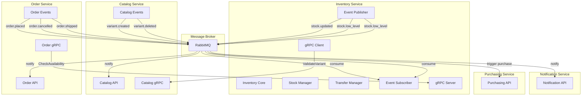
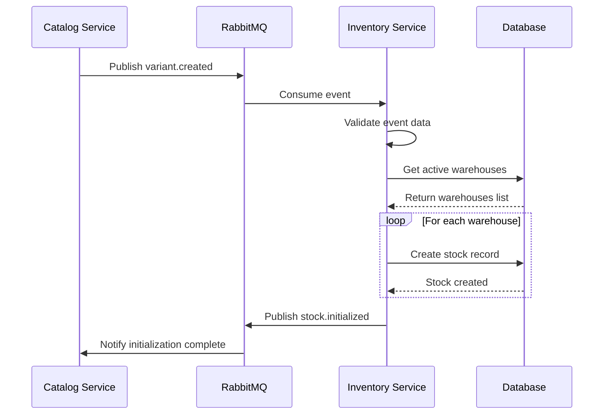
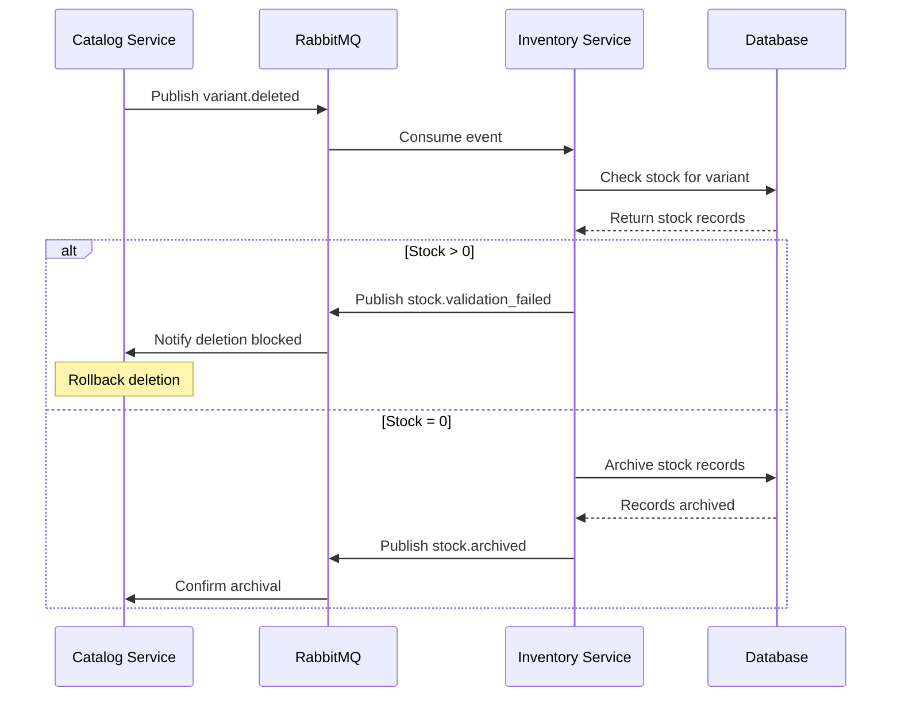
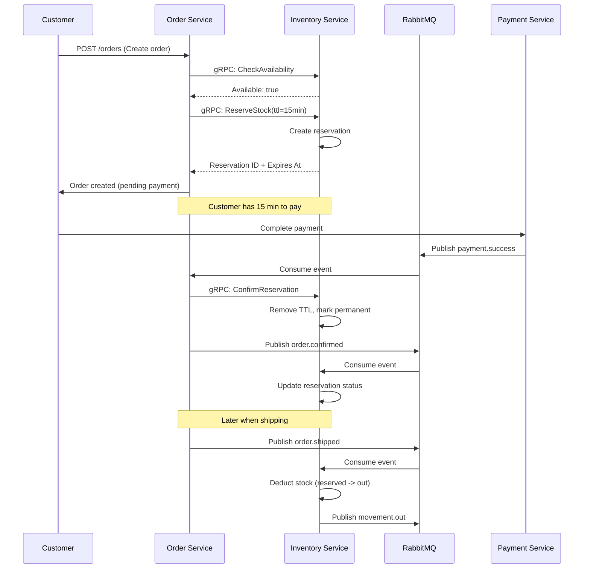
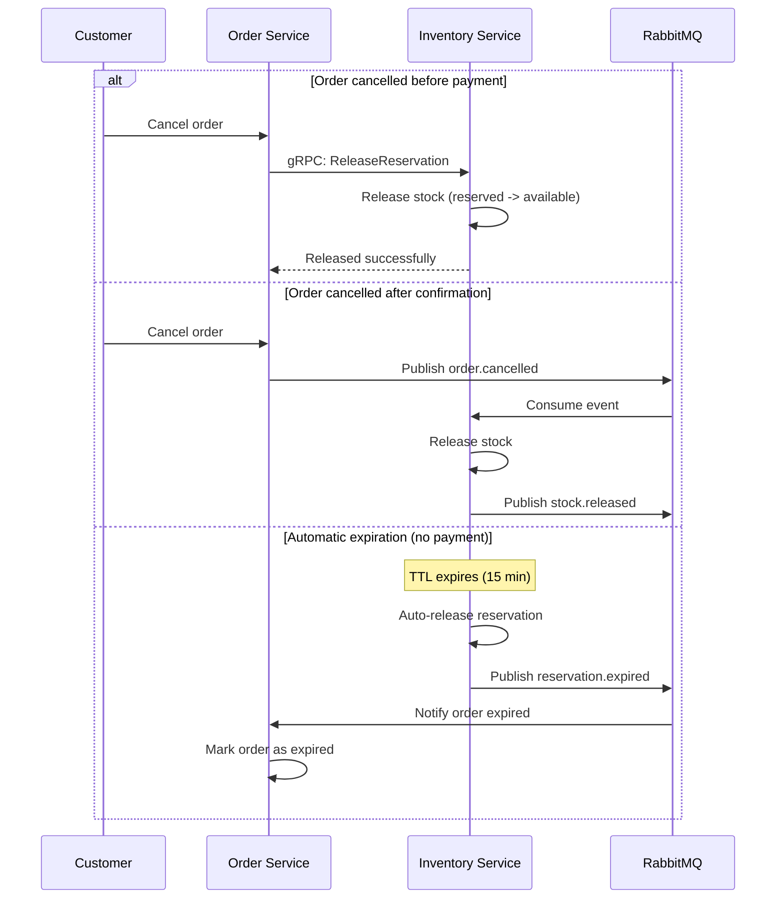
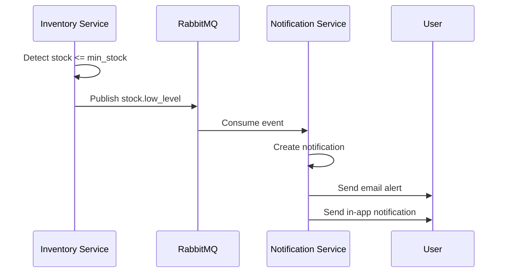
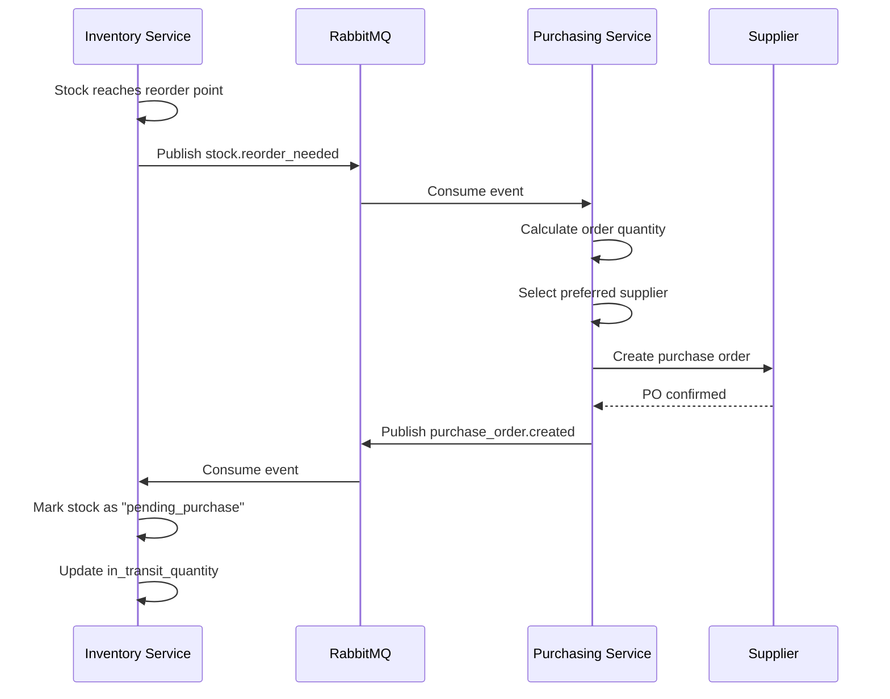

# Integraciones

Documentación completa de las integraciones del Inventory Service con otros microservicios del sistema ERP.

## Arquitectura de Integración



---

## Integración con Catalog Service

### Comunicación Asíncrona (RabbitMQ)

#### 1. Inicialización de Stock para Nueva Variante

**Trigger:** `catalog.variant.created`



**Event Flow:**

```json
// Input: catalog.variant.created
{
  "event": "catalog.variant.created",
  "data": {
    "variant_id": "var_789",
    "product_id": "prod_456",
    "sku": "PROD-001-RED-M",
    "track_inventory": true,
    "default_min_stock": 20,
    "default_max_stock": 200
  }
}

// Output: inventory.stock.initialized
{
  "event": "inventory.stock.initialized",
  "data": {
    "variant_id": "var_789",
    "warehouses": [
      {
        "warehouse_id": "wh_101",
        "stock_id": "stock_456",
        "initial_quantity": 0
      }
    ],
    "status": "success"
  }
}
```

#### 2. Validación antes de Eliminar Variante

**Trigger:** `catalog.variant.deleted`



**Validation Response:**

```json
// When stock exists (blocking deletion)
{
  "event": "inventory.stock.validation_failed",
  "data": {
    "variant_id": "var_789",
    "reason": "stock_not_zero",
    "details": {
      "total_stock": 45,
      "warehouses_affected": [
        {
          "warehouse_id": "wh_101",
          "quantity": 30
        },
        {
          "warehouse_id": "wh_102",
          "quantity": 15
        }
      ]
    },
    "action_required": "Clear all stock before deleting variant"
  }
}
```

### Comunicación Síncrona (gRPC)

#### Validación de Variante

**Service Definition:**

```protobuf
// catalog.proto
service CatalogService {
  rpc ValidateVariant(ValidateVariantRequest) returns (ValidateVariantResponse);
  rpc GetVariantDetails(VariantRequest) returns (VariantResponse);
  rpc CheckVariantActive(VariantRequest) returns (ActiveStatusResponse);
}

message ValidateVariantRequest {
  string organization_id = 1;
  string variant_id = 2;
}

message ValidateVariantResponse {
  bool exists = 1;
  bool is_active = 2;
  bool tracks_inventory = 3;
  string sku = 4;
  string product_name = 5;
}
```

**Client Implementation:**

```python
# inventory_service/grpc/catalog_client.py
from grpc import aio
from proto import catalog_pb2, catalog_pb2_grpc

class CatalogGrpcClient:
    def __init__(self, host: str, port: int):
        self.channel = aio.insecure_channel(f"{host}:{port}")
        self.stub = catalog_pb2_grpc.CatalogServiceStub(self.channel)

    async def validate_variant(
        self,
        organization_id: str,
        variant_id: str
    ) -> Dict[str, Any]:
        """
        Validate variant exists and is active before stock operations.
        """
        request = catalog_pb2.ValidateVariantRequest(
            organization_id=organization_id,
            variant_id=variant_id
        )

        try:
            response = await self.stub.ValidateVariant(
                request,
                timeout=5.0
            )

            return {
                'exists': response.exists,
                'is_active': response.is_active,
                'tracks_inventory': response.tracks_inventory,
                'sku': response.sku,
                'product_name': response.product_name
            }
        except grpc.RpcError as e:
            logger.error(f"gRPC error validating variant: {e.code()} - {e.details()}")
            raise

    async def close(self):
        await self.channel.close()

# Usage in stock service
async def create_stock_movement(
    variant_id: str,
    warehouse_id: str,
    quantity: int,
    organization_id: str
) -> StockMovement:
    # Validate variant via gRPC
    catalog_client = CatalogGrpcClient(
        host=settings.CATALOG_GRPC_HOST,
        port=settings.CATALOG_GRPC_PORT
    )

    variant_info = await catalog_client.validate_variant(
        organization_id=organization_id,
        variant_id=variant_id
    )

    if not variant_info['exists']:
        raise VariantNotFoundError(f"Variant {variant_id} does not exist")

    if not variant_info['is_active']:
        raise VariantInactiveError(f"Variant {variant_id} is inactive")

    if not variant_info['tracks_inventory']:
        raise InventoryNotTrackedError(
            f"Variant {variant_id} does not track inventory"
        )

    # Proceed with movement creation
    # ...
```

### Cache Synchronization

**Redis Cache Strategy:**

```python
# inventory_service/cache/variant_cache.py
import redis.asyncio as redis
from typing import Optional, Dict, Any

class VariantCache:
    """Cache for variant data from Catalog Service."""

    def __init__(self, redis_client: redis.Redis):
        self.redis = redis_client
        self.ttl = 3600  # 1 hour

    async def get_variant(self, variant_id: str) -> Optional[Dict[str, Any]]:
        """Get cached variant data."""
        key = f"variant:{variant_id}"
        data = await self.redis.get(key)

        if data:
            return json.loads(data)
        return None

    async def set_variant(self, variant_id: str, data: Dict[str, Any]) -> None:
        """Cache variant data."""
        key = f"variant:{variant_id}"
        await self.redis.setex(
            key,
            self.ttl,
            json.dumps(data)
        )

    async def invalidate_variant(self, variant_id: str) -> None:
        """Remove variant from cache."""
        key = f"variant:{variant_id}"
        await self.redis.delete(key)

# Event handler to invalidate cache
async def handle_variant_updated(event: Dict[str, Any]) -> None:
    """Invalidate cache when variant is updated in Catalog."""
    variant_id = event['data']['variant_id']
    await variant_cache.invalidate_variant(variant_id)
```

---

## Integración con Order Service

### Comunicación Síncrona (gRPC)

#### 1. Verificar Disponibilidad de Stock

**Service Definition:**

```protobuf
// inventory.proto
service InventoryService {
  rpc CheckAvailability(AvailabilityRequest) returns (AvailabilityResponse);
  rpc ReserveStock(ReserveStockRequest) returns (ReserveStockResponse);
  rpc ReleaseReservation(ReleaseRequest) returns (ReleaseResponse);
  rpc ConfirmReservation(ConfirmRequest) returns (ConfirmResponse);
}

message AvailabilityRequest {
  string organization_id = 1;
  repeated AvailabilityItem items = 2;
  string preferred_warehouse_id = 3;
}

message AvailabilityItem {
  string variant_id = 1;
  int32 quantity = 2;
}

message AvailabilityResponse {
  bool all_available = 1;
  repeated AvailabilityResult results = 2;
}

message AvailabilityResult {
  string variant_id = 1;
  int32 requested = 2;
  int32 available = 3;
  bool sufficient = 4;
  string warehouse_id = 5;
}
```

**Server Implementation:**

```python
# inventory_service/grpc/inventory_server.py
from proto import inventory_pb2, inventory_pb2_grpc

class InventoryServicer(inventory_pb2_grpc.InventoryServiceServicer):
    def __init__(self, stock_service: StockService):
        self.stock_service = stock_service

    async def CheckAvailability(
        self,
        request: inventory_pb2.AvailabilityRequest,
        context: grpc.aio.ServicerContext
    ) -> inventory_pb2.AvailabilityResponse:
        """
        Check stock availability for multiple items.
        Called by Order Service before confirming order.
        """
        organization_id = request.organization_id
        items = request.items
        preferred_warehouse = request.preferred_warehouse_id or None

        results = []
        all_available = True

        for item in items:
            variant_id = item.variant_id
            requested_qty = item.quantity

            # Find best warehouse with available stock
            stock = await self.stock_service.find_available_stock(
                variant_id=variant_id,
                quantity=requested_qty,
                organization_id=organization_id,
                preferred_warehouse_id=preferred_warehouse
            )

            if stock and stock.available_quantity >= requested_qty:
                results.append(inventory_pb2.AvailabilityResult(
                    variant_id=variant_id,
                    requested=requested_qty,
                    available=stock.available_quantity,
                    sufficient=True,
                    warehouse_id=stock.warehouse_id
                ))
            else:
                all_available = False
                results.append(inventory_pb2.AvailabilityResult(
                    variant_id=variant_id,
                    requested=requested_qty,
                    available=stock.available_quantity if stock else 0,
                    sufficient=False,
                    warehouse_id=stock.warehouse_id if stock else ""
                ))

        return inventory_pb2.AvailabilityResponse(
            all_available=all_available,
            results=results
        )

    async def ReserveStock(
        self,
        request: inventory_pb2.ReserveStockRequest,
        context: grpc.aio.ServicerContext
    ) -> inventory_pb2.ReserveStockResponse:
        """
        Create stock reservation for order.
        """
        try:
            reservation = await self.stock_service.create_reservation(
                order_id=request.order_id,
                organization_id=request.organization_id,
                items=[
                    {
                        'variant_id': item.variant_id,
                        'quantity': item.quantity,
                        'warehouse_id': item.warehouse_id
                    }
                    for item in request.items
                ],
                ttl_minutes=request.ttl_minutes
            )

            return inventory_pb2.ReserveStockResponse(
                success=True,
                reservation_id=reservation.reservation_id,
                expires_at=reservation.expires_at.isoformat()
            )

        except InsufficientStockError as e:
            context.set_code(grpc.StatusCode.FAILED_PRECONDITION)
            context.set_details(str(e))
            return inventory_pb2.ReserveStockResponse(
                success=False,
                error_message=str(e)
            )
```

#### 2. Flujo Completo de Orden



#### 3. Manejo de Cancelaciones



### Event-Based Integration

#### Order Events Consumed

```python
# Order event handlers
ORDER_EVENT_HANDLERS = {
    'order.placed': handle_order_placed,
    'order.confirmed': handle_order_confirmed,
    'order.cancelled': handle_order_cancelled,
    'order.shipped': handle_order_shipped,
    'order.returned': handle_order_returned
}

# Configuration
ORDER_EVENT_CONFIG = {
    'exchange': 'order_events',
    'queue': 'inventory_order_consumer',
    'routing_keys': [
        'order.placed',
        'order.confirmed',
        'order.cancelled',
        'order.shipped',
        'order.returned'
    ],
    'prefetch_count': 20
}
```

#### Inventory Events Published to Order Service

```python
# Events that Order Service consumes
ORDER_RELEVANT_EVENTS = [
    'inventory.stock.updated',      # Update product availability
    'inventory.stock.depleted',      # Mark product as out of stock
    'inventory.stock.released',      # Reservation expired/released
    'inventory.reservation.failed'   # Could not reserve stock
]
```

---

## Integración con Notification Service

### Low Stock Alerts



**Event Payload:**

```json
{
  "event": "inventory.stock.low_level",
  "data": {
    "stock_id": "stock_456",
    "variant_id": "var_789",
    "warehouse_id": "wh_101",
    "product_name": "Camiseta Roja M",
    "sku": "CAM-ROJA-M",
    "available_quantity": 15,
    "min_stock": 20,
    "reorder_point": 30,
    "shortage": 5,
    "alert_level": "warning",
    "warehouse_name": "Bodega Principal"
  },
  "notification_config": {
    "channels": ["email", "in_app"],
    "priority": "high",
    "recipients": ["inventory_manager", "purchasing_manager"]
  }
}
```

---

## Integración con Purchasing Service

### Automatic Reorder Triggers



**Reorder Event:**

```json
{
  "event": "inventory.stock.reorder_needed",
  "data": {
    "variant_id": "var_789",
    "warehouse_id": "wh_101",
    "current_stock": 18,
    "reorder_point": 30,
    "max_stock": 200,
    "suggested_order_quantity": 182,
    "last_supplier_id": "sup_456",
    "average_lead_time_days": 7
  }
}
```

---

## Health Checks & Circuit Breaker

### Service Health Monitoring

```python
# inventory_service/health/integration_health.py
from datetime import datetime, timedelta
from typing import Dict, Any

class IntegrationHealthCheck:
    """Monitor health of external service integrations."""

    def __init__(self):
        self.last_success = {}
        self.failure_count = {}
        self.circuit_breaker = {}

    async def check_catalog_service(self) -> Dict[str, Any]:
        """Check Catalog Service health via gRPC."""
        try:
            client = CatalogGrpcClient(
                host=settings.CATALOG_GRPC_HOST,
                port=settings.CATALOG_GRPC_PORT
            )
            # Test call
            response = await client.health_check(timeout=3.0)
            self.record_success('catalog')

            return {
                'service': 'catalog',
                'status': 'healthy',
                'response_time_ms': response.time,
                'last_check': datetime.utcnow().isoformat()
            }

        except Exception as e:
            self.record_failure('catalog')
            return {
                'service': 'catalog',
                'status': 'unhealthy',
                'error': str(e),
                'failure_count': self.failure_count.get('catalog', 0)
            }

    async def check_order_service(self) -> Dict[str, Any]:
        """Check Order Service can reach us via gRPC."""
        # Similar implementation
        pass

    def record_success(self, service: str) -> None:
        """Record successful service call."""
        self.last_success[service] = datetime.utcnow()
        self.failure_count[service] = 0
        if service in self.circuit_breaker:
            self.circuit_breaker[service] = False

    def record_failure(self, service: str) -> None:
        """Record failed service call."""
        self.failure_count[service] = self.failure_count.get(service, 0) + 1

        # Open circuit breaker after 5 failures
        if self.failure_count[service] >= 5:
            self.circuit_breaker[service] = True
            logger.error(f"Circuit breaker opened for {service}")

    def is_circuit_open(self, service: str) -> bool:
        """Check if circuit breaker is open."""
        return self.circuit_breaker.get(service, False)
```

### Graceful Degradation

```python
async def get_variant_info(variant_id: str) -> Dict[str, Any]:
    """
    Get variant info with fallback strategy.
    1. Try cache
    2. Try gRPC
    3. Use minimal data if both fail
    """
    # Try cache first
    cached = await variant_cache.get_variant(variant_id)
    if cached:
        return cached

    # Check circuit breaker
    if health_check.is_circuit_open('catalog'):
        logger.warning("Catalog circuit breaker open, using minimal data")
        return {
            'variant_id': variant_id,
            'exists': True,  # Assume exists
            'is_active': True,  # Allow operation
            'source': 'degraded'
        }

    # Try gRPC
    try:
        client = CatalogGrpcClient()
        variant = await client.get_variant_details(variant_id)
        await variant_cache.set_variant(variant_id, variant)
        return variant

    except Exception as e:
        logger.error(f"Failed to get variant info: {e}")
        # Return minimal data to allow operation
        return {
            'variant_id': variant_id,
            'exists': True,
            'is_active': True,
            'source': 'fallback',
            'error': str(e)
        }
```

---

## Rate Limiting & Retry Logic

### gRPC Retry Configuration

```python
# gRPC client with retry
from grpc import aio
from grpc_retry import RetryPolicy

retry_policy = RetryPolicy(
    max_attempts=3,
    initial_backoff=0.1,
    max_backoff=1.0,
    backoff_multiplier=2,
    retryable_status_codes=[
        grpc.StatusCode.UNAVAILABLE,
        grpc.StatusCode.DEADLINE_EXCEEDED
    ]
)

channel = aio.insecure_channel(
    f"{host}:{port}",
    options=[
        ('grpc.max_send_message_length', 10 * 1024 * 1024),
        ('grpc.max_receive_message_length', 10 * 1024 * 1024),
        ('grpc.service_config', json.dumps({
            'methodConfig': [{
                'name': [{}],
                'retryPolicy': {
                    'maxAttempts': 3,
                    'initialBackoff': '0.1s',
                    'maxBackoff': '1s',
                    'backoffMultiplier': 2,
                    'retryableStatusCodes': ['UNAVAILABLE', 'DEADLINE_EXCEEDED']
                }
            }]
        }))
    ]
)
```

---

## Testing Integrations

### Integration Test Examples

```python
# tests/integration/test_catalog_integration.py
import pytest
from unittest.mock import AsyncMock, patch

@pytest.mark.integration
async def test_variant_created_integration():
    """Test full flow of variant creation."""
    # Mock Catalog Service publishes event
    event = {
        'event': 'catalog.variant.created',
        'data': {
            'variant_id': 'test_var_123',
            'track_inventory': True,
            'default_min_stock': 10
        }
    }

    # Consume event
    await inventory_event_consumer.handle_event(event)

    # Verify stock initialized
    stock_records = await stock_service.get_by_variant('test_var_123')
    assert len(stock_records) > 0
    assert all(s.min_stock == 10 for s in stock_records)

@pytest.mark.integration
async def test_order_reserve_flow():
    """Test order reservation via gRPC."""
    # Setup
    variant_id = 'test_var_456'
    await create_test_stock(variant_id, warehouse_id='wh_101', quantity=100)

    # Mock Order Service calls gRPC
    client = InventoryGrpcClient()
    response = await client.ReserveStock(
        order_id='order_789',
        items=[{'variant_id': variant_id, 'quantity': 10}],
        ttl_minutes=15
    )

    assert response.success is True
    assert response.reservation_id is not None

    # Verify stock updated
    stock = await stock_service.get_stock(variant_id, 'wh_101')
    assert stock.reserved_quantity == 10
    assert stock.available_quantity == 90
```

---

## Próximos Pasos

- [Errores Comunes](./errores-comunes)
- [Flujos de Negocio](./flujos-negocio)
- [Arquitectura](./arquitectura)
