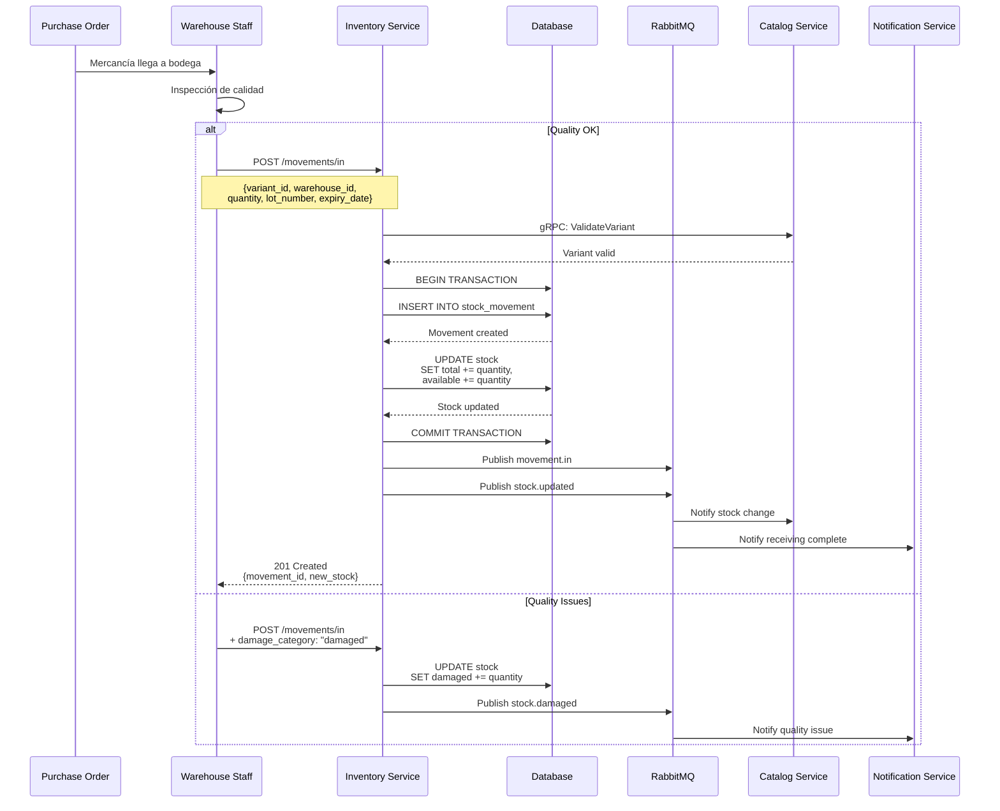
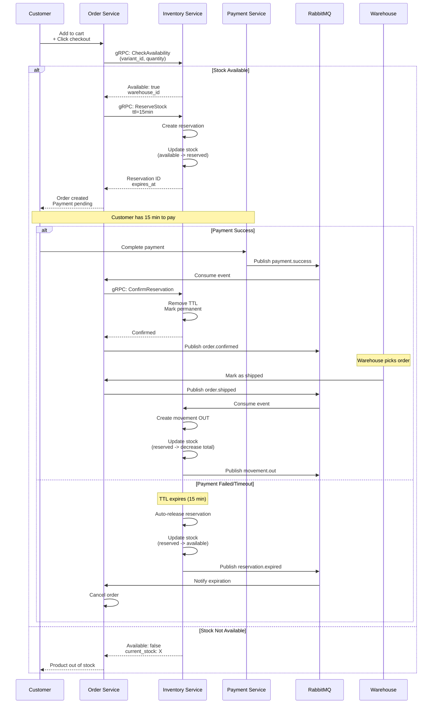
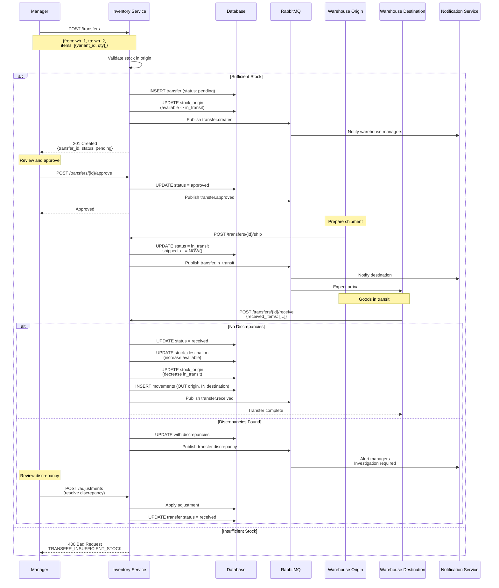
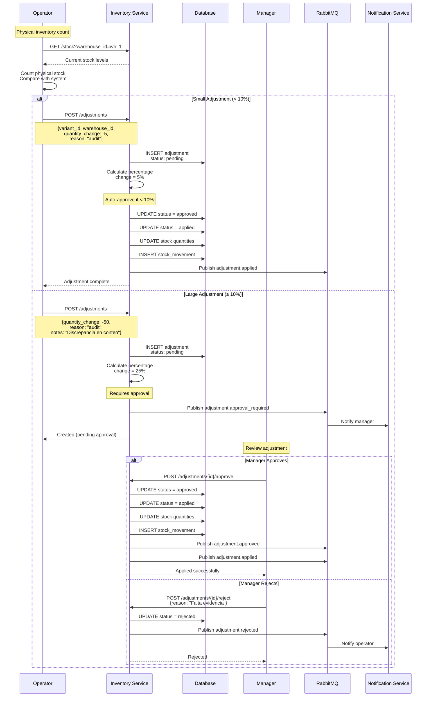
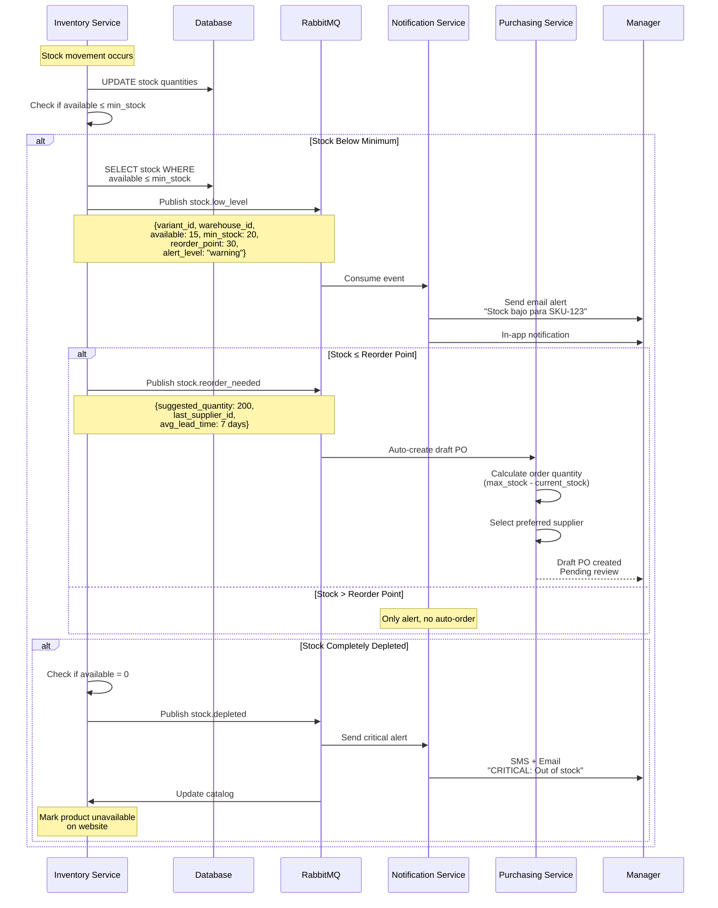
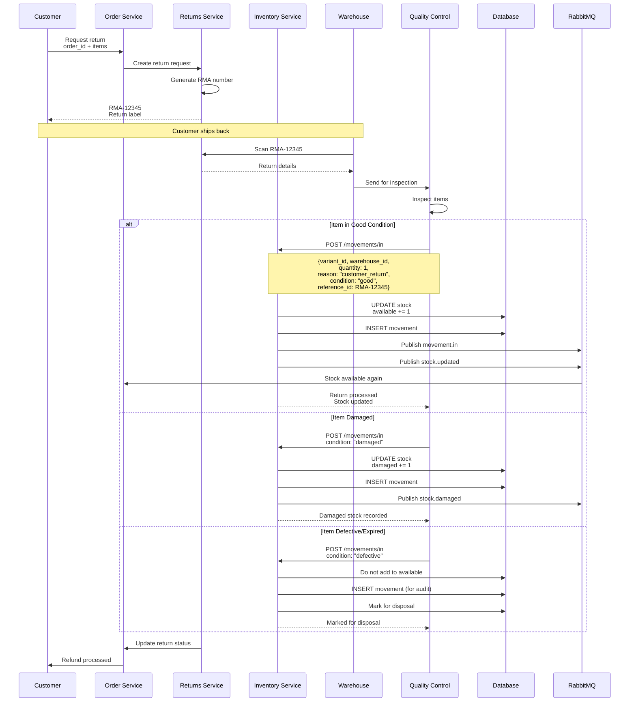
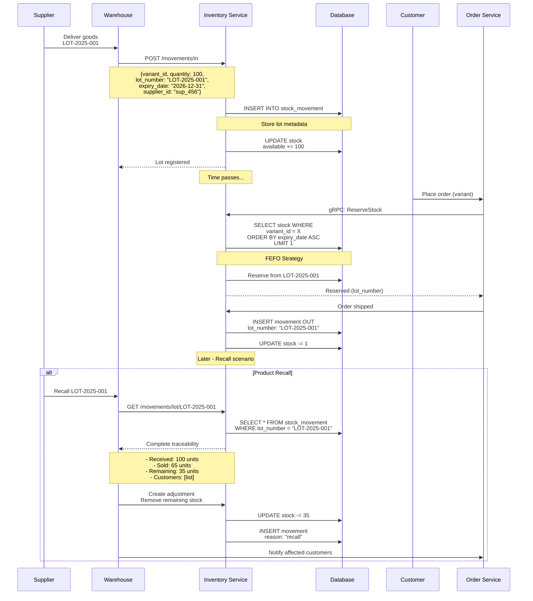
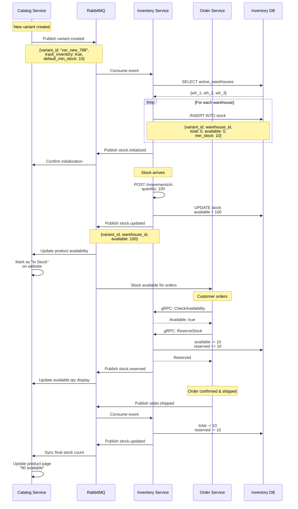

# Flujos de Negocio

Diagramas de secuencia que ilustran los flujos de negocio principales del Inventory Service.

## 1. Flujo de Ingreso de Mercancía (Purchase Order)

Proceso completo desde que llega una orden de compra hasta el registro en inventario.



**Validaciones:**

- Variante existe y está activa
- Bodega existe y está activa
- Número de lote único si se proporciona
- Fecha de vencimiento futura (si aplica)
- Capacidad de bodega no excedida

**Eventos Publicados:**

- `inventory.movement.in`
- `inventory.stock.updated`
- `inventory.stock.damaged` (si hay productos dañados)

---

## 2. Flujo de Reserva y Venta (E-commerce)

Proceso desde que un cliente hace una orden online hasta el despacho.



**Configuración:**

- **TTL Reserva:** 15 minutos (configurable)
- **Auto-release:** Automático al expirar TTL
- **Estrategia:** FIFO para selección de lote

---

## 3. Flujo de Transferencia entre Bodegas

Transferencia de mercancía de una bodega a otra con seguimiento completo.



**Estados de Transferencia:**

1. **pending** - Creada, esperando aprobación
2. **approved** - Aprobada, lista para envío
3. **in_transit** - En camino
4. **received** - Recibida en destino
5. **cancelled** - Cancelada

**Reglas de Negocio:**

- Transferencias mayores a $1000 requieren aprobación
- Discrepancias mayores a 5% requieren investigación
- Stock se marca como "in_transit" durante el traslado

---

## 4. Flujo de Ajuste de Inventario (Physical Count)

Ajuste manual después de un conteo físico de inventario.



**Umbrales de Aprobación:**

- **Auto-aprobado:** Cambio menor a 10% o menos de 10 unidades
- **Requiere aprobación:** Cambio mayor a 10% o más de 10 unidades
- **Requiere doble aprobación:** Cambio mayor a 50% o más de 100 unidades

**Motivos Válidos:**

- `audit` - Conteo físico
- `damaged` - Productos dañados
- `expired` - Productos vencidos
- `lost` - Pérdida/robo
- `found` - Encontrado (ajuste positivo)

---

## 5. Flujo de Stock Bajo Mínimo (Low Stock Alert)

Detección automática y notificación cuando el stock llega al nivel mínimo.



**Niveles de Alerta:**

- **Normal:** `available > min_stock`
- **Warning:** `min_stock ≥ available > reorder_point`
- **Critical:** `reorder_point ≥ available > 0`
- **Depleted:** `available = 0`

**Configuración:**

```python
stock_config = {
    'min_stock': 20,           # Nivel mínimo
    'reorder_point': 30,       # Punto de reorden automático
    'max_stock': 200,          # Nivel máximo
    'auto_reorder': True,      # Activar reorden automático
    'preferred_supplier_id': 'sup_123'
}
```

---

## 6. Flujo de Devolución de Cliente

Proceso completo de devolución desde el cliente hasta reingreso a inventario.



**Condiciones de Retorno:**

- **good** - Se devuelve a stock disponible
- **damaged** - Se marca como dañado
- **defective** - Se marca para disposal
- **expired** - No se reingresa

---

## 7. Flujo de Trazabilidad de Lote (Lot Tracking)

Seguimiento completo de un lote desde ingreso hasta venta.



**Estrategias de Selección:**

- **FIFO** (First In, First Out) - Por defecto
- **LIFO** (Last In, First Out) - Casos específicos
- **FEFO** (First Expired, First Out) - Productos perecederos

---

## 8. Flujo de Sincronización Multi-Servicio

Coordinación entre Inventory, Catalog y Order services.



---

## Mejores Prácticas

### 1. Manejo de Concurrencia

```python
# Optimistic locking para actualizaciones de stock
async def update_stock_with_version(
    stock_id: str,
    quantity_change: int,
    expected_version: int
) -> Stock:
    """
    Update stock with optimistic locking to prevent race conditions.
    """
    result = await db.execute(
        """
        UPDATE stock
        SET available_quantity = available_quantity + :qty_change,
            version = version + 1,
            updated_at = NOW()
        WHERE stock_id = :stock_id
        AND version = :expected_version
        RETURNING *
        """,
        {
            'stock_id': stock_id,
            'qty_change': quantity_change,
            'expected_version': expected_version
        }
    )

    if not result:
        raise ConcurrentModificationError(
            f"Stock {stock_id} was modified by another transaction"
        )

    return result
```

### 2. Event Idempotency

```python
async def handle_order_shipped(event: Dict[str, Any]) -> None:
    """
    Handle order.shipped event idempotently.
    """
    event_id = event['event_id']

    # Check if already processed
    if await event_log.exists(event_id):
        logger.info(f"Event {event_id} already processed")
        return

    try:
        # Process event
        await process_shipment(event['data'])

        # Mark as processed
        await event_log.mark_processed(event_id)

    except Exception as e:
        await event_log.mark_failed(event_id, error=str(e))
        raise
```

### 3. Transacciones Distribuidas (Saga Pattern)

```python
# Saga for transfer between warehouses
class TransferSaga:
    async def execute(self, transfer_id: str):
        """Execute transfer saga with compensating actions."""
        try:
            # Step 1: Reserve in origin
            await self.reserve_stock_origin(transfer_id)

            # Step 2: Ship
            await self.mark_as_shipped(transfer_id)

            # Step 3: Receive in destination
            await self.receive_stock_destination(transfer_id)

            # Step 4: Complete
            await self.complete_transfer(transfer_id)

        except Exception as e:
            # Compensate
            await self.compensate(transfer_id, failed_step=e.step)
            raise

    async def compensate(self, transfer_id: str, failed_step: str):
        """Rollback changes on failure."""
        if failed_step in ['reserve', 'ship']:
            # Release reserved stock
            await self.release_reservation(transfer_id)
```

### 4. Monitoring de Flujos

```python
# Prometheus metrics for business flows
transfer_duration = Histogram(
    'inventory_transfer_duration_seconds',
    'Time to complete transfer',
    ['from_warehouse', 'to_warehouse']
)

reservation_expiry_rate = Counter(
    'inventory_reservation_expired_total',
    'Number of expired reservations',
    ['warehouse']
)

stock_alert_frequency = Gauge(
    'inventory_low_stock_alerts_active',
    'Number of active low stock alerts',
    ['warehouse', 'alert_level']
)
```

---

## Próximos Pasos

- [Arquitectura](./arquitectura)
- [Errores Comunes](./errores-comunes)
- [Eventos Publicados](./eventos-publicados)
