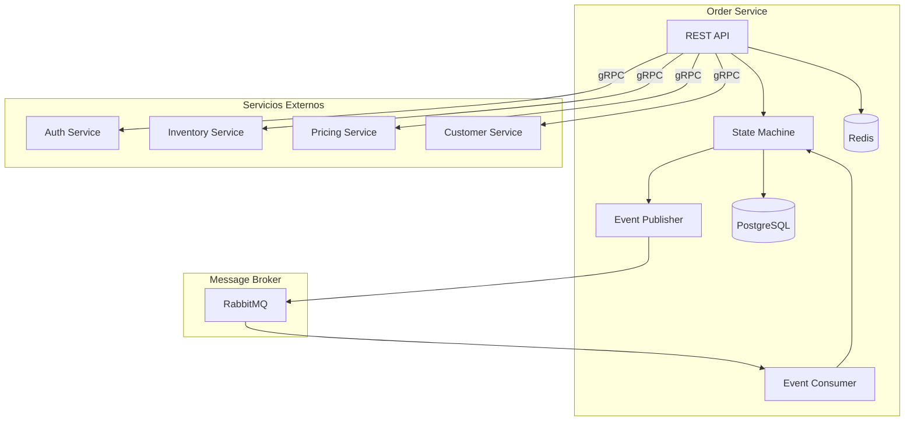

# Arquitectura

## Visión General

Order Service implementa una arquitectura basada en eventos con máquina de estados para gestionar el ciclo de vida completo de las órdenes.



## Componentes Principales

### State Machine

La máquina de estados controla las transiciones válidas de las órdenes:

```
pending → confirmed → processing → shipped → delivered
                  ↘ cancelled ↙
```

### Event Publisher

Publica eventos a RabbitMQ cuando cambia el estado de una orden:
- `order.created`
- `order.confirmed`
- `order.cancelled`
- `order.shipped`
- `order.delivered`

### Event Consumer

Consume eventos de otros servicios:
- `inventory.stock.reserved` → Confirmar disponibilidad
- `payment.succeeded` → Confirmar orden
- `payment.failed` → Cancelar orden

## Integraciones gRPC

| Servicio | Método | Propósito |
|----------|--------|-----------|
| Auth Service | `VerifyToken()` | Validar JWT |
| Inventory Service | `CheckStock()` | Verificar disponibilidad |
| Inventory Service | `ReserveStock()` | Reservar productos |
| Pricing Service | `GetPrice()` | Obtener precios actuales |
| Customer Service | `GetCustomer()` | Información del cliente |

## Próximos Pasos

- [Modelo de Datos](./modelo-datos)
- [API Orders](./api-orders)
- [State Machine](./state-machine)
- [Eventos Publicados](./eventos-publicados)
