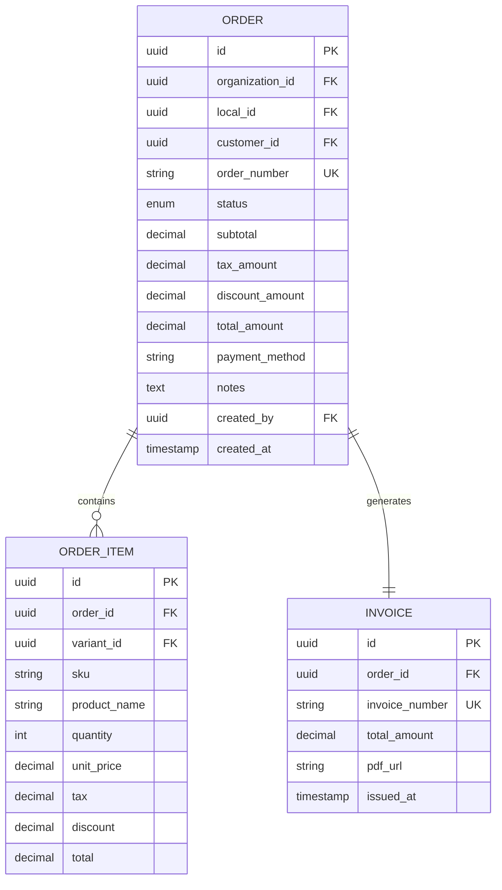
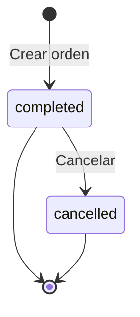

# Modelo de Datos

## Estándares de Tipos de Datos

> **Convención del ERP**: Todos los servicios usan tipos estandarizados para garantizar consistencia.
>
> | Tipo de Campo | Estándar | Descripción |
> |---------------|----------|-------------|
> | IDs primarios | `UUID` | Identificadores únicos universales |
> | Dinero | `DECIMAL(12,4)` | 12 dígitos, 4 decimales |
> | Tasas (%) | `DECIMAL(5,4)` | Ej: 0.0700 = 7% |
> | Cantidades | `DECIMAL(10,3)` | Para productos por peso |

Esquema simplificado de Order Service como sistema de **registro interno de ventas**.

## Concepto

Order Service NO gestiona:
- Pagos electrónicos (Stripe, PayPal)
- Delivery/envíos
- Tracking de pedidos
- Fulfillment/picking/packing
- Carritos de compra online

Order Service SÍ gestiona:
- Registro de ventas completadas
- Registro informativo del método de pago
- Generación de facturas internas
- Historial de órdenes por cliente

> **Importante**: El dinero se maneja externamente entre el negocio y el cliente. El sistema solo registra qué se vendió y genera la factura.

## Diagrama ER Simplificado



## Tablas

### Orders

Registro principal de ventas.

```sql
CREATE TABLE orders (
    id UUID PRIMARY KEY DEFAULT gen_random_uuid(),
    organization_id UUID NOT NULL,
    local_id UUID NOT NULL,
    customer_id UUID,  -- Opcional para ventas anónimas

    -- Identificador
    order_number VARCHAR(50) NOT NULL,

    -- Estado simple: solo completed o cancelled
    status VARCHAR(20) NOT NULL DEFAULT 'completed',

    -- Montos (DECIMAL(12,4) por estándar del ERP)
    subtotal DECIMAL(12,4) NOT NULL DEFAULT 0,
    tax_amount DECIMAL(12,4) NOT NULL DEFAULT 0,
    discount_amount DECIMAL(12,4) NOT NULL DEFAULT 0,
    total_amount DECIMAL(12,4) NOT NULL DEFAULT 0,

    -- Método de pago (solo informativo)
    payment_method VARCHAR(30),  -- cash, card, transfer, credit

    -- Metadata
    notes TEXT,

    -- Auditoría
    created_by UUID NOT NULL,
    created_at TIMESTAMP NOT NULL DEFAULT NOW(),
    cancelled_at TIMESTAMP,
    cancelled_by UUID,
    cancellation_reason TEXT,

    -- Constraints
    CONSTRAINT uk_order_number UNIQUE (organization_id, order_number),
    CONSTRAINT chk_status CHECK (status IN ('completed', 'cancelled')),
    CONSTRAINT chk_payment_method CHECK (
        payment_method IN ('cash', 'card', 'transfer', 'credit', 'mixed', 'other')
    ),
    CONSTRAINT chk_total_positive CHECK (total_amount >= 0)
);

-- Índices
CREATE INDEX idx_orders_org ON orders(organization_id);
CREATE INDEX idx_orders_local ON orders(local_id);
CREATE INDEX idx_orders_customer ON orders(customer_id);
CREATE INDEX idx_orders_status ON orders(status);
CREATE INDEX idx_orders_created_at ON orders(created_at DESC);
CREATE INDEX idx_orders_number ON orders(order_number);
```

### Order Items

Líneas de productos vendidos.

```sql
CREATE TABLE order_items (
    id UUID PRIMARY KEY DEFAULT gen_random_uuid(),
    order_id UUID NOT NULL,

    -- Producto
    variant_id UUID NOT NULL,
    sku VARCHAR(100) NOT NULL,
    product_name VARCHAR(255) NOT NULL,

    -- Cantidades y precios (estándares del ERP)
    quantity DECIMAL(10,3) NOT NULL,
    unit_price DECIMAL(12,4) NOT NULL,
    tax_rate DECIMAL(5,4) DEFAULT 0,
    tax_amount DECIMAL(12,4) DEFAULT 0,
    discount_amount DECIMAL(12,4) DEFAULT 0,
    total DECIMAL(12,4) NOT NULL,

    -- Snapshot de producto (opcional)
    product_snapshot JSONB,

    CONSTRAINT fk_order_item_order FOREIGN KEY (order_id)
        REFERENCES orders(id) ON DELETE CASCADE,
    CONSTRAINT chk_quantity_positive CHECK (quantity > 0),
    CONSTRAINT chk_unit_price_positive CHECK (unit_price >= 0)
);

CREATE INDEX idx_order_items_order ON order_items(order_id);
CREATE INDEX idx_order_items_variant ON order_items(variant_id);
CREATE INDEX idx_order_items_sku ON order_items(sku);
```

### Invoices

Facturas generadas por el sistema.

```sql
CREATE TABLE invoices (
    id UUID PRIMARY KEY DEFAULT gen_random_uuid(),
    organization_id UUID NOT NULL,
    order_id UUID NOT NULL UNIQUE,

    -- Número de factura
    invoice_number VARCHAR(50) NOT NULL,

    -- Datos fiscales del cliente (opcional)
    customer_tax_id VARCHAR(50),
    customer_tax_name VARCHAR(255),
    customer_address TEXT,

    -- Montos (copiados de orden, DECIMAL(12,4) estándar)
    subtotal DECIMAL(12,4) NOT NULL,
    tax_amount DECIMAL(12,4) NOT NULL,
    total_amount DECIMAL(12,4) NOT NULL,

    -- Documentos generados
    pdf_url TEXT,

    -- Timestamps
    issued_at TIMESTAMP NOT NULL DEFAULT NOW(),
    created_at TIMESTAMP NOT NULL DEFAULT NOW(),

    CONSTRAINT fk_invoice_order FOREIGN KEY (order_id)
        REFERENCES orders(id),
    CONSTRAINT uk_invoice_number UNIQUE (organization_id, invoice_number)
);

CREATE INDEX idx_invoices_org ON invoices(organization_id);
CREATE INDEX idx_invoices_order ON invoices(order_id);
CREATE INDEX idx_invoices_number ON invoices(invoice_number);
CREATE INDEX idx_invoices_issued_at ON invoices(issued_at DESC);
```

## Estados de Orden

Solo 2 estados posibles:



| Estado | Descripción |
|--------|-------------|
| `completed` | Venta registrada exitosamente |
| `cancelled` | Orden anulada (requiere motivo) |

## Métodos de Pago (Informativos)

El método de pago es solo informativo, el sistema no procesa pagos:

| Método | Descripción |
|--------|-------------|
| `cash` | Efectivo |
| `card` | Tarjeta (débito/crédito) |
| `transfer` | Transferencia bancaria |
| `credit` | Crédito del cliente |
| `mixed` | Combinación de métodos |
| `other` | Otro método |

## Ejemplo de Datos

### Crear una venta

```sql
-- Insertar orden
INSERT INTO orders (
    id, organization_id, local_id, customer_id,
    order_number, status, subtotal, tax_amount,
    discount_amount, total_amount, payment_method,
    created_by
) VALUES (
    gen_random_uuid(),
    'org_123',
    'local_001',
    'cust_456',
    'ORD-2025-0001',
    'completed',
    100.00,
    12.00,
    0.00,
    112.00,
    'cash',
    'user_789'
);

-- Insertar items
INSERT INTO order_items (
    order_id, variant_id, sku, product_name,
    quantity, unit_price, tax_rate, tax_amount, total
) VALUES
    ('order_id', 'var_001', 'CAFE-001', 'Café Latte', 2, 25.00, 12, 6.00, 56.00),
    ('order_id', 'var_002', 'CAKE-001', 'Pastel Chocolate', 1, 50.00, 12, 6.00, 56.00);
```

### Cancelar una orden

```sql
UPDATE orders
SET
    status = 'cancelled',
    cancelled_at = NOW(),
    cancelled_by = 'user_admin',
    cancellation_reason = 'Cliente solicitó cancelación'
WHERE id = 'order_id'
  AND organization_id = 'org_123';
```

## Queries Comunes

### Ventas del día por local

```sql
SELECT
    o.local_id,
    COUNT(*) as total_orders,
    SUM(o.total_amount) as total_sales,
    o.payment_method,
    COUNT(*) as count_by_method
FROM orders o
WHERE o.organization_id = $1
  AND o.status = 'completed'
  AND o.created_at::date = CURRENT_DATE
GROUP BY o.local_id, o.payment_method
ORDER BY o.local_id;
```

### Historial de compras de cliente

```sql
SELECT
    o.order_number,
    o.created_at,
    o.total_amount,
    o.payment_method,
    array_agg(json_build_object(
        'product', oi.product_name,
        'quantity', oi.quantity,
        'total', oi.total
    )) as items
FROM orders o
JOIN order_items oi ON o.id = oi.order_id
WHERE o.organization_id = $1
  AND o.customer_id = $2
  AND o.status = 'completed'
GROUP BY o.id
ORDER BY o.created_at DESC
LIMIT 20;
```

### Resumen de ventas por período

```sql
SELECT
    date_trunc('day', created_at) as fecha,
    COUNT(*) as num_ordenes,
    SUM(total_amount) as total_ventas,
    AVG(total_amount) as ticket_promedio
FROM orders
WHERE organization_id = $1
  AND local_id = $2
  AND status = 'completed'
  AND created_at BETWEEN $3 AND $4
GROUP BY date_trunc('day', created_at)
ORDER BY fecha DESC;
```

## SQLAlchemy Models

```python
from sqlalchemy import Column, String, Numeric, Integer, ForeignKey, Text
from sqlalchemy.dialects.postgresql import UUID, JSONB
from sqlalchemy.orm import relationship
import uuid

class Order(Base):
    __tablename__ = "orders"

    id = Column(UUID(as_uuid=True), primary_key=True, default=uuid.uuid4)
    organization_id = Column(UUID(as_uuid=True), nullable=False)
    local_id = Column(UUID(as_uuid=True), nullable=False)
    customer_id = Column(UUID(as_uuid=True))

    order_number = Column(String(50), nullable=False)
    status = Column(String(20), nullable=False, default='completed')

    subtotal = Column(Numeric(12, 4), nullable=False, default=0)
    tax_amount = Column(Numeric(12, 4), nullable=False, default=0)
    discount_amount = Column(Numeric(12, 4), nullable=False, default=0)
    total_amount = Column(Numeric(12, 4), nullable=False, default=0)

    payment_method = Column(String(30))
    notes = Column(Text)

    created_by = Column(UUID(as_uuid=True), nullable=False)
    created_at = Column(DateTime, nullable=False, default=datetime.utcnow)
    cancelled_at = Column(DateTime)
    cancelled_by = Column(UUID(as_uuid=True))
    cancellation_reason = Column(Text)

    # Relationships
    items = relationship("OrderItem", back_populates="order", cascade="all, delete-orphan")
    invoice = relationship("Invoice", back_populates="order", uselist=False)


class OrderItem(Base):
    __tablename__ = "order_items"

    id = Column(UUID(as_uuid=True), primary_key=True, default=uuid.uuid4)
    order_id = Column(UUID(as_uuid=True), ForeignKey("orders.id"), nullable=False)

    variant_id = Column(UUID(as_uuid=True), nullable=False)
    sku = Column(String(100), nullable=False)
    product_name = Column(String(255), nullable=False)

    quantity = Column(Numeric(10, 3), nullable=False)
    unit_price = Column(Numeric(12, 4), nullable=False)
    tax_rate = Column(Numeric(5, 4), default=0)
    tax_amount = Column(Numeric(12, 4), default=0)
    discount_amount = Column(Numeric(12, 4), default=0)
    total = Column(Numeric(12, 4), nullable=False)

    product_snapshot = Column(JSONB)

    # Relationships
    order = relationship("Order", back_populates="items")


class Invoice(Base):
    __tablename__ = "invoices"

    id = Column(UUID(as_uuid=True), primary_key=True, default=uuid.uuid4)
    organization_id = Column(UUID(as_uuid=True), nullable=False)
    order_id = Column(UUID(as_uuid=True), ForeignKey("orders.id"), nullable=False, unique=True)

    invoice_number = Column(String(50), nullable=False)

    customer_tax_id = Column(String(50))
    customer_tax_name = Column(String(255))
    customer_address = Column(Text)

    subtotal = Column(Numeric(12, 4), nullable=False)
    tax_amount = Column(Numeric(12, 4), nullable=False)
    total_amount = Column(Numeric(12, 4), nullable=False)

    pdf_url = Column(Text)

    issued_at = Column(DateTime, nullable=False, default=datetime.utcnow)
    created_at = Column(DateTime, nullable=False, default=datetime.utcnow)

    # Relationships
    order = relationship("Order", back_populates="invoice")
```

## Pydantic Schemas

```python
from pydantic import BaseModel
from decimal import Decimal
from datetime import datetime

class OrderItemCreate(BaseModel):
    variant_id: str
    sku: str
    product_name: str
    quantity: int
    unit_price: Decimal
    tax_rate: Decimal = Decimal("0")
    discount_amount: Decimal = Decimal("0")

class OrderCreate(BaseModel):
    local_id: str
    customer_id: str | None = None
    payment_method: str = "cash"
    items: list[OrderItemCreate]
    notes: str | None = None

class OrderResponse(BaseModel):
    id: str
    order_number: str
    status: str
    customer_id: str | None
    local_id: str
    subtotal: Decimal
    tax_amount: Decimal
    discount_amount: Decimal
    total_amount: Decimal
    payment_method: str | None
    items: list[OrderItemResponse]
    created_at: datetime
    created_by: str

class OrderCancelRequest(BaseModel):
    reason: str
```

## Próximos Pasos

- [API Orders](./04-api-orders.md)
- [Eventos Publicados](./11-eventos-publicados.md)
- [Flujo de Venta Completo](/flujos-negocio/flujo-venta-completo)
