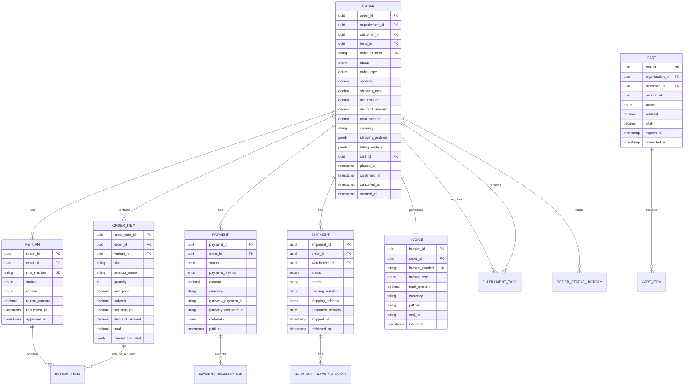

# Modelo de Datos

Esquema completo de la base de datos del Order Service con entidades, relaciones e índices.

## Diagrama ER



## Entidades Principales

### 1. Order (orders)

Tabla principal de órdenes de venta.

```sql
CREATE TABLE orders (
    order_id UUID PRIMARY KEY DEFAULT gen_random_uuid(),
    organization_id UUID NOT NULL,
    customer_id UUID NOT NULL,
    local_id UUID NOT NULL,

    -- Identificadores
    order_number VARCHAR(50) NOT NULL UNIQUE,
    cart_id UUID,
    reservation_id UUID,  -- FK a Inventory Service (reservation)

    -- Estado
    status VARCHAR(30) NOT NULL DEFAULT 'pending',
    order_type VARCHAR(20) NOT NULL DEFAULT 'online',
    version INTEGER NOT NULL DEFAULT 1,  -- Para optimistic locking

    -- Montos
    subtotal DECIMAL(12, 2) NOT NULL DEFAULT 0.00,
    shipping_cost DECIMAL(12, 2) NOT NULL DEFAULT 0.00,
    tax_amount DECIMAL(12, 2) NOT NULL DEFAULT 0.00,
    discount_amount DECIMAL(12, 2) NOT NULL DEFAULT 0.00,
    total_amount DECIMAL(12, 2) NOT NULL DEFAULT 0.00,
    currency VARCHAR(3) NOT NULL DEFAULT 'USD',

    -- Direcciones (JSONB)
    shipping_address JSONB NOT NULL,
    billing_address JSONB NOT NULL,

    -- Método de envío
    shipping_method VARCHAR(50),
    shipping_carrier VARCHAR(50),

    -- Metadata
    notes TEXT,
    internal_notes TEXT,
    customer_notes TEXT,
    tags VARCHAR(255)[],
    metadata JSONB,

    -- Timestamps
    placed_at TIMESTAMP NOT NULL DEFAULT NOW(),
    confirmed_at TIMESTAMP,
    cancelled_at TIMESTAMP,
    created_at TIMESTAMP NOT NULL DEFAULT NOW(),
    updated_at TIMESTAMP,

    -- Constraints
    CONSTRAINT check_total_amount CHECK (total_amount >= 0),
    CONSTRAINT check_subtotal CHECK (subtotal >= 0),
    CONSTRAINT check_valid_status CHECK (
        status IN (
            'cart', 'pending', 'payment_pending', 'payment_failed',
            'confirmed', 'processing', 'ready_to_ship', 'shipped',
            'delivered', 'cancelled', 'return_requested', 'returned', 'refunded'
        )
    ),
    CONSTRAINT check_valid_order_type CHECK (
        order_type IN ('online', 'pos', 'phone', 'b2b', 'subscription')
    )
);

-- Índices
CREATE INDEX idx_orders_organization ON orders(organization_id);
CREATE INDEX idx_orders_customer ON orders(customer_id);
CREATE INDEX idx_orders_status ON orders(status);
CREATE INDEX idx_orders_placed_at ON orders(placed_at DESC);
CREATE INDEX idx_orders_order_number ON orders(order_number);
CREATE INDEX idx_orders_local ON orders(local_id);
```

### 2. OrderItem (order_items)

Líneas de productos en la orden.

```sql
CREATE TABLE order_items (
    order_item_id UUID PRIMARY KEY DEFAULT gen_random_uuid(),
    order_id UUID NOT NULL REFERENCES orders(order_id) ON DELETE CASCADE,

    -- Producto
    variant_id UUID NOT NULL,
    sku VARCHAR(100) NOT NULL,
    product_name VARCHAR(255) NOT NULL,

    -- Cantidades y precios
    quantity INTEGER NOT NULL CHECK (quantity > 0),
    unit_price DECIMAL(12, 2) NOT NULL CHECK (unit_price >= 0),
    subtotal DECIMAL(12, 2) NOT NULL,
    tax_amount DECIMAL(12, 2) NOT NULL DEFAULT 0.00,
    discount_amount DECIMAL(12, 2) NOT NULL DEFAULT 0.00,
    total DECIMAL(12, 2) NOT NULL,

    -- Snapshot del producto al momento de la orden
    variant_snapshot JSONB,

    -- Fulfillment
    warehouse_id UUID,
    fulfillment_status VARCHAR(30) DEFAULT 'pending',

    -- Metadata
    notes TEXT,
    created_at TIMESTAMP NOT NULL DEFAULT NOW(),

    CONSTRAINT check_item_total CHECK (total >= 0)
);

CREATE INDEX idx_order_items_order ON order_items(order_id);
CREATE INDEX idx_order_items_variant ON order_items(variant_id);
CREATE INDEX idx_order_items_sku ON order_items(sku);
```

### 3. Cart (carts)

Carritos de compra.

```sql
CREATE TABLE carts (
    cart_id UUID PRIMARY KEY DEFAULT gen_random_uuid(),
    organization_id UUID NOT NULL,
    customer_id UUID,
    session_id VARCHAR(255),

    -- Estado
    status VARCHAR(20) NOT NULL DEFAULT 'active',

    -- Totales
    subtotal DECIMAL(12, 2) NOT NULL DEFAULT 0.00,
    total DECIMAL(12, 2) NOT NULL DEFAULT 0.00,
    items_count INTEGER NOT NULL DEFAULT 0,

    -- Metadata
    metadata JSONB,

    -- Expiración
    expires_at TIMESTAMP NOT NULL,
    converted_to_order_id UUID REFERENCES orders(order_id),
    converted_at TIMESTAMP,

    -- Timestamps
    created_at TIMESTAMP NOT NULL DEFAULT NOW(),
    updated_at TIMESTAMP,
    last_activity_at TIMESTAMP NOT NULL DEFAULT NOW(),

    CONSTRAINT check_cart_status CHECK (
        status IN ('active', 'abandoned', 'converted', 'expired')
    )
);

CREATE INDEX idx_carts_customer ON carts(customer_id);
CREATE INDEX idx_carts_session ON carts(session_id);
CREATE INDEX idx_carts_status ON carts(status);
CREATE INDEX idx_carts_expires_at ON carts(expires_at);
```

### 4. CartItem (cart_items)

Productos en el carrito.

```sql
CREATE TABLE cart_items (
    cart_item_id UUID PRIMARY KEY DEFAULT gen_random_uuid(),
    cart_id UUID NOT NULL REFERENCES carts(cart_id) ON DELETE CASCADE,

    variant_id UUID NOT NULL,
    sku VARCHAR(100) NOT NULL,
    product_name VARCHAR(255) NOT NULL,

    quantity INTEGER NOT NULL CHECK (quantity > 0),
    unit_price DECIMAL(12, 2) NOT NULL,
    subtotal DECIMAL(12, 2) NOT NULL,

    created_at TIMESTAMP NOT NULL DEFAULT NOW(),
    updated_at TIMESTAMP
);

CREATE INDEX idx_cart_items_cart ON cart_items(cart_id);
CREATE INDEX idx_cart_items_variant ON cart_items(variant_id);
```

### 5. Payment (payments)

Transacciones de pago.

```sql
CREATE TABLE payments (
    payment_id UUID PRIMARY KEY DEFAULT gen_random_uuid(),
    organization_id UUID NOT NULL,
    order_id UUID NOT NULL REFERENCES orders(order_id),

    -- Estado
    status VARCHAR(30) NOT NULL DEFAULT 'pending',

    -- Método de pago
    payment_method VARCHAR(50) NOT NULL,
    payment_gateway VARCHAR(50),

    -- Montos
    amount DECIMAL(12, 2) NOT NULL CHECK (amount > 0),
    currency VARCHAR(3) NOT NULL DEFAULT 'USD',

    -- IDs del gateway
    gateway_payment_id VARCHAR(255),
    gateway_customer_id VARCHAR(255),
    gateway_charge_id VARCHAR(255),

    -- Detalles
    card_brand VARCHAR(50),
    card_last4 VARCHAR(4),

    -- Metadata del gateway
    metadata JSONB,
    error_code VARCHAR(100),
    error_message TEXT,

    -- Timestamps
    attempted_at TIMESTAMP,
    paid_at TIMESTAMP,
    failed_at TIMESTAMP,
    refunded_at TIMESTAMP,
    created_at TIMESTAMP NOT NULL DEFAULT NOW(),

    CONSTRAINT check_payment_status CHECK (
        status IN ('pending', 'processing', 'succeeded', 'failed', 'refunded', 'partially_refunded')
    ),
    CONSTRAINT check_payment_method CHECK (
        payment_method IN ('stripe', 'paypal', 'mercadopago', 'cash', 'transfer', 'pos')
    )
);

CREATE INDEX idx_payments_order ON payments(order_id);
CREATE INDEX idx_payments_status ON payments(status);
CREATE INDEX idx_payments_gateway_payment_id ON payments(gateway_payment_id);
```

### 6. Shipment (shipments)

Envíos y tracking.

```sql
CREATE TABLE shipments (
    shipment_id UUID PRIMARY KEY DEFAULT gen_random_uuid(),
    organization_id UUID NOT NULL,
    order_id UUID NOT NULL REFERENCES orders(order_id),
    warehouse_id UUID NOT NULL,

    -- Estado
    status VARCHAR(30) NOT NULL DEFAULT 'pending',

    -- Carrier
    carrier VARCHAR(100),
    carrier_service VARCHAR(100),
    tracking_number VARCHAR(255),
    tracking_url TEXT,

    -- Dirección
    shipping_address JSONB NOT NULL,

    -- Costos
    shipping_cost DECIMAL(12, 2),
    carrier_cost DECIMAL(12, 2),

    -- Fechas
    estimated_delivery_date DATE,
    shipped_at TIMESTAMP,
    delivered_at TIMESTAMP,
    failed_at TIMESTAMP,

    -- Metadata
    label_url TEXT,
    metadata JSONB,
    notes TEXT,

    created_at TIMESTAMP NOT NULL DEFAULT NOW(),
    updated_at TIMESTAMP,

    CONSTRAINT check_shipment_status CHECK (
        status IN ('pending', 'label_created', 'dispatched', 'in_transit', 'out_for_delivery', 'delivered', 'failed', 'returned')
    )
);

CREATE INDEX idx_shipments_order ON shipments(order_id);
CREATE INDEX idx_shipments_tracking_number ON shipments(tracking_number);
CREATE INDEX idx_shipments_status ON shipments(status);
```

### 7. Return (returns)

Devoluciones de productos.

```sql
CREATE TABLE returns (
    return_id UUID PRIMARY KEY DEFAULT gen_random_uuid(),
    organization_id UUID NOT NULL,
    order_id UUID NOT NULL REFERENCES orders(order_id),

    -- RMA
    rma_number VARCHAR(50) NOT NULL UNIQUE,

    -- Estado
    status VARCHAR(30) NOT NULL DEFAULT 'requested',

    -- Motivo
    reason VARCHAR(50) NOT NULL,
    reason_detail TEXT,

    -- Reembolso
    refund_amount DECIMAL(12, 2),
    refund_method VARCHAR(50),
    refund_status VARCHAR(30),

    -- Aprobación
    approved_by UUID,
    approved_at TIMESTAMP,
    rejected_by UUID,
    rejected_at TIMESTAMP,
    rejection_reason TEXT,

    -- Recepción
    received_at TIMESTAMP,
    inspected_at TIMESTAMP,
    inspection_notes TEXT,

    -- Timestamps
    requested_at TIMESTAMP NOT NULL DEFAULT NOW(),
    completed_at TIMESTAMP,
    created_at TIMESTAMP NOT NULL DEFAULT NOW(),

    CONSTRAINT check_return_status CHECK (
        status IN ('requested', 'approved', 'rejected', 'received', 'inspected', 'refunded', 'completed')
    ),
    CONSTRAINT check_return_reason CHECK (
        reason IN ('wrong_size', 'wrong_product', 'defective', 'damaged', 'not_as_described', 'changed_mind', 'other')
    )
);

CREATE INDEX idx_returns_order ON returns(order_id);
CREATE INDEX idx_returns_rma_number ON returns(rma_number);
CREATE INDEX idx_returns_status ON returns(status);
```

### 8. Invoice (invoices)

Facturas electrónicas.

```sql
CREATE TABLE invoices (
    invoice_id UUID PRIMARY KEY DEFAULT gen_random_uuid(),
    organization_id UUID NOT NULL,
    order_id UUID NOT NULL REFERENCES orders(order_id),

    -- Número de factura
    invoice_number VARCHAR(50) NOT NULL UNIQUE,
    invoice_type VARCHAR(20) NOT NULL DEFAULT 'sale',

    -- Montos
    subtotal DECIMAL(12, 2) NOT NULL,
    tax_amount DECIMAL(12, 2) NOT NULL,
    total_amount DECIMAL(12, 2) NOT NULL,
    currency VARCHAR(3) NOT NULL DEFAULT 'USD',

    -- Documentos
    pdf_url TEXT,
    xml_url TEXT,

    -- Datos fiscales
    tax_id VARCHAR(50),
    tax_name VARCHAR(255),
    fiscal_address JSONB,

    -- Estado tributario
    tax_authority_status VARCHAR(50),
    tax_authority_id VARCHAR(255),
    tax_authority_response JSONB,

    -- Fechas
    issued_at TIMESTAMP NOT NULL,
    due_at TIMESTAMP,
    sent_at TIMESTAMP,
    paid_at TIMESTAMP,

    created_at TIMESTAMP NOT NULL DEFAULT NOW(),

    CONSTRAINT check_invoice_type CHECK (
        invoice_type IN ('sale', 'credit_note', 'debit_note', 'proforma')
    )
);

CREATE INDEX idx_invoices_order ON invoices(order_id);
CREATE INDEX idx_invoices_invoice_number ON invoices(invoice_number);
CREATE INDEX idx_invoices_issued_at ON invoices(issued_at DESC);
```

### 9. ReturnItem (return_items)

Items específicos de una devolución.

```sql
CREATE TABLE return_items (
    return_item_id UUID PRIMARY KEY DEFAULT gen_random_uuid(),
    return_id UUID NOT NULL REFERENCES returns(return_id) ON DELETE CASCADE,
    order_item_id UUID NOT NULL REFERENCES order_items(order_item_id),
    variant_id UUID NOT NULL,

    -- Cantidades
    quantity INTEGER NOT NULL CHECK (quantity > 0),

    -- Condición
    condition VARCHAR(30),
    reason VARCHAR(255),

    -- Reembolso
    refund_amount DECIMAL(12, 2),

    -- Inspección
    inspected_quantity INTEGER DEFAULT 0,
    approved_quantity INTEGER DEFAULT 0,
    rejected_quantity INTEGER DEFAULT 0,
    inspection_notes TEXT,

    created_at TIMESTAMP NOT NULL DEFAULT NOW()
);

CREATE INDEX idx_return_items_return ON return_items(return_id);
CREATE INDEX idx_return_items_order_item ON return_items(order_item_id);
CREATE INDEX idx_return_items_variant ON return_items(variant_id);
```

### 10. ShipmentTrackingEvent (shipment_tracking_events)

Historial de eventos de tracking.

```sql
CREATE TABLE shipment_tracking_events (
    tracking_event_id UUID PRIMARY KEY DEFAULT gen_random_uuid(),
    shipment_id UUID NOT NULL REFERENCES shipments(shipment_id) ON DELETE CASCADE,

    -- Estado
    status VARCHAR(50) NOT NULL,
    status_description TEXT,

    -- Ubicación
    location VARCHAR(255),
    location_city VARCHAR(100),
    location_state VARCHAR(100),
    location_country VARCHAR(3),

    -- Detalles
    carrier_status VARCHAR(100),
    carrier_status_code VARCHAR(50),

    -- Timestamp del evento
    event_timestamp TIMESTAMP NOT NULL,

    created_at TIMESTAMP NOT NULL DEFAULT NOW(),

    CONSTRAINT check_tracking_status CHECK (
        status IN ('pending', 'label_created', 'picked_up', 'in_transit', 'out_for_delivery',
                   'delivery_attempted', 'delivered', 'exception', 'failed', 'returned')
    )
);

CREATE INDEX idx_tracking_events_shipment ON shipment_tracking_events(shipment_id);
CREATE INDEX idx_tracking_events_timestamp ON shipment_tracking_events(event_timestamp DESC);
CREATE INDEX idx_tracking_events_status ON shipment_tracking_events(status);
```

### 11. FulfillmentTask (fulfillment_tasks)

Tareas de picking y packing.

```sql
CREATE TABLE fulfillment_tasks (
    task_id UUID PRIMARY KEY DEFAULT gen_random_uuid(),
    organization_id UUID NOT NULL,
    order_id UUID NOT NULL REFERENCES orders(order_id),
    warehouse_id UUID NOT NULL,

    -- Tipo de tarea
    task_type VARCHAR(30) NOT NULL,

    -- Estado
    status VARCHAR(30) NOT NULL DEFAULT 'pending',
    priority INTEGER DEFAULT 0,

    -- Asignación
    assigned_to UUID,
    assigned_at TIMESTAMP,

    -- Progreso
    items_total INTEGER NOT NULL,
    items_picked INTEGER DEFAULT 0,
    items_packed INTEGER DEFAULT 0,

    -- Timestamps
    started_at TIMESTAMP,
    completed_at TIMESTAMP,
    created_at TIMESTAMP NOT NULL DEFAULT NOW(),

    -- Metadata
    notes TEXT,
    metadata JSONB,

    CONSTRAINT check_task_type CHECK (
        task_type IN ('picking', 'packing', 'quality_check', 'label_printing')
    ),
    CONSTRAINT check_task_status CHECK (
        status IN ('pending', 'assigned', 'in_progress', 'completed', 'cancelled')
    )
);

CREATE INDEX idx_fulfillment_tasks_order ON fulfillment_tasks(order_id);
CREATE INDEX idx_fulfillment_tasks_warehouse ON fulfillment_tasks(warehouse_id);
CREATE INDEX idx_fulfillment_tasks_assigned_to ON fulfillment_tasks(assigned_to);
CREATE INDEX idx_fulfillment_tasks_status ON fulfillment_tasks(status);
```

### 12. OrderStatusHistory (order_status_history)

Historial de cambios de estado de órdenes.

```sql
CREATE TABLE order_status_history (
    history_id UUID PRIMARY KEY DEFAULT gen_random_uuid(),
    order_id UUID NOT NULL REFERENCES orders(order_id) ON DELETE CASCADE,

    -- Estado
    from_status VARCHAR(30),
    to_status VARCHAR(30) NOT NULL,

    -- Razón del cambio
    reason VARCHAR(255),
    notes TEXT,

    -- Usuario que realizó el cambio
    changed_by UUID,

    -- Metadata
    metadata JSONB,

    changed_at TIMESTAMP NOT NULL DEFAULT NOW(),

    CONSTRAINT check_from_status_valid CHECK (
        from_status IN (
            'cart', 'pending', 'payment_pending', 'payment_failed',
            'confirmed', 'processing', 'ready_to_ship', 'shipped',
            'delivered', 'cancelled', 'return_requested', 'returned', 'refunded'
        )
    ),
    CONSTRAINT check_to_status_valid CHECK (
        to_status IN (
            'cart', 'pending', 'payment_pending', 'payment_failed',
            'confirmed', 'processing', 'ready_to_ship', 'shipped',
            'delivered', 'cancelled', 'return_requested', 'returned', 'refunded'
        )
    )
);

CREATE INDEX idx_order_status_history_order ON order_status_history(order_id);
CREATE INDEX idx_order_status_history_changed_at ON order_status_history(changed_at DESC);
CREATE INDEX idx_order_status_history_to_status ON order_status_history(to_status);
```

### 13. PaymentTransaction (payment_transactions)

Registro detallado de transacciones con payment gateways.

```sql
CREATE TABLE payment_transactions (
    transaction_id UUID PRIMARY KEY DEFAULT gen_random_uuid(),
    payment_id UUID NOT NULL REFERENCES payments(payment_id) ON DELETE CASCADE,

    -- Tipo de transacción
    transaction_type VARCHAR(30) NOT NULL,

    -- Estado
    status VARCHAR(30) NOT NULL,

    -- Montos
    amount DECIMAL(12, 2) NOT NULL,
    currency VARCHAR(3) NOT NULL DEFAULT 'USD',

    -- Gateway
    gateway_transaction_id VARCHAR(255),
    gateway_response JSONB,

    -- Error
    error_code VARCHAR(100),
    error_message TEXT,

    -- Timestamps
    processed_at TIMESTAMP NOT NULL DEFAULT NOW(),
    created_at TIMESTAMP NOT NULL DEFAULT NOW(),

    CONSTRAINT check_transaction_type CHECK (
        transaction_type IN ('authorize', 'capture', 'charge', 'refund', 'void')
    ),
    CONSTRAINT check_transaction_status CHECK (
        status IN ('pending', 'processing', 'succeeded', 'failed')
    )
);

CREATE INDEX idx_payment_transactions_payment ON payment_transactions(payment_id);
CREATE INDEX idx_payment_transactions_type ON payment_transactions(transaction_type);
CREATE INDEX idx_payment_transactions_status ON payment_transactions(status);
CREATE INDEX idx_payment_transactions_gateway_id ON payment_transactions(gateway_transaction_id);
```

## Vistas

### v_order_summary

```sql
CREATE VIEW v_order_summary AS
SELECT
    o.order_id,
    o.order_number,
    o.organization_id,
    o.customer_id,
    o.status,
    o.total_amount,
    o.currency,
    COUNT(oi.order_item_id) as items_count,
    SUM(oi.quantity) as total_quantity,
    o.placed_at,
    o.confirmed_at,
    p.status as payment_status,
    s.status as shipment_status,
    s.tracking_number
FROM orders o
LEFT JOIN order_items oi ON o.order_id = oi.order_id
LEFT JOIN payments p ON o.order_id = p.order_id AND p.status = 'succeeded'
LEFT JOIN shipments s ON o.order_id = s.order_id
GROUP BY o.order_id, p.status, s.status, s.tracking_number;
```

## Row-Level Security

```sql
ALTER TABLE orders ENABLE ROW LEVEL SECURITY;
ALTER TABLE payments ENABLE ROW LEVEL SECURITY;
ALTER TABLE shipments ENABLE ROW LEVEL SECURITY;

CREATE POLICY orders_organization_isolation ON orders
    USING (organization_id = current_setting('app.current_organization_id')::uuid);

CREATE POLICY payments_organization_isolation ON payments
    USING (organization_id = current_setting('app.current_organization_id')::uuid);
```

## Próximos Pasos

- [Arquitectura](./arquitectura)
- [API: Orders](./api-orders)
- [State Machine](./state-machine)
