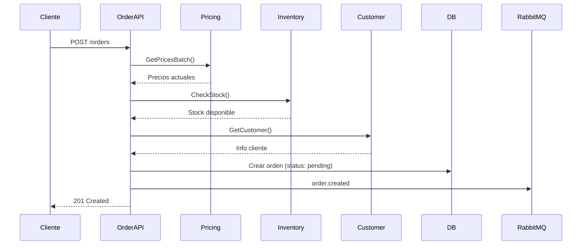
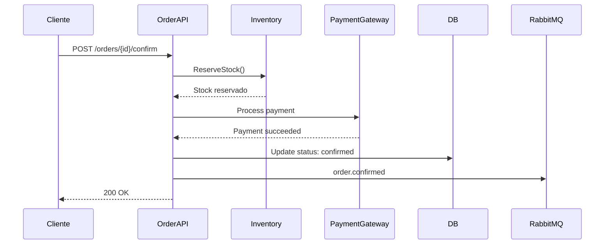
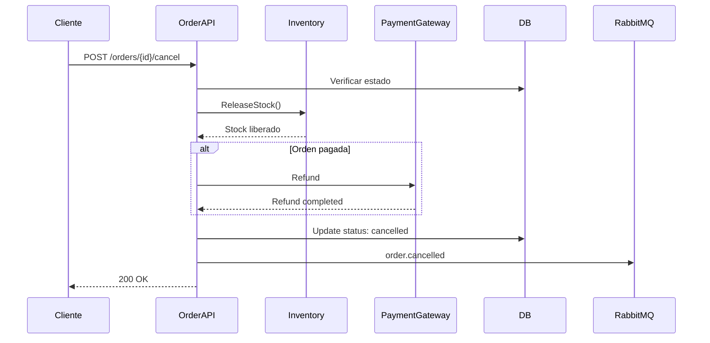

# Flujos de Negocio

## Flujo de Creación de Orden

## Flujo de Confirmación con Pago

## Flujo de Cancelación

## Estados de la Orden

| Estado | Descripción | Transiciones Válidas |
|--------|-------------|---------------------|
| `pending` | Orden creada, esperando confirmación | confirmed, cancelled |
| `confirmed` | Orden confirmada y pagada | processing, cancelled |
| `processing` | En preparación | shipped, cancelled |
| `shipped` | Enviada | delivered |
| `delivered` | Entregada | - |
| `cancelled` | Cancelada | - |

## Próximos Pasos

- [State Machine](./state-machine)
- [Eventos Publicados](./eventos-publicados)
- [API Orders](./api-orders)
