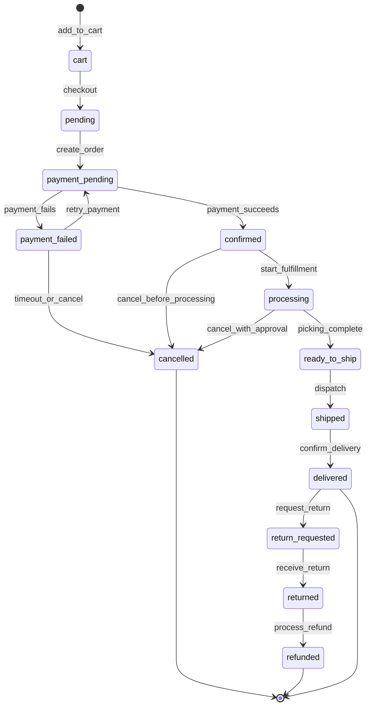

# Máquina de Estados de Orden

Definición completa de la máquina de estados del Order Service con transiciones, validaciones y eventos.

## Diagrama de Estados



## Estados Definidos

### 1. cart
**Descripción:** Productos agregados al carrito, aún no convertido a orden.

**Acciones Permitidas:**
- Agregar productos
- Remover productos
- Actualizar cantidades
- Aplicar cupones
- Proceder a checkout

**Eventos Publicados:**
- `cart.item_added`
- `cart.item_removed`
- `cart.updated`

**Condiciones de Salida:**
- Usuario hace checkout → `pending`
- Carrito expira (30 días) → `abandoned`

---

### 2. pending
**Descripción:** Orden creada, esperando confirmación del usuario para procesar pago.

**Acciones Permitidas:**
- Proceder a pago
- Cancelar orden
- Actualizar dirección de envío

**Eventos Publicados:**
- `order.created`

**Condiciones de Salida:**
- Usuario confirma y procede a pago → `payment_pending`
- Usuario cancela → `cancelled`
- Timeout (15 min) → `cancelled`

---

### 3. payment_pending
**Descripción:** Procesando pago con el gateway.

**Acciones Permitidas:**
- Esperar resultado del pago
- Cancelar (antes de que se procese)

**Eventos Publicados:**
- `payment.pending`

**Condiciones de Salida:**
- Pago exitoso → `confirmed`
- Pago fallido → `payment_failed`
- Pago requiere 3D Secure → `payment_action_required`

**Timeout:** 5 minutos

---

### 4. payment_failed
**Descripción:** El pago fue rechazado por el gateway o banco.

**Acciones Permitidas:**
- Reintentar con otro método de pago
- Actualizar información de pago
- Cancelar orden

**Eventos Publicados:**
- `payment.failed`

**Condiciones de Salida:**
- Reintenta pago → `payment_pending`
- Usuario cancela → `cancelled`
- Timeout (24 horas) → `cancelled`

**Reintentos Máximos:** 3

---

### 5. confirmed
**Descripción:** Pago confirmado, orden lista para fulfillment.

**Acciones Permitidas:**
- Asignar a bodega
- Iniciar fulfillment
- Cancelar (con políticas)

**Eventos Publicados:**
- `order.confirmed`
- `order.payment_confirmed`

**Condiciones de Salida:**
- Fulfillment inicia → `processing`
- Usuario cancela (dentro de ventana) → `cancelled`

**Ventana de Cancelación:** 2 horas después de confirmación

---

### 6. processing
**Descripción:** Orden en proceso de picking y packing.

**Acciones Permitidas:**
- Actualizar estado de picking
- Marcar items como pickeados
- Cancelar (requiere aprobación de manager)

**Eventos Publicados:**
- `order.processing`
- `fulfillment.started`
- `fulfillment.item_picked`

**Condiciones de Salida:**
- Picking completo → `ready_to_ship`
- Cancelación aprobada → `cancelled`

---

### 7. ready_to_ship
**Descripción:** Orden empacada y lista para despacho.

**Acciones Permitidas:**
- Generar etiqueta de envío
- Asignar a carrier
- Despachar

**Eventos Publicados:**
- `order.ready_to_ship`
- `shipment.label_created`

**Condiciones de Salida:**
- Despachada → `shipped`

---

### 8. shipped
**Descripción:** Orden despachada, en tránsito al cliente.

**Acciones Permitidas:**
- Actualizar tracking
- Confirmar entrega
- Reportar problema de entrega

**Eventos Publicados:**
- `order.shipped`
- `shipment.dispatched`
- `shipment.in_transit`
- `shipment.out_for_delivery`

**Condiciones de Salida:**
- Entrega confirmada → `delivered`
- Entrega fallida (3 intentos) → `shipment_failed`

---

### 9. delivered
**Descripción:** Orden entregada exitosamente al cliente.

**Acciones Permitidas:**
- Solicitar devolución (dentro de ventana)
- Dejar reseña

**Eventos Publicados:**
- `order.delivered`
- `shipment.delivered`

**Condiciones de Salida:**
- Solicita devolución → `return_requested`
- Orden completada → Estado final

**Ventana de Devolución:** 30 días

---

### 10. return_requested
**Descripción:** Cliente solicitó devolución de productos.

**Acciones Permitidas:**
- Aprobar devolución
- Rechazar devolución
- Solicitar más información

**Eventos Publicados:**
- `return.requested`

**Condiciones de Salida:**
- Aprobada y recibida → `returned`
- Rechazada → `delivered`

---

### 11. returned
**Descripción:** Productos devueltos y recibidos en bodega.

**Acciones Permitidas:**
- Inspeccionar productos
- Procesar reembolso
- Reabastecer inventario

**Eventos Publicados:**
- `return.received`
- `return.inspected`

**Condiciones de Salida:**
- Reembolso procesado → `refunded`

---

### 12. refunded
**Descripción:** Reembolso completado. Estado final.

**Acciones Permitidas:**
- Ver historial

**Eventos Publicados:**
- `return.refunded`
- `order.refunded`

---

### 13. cancelled
**Descripción:** Orden cancelada. Estado final.

**Acciones Permitidas:**
- Ver historial
- Crear nueva orden

**Eventos Publicados:**
- `order.cancelled`

**Motivos de Cancelación:**
- `customer_request` - Cliente canceló
- `payment_failed` - Pago fallido
- `timeout` - Expiró tiempo de pago
- `fraud_detected` - Fraude detectado
- `out_of_stock` - Sin stock disponible
- `admin_action` - Cancelado por admin

---

## Matriz de Transiciones

| Estado Actual | Acción | Estado Siguiente | Requiere Aprobación |
|---------------|--------|------------------|---------------------|
| cart | checkout | pending | No |
| pending | create_order | payment_pending | No |
| payment_pending | payment_success | confirmed | No |
| payment_pending | payment_failure | payment_failed | No |
| payment_failed | retry_payment | payment_pending | No |
| payment_failed | cancel | cancelled | No |
| confirmed | start_fulfillment | processing | No |
| confirmed | cancel | cancelled | Sí (dentro de 2h) |
| processing | picking_complete | ready_to_ship | No |
| processing | cancel | cancelled | Sí (Manager) |
| ready_to_ship | dispatch | shipped | No |
| shipped | confirm_delivery | delivered | No |
| delivered | request_return | return_requested | No |
| return_requested | approve_return | returned | Sí |
| return_requested | reject_return | delivered | Sí |
| returned | process_refund | refunded | No |

## Implementación en Código

### State Machine Class

```python
# services/order_state_machine.py
from enum import Enum
from typing import Optional, Dict, Any
from datetime import datetime, timedelta

class OrderStatus(str, Enum):
    CART = 'cart'
    PENDING = 'pending'
    PAYMENT_PENDING = 'payment_pending'
    PAYMENT_FAILED = 'payment_failed'
    CONFIRMED = 'confirmed'
    PROCESSING = 'processing'
    READY_TO_SHIP = 'ready_to_ship'
    SHIPPED = 'shipped'
    DELIVERED = 'delivered'
    RETURN_REQUESTED = 'return_requested'
    RETURNED = 'returned'
    REFUNDED = 'refunded'
    CANCELLED = 'cancelled'

class OrderStateMachine:
    """State machine for order status transitions."""

    # Define valid transitions
    TRANSITIONS = {
        OrderStatus.CART: [OrderStatus.PENDING],
        OrderStatus.PENDING: [OrderStatus.PAYMENT_PENDING, OrderStatus.CANCELLED],
        OrderStatus.PAYMENT_PENDING: [
            OrderStatus.CONFIRMED,
            OrderStatus.PAYMENT_FAILED
        ],
        OrderStatus.PAYMENT_FAILED: [
            OrderStatus.PAYMENT_PENDING,
            OrderStatus.CANCELLED
        ],
        OrderStatus.CONFIRMED: [OrderStatus.PROCESSING, OrderStatus.CANCELLED],
        OrderStatus.PROCESSING: [
            OrderStatus.READY_TO_SHIP,
            OrderStatus.CANCELLED
        ],
        OrderStatus.READY_TO_SHIP: [OrderStatus.SHIPPED],
        OrderStatus.SHIPPED: [OrderStatus.DELIVERED],
        OrderStatus.DELIVERED: [OrderStatus.RETURN_REQUESTED],
        OrderStatus.RETURN_REQUESTED: [
            OrderStatus.RETURNED,
            OrderStatus.DELIVERED
        ],
        OrderStatus.RETURNED: [OrderStatus.REFUNDED],
    }

    # Define which transitions require approval
    REQUIRES_APPROVAL = {
        (OrderStatus.CONFIRMED, OrderStatus.CANCELLED): True,
        (OrderStatus.PROCESSING, OrderStatus.CANCELLED): True,
    }

    @classmethod
    def can_transition(
        cls,
        from_status: OrderStatus,
        to_status: OrderStatus
    ) -> bool:
        """Check if transition is valid."""
        valid_next_states = cls.TRANSITIONS.get(from_status, [])
        return to_status in valid_next_states

    @classmethod
    def requires_approval(
        cls,
        from_status: OrderStatus,
        to_status: OrderStatus
    ) -> bool:
        """Check if transition requires approval."""
        return cls.REQUIRES_APPROVAL.get(
            (from_status, to_status),
            False
        )

    @classmethod
    async def transition(
        cls,
        order: 'Order',
        to_status: OrderStatus,
        **kwargs
    ) -> 'Order':
        """
        Execute state transition with validations.
        """
        from_status = OrderStatus(order.status)

        # Validate transition
        if not cls.can_transition(from_status, to_status):
            raise InvalidTransitionError(
                f"Cannot transition from {from_status} to {to_status}"
            )

        # Check approval requirement
        if cls.requires_approval(from_status, to_status):
            approved_by = kwargs.get('approved_by')
            if not approved_by:
                raise ApprovalRequiredError(
                    f"Transition {from_status} -> {to_status} requires approval"
                )

        # Execute pre-transition actions
        await cls._execute_pre_transition(order, from_status, to_status, **kwargs)

        # Update status
        order.status = to_status.value
        order.updated_at = datetime.utcnow()

        # Set specific timestamps
        if to_status == OrderStatus.CONFIRMED:
            order.confirmed_at = datetime.utcnow()
        elif to_status == OrderStatus.CANCELLED:
            order.cancelled_at = datetime.utcnow()

        # Execute post-transition actions
        await cls._execute_post_transition(order, from_status, to_status, **kwargs)

        # Publish event
        await cls._publish_transition_event(order, from_status, to_status)

        return order

    @classmethod
    async def _execute_pre_transition(
        cls,
        order: 'Order',
        from_status: OrderStatus,
        to_status: OrderStatus,
        **kwargs
    ) -> None:
        """Execute actions before transition."""

        # Confirm → Cancelled: Release stock reservation
        if from_status == OrderStatus.CONFIRMED and to_status == OrderStatus.CANCELLED:
            await cls._release_stock_reservation(order)

        # Processing → Cancelled: Return picked items
        if from_status == OrderStatus.PROCESSING and to_status == OrderStatus.CANCELLED:
            await cls._return_picked_items(order)

    @classmethod
    async def _execute_post_transition(
        cls,
        order: 'Order',
        from_status: OrderStatus,
        to_status: OrderStatus,
        **kwargs
    ) -> None:
        """Execute actions after transition."""

        # Payment Pending → Confirmed: Confirm stock reservation
        if to_status == OrderStatus.CONFIRMED:
            await cls._confirm_stock_reservation(order)

        # Ready to Ship → Shipped: Create tracking
        if to_status == OrderStatus.SHIPPED:
            await cls._create_shipment_tracking(order, **kwargs)

    @classmethod
    async def _publish_transition_event(
        cls,
        order: 'Order',
        from_status: OrderStatus,
        to_status: OrderStatus
    ) -> None:
        """Publish event for state transition."""
        event_type = f"order.status_changed.{to_status.value}"

        await event_publisher.publish(event_type, {
            'order_id': order.order_id,
            'order_number': order.order_number,
            'from_status': from_status.value,
            'to_status': to_status.value,
            'timestamp': datetime.utcnow().isoformat()
        })
```

### Usage Examples

```python
# Example 1: Confirm payment
order = await order_service.get_order(order_id)
order = await OrderStateMachine.transition(
    order,
    OrderStatus.CONFIRMED,
    payment_id='pay_123'
)
await db.commit()

# Example 2: Cancel with approval
order = await OrderStateMachine.transition(
    order,
    OrderStatus.CANCELLED,
    approved_by='user_manager_456',
    cancellation_reason='customer_request'
)
await db.commit()

# Example 3: Invalid transition (raises error)
try:
    order = await OrderStateMachine.transition(
        order,
        OrderStatus.DELIVERED  # From 'confirmed' - invalid
    )
except InvalidTransitionError as e:
    print(f"Error: {e}")
```

## Validaciones por Estado

### Confirmed → Cancelled

```python
async def validate_confirmed_to_cancelled(order: Order) -> None:
    """Validate cancellation of confirmed order."""

    # Check cancellation window (2 hours)
    if order.confirmed_at:
        elapsed = datetime.utcnow() - order.confirmed_at
        if elapsed > timedelta(hours=2):
            raise CancellationWindowExpiredError(
                "Cannot cancel order after 2 hours of confirmation"
            )

    # Check if fulfillment started
    if order.fulfillment_status != 'pending':
        raise FulfillmentAlreadyStartedError(
            "Cannot cancel order with started fulfillment"
        )
```

### Processing → Cancelled

```python
async def validate_processing_to_cancelled(order: Order, approved_by: str) -> None:
    """Validate cancellation of processing order."""

    # Requires manager approval
    user = await user_service.get_user(approved_by)
    if 'order.manager' not in user.roles:
        raise InsufficientPermissionsError(
            "Only managers can cancel orders in processing"
        )

    # Check picking progress
    picked_items = await fulfillment_service.get_picked_items(order.order_id)
    if picked_items:
        # Create return task for picked items
        await fulfillment_service.create_return_task(order.order_id, picked_items)
```

## Próximos Pasos

- [API: Orders](./api-orders)
- [Flujos de Negocio](./flujos-negocio)
- [Eventos Publicados](./eventos-publicados)
