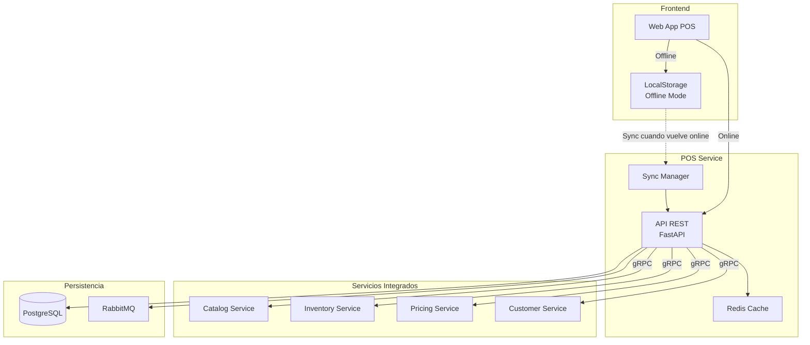

# Overview - POS Service

## Descripción

El **POS Service** (Point of Sale Service) es el microservicio encargado de gestionar las transacciones de venta en tiempo real en tiendas físicas. Proporciona una interfaz simplificada para que cajeras y personal de ventas puedan procesar ventas rápidamente, registrar diferentes métodos de pago, y mantener un control de las operaciones comerciales sin la complejidad

 tradicional de sistemas de caja registradora con manejo físico de efectivo.

## Características Principales

### ✅ Funcionalidades Core

- **Procesamiento de Transacciones**: Creación y gestión de ventas en tiempo real
- **Búsqueda de Productos**: Por código de barras o búsqueda manual
- **Productos por Peso**: Integración con balanzas electrónicas
- **Métodos de Pago Múltiples**: Efectivo, tarjeta, Yappy, transferencia, mixto
- **Descuentos**: Automáticos (promociones) y manuales (con autorización)
- **Gestión de Clientes**: Ventas anónimas o asociadas a cliente para fidelización
- **Devoluciones**: Procesamiento con autorización de supervisor
- **Modo Offline**: Funciona sin internet y sincroniza después
- **Reportes**: Por cajera, método de pago, producto, y período

### ❌ Lo que NO incluye

- **Sin apertura/cierre de caja física**: No hay conteo de billetes ni arqueo
- **Sin gestión de cajón de dinero**: No controla efectivo físico
- **Sin impresión de tickets**: Todo es digital
- **Sin terminal de pago integrado**: Usa terminales externas

## Casos de Uso por Tipo de Negocio

### 🛒 Supermercado
- Varias cajas con scanners de código de barras
- Ventas rápidas con muchos productos por transacción
- Productos por peso (frutas, verduras, carnes)
- Mayoría de ventas anónimas
- Algunos clientes con tarjeta de fidelización

### ☕ Cafetería
- 1-2 cajas para toma de orden
- **Flujo**: Toma orden → Cobra → Prepara
- Pre-pago (se cobra antes de preparar)
- Propinas opcionales
- Modificadores de productos (sin azúcar, leche de almendra)

### 🔧 Ferretería
- 1-2 cajas en mostrador
- Búsqueda por código y descripción
- Productos por unidad, metro, o peso
- Ventas a clientes corporativos registrados
- Crédito para clientes B2B

### 🚚 Distribuidora
- **NO USA POS** - Las ventas son por órdenes de vendedores en ruta
- Usa Order Service en su lugar

## Arquitectura de Alto Nivel



## Responsabilidades

### 🎯 Responsabilidad Principal
Procesar ventas en punto de venta físico de manera rápida, confiable y sin dependencia de conexión permanente a internet.

### 🔧 Responsabilidades Secundarias

1. **Gestión de Transacciones**
   - Crear, modificar, completar transacciones
   - Calcular totales con impuestos y descuentos
   - Validar stock disponible antes de vender

2. **Procesamiento de Pagos**
   - Registrar múltiples métodos de pago
   - Soportar pagos mixtos (efectivo + tarjeta)
   - Calcular vuelto en efectivo

3. **Búsqueda de Productos**
   - Por código de barras (rápido)
   - Por nombre o descripción (búsqueda)
   - Por categoría

4. **Aplicación de Descuentos**
   - Descuentos automáticos desde Pricing Service
   - Descuentos manuales con autorización

5. **Gestión de Devoluciones**
   - Devolución de productos del mismo día
   - Con autorización de supervisor
   - Reingreso automático a inventario

6. **Modo Offline**
   - Funcionar sin conexión a internet
   - Almacenar transacciones localmente
   - Sincronizar cuando vuelve la conexión

7. **Reportes y Auditoría**
   - Ventas por cajera
   - Ventas por método de pago
   - Ventas por producto/categoría
   - Tracking completo de operaciones

## Integraciones

### 📥 Consume de (gRPC)

| Servicio | Método | Propósito |
|----------|--------|-----------|
| **Catalog Service** | `GetProductByBarcode()` | Buscar producto al escanear |
| **Catalog Service** | `SearchProducts()` | Búsqueda manual de productos |
| **Catalog Service** | `GetProductPrice()` | Obtener precio actual |
| **Inventory Service** | `CheckStock()` | Verificar disponibilidad |
| **Inventory Service** | `DeductStock()` | Descontar del inventario |
| **Pricing Service** | `CalculatePrice()` | Calcular precio con descuentos |
| **Pricing Service** | `GetActivePromotions()` | Obtener promociones activas |
| **Customer Service** | `GetCustomer()` | Buscar cliente para fidelización |
| **Customer Service** | `AddLoyaltyPoints()` | Acumular puntos |

### 📤 Publica Eventos (RabbitMQ)

| Evento | Exchange | Cuándo |
|--------|----------|--------|
| `pos.transaction.created` | `pos_events` | Nueva transacción creada |
| `pos.transaction.completed` | `pos_events` | Venta completada |
| `pos.transaction.voided` | `pos_events` | Venta anulada |
| `pos.payment.processed` | `pos_events` | Pago procesado |
| `pos.return.processed` | `pos_events` | Devolución procesada |

### 📥 Consume Eventos (RabbitMQ)

| Evento | Acción |
|--------|--------|
| `catalog.product.updated` | Actualizar cache de productos |
| `catalog.product.deleted` | Invalidar producto en cache |
| `inventory.stock.updated` | Actualizar disponibilidad en tiempo real |
| `pricing.promotion.activated` | Aplicar nueva promoción |
| `pricing.promotion.deactivated` | Desactivar promoción |

## Stack Tecnológico

- **Runtime**: Python 3.11+
- **Framework**: FastAPI 0.104+
- **Base de Datos**: PostgreSQL 15+ (con Row-Level Security)
- **Cache**: Redis 7.0+
- **Message Broker**: RabbitMQ 3.12+
- **Comunicación**: gRPC para servicios internos
- **ORM**: SQLAlchemy 2.0 (async)
- **Validación**: Pydantic v2

## Puerto y Configuración

- **Puerto**: 8006
- **Base URL**: `http://localhost:8006`
- **Health Check**: `GET /health`
- **Metrics**: `GET /metrics`
- **Docs API**: `http://localhost:8006/docs`

## Métricas Clave (KPIs)

- **Tiempo promedio de transacción**: < 30 segundos
- **Disponibilidad**: 99.9% (con modo offline)
- **Latencia de búsqueda**: < 200ms
- **Transacciones por segundo**: 10+ por caja
- **Tasa de sincronización offline**: 99%

## Casos de Uso Críticos

### 1. Venta Rápida con Escaneo
```
Usuario: Cajera
Flujo:
1. Cajera escanea código de barras
2. Sistema busca producto y muestra precio
3. Se agrega al carrito
4. Repite pasos 1-3 para todos los productos
5. Selecciona método de pago
6. Completa venta
7. Sistema descuenta inventario y registra venta
```

### 2. Venta con Cliente Fidelización
```
Usuario: Cajera
Flujo:
1. Cliente proporciona número de cliente
2. Cajera busca y selecciona cliente
3. Escanea productos normalmente
4. Sistema aplica descuentos de cliente automáticamente
5. Completa venta
6. Sistema acumula puntos al cliente
```

### 3. Venta en Modo Offline
```
Usuario: Cajera
Escenario: Se cayó el internet
Flujo:
1. Sistema detecta pérdida de conexión
2. Activa modo offline automáticamente
3. Cajera procesa ventas normalmente
4. Transacciones se guardan localmente
5. Cuando vuelve internet, sincroniza automáticamente
6. Inventario se actualiza con todas las ventas offline
```

### 4. Devolución con Autorización
```
Usuario: Cajera + Supervisor
Flujo:
1. Cliente trae producto para devolución
2. Cajera busca la venta original
3. Selecciona producto a devolver
4. Solicita autorización de supervisor
5. Supervisor ingresa credenciales
6. Sistema procesa devolución
7. Producto regresa a inventario
8. Se genera crédito o reembolso
```

## Próximos Pasos

- [Arquitectura Detallada](./01-arquitectura.md)
- [Modelo de Datos](./02-modelo-datos.md)
- [API de Transacciones](./03-api-transactions.md)
