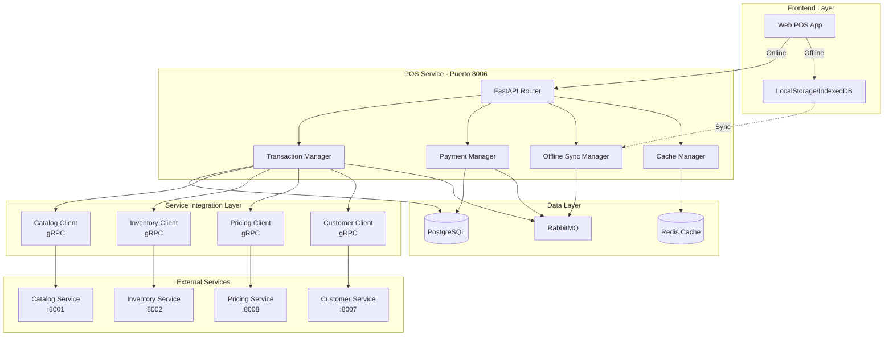
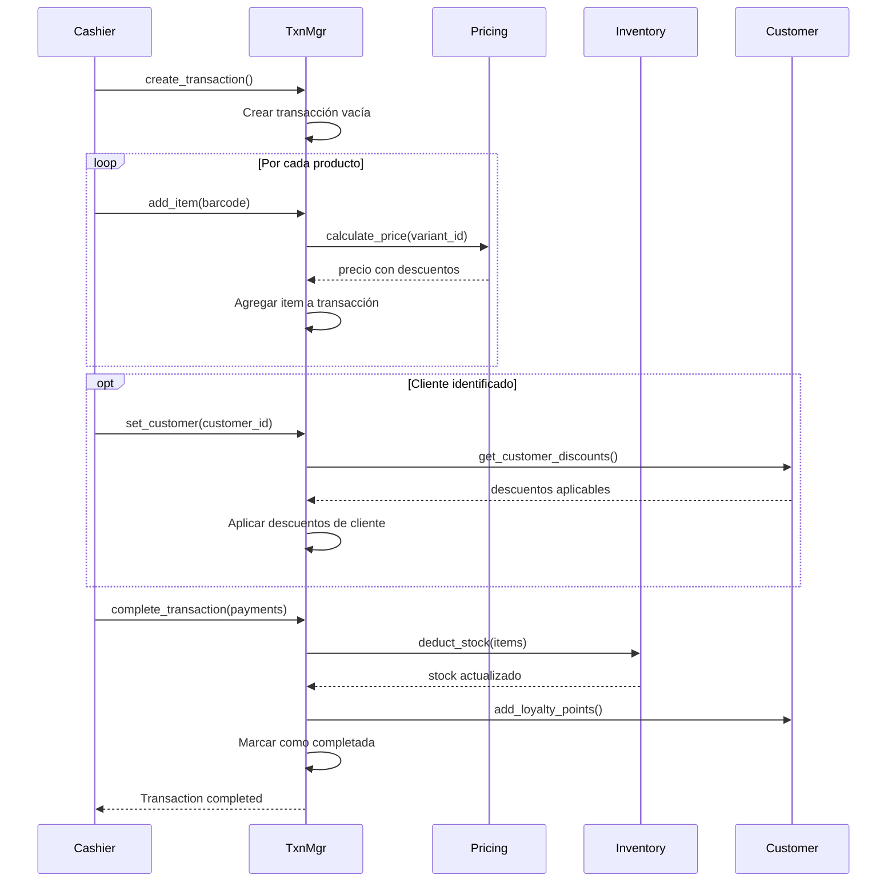
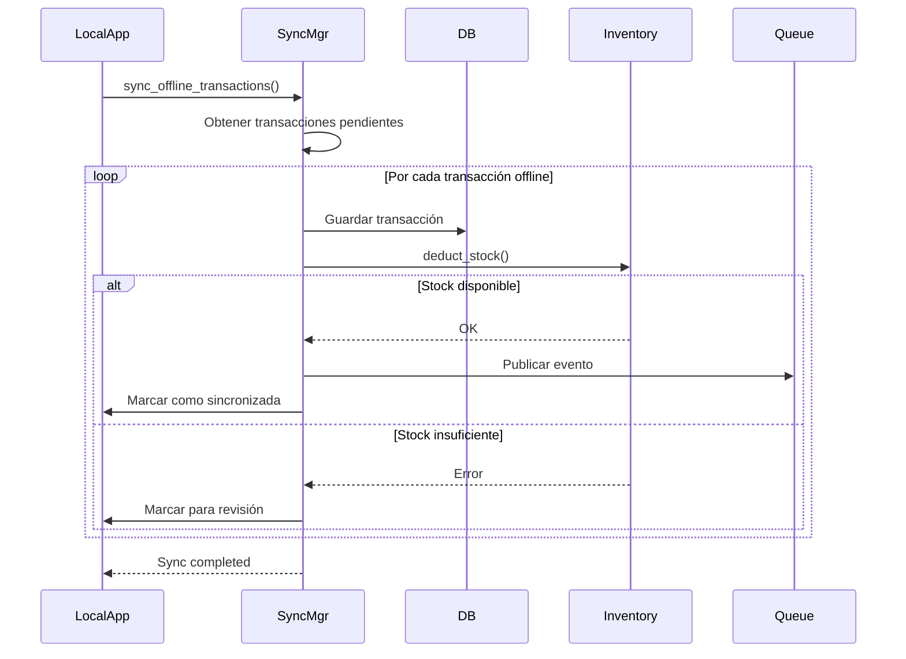

# Arquitectura - POS Service

## Diagrama de Componentes



## Capas de la Arquitectura

### 1. API Layer (FastAPI)

**Responsabilidad:** Exponer endpoints REST para operaciones de POS.

**Endpoints principales:**
- `/api/v1/pos/transactions` - CRUD de transacciones
- `/api/v1/pos/products/search` - Búsqueda de productos
- `/api/v1/pos/payments` - Procesamiento de pagos
- `/api/v1/pos/sync` - Sincronización offline
- `/api/v1/pos/reports` - Reportes de caja

**Características:**
- Autenticación mediante JWT (Auth Service)
- Validación con Pydantic
- Rate limiting por cajera
- Logging estructurado

### 2. Transaction Manager

**Responsabilidad:** Gestión del ciclo de vida de transacciones de venta.

**Funciones clave:**
```python
class TransactionManager:
    async def create_transaction(
        self,
        cashier_id: UUID,
        local_id: UUID
    ) -> Transaction

    async def add_item(
        self,
        transaction_id: UUID,
        variant_id: UUID,
        quantity: int
    ) -> TransactionItem

    async def apply_discount(
        self,
        transaction_id: UUID,
        discount: DiscountInput
    ) -> Transaction

    async def complete_transaction(
        self,
        transaction_id: UUID,
        payments: List[PaymentInput]
    ) -> CompletedTransaction

    async def void_transaction(
        self,
        transaction_id: UUID,
        reason: str,
        authorized_by: UUID
    ) -> Transaction
```

**Flujo de procesamiento:**



### 3. Payment Manager

**Responsabilidad:** Procesar y registrar pagos múltiples.

**Métodos de pago soportados:**
- `cash` - Efectivo (con cálculo de vuelto)
- `card` - Tarjeta de crédito/débito
- `yappy` - Yappy (Panamá)
- `transfer` - Transferencia bancaria
- `mixed` - Pago mixto (combinación de métodos)

**Funciones:**
```python
class PaymentManager:
    async def process_payment(
        self,
        transaction_id: UUID,
        payments: List[PaymentInput]
    ) -> PaymentResult

    async def calculate_change(
        self,
        total_amount: Decimal,
        cash_received: Decimal
    ) -> Decimal

    async def validate_payment_total(
        self,
        transaction_total: Decimal,
        payments_total: Decimal
    ) -> bool
```

**Ejemplo de pago mixto:**
```json
{
  "transaction_id": "txn_123",
  "payments": [
    {
      "method": "cash",
      "amount": 50.00,
      "received": 50.00
    },
    {
      "method": "card",
      "amount": 75.50,
      "card_last4": "4242",
      "authorization_code": "AUTH_123"
    }
  ],
  "total_paid": 125.50,
  "change_due": 0.00
}
```

### 4. Offline Sync Manager

**Responsabilidad:** Gestionar sincronización de transacciones offline.

**Características:**
- Detección automática de pérdida de conexión
- Almacenamiento local de transacciones
- Sincronización incremental cuando vuelve conexión
- Resolución de conflictos

**Flujo de sincronización:**



**Estructura de transacción offline:**
```typescript
interface OfflineTransaction {
  local_transaction_id: string;
  cashier_id: string;
  local_id: string;
  items: TransactionItem[];
  payments: Payment[];
  total_amount: number;
  timestamp: string;
  synced: boolean;
  sync_attempts: number;
}
```

### 5. Cache Manager

**Responsabilidad:** Cachear datos frecuentes para mejorar performance.

**Datos cacheados:**
- Productos más vendidos (TTL: 1 hora)
- Precios de productos (TTL: 15 minutos)
- Promociones activas (TTL: 30 minutos)
- Información de clientes (TTL: 5 minutos)

**Estrategia de cache:**
```python
class CacheManager:
    async def get_product_info(
        self,
        variant_id: UUID
    ) -> Optional[ProductInfo]:
        # 1. Buscar en cache
        cached = await self.redis.get(f"product:{variant_id}")
        if cached:
            return ProductInfo.parse_raw(cached)

        # 2. Consultar Catalog Service
        product = await self.catalog_client.get_product(variant_id)

        # 3. Guardar en cache
        await self.redis.setex(
            f"product:{variant_id}",
            900,  # 15 minutos
            product.json()
        )

        return product

    async def invalidate_product(self, variant_id: UUID):
        await self.redis.delete(f"product:{variant_id}")
```

## Patrones de Diseño

### 1. Repository Pattern

```python
class TransactionRepository:
    def __init__(self, db: AsyncSession):
        self.db = db

    async def create(self, transaction: Transaction) -> Transaction:
        self.db.add(transaction)
        await self.db.commit()
        await self.db.refresh(transaction)
        return transaction

    async def get_by_id(self, transaction_id: UUID) -> Optional[Transaction]:
        result = await self.db.execute(
            select(Transaction).where(Transaction.transaction_id == transaction_id)
        )
        return result.scalar_one_or_none()
```

### 2. Circuit Breaker Pattern

Para llamadas a servicios externos:

```python
from circuitbreaker import circuit

class CatalogServiceClient:
    @circuit(failure_threshold=5, recovery_timeout=60)
    async def get_product_by_barcode(self, barcode: str) -> Product:
        # Si falla 5 veces, abre el circuito por 60 segundos
        async with self.channel:
            response = await self.stub.GetProductByBarcode(
                GetProductRequest(barcode=barcode)
            )
            return response
```

### 3. Saga Pattern

Para transacciones distribuidas (venta completa):

```python
class SaleCompletionSaga:
    async def execute(self, transaction_id: UUID):
        steps = [
            self.validate_stock,
            self.deduct_inventory,
            self.add_loyalty_points,
            self.publish_event,
            self.generate_receipt
        ]

        completed_steps = []

        try:
            for step in steps:
                await step(transaction_id)
                completed_steps.append(step)
        except Exception as e:
            # Compensar pasos completados en orden inverso
            for step in reversed(completed_steps):
                await step.compensate(transaction_id)
            raise
```

## Seguridad

### Autenticación

- Todas las requests requieren JWT válido
- JWT contiene `cashier_id`, `local_id`, `organization_id`
- Validación de permisos: `pos:create`, `pos:void`, `pos:discount`

### Autorización

```python
@router.post("/transactions/{transaction_id}/void")
async def void_transaction(
    transaction_id: UUID,
    current_user: User = Depends(get_current_user),
    permission_check: None = Depends(require_permission("pos:void"))
):
    # Solo usuarios con permiso pos:void pueden anular
    pass
```

### Row-Level Security

```sql
-- Solo ver transacciones de tu organización y local
CREATE POLICY transactions_isolation ON transactions
    USING (
        organization_id = current_setting('app.current_organization_id')::uuid
        AND local_id = current_setting('app.current_local_id')::uuid
    );
```

### Auditoría

Todas las operaciones críticas quedan registradas:
- Creación de transacciones
- Anulaciones (con autorización)
- Descuentos manuales (con autorización)
- Devoluciones

## Performance

### Optimizaciones

1. **Caché de productos frecuentes**
   - Top 100 productos cacheados por local
   - Actualización cada hora

2. **Consultas optimizadas**
   - Índices en campos de búsqueda frecuente
   - Paginación cursor-based

3. **Batch processing**
   - Sincronización offline en lotes de 50

4. **Connection pooling**
   - Pool de conexiones gRPC reutilizables
   - Pool de conexiones PostgreSQL (min: 10, max: 50)

### Métricas objetivo

| Métrica | Target |
|---------|--------|
| Tiempo de búsqueda de producto | < 200ms |
| Tiempo de agregar item al carrito | < 100ms |
| Tiempo de completar transacción | < 2s |
| Sincronización offline (100 txns) | < 10s |
| Disponibilidad con modo offline | 99.9% |

## Escalabilidad

### Horizontal Scaling

- Servicio stateless, puede escalar horizontalmente
- Redis compartido para cache coherente
- Balanceo de carga con sticky sessions por local

### Estrategia de deployment

```yaml
# Kubernetes deployment
replicas: 3
resources:
  requests:
    cpu: 500m
    memory: 512Mi
  limits:
    cpu: 1000m
    memory: 1Gi

autoscaling:
  minReplicas: 3
  maxReplicas: 10
  targetCPUUtilization: 70%
```

## Próximos Pasos

- [Modelo de Datos](./02-modelo-datos.md)
- [API de Transacciones](./03-api-transactions.md)
- [Modo Offline](./09-modo-offline.md)
