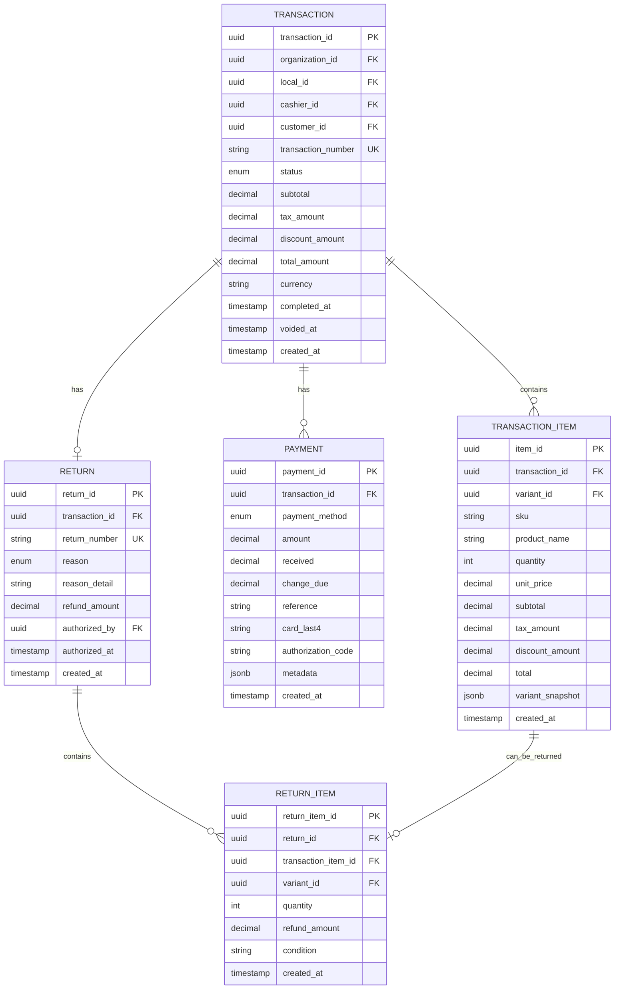

# Modelo de Datos - POS Service

## Estándares de Tipos de Datos

> **Convención del ERP**: Todos los servicios usan tipos estandarizados para garantizar consistencia.
>
> | Tipo de Campo | Estándar | Descripción |
> |---------------|----------|-------------|
> | IDs primarios | `UUID` | Identificadores únicos universales |
> | Dinero | `DECIMAL(12,4)` | 12 dígitos, 4 decimales |
> | Tasas (%) | `DECIMAL(5,4)` | Ej: 0.0700 = 7% |
> | Cantidades | `DECIMAL(10,3)` | Para productos por peso |

## Diagrama ER



## Entidades Principales

### 1. Transaction (transactions)

Tabla principal de transacciones de venta en POS.

```sql
CREATE TABLE transactions (
    transaction_id UUID PRIMARY KEY DEFAULT gen_random_uuid(),
    organization_id UUID NOT NULL,
    local_id UUID NOT NULL,
    cashier_id UUID NOT NULL,
    customer_id UUID,  -- Opcional: NULL = venta anónima

    -- Identificadores
    transaction_number VARCHAR(50) NOT NULL UNIQUE,
    session_id UUID,  -- Sesión de caja

    -- Estado
    status VARCHAR(30) NOT NULL DEFAULT 'open',

    -- Montos (DECIMAL(12,4) por estándar del ERP)
    subtotal DECIMAL(12, 4) NOT NULL DEFAULT 0.0000,
    tax_amount DECIMAL(12, 4) NOT NULL DEFAULT 0.0000,
    discount_amount DECIMAL(12, 4) NOT NULL DEFAULT 0.0000,
    total_amount DECIMAL(12, 4) NOT NULL DEFAULT 0.0000,
    currency VARCHAR(3) NOT NULL DEFAULT 'USD',

    -- Descuentos
    discount_type VARCHAR(30),  -- 'percentage', 'fixed_amount', 'promotion'
    discount_value DECIMAL(12, 4),
    discount_authorized_by UUID,  -- Requerido para descuentos manuales

    -- Metadata
    notes TEXT,
    metadata JSONB,
    tags VARCHAR(255)[],

    -- Timestamps
    completed_at TIMESTAMP,
    voided_at TIMESTAMP,
    void_reason TEXT,
    void_authorized_by UUID,
    created_at TIMESTAMP NOT NULL DEFAULT NOW(),
    updated_at TIMESTAMP,

    -- Constraints
    CONSTRAINT check_status_valid CHECK (
        status IN ('open', 'completed', 'voided', 'returned')
    ),
    CONSTRAINT check_total_amount CHECK (total_amount >= 0),
    CONSTRAINT check_void_requires_auth CHECK (
        (status = 'voided' AND void_authorized_by IS NOT NULL) OR status != 'voided'
    )
);

-- Índices
CREATE INDEX idx_transactions_organization ON transactions(organization_id);
CREATE INDEX idx_transactions_local ON transactions(local_id);
CREATE INDEX idx_transactions_cashier ON transactions(cashier_id);
CREATE INDEX idx_transactions_customer ON transactions(customer_id);
CREATE INDEX idx_transactions_status ON transactions(status);
CREATE INDEX idx_transactions_created_at ON transactions(created_at DESC);
CREATE INDEX idx_transactions_number ON transactions(transaction_number);
CREATE INDEX idx_transactions_completed_at ON transactions(completed_at DESC);

-- Full-text search
CREATE INDEX idx_transactions_number_trgm ON transactions USING gin(transaction_number gin_trgm_ops);
```

### 2. TransactionItem (transaction_items)

Líneas de productos en la transacción.

```sql
CREATE TABLE transaction_items (
    item_id UUID PRIMARY KEY DEFAULT gen_random_uuid(),
    transaction_id UUID NOT NULL REFERENCES transactions(transaction_id) ON DELETE CASCADE,

    -- Producto
    variant_id UUID NOT NULL,
    sku VARCHAR(100) NOT NULL,
    product_name VARCHAR(255) NOT NULL,
    barcode VARCHAR(100),

    -- Cantidades y precios (estándares del ERP)
    quantity DECIMAL(10, 3) NOT NULL CHECK (quantity > 0),  -- Decimal para productos por peso
    unit_price DECIMAL(12, 4) NOT NULL CHECK (unit_price >= 0),
    subtotal DECIMAL(12, 4) NOT NULL,
    tax_amount DECIMAL(12, 4) NOT NULL DEFAULT 0.0000,
    tax_rate DECIMAL(5, 4) DEFAULT 0.0700,  -- 7% ITBMS Panamá
    discount_amount DECIMAL(12, 4) NOT NULL DEFAULT 0.0000,
    total DECIMAL(12, 4) NOT NULL,

    -- Snapshot del producto al momento de la venta
    variant_snapshot JSONB,

    -- Productos por peso
    is_weighted BOOLEAN DEFAULT false,
    weight_kg DECIMAL(10, 3),

    -- Metadata
    notes TEXT,
    line_number INTEGER,  -- Orden en la transacción

    created_at TIMESTAMP NOT NULL DEFAULT NOW(),

    CONSTRAINT check_item_total CHECK (total >= 0)
);

CREATE INDEX idx_transaction_items_transaction ON transaction_items(transaction_id);
CREATE INDEX idx_transaction_items_variant ON transaction_items(variant_id);
CREATE INDEX idx_transaction_items_sku ON transaction_items(sku);
CREATE INDEX idx_transaction_items_barcode ON transaction_items(barcode);
```

### 3. Payment (payments)

Registros de pagos por transacción.

```sql
CREATE TABLE payments (
    payment_id UUID PRIMARY KEY DEFAULT gen_random_uuid(),
    transaction_id UUID NOT NULL REFERENCES transactions(transaction_id) ON DELETE CASCADE,

    -- Método de pago
    payment_method VARCHAR(30) NOT NULL,

    -- Montos (estándares del ERP)
    amount DECIMAL(12, 4) NOT NULL CHECK (amount > 0),
    currency VARCHAR(3) NOT NULL DEFAULT 'USD',

    -- Para efectivo
    received DECIMAL(12, 4),  -- Cantidad recibida del cliente
    change_due DECIMAL(12, 4) DEFAULT 0.0000,  -- Vuelto

    -- Para pagos electrónicos
    reference VARCHAR(255),  -- Número de referencia/comprobante
    card_brand VARCHAR(50),  -- visa, mastercard, amex
    card_last4 VARCHAR(4),
    authorization_code VARCHAR(100),
    terminal_id VARCHAR(50),

    -- Metadata
    metadata JSONB,
    notes TEXT,

    created_at TIMESTAMP NOT NULL DEFAULT NOW(),

    CONSTRAINT check_payment_method_valid CHECK (
        payment_method IN ('cash', 'card', 'yappy', 'transfer', 'credit')
    ),
    CONSTRAINT check_cash_received CHECK (
        (payment_method = 'cash' AND received IS NOT NULL) OR payment_method != 'cash'
    ),
    CONSTRAINT check_change_calculation CHECK (
        change_due >= 0
    )
);

CREATE INDEX idx_payments_transaction ON payments(transaction_id);
CREATE INDEX idx_payments_method ON payments(payment_method);
CREATE INDEX idx_payments_created_at ON payments(created_at DESC);
CREATE INDEX idx_payments_reference ON payments(reference);
```

### 4. Return (returns)

Devoluciones de transacciones.

```sql
CREATE TABLE returns (
    return_id UUID PRIMARY KEY DEFAULT gen_random_uuid(),
    organization_id UUID NOT NULL,
    transaction_id UUID NOT NULL REFERENCES transactions(transaction_id),

    -- Identificación
    return_number VARCHAR(50) NOT NULL UNIQUE,

    -- Razón
    reason VARCHAR(50) NOT NULL,
    reason_detail TEXT,

    -- Reembolso
    refund_amount DECIMAL(12, 4) NOT NULL,
    refund_method VARCHAR(30) NOT NULL,  -- 'original_payment', 'cash', 'credit_note'

    -- Autorización (siempre requerida)
    authorized_by UUID NOT NULL,
    authorized_at TIMESTAMP NOT NULL,

    -- Metadata
    notes TEXT,
    metadata JSONB,

    created_at TIMESTAMP NOT NULL DEFAULT NOW(),

    CONSTRAINT check_return_reason CHECK (
        reason IN ('defective', 'wrong_product', 'changed_mind', 'damaged', 'other')
    ),
    CONSTRAINT check_refund_amount CHECK (refund_amount > 0),
    CONSTRAINT check_refund_method CHECK (
        refund_method IN ('original_payment', 'cash', 'credit_note', 'exchange')
    )
);

CREATE INDEX idx_returns_organization ON returns(organization_id);
CREATE INDEX idx_returns_transaction ON returns(transaction_id);
CREATE INDEX idx_returns_return_number ON returns(return_number);
CREATE INDEX idx_returns_created_at ON returns(created_at DESC);
CREATE INDEX idx_returns_authorized_by ON returns(authorized_by);
```

### 5. ReturnItem (return_items)

Productos específicos de una devolución.

```sql
CREATE TABLE return_items (
    return_item_id UUID PRIMARY KEY DEFAULT gen_random_uuid(),
    return_id UUID NOT NULL REFERENCES returns(return_id) ON DELETE CASCADE,
    transaction_item_id UUID NOT NULL REFERENCES transaction_items(item_id),
    variant_id UUID NOT NULL,

    -- Cantidades
    quantity DECIMAL(10, 3) NOT NULL CHECK (quantity > 0),

    -- Montos de reembolso
    refund_amount DECIMAL(12, 4) NOT NULL,

    -- Condición del producto
    condition VARCHAR(30),  -- 'good', 'damaged', 'defective', 'opened'
    notes TEXT,

    created_at TIMESTAMP NOT NULL DEFAULT NOW(),

    CONSTRAINT check_return_item_condition CHECK (
        condition IN ('good', 'damaged', 'defective', 'opened', 'missing_parts')
    )
);

CREATE INDEX idx_return_items_return ON return_items(return_id);
CREATE INDEX idx_return_items_transaction_item ON return_items(transaction_item_id);
CREATE INDEX idx_return_items_variant ON return_items(variant_id);
```

### 6. CashierSession (cashier_sessions)

Sesiones de trabajo de cajeras (opcional, para tracking).

```sql
CREATE TABLE cashier_sessions (
    session_id UUID PRIMARY KEY DEFAULT gen_random_uuid(),
    organization_id UUID NOT NULL,
    local_id UUID NOT NULL,
    cashier_id UUID NOT NULL,

    -- Metadata de sesión
    terminal_id VARCHAR(50),
    ip_address INET,

    -- Estado
    status VARCHAR(30) NOT NULL DEFAULT 'active',

    -- Timestamps
    started_at TIMESTAMP NOT NULL DEFAULT NOW(),
    ended_at TIMESTAMP,

    -- Metadata
    metadata JSONB,

    CONSTRAINT check_session_status CHECK (
        status IN ('active', 'ended', 'suspended')
    )
);

CREATE INDEX idx_cashier_sessions_organization ON cashier_sessions(organization_id);
CREATE INDEX idx_cashier_sessions_cashier ON cashier_sessions(cashier_id);
CREATE INDEX idx_cashier_sessions_local ON cashier_sessions(local_id);
CREATE INDEX idx_cashier_sessions_status ON cashier_sessions(status);
```

## Tipos Enum

### TransactionStatus

```sql
CREATE TYPE transaction_status AS ENUM (
    'open',        -- Transacción en proceso
    'completed',   -- Venta completada
    'voided',      -- Anulada
    'returned'     -- Devuelta (parcial o total)
);
```

### PaymentMethod

```sql
CREATE TYPE payment_method AS ENUM (
    'cash',        -- Efectivo
    'card',        -- Tarjeta crédito/débito
    'yappy',       -- Yappy (Panamá)
    'transfer',    -- Transferencia bancaria
    'credit'       -- Crédito de cliente
);
```

### ReturnReason

```sql
CREATE TYPE return_reason AS ENUM (
    'defective',      -- Producto defectuoso
    'wrong_product',  -- Producto equivocado
    'changed_mind',   -- Cliente cambió de opinión
    'damaged',        -- Producto dañado
    'other'           -- Otro motivo
);
```

## Vistas Materializadas

### v_transaction_summary

Vista optimizada para reportes rápidos.

```sql
CREATE MATERIALIZED VIEW v_transaction_summary AS
SELECT
    t.transaction_id,
    t.transaction_number,
    t.organization_id,
    t.local_id,
    t.cashier_id,
    t.customer_id,
    t.status,
    t.total_amount,
    t.currency,
    COUNT(ti.item_id) as items_count,
    SUM(ti.quantity) as total_quantity,
    t.completed_at,
    t.created_at,
    COALESCE(
        json_agg(
            json_build_object(
                'payment_method', p.payment_method,
                'amount', p.amount
            )
        ) FILTER (WHERE p.payment_id IS NOT NULL),
        '[]'
    ) as payments
FROM transactions t
LEFT JOIN transaction_items ti ON t.transaction_id = ti.transaction_id
LEFT JOIN payments p ON t.transaction_id = p.transaction_id
WHERE t.status = 'completed'
GROUP BY t.transaction_id;

CREATE UNIQUE INDEX idx_txn_summary_id ON v_transaction_summary(transaction_id);
CREATE INDEX idx_txn_summary_completed_at ON v_transaction_summary(completed_at DESC);
CREATE INDEX idx_txn_summary_cashier ON v_transaction_summary(cashier_id);

-- Refrescar cada 5 minutos
CREATE OR REPLACE FUNCTION refresh_transaction_summary()
RETURNS void AS $$
BEGIN
    REFRESH MATERIALIZED VIEW CONCURRENTLY v_transaction_summary;
END;
$$ LANGUAGE plpgsql;
```

## Row-Level Security

```sql
ALTER TABLE transactions ENABLE ROW LEVEL SECURITY;
ALTER TABLE transaction_items ENABLE ROW LEVEL SECURITY;
ALTER TABLE payments ENABLE ROW LEVEL SECURITY;
ALTER TABLE returns ENABLE ROW LEVEL SECURITY;

-- Policy: Solo acceso a datos de tu organización
CREATE POLICY transactions_organization_isolation ON transactions
    USING (organization_id = current_setting('app.current_organization_id')::uuid);

CREATE POLICY transaction_items_organization_isolation ON transaction_items
    USING (
        transaction_id IN (
            SELECT transaction_id FROM transactions
            WHERE organization_id = current_setting('app.current_organization_id')::uuid
        )
    );

-- Policy: Cajeras solo ven sus propias transacciones (opcional)
CREATE POLICY transactions_cashier_isolation ON transactions
    USING (
        cashier_id = current_setting('app.current_user_id')::uuid
        OR current_setting('app.user_role') = 'manager'
    );
```

## Triggers

### Actualizar total de transacción

```sql
CREATE OR REPLACE FUNCTION update_transaction_totals()
RETURNS TRIGGER AS $$
BEGIN
    UPDATE transactions
    SET
        subtotal = (
            SELECT COALESCE(SUM(subtotal), 0)
            FROM transaction_items
            WHERE transaction_id = NEW.transaction_id
        ),
        tax_amount = (
            SELECT COALESCE(SUM(tax_amount), 0)
            FROM transaction_items
            WHERE transaction_id = NEW.transaction_id
        ),
        total_amount = (
            SELECT COALESCE(SUM(total), 0)
            FROM transaction_items
            WHERE transaction_id = NEW.transaction_id
        ),
        updated_at = NOW()
    WHERE transaction_id = NEW.transaction_id;

    RETURN NEW;
END;
$$ LANGUAGE plpgsql;

CREATE TRIGGER trigger_update_transaction_totals
AFTER INSERT OR UPDATE OR DELETE ON transaction_items
FOR EACH ROW
EXECUTE FUNCTION update_transaction_totals();
```

### Validar monto de pagos

```sql
CREATE OR REPLACE FUNCTION validate_payment_total()
RETURNS TRIGGER AS $$
DECLARE
    v_transaction_total DECIMAL(12, 2);
    v_payments_total DECIMAL(12, 2);
BEGIN
    SELECT total_amount INTO v_transaction_total
    FROM transactions
    WHERE transaction_id = NEW.transaction_id;

    SELECT COALESCE(SUM(amount), 0) INTO v_payments_total
    FROM payments
    WHERE transaction_id = NEW.transaction_id;

    IF v_payments_total > v_transaction_total THEN
        RAISE EXCEPTION 'Total de pagos (%) excede total de transacción (%)',
            v_payments_total, v_transaction_total;
    END IF;

    RETURN NEW;
END;
$$ LANGUAGE plpgsql;

CREATE TRIGGER trigger_validate_payment_total
BEFORE INSERT OR UPDATE ON payments
FOR EACH ROW
EXECUTE FUNCTION validate_payment_total();
```

## Ejemplos de Datos

### Transacción completa

```json
{
  "transaction_id": "txn_123",
  "transaction_number": "POS-2025-001234",
  "organization_id": "org_001",
  "local_id": "local_101",
  "cashier_id": "user_456",
  "customer_id": null,
  "status": "completed",
  "subtotal": 100.00,
  "tax_amount": 7.00,
  "discount_amount": 5.00,
  "total_amount": 102.00,
  "currency": "USD",
  "items": [
    {
      "item_id": "item_001",
      "variant_id": "var_789",
      "sku": "PROD-001",
      "product_name": "Coca Cola 2L",
      "quantity": 2,
      "unit_price": 2.50,
      "subtotal": 5.00,
      "tax_amount": 0.35,
      "discount_amount": 0.00,
      "total": 5.35
    }
  ],
  "payments": [
    {
      "payment_id": "pay_001",
      "payment_method": "cash",
      "amount": 102.00,
      "received": 150.00,
      "change_due": 48.00
    }
  ],
  "completed_at": "2025-11-24T10:30:00Z",
  "created_at": "2025-11-24T10:25:00Z"
}
```

## Próximos Pasos

- [API de Transacciones](./03-api-transactions.md)
- [API de Productos](./04-api-products.md)
- [API de Pagos](./05-api-payments.md)
