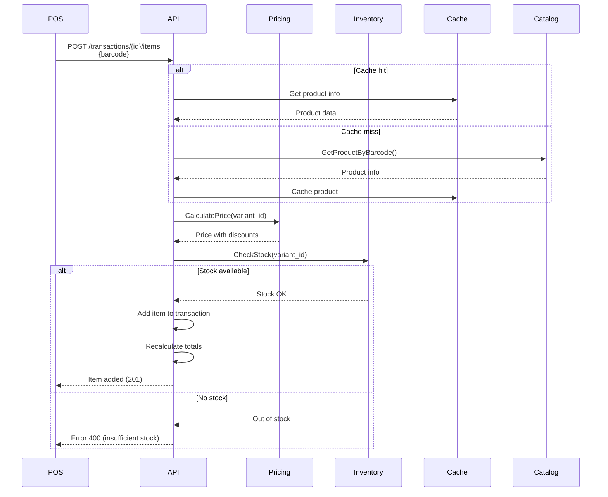
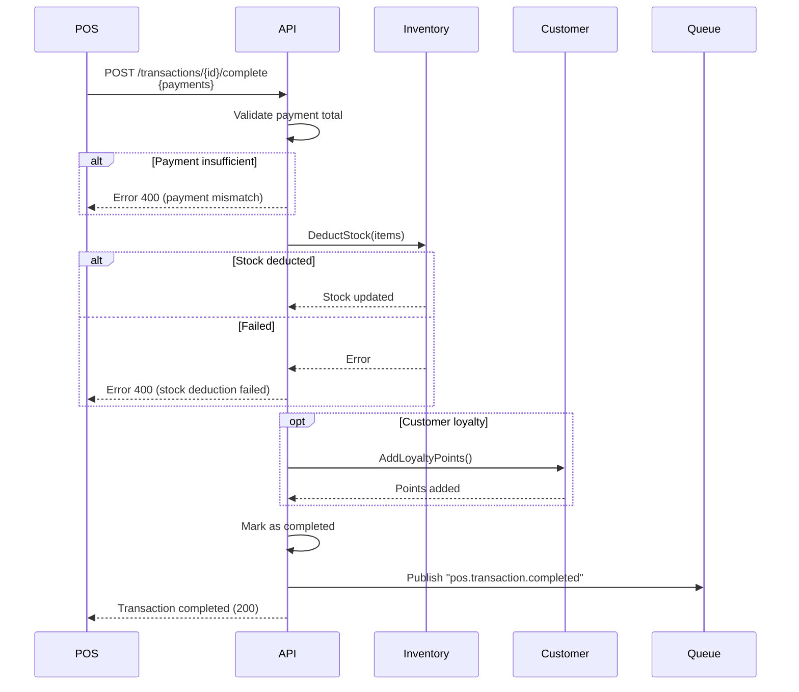

# API de Transacciones

Endpoints para gestión de transacciones de venta en POS.

## Base URL

```
POST   /api/v1/pos/transactions
GET    /api/v1/pos/transactions
GET    /api/v1/pos/transactions/{transactionId}
POST   /api/v1/pos/transactions/{transactionId}/items
DELETE /api/v1/pos/transactions/{transactionId}/items/{itemId}
POST   /api/v1/pos/transactions/{transactionId}/complete
POST   /api/v1/pos/transactions/{transactionId}/void
PATCH  /api/v1/pos/transactions/{transactionId}/discount
```

## Crear Transacción

```http
POST /api/v1/pos/transactions
```

**Request Body:**

```json
{
  "cashier_id": "user_456",
  "local_id": "local_101",
  "customer_id": "cust_789"  // Opcional
}
```

**Response:** `201 Created`

```json
{
  "status": "success",
  "statusCode": 201,
  "data": {
    "transaction_id": "txn_123",
    "transaction_number": "POS-2025-001234",
    "cashier_id": "user_456",
    "local_id": "local_101",
    "customer_id": "cust_789",
    "status": "open",
    "subtotal": 0.00,
    "tax_amount": 0.00,
    "discount_amount": 0.00,
    "total_amount": 0.00,
    "currency": "USD",
    "items": [],
    "created_at": "2025-11-24T10:25:00Z"
  },
  "timestamp": "2025-11-24T10:25:00Z"
}
```

## Agregar Producto a Transacción

```http
POST /api/v1/pos/transactions/{transactionId}/items
```

**Request Body:**

```json
{
  "variant_id": "var_789",
  "barcode": "7501234567890",  // Alternativa a variant_id
  "quantity": 2,
  "notes": "Sin azúcar"  // Opcional
}
```

**Producto por peso:**

```json
{
  "barcode": "2001234567890",  // Código de balanza
  "quantity": 1.567,  // kg
  "is_weighted": true
}
```

**Response:** `201 Created`

```json
{
  "status": "success",
  "data": {
    "item_id": "item_001",
    "transaction_id": "txn_123",
    "variant_id": "var_789",
    "sku": "PROD-001",
    "product_name": "Coca Cola 2L",
    "barcode": "7501234567890",
    "quantity": 2,
    "unit_price": 2.50,
    "subtotal": 5.00,
    "tax_amount": 0.35,
    "tax_rate": 0.0700,
    "discount_amount": 0.00,
    "total": 5.35,
    "variant_snapshot": {
      "name": "Coca Cola 2L",
      "category": "Bebidas",
      "brand": "Coca Cola"
    },
    "created_at": "2025-11-24T10:26:00Z"
  },
  "transaction_summary": {
    "subtotal": 5.00,
    "tax_amount": 0.35,
    "discount_amount": 0.00,
    "total_amount": 5.35,
    "items_count": 1
  }
}
```

**Flujo de agregar producto:**



## Remover Producto de Transacción

```http
DELETE /api/v1/pos/transactions/{transactionId}/items/{itemId}
```

**Response:** `200 OK`

```json
{
  "status": "success",
  "data": {
    "item_id": "item_001",
    "removed": true
  },
  "transaction_summary": {
    "subtotal": 0.00,
    "tax_amount": 0.00,
    "discount_amount": 0.00,
    "total_amount": 0.00,
    "items_count": 0
  }
}
```

## Aplicar Descuento

```http
PATCH /api/v1/pos/transactions/{transactionId}/discount
```

**Request Body:**

```json
{
  "discount_type": "percentage",  // 'percentage' | 'fixed_amount' | 'promotion'
  "discount_value": 10.00,
  "reason": "Cliente frecuente",
  "authorized_by": "supervisor_123"  // Requerido si excede límite permitido
}
```

**Validaciones:**
- Cajeras pueden aplicar hasta 5% sin autorización
- Descuentos > 5% requieren autorización de supervisor
- Descuentos automáticos desde Pricing Service no requieren autorización

**Response:** `200 OK`

```json
{
  "status": "success",
  "data": {
    "transaction_id": "txn_123",
    "discount_type": "percentage",
    "discount_value": 10.00,
    "discount_amount": 10.00,
    "authorized_by": "supervisor_123",
    "total_before_discount": 100.00,
    "total_after_discount": 90.00
  }
}
```

## Completar Transacción

```http
POST /api/v1/pos/transactions/{transactionId}/complete
```

**Request Body:**

```json
{
  "payments": [
    {
      "payment_method": "cash",
      "amount": 90.00,
      "received": 100.00
    }
  ]
}
```

**Pago mixto:**

```json
{
  "payments": [
    {
      "payment_method": "cash",
      "amount": 50.00,
      "received": 50.00
    },
    {
      "payment_method": "card",
      "amount": 40.00,
      "card_last4": "4242",
      "authorization_code": "AUTH_123456"
    }
  ]
}
```

**Response:** `200 OK`

```json
{
  "status": "success",
  "data": {
    "transaction_id": "txn_123",
    "transaction_number": "POS-2025-001234",
    "status": "completed",
    "total_amount": 90.00,
    "payments": [
      {
        "payment_id": "pay_001",
        "payment_method": "cash",
        "amount": 90.00,
        "received": 100.00,
        "change_due": 10.00
      }
    ],
    "receipt": {
      "receipt_url": "https://pos.zenlogic.com/receipts/txn_123",
      "receipt_number": "REC-2025-001234"
    },
    "loyalty_points": {
      "points_earned": 9,
      "total_points": 109
    },
    "completed_at": "2025-11-24T10:30:00Z"
  }
}
```

**Flujo completo:**



## Anular Transacción

```http
POST /api/v1/pos/transactions/{transactionId}/void
```

**Request Body:**

```json
{
  "reason": "Entrada de producto incorrecta",
  "authorized_by": "supervisor_123"  // Siempre requerido
}
```

**Validaciones:**
- Solo transacciones `completed` pueden anularse
- Requiere autorización de supervisor siempre
- Solo se puede anular el mismo día de la venta

**Response:** `200 OK`

```json
{
  "status": "success",
  "data": {
    "transaction_id": "txn_123",
    "status": "voided",
    "void_reason": "Entrada de producto incorrecta",
    "voided_at": "2025-11-24T11:00:00Z",
    "authorized_by": "supervisor_123",
    "stock_restored": true,
    "refund": {
      "refund_method": "original_payment",
      "refund_amount": 90.00,
      "refund_status": "completed"
    }
  }
}
```

## Listar Transacciones

```http
GET /api/v1/pos/transactions?status=completed&date=2025-11-24
```

**Query Parameters:**

| Parámetro | Tipo | Descripción |
|-----------|------|-------------|
| `status` | string | Filtrar por estado |
| `cashier_id` | uuid | Filtrar por cajera |
| `customer_id` | uuid | Filtrar por cliente |
| `date` | date | Filtrar por fecha (YYYY-MM-DD) |
| `date_from` | datetime | Desde fecha/hora |
| `date_to` | datetime | Hasta fecha/hora |
| `local_id` | uuid | Filtrar por local |
| `limit` | int | Resultados por página (default: 50, max: 100) |
| `cursor` | string | Cursor para paginación |

**Response:** `200 OK`

```json
{
  "status": "success",
  "data": {
    "edges": [
      {
        "cursor": "dHhuXzEyMw==",
        "node": {
          "transaction_id": "txn_123",
          "transaction_number": "POS-2025-001234",
          "cashier": {
            "cashier_id": "user_456",
            "name": "María García"
          },
          "customer": {
            "customer_id": "cust_789",
            "name": "Juan Pérez"
          },
          "status": "completed",
          "total_amount": 90.00,
          "currency": "USD",
          "items_count": 5,
          "payments": [
            {
              "payment_method": "cash",
              "amount": 90.00
            }
          ],
          "completed_at": "2025-11-24T10:30:00Z",
          "created_at": "2025-11-24T10:25:00Z"
        }
      }
    ],
    "pageInfo": {
      "hasNextPage": true,
      "hasPreviousPage": false,
      "startCursor": "dHhuXzEyMw==",
      "endCursor": "dHhuXzEyMg==",
      "totalCount": 250
    },
    "summary": {
      "total_transactions": 250,
      "total_sales": 15750.00,
      "average_ticket": 63.00
    }
  }
}
```

## Obtener Transacción por ID

```http
GET /api/v1/pos/transactions/{transactionId}
```

**Response:** `200 OK`

```json
{
  "status": "success",
  "data": {
    "transaction_id": "txn_123",
    "transaction_number": "POS-2025-001234",
    "organization_id": "org_001",
    "local_id": "local_101",
    "cashier": {
      "cashier_id": "user_456",
      "name": "María García",
      "email": "maria@example.com"
    },
    "customer": {
      "customer_id": "cust_789",
      "name": "Juan Pérez",
      "phone": "+507 6000-0000",
      "loyalty_tier": "gold"
    },
    "status": "completed",
    "items": [
      {
        "item_id": "item_001",
        "variant_id": "var_789",
        "sku": "PROD-001",
        "product_name": "Coca Cola 2L",
        "barcode": "7501234567890",
        "quantity": 2,
        "unit_price": 2.50,
        "subtotal": 5.00,
        "tax_amount": 0.35,
        "discount_amount": 0.00,
        "total": 5.35
      }
    ],
    "totals": {
      "subtotal": 100.00,
      "tax_amount": 7.00,
      "discount_amount": 10.00,
      "total_amount": 97.00,
      "currency": "USD"
    },
    "discount": {
      "discount_type": "percentage",
      "discount_value": 10.00,
      "discount_amount": 10.00,
      "authorized_by": "supervisor_123"
    },
    "payments": [
      {
        "payment_id": "pay_001",
        "payment_method": "cash",
        "amount": 97.00,
        "received": 100.00,
        "change_due": 3.00
      }
    ],
    "loyalty": {
      "points_earned": 9,
      "points_balance": 109
    },
    "completed_at": "2025-11-24T10:30:00Z",
    "created_at": "2025-11-24T10:25:00Z",
    "updated_at": "2025-11-24T10:30:00Z"
  }
}
```

## Errores Comunes

### POS-1001: INSUFFICIENT_STOCK

```json
{
  "error": {
    "code": "POS-1001",
    "type": "INSUFFICIENT_STOCK",
    "message": "Stock insuficiente para completar la transacción",
    "details": {
      "variant_id": "var_789",
      "requested": 5,
      "available": 2
    }
  }
}
```

### POS-1002: PAYMENT_MISMATCH

```json
{
  "error": {
    "code": "POS-1002",
    "type": "PAYMENT_MISMATCH",
    "message": "Total de pagos no coincide con total de transacción",
    "details": {
      "transaction_total": 100.00,
      "payments_total": 95.00,
      "difference": 5.00
    }
  }
}
```

### POS-1003: AUTHORIZATION_REQUIRED

```json
{
  "error": {
    "code": "POS-1003",
    "type": "AUTHORIZATION_REQUIRED",
    "message": "Esta operación requiere autorización de supervisor",
    "details": {
      "operation": "apply_discount",
      "threshold_exceeded": "5%",
      "requested": "10%"
    }
  }
}
```

### POS-1004: TRANSACTION_NOT_OPEN

```json
{
  "error": {
    "code": "POS-1004",
    "type": "TRANSACTION_NOT_OPEN",
    "message": "No se puede modificar una transacción completada o anulada",
    "details": {
      "current_status": "completed",
      "allowed_status": ["open"]
    }
  }
}
```

## Próximos Pasos

- [API de Productos](./04-api-products.md)
- [API de Pagos](./05-api-payments.md)
- [Modo Offline](./09-modo-offline.md)
