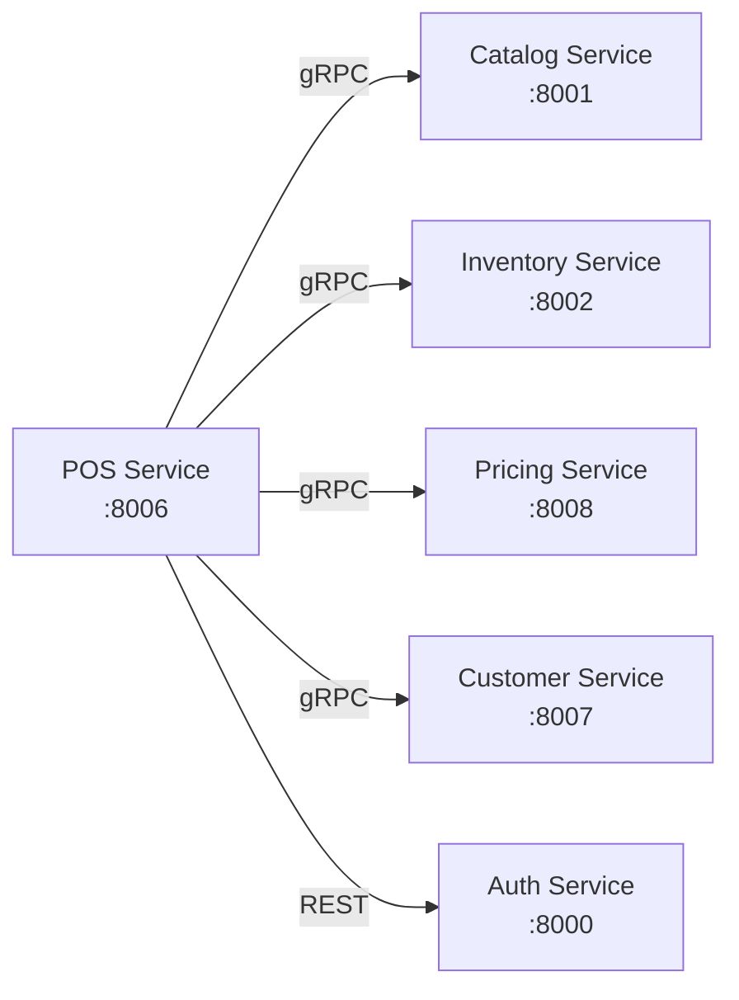

# Integraciones

Integraciones del POS Service con otros servicios mediante gRPC.

## Diagrama de Integraciones



## Catalog Service Integration

### GetProductByBarcode

Buscar producto por código de barras.

```python
async def get_product_by_barcode(self, barcode: str) -> ProductInfo:
    async with self.catalog_channel as channel:
        stub = CatalogServiceStub(channel)

        request = GetProductByBarcodeRequest(
            barcode=barcode,
            organization_id=self.organization_id
        )

        response = await stub.GetProductByBarcode(request)

        return ProductInfo(
            variant_id=response.variant_id,
            sku=response.sku,
            product_name=response.product_name,
            unit_price=response.unit_price,
            barcode=response.barcode,
            category=response.category,
            brand=response.brand,
            image_url=response.image_url
        )
```

### SearchProducts

Búsqueda de productos por nombre.

```python
async def search_products(
    self,
    query: str,
    limit: int = 20
) -> List[ProductInfo]:
    async with self.catalog_channel as channel:
        stub = CatalogServiceStub(channel)

        request = SearchProductsRequest(
            query=query,
            organization_id=self.organization_id,
            limit=limit,
            active_only=True
        )

        response = await stub.SearchProducts(request)

        return [
            ProductInfo.from_proto(product)
            for product in response.products
        ]
```

## Inventory Service Integration

### CheckStock

Verificar disponibilidad antes de agregar a transacción.

```python
async def check_stock(
    self,
    variant_id: UUID,
    local_id: UUID,
    quantity: Decimal
) -> bool:
    async with self.inventory_channel as channel:
        stub = InventoryServiceStub(channel)

        request = CheckStockRequest(
            variant_id=str(variant_id),
            local_id=str(local_id),
            quantity=float(quantity)
        )

        response = await stub.CheckStock(request)

        return response.available
```

### DeductStock

Descontar inventario al completar transacción.

```python
async def deduct_stock(
    self,
    transaction_id: UUID,
    items: List[TransactionItem]
) -> bool:
    async with self.inventory_channel as channel:
        stub = InventoryServiceStub(channel)

        deductions = [
            StockDeduction(
                variant_id=str(item.variant_id),
                quantity=float(item.quantity),
                reason="pos_sale",
                reference_id=str(transaction_id)
            )
            for item in items
        ]

        request = DeductStockBatchRequest(
            local_id=str(self.local_id),
            deductions=deductions
        )

        response = await stub.DeductStockBatch(request)

        return response.success
```

### RestoreStock

Restaurar inventario al anular transacción.

```python
async def restore_stock(
    self,
    transaction_id: UUID,
    items: List[TransactionItem]
) -> bool:
    async with self.inventory_channel as channel:
        stub = InventoryServiceStub(channel)

        additions = [
            StockAddition(
                variant_id=str(item.variant_id),
                quantity=float(item.quantity),
                reason="pos_void",
                reference_id=str(transaction_id)
            )
            for item in items
        ]

        request = AddStockBatchRequest(
            local_id=str(self.local_id),
            additions=additions
        )

        response = await stub.AddStockBatch(request)

        return response.success
```

## Pricing Service Integration

### CalculatePrice

Calcular precio con descuentos y promociones.

```python
async def calculate_price(
    self,
    variant_id: UUID,
    quantity: Decimal,
    customer_id: Optional[UUID] = None
) -> PriceCalculation:
    async with self.pricing_channel as channel:
        stub = PricingServiceStub(channel)

        request = CalculatePriceRequest(
            variant_id=str(variant_id),
            quantity=float(quantity),
            customer_id=str(customer_id) if customer_id else None,
            local_id=str(self.local_id)
        )

        response = await stub.CalculatePrice(request)

        return PriceCalculation(
            unit_price=Decimal(str(response.unit_price)),
            discount_amount=Decimal(str(response.discount_amount)),
            final_price=Decimal(str(response.final_price)),
            promotions_applied=[
                Promotion(
                    promotion_id=p.promotion_id,
                    name=p.name,
                    discount_type=p.discount_type
                )
                for p in response.promotions_applied
            ]
        )
```

### GetActivePromotions

Obtener promociones activas para el local.

```python
async def get_active_promotions(
    self,
    local_id: UUID
) -> List[Promotion]:
    async with self.pricing_channel as channel:
        stub = PricingServiceStub(channel)

        request = GetActivePromotionsRequest(
            local_id=str(local_id),
            organization_id=str(self.organization_id)
        )

        response = await stub.GetActivePromotions(request)

        return [
            Promotion.from_proto(promo)
            for promo in response.promotions
        ]
```

## Customer Service Integration

### GetCustomer

Obtener información de cliente para descuentos y lealtad.

```python
async def get_customer(
    self,
    customer_id: UUID
) -> Customer:
    async with self.customer_channel as channel:
        stub = CustomerServiceStub(channel)

        request = GetCustomerRequest(
            customer_id=str(customer_id),
            organization_id=str(self.organization_id)
        )

        response = await stub.GetCustomer(request)

        return Customer(
            customer_id=response.customer_id,
            name=response.name,
            email=response.email,
            phone=response.phone,
            loyalty_tier=response.loyalty_tier,
            loyalty_points=response.loyalty_points,
            credit_limit=Decimal(str(response.credit_limit)),
            credit_available=Decimal(str(response.credit_available))
        )
```

### AddLoyaltyPoints

Acumular puntos al completar transacción.

```python
async def add_loyalty_points(
    self,
    customer_id: UUID,
    transaction_id: UUID,
    amount: Decimal
) -> int:
    async with self.customer_channel as channel:
        stub = CustomerServiceStub(channel)

        request = AddLoyaltyPointsRequest(
            customer_id=str(customer_id),
            transaction_id=str(transaction_id),
            amount=float(amount),
            points_rate=1  # 1 punto por cada $1
        )

        response = await stub.AddLoyaltyPoints(request)

        return response.points_earned
```

## Auth Service Integration

### VerifyToken

Validar token JWT en cada request.

```python
async def verify_token(self, token: str) -> TokenPayload:
    async with httpx.AsyncClient() as client:
        response = await client.post(
            f"{self.auth_service_url}/auth/verify",
            json={"token": token}
        )

        if response.status_code != 200:
            raise UnauthorizedError("Invalid token")

        data = response.json()

        return TokenPayload(
            user_id=UUID(data['user_id']),
            organization_id=UUID(data['organization_id']),
            local_id=UUID(data['local_id']),
            permissions=data['permissions']
        )
```

## Circuit Breaker Configuration

```python
from circuitbreaker import circuit

# Circuit breaker para servicios críticos
@circuit(failure_threshold=5, recovery_timeout=60, expected_exception=GRPCError)
async def call_with_circuit_breaker(func, *args, **kwargs):
    """
    Si falla 5 veces consecutivas, abre el circuito por 60 segundos.
    Durante ese tiempo, las llamadas fallan inmediatamente.
    """
    return await func(*args, **kwargs)
```

## Retry Strategy

```python
from tenacity import retry, stop_after_attempt, wait_exponential

@retry(
    stop=stop_after_attempt(3),
    wait=wait_exponential(multiplier=1, min=2, max=10)
)
async def call_with_retry(func, *args, **kwargs):
    """
    Reintenta hasta 3 veces con backoff exponencial.
    """
    return await func(*args, **kwargs)
```

## Próximos Pasos

- [Modo Offline](./09-modo-offline.md)
- [Configuración](./10-configuracion.md)
