# Modo Offline

Funcionalidad crítica que permite operar sin conexión a internet.

## Arquitectura Offline


## Detección de Estado Offline

### Frontend

```typescript
class OfflineDetector {
  private isOnline: boolean = navigator.onLine;
  private listeners: Set<(online: boolean) => void> = new Set();

  constructor() {
    window.addEventListener('online', () => this.setOnline(true));
    window.addEventListener('offline', () => this.setOnline(false));

    // Heartbeat cada 30 segundos
    setInterval(() => this.checkConnectivity(), 30000);
  }

  private async checkConnectivity(): Promise<void> {
    try {
      const response = await fetch('/api/health', {
        method: 'HEAD',
        cache: 'no-cache'
      });

      this.setOnline(response.ok);
    } catch {
      this.setOnline(false);
    }
  }

  private setOnline(online: boolean): void {
    if (this.isOnline !== online) {
      this.isOnline = online;
      this.listeners.forEach(listener => listener(online));

      if (online) {
        console.log('🟢 Conexión restaurada - iniciando sincronización');
      } else {
        console.log('🔴 Sin conexión - modo offline activado');
      }
    }
  }

  public subscribe(listener: (online: boolean) => void): () => void {
    this.listeners.add(listener);
    return () => this.listeners.delete(listener);
  }

  public get online(): boolean {
    return this.isOnline;
  }
}
```

## Almacenamiento Local

### Schema IndexedDB

```typescript
interface OfflineTransaction {
  local_transaction_id: string;  // UUID generado localmente
  cashier_id: string;
  local_id: string;
  customer_id: string | null;
  items: OfflineTransactionItem[];
  payments: OfflinePayment[];
  totals: {
    subtotal: number;
    tax_amount: number;
    discount_amount: number;
    total_amount: number;
  };
  timestamp: string;  // ISO string
  synced: boolean;
  sync_attempts: number;
  sync_error: string | null;
}

interface OfflineTransactionItem {
  variant_id: string;
  sku: string;
  product_name: string;
  barcode: string;
  quantity: number;
  unit_price: number;
  subtotal: number;
  tax_amount: number;
  discount_amount: number;
  total: number;
  variant_snapshot: any;
}

interface OfflinePayment {
  payment_method: 'cash' | 'card' | 'yappy' | 'transfer';
  amount: number;
  received?: number;
  change_due?: number;
  reference?: string;
  card_last4?: string;
  authorization_code?: string;
}

// Productos cacheados para búsqueda offline
interface CachedProduct {
  variant_id: string;
  sku: string;
  barcode: string;
  product_name: string;
  unit_price: number;
  tax_rate: number;
  category: string;
  brand: string;
  image_url: string;
  cached_at: string;
}
```

### Inicialización de IndexedDB

```typescript
class OfflineStorage {
  private db: IDBDatabase | null = null;

  async init(): Promise<void> {
    return new Promise((resolve, reject) => {
      const request = indexedDB.open('pos_offline_db', 1);

      request.onerror = () => reject(request.error);
      request.onsuccess = () => {
        this.db = request.result;
        resolve();
      };

      request.onupgradeneeded = (event) => {
        const db = (event.target as IDBOpenDBRequest).result;

        // Store para transacciones offline
        if (!db.objectStoreNames.contains('transactions')) {
          const txnStore = db.createObjectStore('transactions', {
            keyPath: 'local_transaction_id'
          });
          txnStore.createIndex('synced', 'synced', { unique: false });
          txnStore.createIndex('timestamp', 'timestamp', { unique: false });
        }

        // Store para productos cacheados
        if (!db.objectStoreNames.contains('products')) {
          const prodStore = db.createObjectStore('products', {
            keyPath: 'variant_id'
          });
          prodStore.createIndex('barcode', 'barcode', { unique: false });
          prodStore.createIndex('sku', 'sku', { unique: false });
        }
      };
    });
  }

  async saveTransaction(transaction: OfflineTransaction): Promise<void> {
    const tx = this.db!.transaction(['transactions'], 'readwrite');
    const store = tx.objectStore('transactions');

    await store.put(transaction);
  }

  async getPendingTransactions(): Promise<OfflineTransaction[]> {
    const tx = this.db!.transaction(['transactions'], 'readonly');
    const store = tx.objectStore('transactions');
    const index = store.index('synced');

    return new Promise((resolve, reject) => {
      const request = index.getAll(false);  // synced = false

      request.onsuccess = () => resolve(request.result);
      request.onerror = () => reject(request.error);
    });
  }

  async markAsSynced(localTransactionId: string): Promise<void> {
    const tx = this.db!.transaction(['transactions'], 'readwrite');
    const store = tx.objectStore('transactions');

    const transaction = await store.get(localTransactionId);
    if (transaction) {
      transaction.synced = true;
      await store.put(transaction);
    }
  }
}
```

## Cache de Productos

### Estrategia de Cache

```typescript
class ProductCache {
  private storage: OfflineStorage;
  private cacheDuration = 24 * 60 * 60 * 1000; // 24 horas

  async cacheProduct(product: CachedProduct): Promise<void> {
    product.cached_at = new Date().toISOString();

    const tx = this.storage.db!.transaction(['products'], 'readwrite');
    const store = tx.objectStore('products');

    await store.put(product);
  }

  async getProductByBarcode(barcode: string): Promise<CachedProduct | null> {
    const tx = this.storage.db!.transaction(['products'], 'readonly');
    const store = tx.objectStore('products');
    const index = store.index('barcode');

    const product = await index.get(barcode);

    if (!product) return null;

    // Verificar si el cache expiró
    const cachedAt = new Date(product.cached_at).getTime();
    const now = Date.now();

    if (now - cachedAt > this.cacheDuration) {
      return null; // Cache expirado
    }

    return product;
  }

  async cachePopularProducts(localId: string): Promise<void> {
    try {
      const response = await fetch(
        `/api/v1/pos/products/popular?local_id=${localId}&limit=100`
      );

      const data = await response.json();

      for (const product of data.data.products) {
        await this.cacheProduct(product);
      }

      console.log(`✅ ${data.data.products.length} productos cacheados`);
    } catch (error) {
      console.error('Error cacheando productos:', error);
    }
  }
}
```

## Sincronización

### Flujo de Sincronización

```mermaid
sequenceDiagram
    participant UI
    participant Storage
    participant SyncMgr
    participant API
    participant DB

    UI->>Storage: Conexión restaurada
    Storage->>Storage: getPendingTransactions()

    loop Por cada transacción pendiente
        Storage->>SyncMgr: Sincronizar transacción
        SyncMgr->>API: POST /pos/sync/transaction
        API->>DB: Guardar transacción

        alt Sincronización exitosa
            API-->>SyncMgr: 201 Created
            SyncMgr->>Storage: markAsSynced()
            SyncMgr-->>UI: Transacción sincronizada
        else Error de sincronización
            API-->>SyncMgr: 400 Error
            SyncMgr->>Storage: Incrementar sync_attempts
            SyncMgr-->>UI: Error, reintentar después
        end
    end

    SyncMgr-->>UI: Sincronización completada
```



### Backend Sync Endpoint

```python
@router.post("/pos/sync/transaction")
async def sync_offline_transaction(
    transaction: OfflineTransactionInput,
    current_user: User = Depends(get_current_user)
):
    """
    Sincroniza una transacción creada en modo offline.
    """
    try:
        # 1. Validar que no exista ya
        existing = await transaction_service.get_by_local_id(
            transaction.local_transaction_id
        )

        if existing:
            return {"status": "already_synced", "transaction_id": existing.transaction_id}

        # 2. Validar stock disponible
        for item in transaction.items:
            stock_available = await inventory_client.check_stock(
                variant_id=item.variant_id,
                local_id=transaction.local_id,
                quantity=item.quantity
            )

            if not stock_available:
                raise InsufficientStockError(
                    f"Stock insuficiente para {item.product_name}"
                )

        # 3. Crear transacción
        new_transaction = await transaction_service.create_from_offline(
            offline_transaction=transaction,
            synced_by=current_user.user_id
        )

        # 4. Descontar stock
        await inventory_client.deduct_stock(
            transaction_id=new_transaction.transaction_id,
            items=transaction.items
        )

        # 5. Acumular puntos si hay cliente
        if transaction.customer_id:
            await customer_client.add_loyalty_points(
                customer_id=transaction.customer_id,
                transaction_id=new_transaction.transaction_id,
                amount=transaction.totals.total_amount
            )

        # 6. Publicar evento
        await event_publisher.publish(
            exchange="pos_events",
            routing_key="pos.transaction.synced",
            message={
                "transaction_id": str(new_transaction.transaction_id),
                "local_transaction_id": transaction.local_transaction_id,
                "synced_at": datetime.utcnow().isoformat()
            }
        )

        return {
            "status": "success",
            "statusCode": 201,
            "data": {
                "transaction_id": new_transaction.transaction_id,
                "transaction_number": new_transaction.transaction_number,
                "synced_at": datetime.utcnow()
            }
        }

    except InsufficientStockError as e:
        # Marcar para revisión manual
        await transaction_service.create_sync_conflict(
            local_transaction_id=transaction.local_transaction_id,
            reason="insufficient_stock",
            details=str(e)
        )

        raise HTTPException(
            status_code=400,
            detail={
                "code": "SYNC_CONFLICT",
                "message": str(e),
                "requires_manual_review": True
            }
        )
```

## Manejo de Conflictos

### Resolución de Conflictos

```typescript
class ConflictResolver {
  async resolveStockConflict(
    transaction: OfflineTransaction
  ): Promise<Resolution> {
    // Opción 1: Reducir cantidad a disponible
    const resolution1 = await this.adjustQuantitiesToAvailable(transaction);

    // Opción 2: Cancelar transacción completa
    const resolution2 = {
      action: 'cancel',
      reason: 'Stock insuficiente'
    };

    // Mostrar opciones al supervisor
    return await this.showConflictDialog([resolution1, resolution2]);
  }

  private async adjustQuantitiesToAvailable(
    transaction: OfflineTransaction
  ): Promise<Resolution> {
    const adjustedItems = [];

    for (const item of transaction.items) {
      const available = await this.checkAvailableStock(item.variant_id);

      if (available < item.quantity) {
        adjustedItems.push({
          ...item,
          original_quantity: item.quantity,
          quantity: available,
          adjustment_reason: 'Stock insuficiente'
        });
      } else {
        adjustedItems.push(item);
      }
    }

    return {
      action: 'adjust',
      items: adjustedItems
    };
  }
}
```

## Indicadores UI

### Componente de Estado Offline

```typescript
function OfflineIndicator() {
  const [isOnline, setIsOnline] = useState(true);
  const [pendingCount, setPendingCount] = useState(0);

  useEffect(() => {
    const unsubscribe = offlineDetector.subscribe(online => {
      setIsOnline(online);

      if (!online) {
        // Cachear productos populares al perder conexión
        productCache.cachePopularProducts(currentLocalId);
      }
    });

    return unsubscribe;
  }, []);

  useEffect(() => {
    async function updatePending() {
      const pending = await offlineStorage.getPendingTransactions();
      setPendingCount(pending.length);
    }

    updatePending();
    const interval = setInterval(updatePending, 10000); // Cada 10s

    return () => clearInterval(interval);
  }, []);

  if (isOnline && pendingCount === 0) {
    return null; // No mostrar nada si todo está bien
  }

  return (
    <div className={isOnline ? 'online-syncing' : 'offline-warning'}>
      {!isOnline && (
        <>
          🔴 Modo Offline Activo
          <span>{pendingCount} ventas pendientes de sincronizar</span>
        </>
      )}
      {isOnline && pendingCount > 0 && (
        <>
          🟡 Sincronizando...
          <span>{pendingCount} ventas pendientes</span>
        </>
      )}
    </div>
  );
}
```

## Mejores Prácticas

### 1. Cachear Proactivamente

```typescript
// Al iniciar turno, cachear productos populares
async function startShift(cashierId: string, localId: string) {
  await productCache.cachePopularProducts(localId);
  console.log('✅ Productos populares cacheados');
}
```

### 2. Validación Local

```typescript
// Validar antes de guardar offline
async function validateOfflineTransaction(
  transaction: OfflineTransaction
): Promise<ValidationResult> {
  const errors: string[] = [];

  // Validar que hay productos
  if (transaction.items.length === 0) {
    errors.push('La transacción debe tener al menos un producto');
  }

  // Validar que los pagos suman el total
  const paymentsTotal = transaction.payments.reduce(
    (sum, p) => sum + p.amount,
    0
  );

  if (Math.abs(paymentsTotal - transaction.totals.total_amount) > 0.01) {
    errors.push('El total de pagos no coincide con el total de la transacción');
  }

  return {
    valid: errors.length === 0,
    errors
  };
}
```

### 3. Límite de Transacciones Offline

```typescript
const MAX_OFFLINE_TRANSACTIONS = 100;

async function canCreateOfflineTransaction(): Promise<boolean> {
  const pending = await offlineStorage.getPendingTransactions();

  if (pending.length >= MAX_OFFLINE_TRANSACTIONS) {
    throw new Error(
      'Límite de transacciones offline alcanzado. Espere a que se restablezca la conexión.'
    );
  }

  return true;
}
```

## Próximos Pasos

- [Configuración](./10-configuracion.md)
- [API de Transacciones](./03-api-transactions.md)
