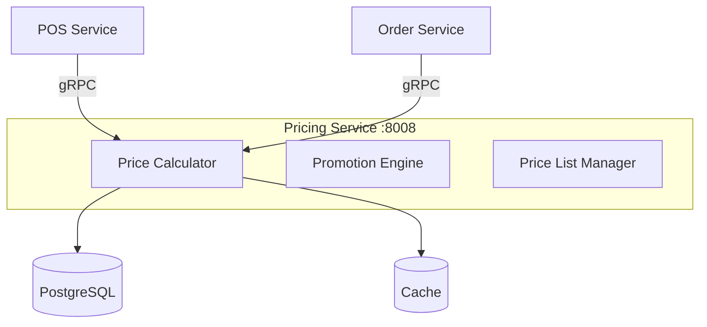
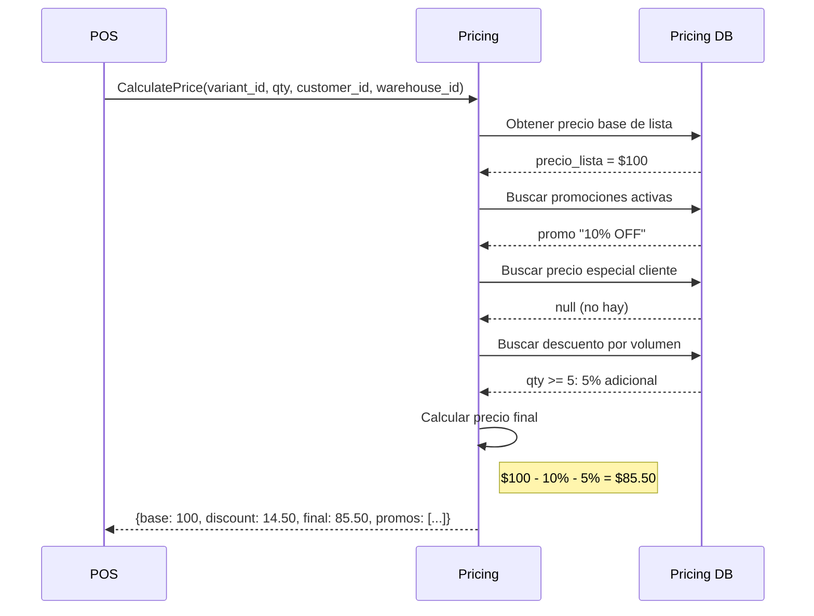

# Overview - Pricing Service

## Descripción

El **Pricing Service** es la **fuente única de verdad para todos los precios** del sistema. Gestiona listas de precios, promociones, descuentos y cálculos de precio final.

> **Principio Clave**: Ningún servicio calcula precios por sí mismo. Siempre se consulta a Pricing Service.

## Centralización de Precios

```
┌─────────────────────────────────────────────────────────────────────────────┐
│                           PRICING SERVICE                                    │
│                    (Fuente única de verdad para precios)                    │
│                                                                              │
│  ┌──────────────┐  ┌──────────────┐  ┌──────────────┐  ┌──────────────┐   │
│  │ Listas de    │  │ Promociones  │  │ Descuentos   │  │ Cupones      │   │
│  │ Precios      │  │ Activas      │  │ por Volumen  │  │ Canjeables   │   │
│  └──────────────┘  └──────────────┘  └──────────────┘  └──────────────┘   │
└─────────────────────────────────────────────────────────────────────────────┘
                                    │
                    ┌───────────────┼───────────────┐
                    ▼               ▼               ▼
             ┌──────────┐    ┌──────────┐    ┌──────────┐
             │   POS    │    │  Order   │    │ Frontend │
             │ Service  │    │ Service  │    │   Web    │
             └──────────┘    └──────────┘    └──────────┘
```

### ¿Qué gestiona Pricing Service?

| Componente | Descripción |
|------------|-------------|
| **Listas de Precios** | Precios base por canal, región, tipo de cliente |
| **Promociones** | 2x1, 3x2, descuentos temporales |
| **Descuentos por Volumen** | Escalas según cantidad comprada |
| **Cupones/Códigos** | Códigos canjeables por descuento |
| **Precios por Cliente** | Precios especiales para clientes específicos |
| **Puntos de Lealtad** | Conversión de puntos a descuento |

### ¿Qué NO gestiona?

| Servicio | Tiene | No Calcula |
|----------|-------|------------|
| **Catalog** | `sale_price` (referencia) | Precio final |
| **Order** | `unit_price` (snapshot) | Descuentos |
| **POS** | Items de venta | Precio, solo consume |

## Características Principales

- **Listas de Precios**: Múltiples listas por tipo de cliente, canal, región
- **Precios Dinámicos**: Cálculo en tiempo real basado en reglas
- **Promociones**: 2x1, descuentos porcentuales, fijos, por volumen
- **Precios por Volumen**: Escalas de descuento según cantidad
- **Precios por Cliente**: Personalización por segmento o cliente específico
- **Vigencia Temporal**: Precios y promociones con fechas de inicio/fin
- **Priorización**: Sistema de prioridades cuando aplican múltiples descuentos
- **Cupones/Lealtad**: Gestión de códigos promocionales y puntos

## Arquitectura



## Integraciones

### Expone (gRPC)
- `CalculatePrice()` - Calcular precio con descuentos
- `GetActivePromotions()` - Obtener promociones activas
- `GetPriceList()` - Obtener lista de precios

### Publica Eventos
- `pricing.promotion.activated`
- `pricing.promotion.deactivated`
- `pricing.price.updated`

## Puerto

- **REST**: 8008
- **gRPC**: 50008

## Flujo de Cálculo de Precio

### Secuencia: POS solicitando precio



### Request y Response

```python
# gRPC Request
message CalculatePriceRequest {
    string organization_id = 1;
    string variant_id = 2;
    int32 quantity = 3;
    optional string customer_id = 4;
    optional string price_list_id = 5;
    optional string coupon_code = 6;
    optional int32 loyalty_points = 7;  // Puntos a canjear
}

# gRPC Response
message CalculatePriceResponse {
    string variant_id = 1;
    Decimal base_price = 2;           // Precio de lista
    Decimal discount_amount = 3;       // Total descuentos
    Decimal final_price = 4;           // Precio final
    Decimal tax_amount = 5;            // Impuesto calculado
    Decimal total_with_tax = 6;        // Total con impuesto
    repeated AppliedPromotion promotions = 7;  // Promociones aplicadas
    optional LoyaltyInfo loyalty = 8;  // Info de lealtad
}
```

### Ejemplo de Uso en POS

```python
# POS Service - Al agregar item al carrito
async def add_item_to_cart(
    cart_id: str,
    variant_id: str,
    quantity: int,
    customer_id: str | None = None
):
    # 1. SIEMPRE consultar Pricing Service
    price_response = await pricing_client.calculate_price(
        organization_id=ctx.organization_id,
        variant_id=variant_id,
        quantity=quantity,
        customer_id=customer_id,
        price_list_id=get_price_list_for_local(ctx.local_id)
    )

    # 2. Crear item con precio calculado
    cart_item = CartItem(
        variant_id=variant_id,
        quantity=quantity,
        unit_price=price_response.final_price,  # Ya con descuentos
        tax_amount=price_response.tax_amount,
        applied_promotions=[p.to_dict() for p in price_response.promotions]
    )

    # 3. Guardar en carrito
    await cart_service.add_item(cart_id, cart_item)
```

## Próximos Pasos

- [Arquitectura](./01-arquitectura.md)
- [Modelo de Datos](./02-modelo-datos.md)
- [API Cálculo de Precios](./06-api-calculation.md)
