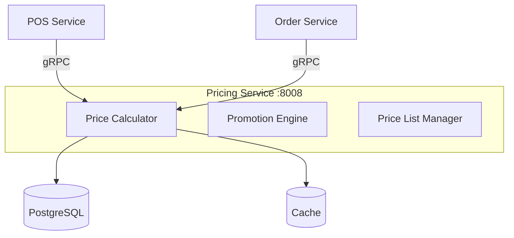

# Overview - Pricing Service

## Descripción

El **Pricing Service** gestiona todas las estrategias de precios, listas de precios, promociones y cálculos de descuentos del ERP zenLogic. Proporciona flexibilidad para implementar estrategias de pricing complejas adaptadas a cada tipo de negocio.

## Características Principales

- **Listas de Precios**: Múltiples listas por tipo de cliente, canal, región
- **Precios Dinámicos**: Cálculo en tiempo real basado en reglas
- **Promociones**: 2x1, descuentos porcentuales, fijos, por volumen
- **Precios por Volumen**: Escalas de descuento según cantidad
- **Precios por Cliente**: Personalización por segmento o cliente específico
- **Vigencia Temporal**: Precios y promociones con fechas de inicio/fin
- **Priorización**: Sistema de prioridades cuando aplican múltiples descuentos

## Arquitectura

## Integraciones

### Expone (gRPC)
- `CalculatePrice()` - Calcular precio con descuentos
- `GetActivePromotions()` - Obtener promociones activas
- `GetPriceList()` - Obtener lista de precios

### Publica Eventos
- `pricing.promotion.activated`
- `pricing.promotion.deactivated`
- `pricing.price.updated`

## Puerto

- **REST**: 8008
- **gRPC**: 50008

## Próximos Pasos

- [Arquitectura](./01-arquitectura.md)
- [Modelo de Datos](./02-modelo-datos.md)
