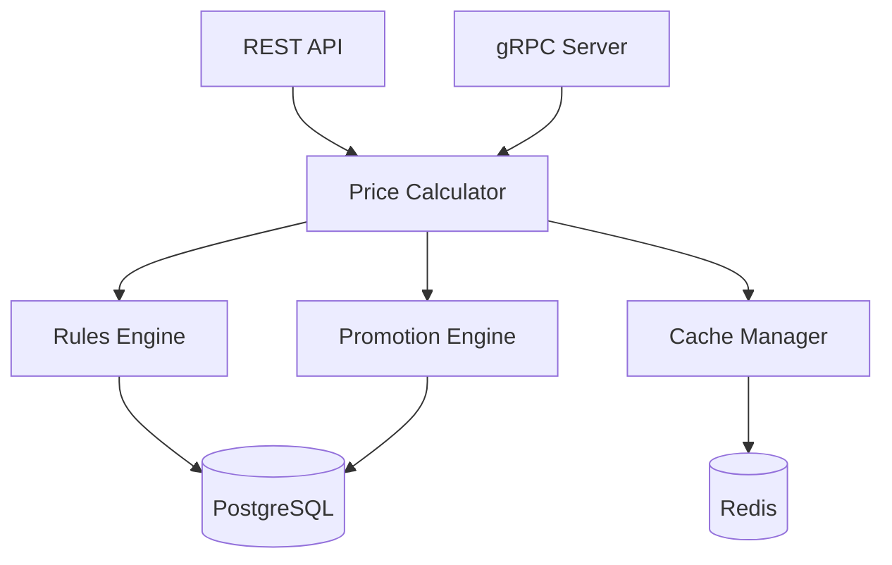

# Arquitectura - Pricing Service

## Componentes



## Price Calculator

```python
class PriceCalculator:
    async def calculate_price(
        self,
        variant_id: UUID,
        quantity: Decimal,
        customer_id: Optional[UUID] = None,
        price_list_id: Optional[UUID] = None
    ) -> PriceCalculation
```

## Promotion Engine

```python
class PromotionEngine:
    async def get_applicable_promotions(
        self,
        variant_id: UUID,
        quantity: Decimal,
        customer_segment: Optional[str] = None
    ) -> List[Promotion]

    async def apply_best_promotion(
        self,
        price: Decimal,
        promotions: List[Promotion]
    ) -> PromotionResult
```

## Próximos Pasos

- [Modelo de Datos](./02-modelo-datos.md)
- [Tipos de Promociones](./10-tipos-promociones.md)
