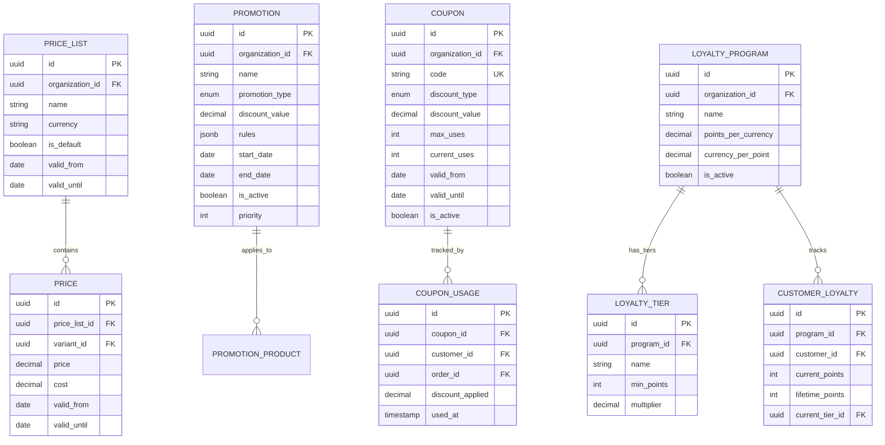

# Modelo de Datos - Pricing Service

## Diagrama ER Completo



## Tablas Principales

### price_lists

```sql
CREATE TABLE price_lists (
    price_list_id UUID PRIMARY KEY,
    organization_id UUID NOT NULL,
    name VARCHAR(255) NOT NULL,
    currency VARCHAR(3) DEFAULT 'USD',
    is_default BOOLEAN DEFAULT false,
    valid_from DATE,
    valid_until DATE,
    created_at TIMESTAMP DEFAULT NOW()
);
```

### prices

```sql
CREATE TABLE prices (
    price_id UUID PRIMARY KEY,
    price_list_id UUID REFERENCES price_lists(price_list_id),
    variant_id UUID NOT NULL,
    price DECIMAL(12,2) NOT NULL CHECK (price >= 0),
    cost DECIMAL(12,2),
    margin_percentage DECIMAL(5,2),
    valid_from DATE,
    valid_until DATE,
    created_at TIMESTAMP DEFAULT NOW()
);

CREATE INDEX idx_prices_variant ON prices(variant_id);
CREATE INDEX idx_prices_list ON prices(price_list_id);
```

### promotions

```sql
CREATE TABLE promotions (
    promotion_id UUID PRIMARY KEY,
    organization_id UUID NOT NULL,
    name VARCHAR(255) NOT NULL,
    promotion_type VARCHAR(50) NOT NULL,
    discount_type VARCHAR(50),
    discount_value DECIMAL(12,2),
    rules JSONB,
    start_date TIMESTAMP NOT NULL,
    end_date TIMESTAMP NOT NULL,
    is_active BOOLEAN DEFAULT true,
    priority INTEGER DEFAULT 0,
    created_at TIMESTAMP DEFAULT NOW(),

    CONSTRAINT check_promotion_type CHECK (
        promotion_type IN ('percentage', 'fixed_amount', 'buy_x_get_y', 'volume_discount', 'bundle')
    )
);

CREATE INDEX idx_promotions_active ON promotions(is_active, start_date, end_date);
```

## Cupones

### coupons

```sql
CREATE TABLE coupons (
    id UUID PRIMARY KEY DEFAULT gen_random_uuid(),
    organization_id UUID NOT NULL,

    -- Identificador
    code VARCHAR(50) NOT NULL,

    -- Tipo de descuento
    discount_type VARCHAR(20) NOT NULL,  -- 'percentage', 'fixed_amount'
    discount_value DECIMAL(12,2) NOT NULL,
    max_discount DECIMAL(12,2),  -- Tope máximo de descuento (para porcentajes)

    -- Límites de uso
    max_uses INT,  -- NULL = ilimitado
    max_uses_per_customer INT DEFAULT 1,
    current_uses INT DEFAULT 0,

    -- Restricciones
    min_purchase_amount DECIMAL(12,2),
    applicable_variants JSONB,  -- NULL = todos, o lista de variant_ids
    applicable_collections JSONB,  -- Lista de collection_ids

    -- Vigencia
    valid_from TIMESTAMP NOT NULL,
    valid_until TIMESTAMP NOT NULL,
    is_active BOOLEAN DEFAULT true,

    -- Metadata
    description TEXT,
    created_at TIMESTAMP DEFAULT NOW(),
    updated_at TIMESTAMP DEFAULT NOW(),

    CONSTRAINT uk_coupon_code UNIQUE (organization_id, code),
    CONSTRAINT chk_discount_type CHECK (discount_type IN ('percentage', 'fixed_amount')),
    CONSTRAINT chk_discount_value CHECK (discount_value > 0),
    CONSTRAINT chk_max_uses CHECK (max_uses IS NULL OR max_uses > 0)
);

CREATE INDEX idx_coupons_org ON coupons(organization_id);
CREATE INDEX idx_coupons_code ON coupons(code);
CREATE INDEX idx_coupons_active ON coupons(is_active, valid_from, valid_until);
```

### coupon_usages

```sql
CREATE TABLE coupon_usages (
    id UUID PRIMARY KEY DEFAULT gen_random_uuid(),
    coupon_id UUID NOT NULL REFERENCES coupons(id),
    customer_id UUID,
    order_id UUID NOT NULL,

    -- Descuento aplicado
    discount_applied DECIMAL(12,2) NOT NULL,

    -- Metadata
    used_at TIMESTAMP DEFAULT NOW(),

    CONSTRAINT uk_coupon_order UNIQUE (coupon_id, order_id)
);

CREATE INDEX idx_coupon_usages_coupon ON coupon_usages(coupon_id);
CREATE INDEX idx_coupon_usages_customer ON coupon_usages(customer_id);
CREATE INDEX idx_coupon_usages_order ON coupon_usages(order_id);
```

## Programas de Lealtad

### loyalty_programs

```sql
CREATE TABLE loyalty_programs (
    id UUID PRIMARY KEY DEFAULT gen_random_uuid(),
    organization_id UUID NOT NULL,
    name VARCHAR(100) NOT NULL,

    -- Configuración de puntos
    points_per_currency DECIMAL(10,4) DEFAULT 1,  -- Puntos por cada $1 gastado
    currency_per_point DECIMAL(10,4) DEFAULT 0.01,  -- Valor de cada punto en $

    -- Configuración de expiración
    points_expiry_months INT,  -- NULL = no expiran

    -- Estado
    is_active BOOLEAN DEFAULT true,
    created_at TIMESTAMP DEFAULT NOW(),
    updated_at TIMESTAMP DEFAULT NOW(),

    CONSTRAINT uk_loyalty_program_org UNIQUE (organization_id, name)
);

CREATE INDEX idx_loyalty_programs_org ON loyalty_programs(organization_id);
```

### loyalty_tiers

```sql
CREATE TABLE loyalty_tiers (
    id UUID PRIMARY KEY DEFAULT gen_random_uuid(),
    program_id UUID NOT NULL REFERENCES loyalty_programs(id) ON DELETE CASCADE,

    name VARCHAR(50) NOT NULL,  -- Bronze, Silver, Gold, Platinum
    min_points INT NOT NULL,  -- Puntos mínimos para este nivel
    points_multiplier DECIMAL(3,2) DEFAULT 1.00,  -- Multiplicador de puntos (1.5x, 2x)
    discount_percentage DECIMAL(5,2) DEFAULT 0,  -- Descuento adicional por nivel

    -- Benefits (JSON flexible)
    benefits JSONB DEFAULT '{}',

    CONSTRAINT uk_tier_program_name UNIQUE (program_id, name),
    CONSTRAINT chk_min_points CHECK (min_points >= 0),
    CONSTRAINT chk_multiplier CHECK (points_multiplier >= 1.00)
);

CREATE INDEX idx_loyalty_tiers_program ON loyalty_tiers(program_id);
```

### customer_loyalty

```sql
CREATE TABLE customer_loyalty (
    id UUID PRIMARY KEY DEFAULT gen_random_uuid(),
    program_id UUID NOT NULL REFERENCES loyalty_programs(id),
    customer_id UUID NOT NULL,

    -- Puntos
    current_points INT DEFAULT 0,
    lifetime_points INT DEFAULT 0,

    -- Nivel actual
    current_tier_id UUID REFERENCES loyalty_tiers(id),

    -- Metadata
    enrolled_at TIMESTAMP DEFAULT NOW(),
    last_activity_at TIMESTAMP,

    CONSTRAINT uk_customer_program UNIQUE (program_id, customer_id),
    CONSTRAINT chk_points CHECK (current_points >= 0 AND lifetime_points >= current_points)
);

CREATE INDEX idx_customer_loyalty_program ON customer_loyalty(program_id);
CREATE INDEX idx_customer_loyalty_customer ON customer_loyalty(customer_id);
CREATE INDEX idx_customer_loyalty_tier ON customer_loyalty(current_tier_id);
```

### loyalty_transactions

```sql
CREATE TABLE loyalty_transactions (
    id UUID PRIMARY KEY DEFAULT gen_random_uuid(),
    customer_loyalty_id UUID NOT NULL REFERENCES customer_loyalty(id),
    order_id UUID,

    -- Tipo de transacción
    transaction_type VARCHAR(20) NOT NULL,  -- 'earn', 'redeem', 'expire', 'adjust'
    points INT NOT NULL,  -- Positivo para earn, negativo para redeem/expire

    -- Balance después de transacción
    balance_after INT NOT NULL,

    -- Metadata
    description TEXT,
    created_at TIMESTAMP DEFAULT NOW(),

    CONSTRAINT chk_transaction_type CHECK (
        transaction_type IN ('earn', 'redeem', 'expire', 'adjust')
    )
);

CREATE INDEX idx_loyalty_tx_customer ON loyalty_transactions(customer_loyalty_id);
CREATE INDEX idx_loyalty_tx_order ON loyalty_transactions(order_id);
CREATE INDEX idx_loyalty_tx_created ON loyalty_transactions(created_at DESC);
```

## Ejemplo de Uso

### Crear cupón

```sql
INSERT INTO coupons (
    organization_id, code, discount_type, discount_value,
    max_uses, max_uses_per_customer, min_purchase_amount,
    valid_from, valid_until, description
) VALUES (
    'org_123',
    'WELCOME10',
    'percentage',
    10.00,
    1000,
    1,
    50.00,
    '2025-01-01',
    '2025-12-31',
    '10% de descuento para nuevos clientes'
);
```

### Validar y aplicar cupón

```python
async def validate_coupon(
    org_id: str,
    code: str,
    customer_id: str | None,
    cart_total: Decimal
) -> CouponValidation:
    coupon = await get_coupon_by_code(org_id, code)

    if not coupon:
        return CouponValidation(valid=False, error="Cupón no encontrado")

    if not coupon.is_active:
        return CouponValidation(valid=False, error="Cupón inactivo")

    now = datetime.utcnow()
    if now < coupon.valid_from or now > coupon.valid_until:
        return CouponValidation(valid=False, error="Cupón expirado")

    if coupon.max_uses and coupon.current_uses >= coupon.max_uses:
        return CouponValidation(valid=False, error="Cupón agotado")

    if customer_id and coupon.max_uses_per_customer:
        uses = await count_customer_uses(coupon.id, customer_id)
        if uses >= coupon.max_uses_per_customer:
            return CouponValidation(valid=False, error="Ya usaste este cupón")

    if coupon.min_purchase_amount and cart_total < coupon.min_purchase_amount:
        return CouponValidation(
            valid=False,
            error=f"Mínimo de compra: ${coupon.min_purchase_amount}"
        )

    # Calcular descuento
    if coupon.discount_type == 'percentage':
        discount = cart_total * (coupon.discount_value / 100)
        if coupon.max_discount:
            discount = min(discount, coupon.max_discount)
    else:
        discount = coupon.discount_value

    return CouponValidation(
        valid=True,
        discount_amount=discount,
        coupon_id=coupon.id
    )
```

### Acumular puntos de lealtad

```python
async def earn_loyalty_points(
    org_id: str,
    customer_id: str,
    order_id: str,
    order_total: Decimal
):
    # Obtener programa de lealtad
    program = await get_active_program(org_id)
    if not program:
        return

    # Obtener/crear membresía del cliente
    loyalty = await get_or_create_customer_loyalty(program.id, customer_id)

    # Calcular puntos base
    base_points = int(order_total * program.points_per_currency)

    # Aplicar multiplicador de nivel
    if loyalty.current_tier:
        base_points = int(base_points * loyalty.current_tier.points_multiplier)

    # Registrar transacción
    new_balance = loyalty.current_points + base_points
    await create_loyalty_transaction(
        customer_loyalty_id=loyalty.id,
        order_id=order_id,
        transaction_type='earn',
        points=base_points,
        balance_after=new_balance,
        description=f"Compra orden {order_id}"
    )

    # Actualizar balance
    loyalty.current_points = new_balance
    loyalty.lifetime_points += base_points
    loyalty.last_activity_at = datetime.utcnow()

    # Verificar upgrade de nivel
    await check_tier_upgrade(loyalty)
```

## Próximos Pasos

- [API Price Lists](./03-api-price-lists.md)
- [API Promotions](./05-api-promotions.md)
- [API Cálculo de Precios](./06-api-calculation.md)
