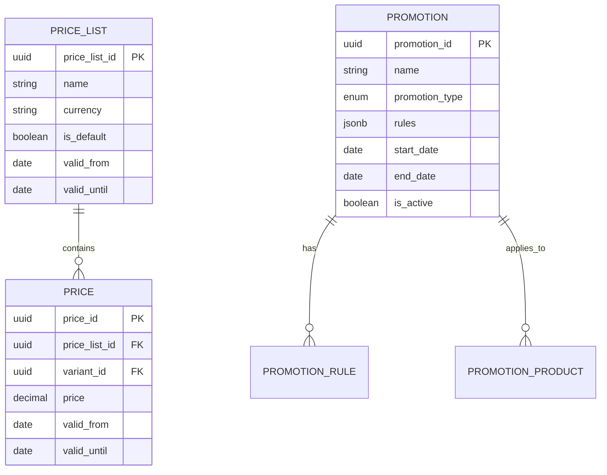

# Modelo de Datos - Pricing Service

## Diagrama ER



## Tablas Principales

### price_lists

```sql
CREATE TABLE price_lists (
    price_list_id UUID PRIMARY KEY,
    organization_id UUID NOT NULL,
    name VARCHAR(255) NOT NULL,
    currency VARCHAR(3) DEFAULT 'USD',
    is_default BOOLEAN DEFAULT false,
    valid_from DATE,
    valid_until DATE,
    created_at TIMESTAMP DEFAULT NOW()
);
```

### prices

```sql
CREATE TABLE prices (
    price_id UUID PRIMARY KEY,
    price_list_id UUID REFERENCES price_lists(price_list_id),
    variant_id UUID NOT NULL,
    price DECIMAL(12,2) NOT NULL CHECK (price >= 0),
    cost DECIMAL(12,2),
    margin_percentage DECIMAL(5,2),
    valid_from DATE,
    valid_until DATE,
    created_at TIMESTAMP DEFAULT NOW()
);

CREATE INDEX idx_prices_variant ON prices(variant_id);
CREATE INDEX idx_prices_list ON prices(price_list_id);
```

### promotions

```sql
CREATE TABLE promotions (
    promotion_id UUID PRIMARY KEY,
    organization_id UUID NOT NULL,
    name VARCHAR(255) NOT NULL,
    promotion_type VARCHAR(50) NOT NULL,
    discount_type VARCHAR(50),
    discount_value DECIMAL(12,2),
    rules JSONB,
    start_date TIMESTAMP NOT NULL,
    end_date TIMESTAMP NOT NULL,
    is_active BOOLEAN DEFAULT true,
    priority INTEGER DEFAULT 0,
    created_at TIMESTAMP DEFAULT NOW(),

    CONSTRAINT check_promotion_type CHECK (
        promotion_type IN ('percentage', 'fixed_amount', 'buy_x_get_y', 'volume_discount', 'bundle')
    )
);

CREATE INDEX idx_promotions_active ON promotions(is_active, start_date, end_date);
```

## Próximos Pasos

- [API Price Lists](./03-api-price-lists.md)
- [API Promotions](./05-api-promotions.md)
