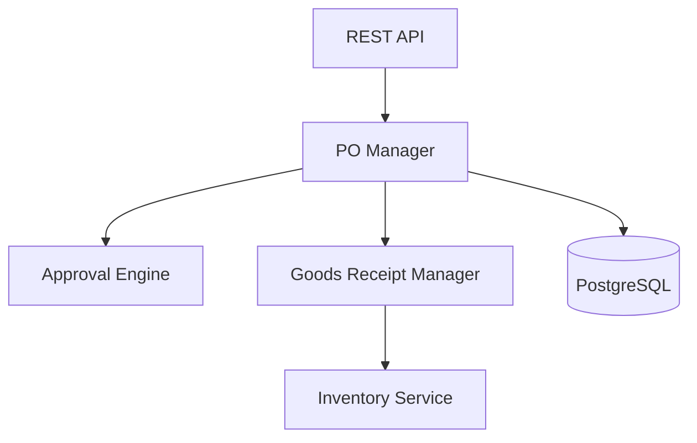

# Overview - Procurement Service

## Descripción

El **Procurement Service** gestiona todo el proceso de compras y adquisiciones del ERP zenLogic. Maneja proveedores, órdenes de compra, recepción de mercancía y relaciones con suppliers.

## Características Principales

- **Gestión de Proveedores**: CRUD de suppliers con información completa
- **Órdenes de Compra**: Creación, aprobación y seguimiento de POs
- **Recepción de Mercancía**: Registro de goods receipts con validación
- **Condiciones de Pago**: Términos y plazos por proveedor
- **Historial de Compras**: Tracking completo de adquisiciones
- **Precios de Compra**: Gestión de costos por proveedor
- **Aprobaciones**: Workflow de aprobación de compras

## Arquitectura

## Integraciones

### Consume (gRPC)
- `Inventory.AddStock()` - Al recibir mercancía

### Publica Eventos
- `procurement.po.created`
- `procurement.po.approved`
- `procurement.goods_receipt.created`

## Puerto

- **REST**: 8009
- **gRPC**: 50009

## Próximos Pasos

- [Arquitectura](./01-arquitectura.md)
- [Modelo de Datos](./02-modelo-datos.md)
