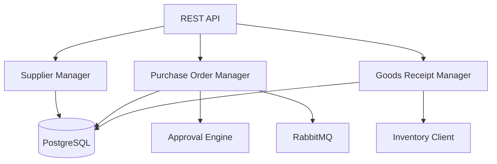

# Arquitectura - Procurement Service

## Componentes



## Purchase Order Manager

```python
class PurchaseOrderManager:
    async def create_po(
        self,
        supplier_id: UUID,
        items: List[POItem],
        delivery_date: date
    ) -> PurchaseOrder

    async def approve_po(
        self,
        po_id: UUID,
        approved_by: UUID
    ) -> PurchaseOrder

    async def receive_goods(
        self,
        po_id: UUID,
        received_items: List[ReceivedItem]
    ) -> GoodsReceipt
```

## Approval Engine

```python
class ApprovalEngine:
    async def requires_approval(
        self,
        po: PurchaseOrder
    ) -> bool:
        # POs > $10,000 requieren aprobación
        return po.total_amount > 10000

    async def get_approvers(
        self,
        po: PurchaseOrder
    ) -> List[UUID]:
        # Retorna usuarios con permiso de aprobación
        pass
```

## Próximos Pasos

- [Modelo de Datos](./02-modelo-datos.md)
- [API Suppliers](./03-api-suppliers.md)
